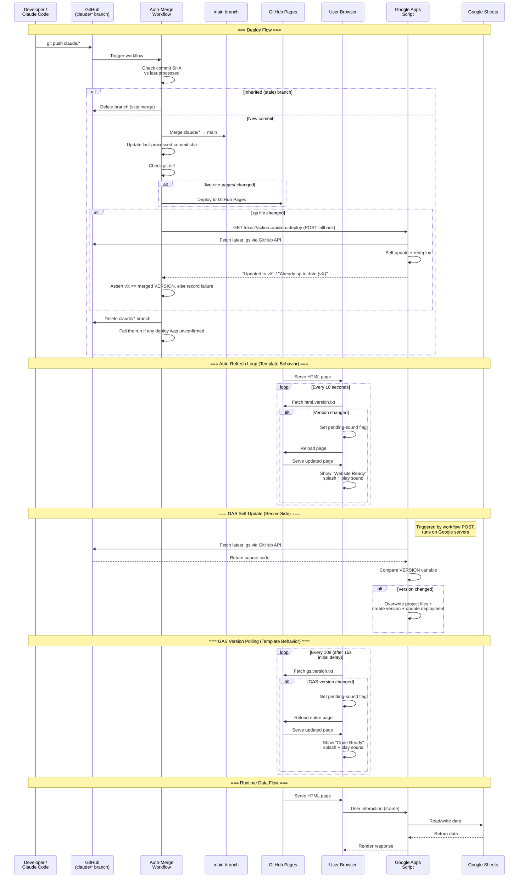
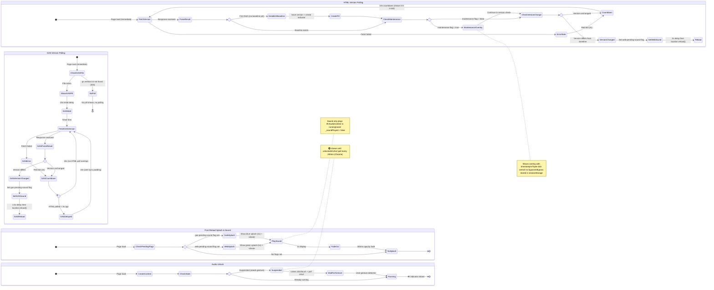
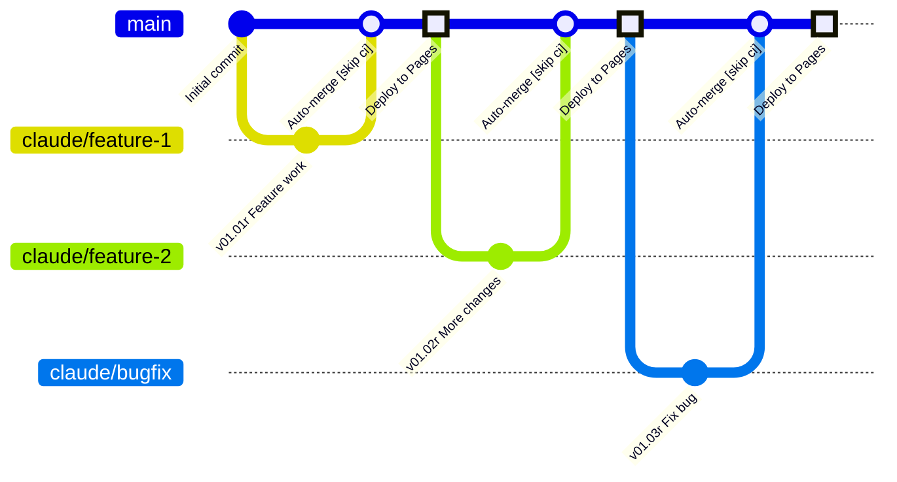
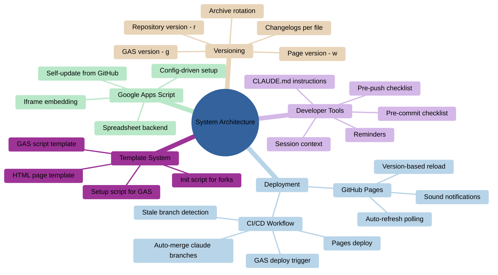
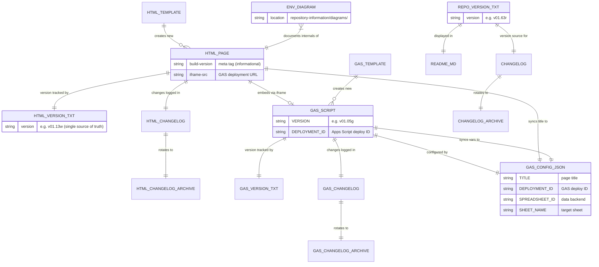

# Project Architecture

> **Scope** — this document covers the repo-wide architecture: how environments connect to each other and to shared infrastructure (CI/CD, GitHub Pages, templates, versioning, developer tools). It does **not** cover the internal processes of individual environments (auto-refresh polling, GAS self-update loops, page lifecycle states, etc.) — those are documented in per-environment diagrams under `repository-information/diagrams/`.

## 1. Flowchart — System Overview

> [Open in mermaid.live — Flowchart](https://mermaid.live/edit#pako:eNq1Wv9y27gRfhUMb6aTu4aSL9fkzp5Jb2iKltXQlkZU0mbMjAYiVxQiiOAAoG01uZk-RN-l__dR-iQdgD9EiaBOdlP_Ce5-uwvsftiF_MWKWAzWhZVwnK3Q7DJMEUJI5ItiIbSmkDFBJOPbCxRgCiK0Chn1FxMOkSQs1Zq79Yb-AO6Bsgw4-ivj6yVlD00A9TfwPtw15frIpTiPAbkshtD6tC_tXt6FVqQF-j-gBcdptGoJDbwPyLb__DW0slysQusrci93EpDGHc66o747QP_5xz8RziWzN8ATsAtjve2GojsJm4xiCejf_0IkJZJgSv4O8afDmPY3pvllNh0Nh970S2hNcrFCkqEqmF9D67fDWFUUlYoRR4f5EcRXFFw7c_fac999CS2XbTZEqqUwTN8iioW0M84iEALitp1adYc28Hxv5s2DmeN7-nQoSEAkXQEnEuJq48P0hViTDOmd-r51DvvAt-wr-uD4o4Ez876EVgD8HmJE0hS4LSJOMhmGqdimEj-ie0yJwdNKvca79Mfuu7vQusKEIp6n-vAWlEXrMEy1V-gPKIaMsq1ytnAbZRyEtt52ec-C3oobbzpUe3Cj0UgqGdpgkrY0tZw-sPcThTAPrp270HqfxVhCGKb7p2BH-ox6YoVbSDt9DTcYXV3dhZa7gmiNEiJRTJbLds6Prq7KpKfkHmxBJNgZTkD0UbTCaQKxKoSJM_SC-ZXvDO9CS3-2y6_oLZI8h2PAvUQ0sYZOMB94E3_88S60EizsYqN7YnURhunQm6E-PEL0K8ve7o5gMg5maIkpXeBo3d7_HaaO_YM3HV19LFe-FHTEVQLeAxeqvt6-rQ46VsLBaHxrSJsmSp07U88dTwfzK2fk3ynkiPEYLTGhOVfn9QIeiURnOqNihlImi8RCEQWc5pkhd1pmmrV0eVDBDfPFMZvFdmlVC-wK8veIcHfaJYLybK5Xu-kktAaavlBWMlSR7l-PqO-cvBlNp2Pl4Q3hnHG0TtkDhTgBtCQUBJIsDNMFCGFjEkc2JQuO-Ra9yBij7R09ya3C5Cn8PiTyOl-giUp7NNApuYFUtm-kXZx6r5UgalWVDqUJ2XLfH31QzOGTe0ABKViAJCuJiWA0V_eD6CVErvJFj7B-eb1-6nZG77ACPSVYL70nnKUqQIFeaAe_776n_GmrDmcTX5u9C6364vuEVJ1nnH2GSNoRBywZ763khqqKGToBmhTfkFt8M5ypF8yc97ProRP8aMCXICTO5SrB4scaeAZCIieXK_RjN-D17MY_hqjATJBKz4Q79MeXju-4xl2gbIEpjugudr2CHNc3efi3mTu-mThTz-jfo1TXQYY5NNx7lMgtFtHMWBw3TjDzpmb_brCQwB3XrwHrFcM17U6diTc1wAQRxxnsDvgWHkS12MaZeq43mswCA9AUIiCZFDVStdBGmUzHVyN_586EM0UdOyf0rqRbNGBCEOAGCNd3gmA6Ht8YPHEpFoIzttnhVSua6i-9IOg7o4GL3JxzEuU03-xbOMIvjCUUkJNlepdUfLue8dOTim_eLJMjFZII4xW6VxPHyuFAvzu2YIU5xGgKguU8gucFdjv-i_fuo-_ve9RL2WdYbyltZ-btYF9UsDyNRb8lqOKcq_t_X1zFaJetgkFrGBh0EnFEQ9txfYOVoi-iLDHbOdRJRKdG9xkcXkEVnOifPpooVr8dq9zYd-habqiTxkMsZuWak0tWdK92ylTG6IrpyUfVp7_QrFkbfSByxXKp5qaVgf8m_vyJFk-wh8pyM9ssL7Cb0a0xXHWNbUhKNpiW0dnVR1vNxL3PorKsbrXq21E7x62cbKMIrh1Vd17Udy5LlyQ5Upmu77wfePObg6oqlnubWLlSXu6IpELyXNexgWKn733voHB6ZTfKcwqir6AwfcBbYVOGY4jRH1GG5coWEcsgRlrKcBe9G_l-B7BYE0oLZJLeszVeUEAP5bMCKr6abqXJWJX5Piav3zV6ZbXro2gPP85w6twEXco2SZeMb7DapX5McMLxpvAwA27DrgVDmEcrIiGSOQdUSRri92az0e2wawdASpImovdZsFRZUePgD8VrBaaUPZhGWjWFqxv1ALJoPPvdY6ne5v2BHyU55vGpaanK-ZrJNWyPpKRz_U4VzrgYeps-KibbsJgsCcSfdIwFWH9HEz28Wutt4ADpkgCNUZZTai-wgLjYllwL8lN9_v1re3Q7ms0DdzqazA7upkK1r9jXVinSE_qFhKVgixWTaMn4esfNOmfMA3Dgzd5PzOACZJ7ZjSa8NKIIpKpc1S4h3ZsbLbjBZH7tBNdmA6oRzRVBicxeYbEq8d1gohLJfvX6DVLLqJA7EkTdPnd1zh2tS93WdnW0HXplF2tuYDt0qo61o1nt0Ko61GZzmgi1SzoF7ZTptzKJ1-b7Yl73p12tqcFwI-2Q3dPzsM7vGBSpCMR40ldJF4Yph4xi1aK9elVM3foFtKL-gyo4KIfqqq5sRCzb6ldKlU5qgE3hQd9NKCtG3q_tge5_RtpNcs-G2h_eng2zP2M9G6Y5YT0bZG-8ejbK_mxUwBz0MBVaTcRFy69few308331FthMhP8LsM6Lb4pcp8k3Ra2z5puilkn0TTGrnPqmoHWKPQm1VK7ItUzwQ26ptGGzgFige4IRWXK8ge4kbLPKySCNhFPPbpWe_vFAlMLVM9kxsQ6KPC58yIIdHhiIrgt3_xXqmKyJ98ySbWozyxnYyyy49_5zTLCDyer39zLNOEkS4AIJoMuyGzxKWM_Q3-elJwC06ecJym2WeYLyIZk8QbXFGU_Q3a_up-ke0Eo11lSqHHCMFludk9XvjoVk8_e0QvZBDTWiElUohWT9jFQJVj8zZYxSkibGkj9FqYMAnqJ6SAcn-Wogh9NsmqjiFE0TcZyi16aRU7QMpHKKmoFiTlEzEc7uOe1oD1Y8MTU7XdMGPxPMEE6z1iosl90DxwmoOfFR_xYr2RpSO8FqwI8Yz3KBVBW1O47y30LkloL-54olofTiuz_h87P4_GXEKOMX3y2Xy6aY5uxC7s2bxeIN7pCry7iQheXrn16fdcg2_yuhlj_H5zX22dlZU17_d8ApwI2NL6SXS_zzqzcdsHXXfYJsgy1OEa-ntFI4gvOf4l86hPUb3CmCxaPaKZLNKbMQ__mX87PzqLFv1ktrA3yDSWxdWF9CS65ANU4XoRXDEudUhtZv1ks9nAbbNLIu1H8VvLQKLh8UD1_F4m__BZNoU84) — *interactive editor with pan, zoom, and export*

```mermaid
graph TB
    subgraph "Repository: Sales"
        direction TB

        subgraph "Developer Workflow"
            DEV["Developer / Claude Code"]
            CB["claude/* branch"]
            DEV -->|"push"| CB
        end

        subgraph "CI/CD — auto-merge-claude.yml [template · initialized]"
            direction TB
            TRIGGER{"Push to claude/*?"}
            CB --> TRIGGER
            TRIGGER -->|Yes| SHA_CHECK{"Commit SHA\n= last-processed?"}
            SHA_CHECK -->|Yes| DELETE_STALE["Delete inherited branch\n(skip merge)"]
            SHA_CHECK -->|No| VALIDATE{"Served inner-script\nsyntax valid?"}
            VALIDATE -->|No| BLOCK["Fail run — block\nmerge & deploy\n(branch preserved)"]
            VALIDATE -->|Yes| MERGE["Merge into main"]
            MERGE --> UPDATE_SHA["Update\nlast-processed-commit.sha"]
            UPDATE_SHA --> DIFF["Check git diff"]
            DIFF -->|"live-site-pages/ changed"| PAGES_FLAG["pages-changed = true"]
            DIFF -->|".gs changed"| GAS_DEPLOY["gas-deploy.sh:\nGET /exec?op=deploy\n(POST fallback)"]
            GAS_DEPLOY --> VERIFY_DEPLOY{"Reported version ==\nmerged VERSION?"}
            VERIFY_DEPLOY -->|No| RECORD_FAIL["Record failure\n(exit 0 — do not block cleanup)"]
            VERIFY_DEPLOY -->|Yes| DELETE_BR
            RECORD_FAIL --> DELETE_BR
            MERGE --> DELETE_BR["Delete claude/* branch"]
            PAGES_FLAG --> DEPLOY_PAGES
            TRIGGER -->|"Direct push to main"| DEPLOY_PAGES
            MERGE --> MIRROR["Mirror knowledge files to\nbess-aidc-library (pool)"]
            TRIGGER -->|"Direct push to main"| MIRROR
        end

        subgraph "GitHub Pages Deployment"
            DEPLOY_PAGES["Deploy live-site-pages/ to\nGitHub Pages"]
            LIVE["Live Site\nlightaisolutions.github.io/Sales"]
            DEPLOY_PAGES --> LIVE
        end

        subgraph "Environments (Pages)"
            direction LR
            GASTPL_PAGE["[template] gas-project-creator.html\n(GAS Project Creator)"]
            TESTAUTHGAS1_PAGE["[template] testauthgas1.html\n(Test Auth 1)"]
            TESTAUTHHTML1_PAGE["[template] testauthhtml1.html\n(Test Auth HTML 1)"]
            GLOBALACL_PAGE["[template] globalacl.html\n(Global ACL)"]
            TEXTCOMPARE_PAGE["[template] text-compare.html\n(Text Compare Tool)"]
            MASTERACL_PAGE["[template] MasterACL.html\n(MasterACL)"]
            SCRAPER_PAGE["[template] Scraper.html\n(News Scraper)"]
            RECEIPTS_PAGE["[template] Receipts.html\n(Receipts)"]
            PROFILER_PAGE["Profiler.html\n(Company Dossiers)"]
            CLASSROOM_PAGE["[template] Classroom.html\n(Classroom — BESS/AIDC Curriculum)"]
        end

        subgraph "Google Apps Scripts [template]"
            direction LR
            GAS_TESTAUTHGAS1["[template] testauthgas1.gs"]
            GAS_TESTAUTHHTML1["[template] testauthhtml1.gs"]
        end

        subgraph "Shared Resources [template]"
            direction LR
            NOJEKYLL["[template] .nojekyll"]
            SND["[template] sounds/"]
            HTML_VERS["[template] html-versions/"]
            GS_VERS["[template] gs-versions/"]
            HTML_CL["[template] html-changelogs/"]
            GS_CL["[template] gs-changelogs/"]
        end

        subgraph "live-site-pages/templates/ [template · initialized]"
            TPL_NOAUTH["[template] HtmlAndGasTemplateAutoUpdate-noauth.html.txt\n(HTML template without auth)"]
            TPL_AUTH["[template] HtmlAndGasTemplateAutoUpdate-auth.html.txt\n(HTML template with Google auth)"]
            GASTPL_MIN_NOAUTH["[template] gas-minimal-noauth-template-code.js.txt\n(GAS template)"]
            GASTPL_MIN_AUTH["[template] gas-minimal-auth-template-code.js.txt\n(GAS template with auth)"]
        end

        subgraph "Project Config [template]"
            CLAUDE_MD["[template] CLAUDE.md\n(project instructions)"]
            RULES["[template] .claude/rules/\n(always-loaded + path-scoped rules)"]
            SKILLS["[template] .claude/skills/\n(invokable workflow skills)"]
            REPO_VER["[template] repository.version.txt"]
            DIAGRAMS["[template] repository-information/diagrams/\n(per-environment architecture diagrams)"]
            SETTINGS["[template] .claude/settings.json\n(git * auto-allowed)"]
            SHA_FILE["[template] .github/last-processed-commit.sha\n(inherited branch guard)"]
        end

        subgraph "AutoHotkey [template]"
            AHK_AUTOUPDATE["[template · modified] autoHotkey/AutoUpdate.ahk\n(greenfield pull-based auto-updater)"]
        end

        subgraph "Scripts [template]"
            INIT_SCRIPT["[template] scripts/init-repo.sh\n(one-shot fork initialization)"]
            GAS_SETUP["[template] scripts/setup-gas-project.sh\n(GAS project file creation)"]
            CSP_HASH["[template] scripts/compute-csp-hash.sh\n(CSP SHA-256 hash computation)"]
            GAS_GLOBALACL["[template] globalacl.gs"]
            GAS_MASTERACL["[template] MasterACL.gs"]
            GAS_SCRAPER["[template] Scraper.gs"]
            GAS_RECEIPTS["[template] Receipts.gs"]
            GAS_PROFILER["Profiler.gs\n(field-note intake)"]
            GAS_CLASSROOM["[template] Classroom.gs"]
            INIT_SCRIPT -.->|"auto-detects org/repo\nreplaces 22 files"| CLAUDE_MD
        end
    end

    TPL_AUTH -.->|"copy to create\nnew auth pages"| TESTAUTHGAS1_PAGE
    TPL_AUTH -.->|"copy to create\nnew auth pages"| TESTAUTHHTML1_PAGE
    TPL_AUTH -.->|"copy to create\nnew auth pages"| GLOBALACL_PAGE
    TPL_AUTH -.->|"copy to create\nnew auth pages"| MASTERACL_PAGE
    TPL_AUTH -.->|"copy to create\nnew auth pages"| SCRAPER_PAGE
    TPL_AUTH -.->|"copy to create\nnew auth pages"| RECEIPTS_PAGE
    TPL_AUTH -.->|"copy to create\nnew auth pages"| CLASSROOM_PAGE
    GASTPL_MIN_AUTH -.->|"template source\n(setup-gas-project.sh)"| GAS_TESTAUTHGAS1
    GASTPL_MIN_AUTH -.->|"template source\n(setup-gas-project.sh)"| GAS_TESTAUTHHTML1
    GASTPL_MIN_AUTH -.->|"template source\n(setup-gas-project.sh)"| GAS_GLOBALACL
    GASTPL_MIN_AUTH -.->|"template source\n(setup-gas-project.sh)"| GAS_MASTERACL
    GASTPL_MIN_AUTH -.->|"template source\n(setup-gas-project.sh)"| GAS_SCRAPER
    GASTPL_MIN_AUTH -.->|"template source\n(setup-gas-project.sh)"| GAS_RECEIPTS
    GASTPL_MIN_AUTH -.->|"template source\n(setup-gas-project.sh)"| GAS_CLASSROOM
    GASTPL_MIN_AUTH -.->|"template source"| GAS_PROFILER
    TESTAUTHGAS1_PAGE -.->|"embeds via iframe"| GAS_TESTAUTHGAS1
    TESTAUTHHTML1_PAGE -.->|"embeds via iframe"| GAS_TESTAUTHHTML1
    LIVE -.->|"serves"| GASTPL_PAGE
    LIVE -.->|"serves"| TESTAUTHGAS1_PAGE
    LIVE -.->|"serves"| TESTAUTHHTML1_PAGE
    LIVE -.->|"serves"| GLOBALACL_PAGE
    LIVE -.->|"serves"| TEXTCOMPARE_PAGE
    LIVE -.->|"serves"| MASTERACL_PAGE
    LIVE -.->|"serves"| SCRAPER_PAGE
    LIVE -.->|"serves"| RECEIPTS_PAGE
    LIVE -.->|"serves"| PROFILER_PAGE
    LIVE -.->|"serves"| CLASSROOM_PAGE
    GAS_DEPLOY -.->|"triggers self-update"| GAS_TESTAUTHGAS1
    GAS_DEPLOY -.->|"triggers self-update"| GAS_TESTAUTHHTML1
    GAS_DEPLOY -.->|"triggers self-update"| GAS_GLOBALACL
    GAS_DEPLOY -.->|"triggers self-update"| GAS_MASTERACL
    GAS_DEPLOY -.->|"triggers self-update"| GAS_SCRAPER
    GAS_DEPLOY -.->|"triggers self-update"| GAS_RECEIPTS
    GAS_DEPLOY -.->|"triggers self-update"| GAS_PROFILER
    GAS_DEPLOY -.->|"triggers self-update"| GAS_CLASSROOM
    SHA_FILE -.->|"read by"| SHA_CHECK
    UPDATE_SHA -.->|"writes"| SHA_FILE
    HTML_VERS -.->|"version polling"| GASTPL_PAGE
    HTML_VERS -.->|"version polling"| TESTAUTHGAS1_PAGE
    HTML_VERS -.->|"version polling"| TESTAUTHHTML1_PAGE
    HTML_VERS -.->|"version polling"| GLOBALACL_PAGE
    HTML_VERS -.->|"version polling"| TEXTCOMPARE_PAGE
    HTML_VERS -.->|"version polling"| MASTERACL_PAGE
    HTML_VERS -.->|"version polling"| SCRAPER_PAGE
    HTML_VERS -.->|"version polling"| RECEIPTS_PAGE
    HTML_VERS -.->|"version polling"| PROFILER_PAGE
    HTML_VERS -.->|"version polling"| CLASSROOM_PAGE
    TPL_NOAUTH -.->|"copy to create\nnew noauth pages"| TEXTCOMPARE_PAGE
    TPL_NOAUTH -.->|"copy to create\nnew noauth pages"| PROFILER_PAGE
    GAS_PROFILER -.->|"Coverage proxy\n(token-gated corpus read)"| GAS_SCRAPER

    style DEV fill:#4a90d9,color:#fff
    style LIVE fill:#66bb6a,color:#fff
    style SHA_FILE fill:#ef5350,color:#fff
    style DELETE_STALE fill:#ef9a9a,color:#000
    style BLOCK fill:#ef5350,color:#fff
    style TPL_NOAUTH fill:#ffa726,color:#000
    style TPL_AUTH fill:#ffa726,color:#000
    style GASTPL_PAGE fill:#ffa726,color:#000
    style CLAUDE_MD fill:#ce93d8,color:#000
    style RULES fill:#ce93d8,color:#000
    style SKILLS fill:#ce93d8,color:#000
    style INIT_SCRIPT fill:#78909c,color:#fff
```



## 2. Sequence Diagram — Deploy & Runtime Flows

> [Open in mermaid.live — Sequence](https://mermaid.live/edit#pako:eNq9Vs1y2zYQfpUdHjpSLVrNoRdNpY5iWZJn4p-RlNgHXiBiSaIGARQAqWgyufYB-oh9kg4A0vp1nRxSXjgkdhe7-33fAl-iVFKMBpHBPysUKU4YyTUpEwEAoIi2LGWKCAsTrIEY90IuFWro_7bW_dEVJxVFuJIUT31mc-cyY3Zerb11J_Xm_Z9hrYlIi-6pz-PU-YwrK-Nb1Dl6v0epnzMuN6fmt4QJ51C6dwh6avRAcjS7VML3qdl7LTcGtTP86N7N95m6xksfTcqcI4yVMj7LZaqZsqfmywLRmj2P8CMRwfROWgRZo3bN7YW1AQyHQ5ig4nILUy437rt1mGAdj0az-QByZkFVpoC2r8FgNo9Ho8fpAFaa5Tlq2Bz073HaLF8VmD5DKsuSWVjOx76K2gAnxsZKyxSNQRqcCLdwIwrUzCKFjrGEY_eg4y-hXWYT5GixWYeOeWYKSodnAzlyg3CHm2b3owgO1QF4_F9Kg3_--tvDfGTrCvmoKLF4lHccQl-agpxxCbW7BlKWZTsDVydnNcaGWYyVY0of0oKIvO3EQShPpUGLlJVnKObLFfRwi8vcQMY4_kfo2Xg5gNn1Cvr4GdPfSWqZFEOi2E9SDWnYsPNwv1xBRjhfk_S5exhlNl42aEzRpgVwYtGErWtG2kzHDzdn3dzuS-RZXIXmXoDGsOupedPTJApAUNeI-imJoA9JNOYaCd1CpdxvH6tTP3WT6EzNLsrYGNQW6icYDgNnKHy6Xixv7u96gTcaU6kpZITxSuMrXT6m4tHoOUOJKWEcbIGgKwEsAyK20PR5QwxUIpUiY7ps0fLbvaVhP8kWmGk0BXyQUkFnhaVyWMB7LEjNpO7uq9szJx6NmunjQNA1wnx1-wEcHYMVd5Gua9RbePcLGEyloHt8a5x3BA0MKGzJL2vUhklxaT_bQ05-CgvnKbmLuJeYBYWCMpHHRlaCQsZJ_ppbk8gCuSR0r5L2eaXuqmHUqcO5jAq5gSR6xLVTLywc75LIjzWjODEFXIDiZAs-3TPE-SZI3fj3ymjGTsdnquMlo3gApQ-hWV5YkBl4RTUTGSmsty9jGZyKez5NXQkDUrQnhfGRG2C_U8-zedzqeIG20sJVrVOE9OWw3pP6lSwV0dgqDWqiGVlz3E3_V-mxF-W-Rr1xRwQoLf_A1PohZ-DCF5dqdP1qCAgXDbiNyEoU9jtRaFN6kJwzkb8lrQPRGOiQzKKGd78aYIJZRjhQ5GTbfVNHuXldRS6v-n9UEgrLNP5YQbnr3Y9S06ISlpUIE2LJyVXn24bhLnFPQn95Y8KiDmcmdFimSdlePQJd2xRcVf1AWUpsc1MIi8fy2a03Z95LVgsUFDVoNEoKg1EvKlGXhNFoEH1JIltgiUk0SCKKGam4TaKvUS8ilZXLrUijgdUV9qKATHMDDz-__gsBtKtm) — *interactive editor with pan, zoom, and export*



## 3. Template-Level Behaviors & Per-Environment Diagrams

The following behaviors are inherited by **all pages** via the HTML/GAS templates (`HtmlAndGasTemplateAutoUpdate-noauth.html.txt`/`HtmlAndGasTemplateAutoUpdate-auth.html.txt` and GAS script templates). They are documented here because they are template-level — they only change when the templates change, not when individual environments change.

### Template-Level State Diagram

> [Open in mermaid.live — Template State Diagram](https://mermaid.live/edit#pako:eNqVV8Fu4zYQ_ZWBDoXTjdMku7kIaYBsttkesrtGnHQPVRHQEmURK5MCSSUxgpwL9Nx7f7Gf0CEpiZQt2VsDiWVx3sxwOPNm-BKlIqNRHClNNP3AyFKS1fTxNOGAn4xJmmomONzcJty9s4KQRL_efbqB36hUZnkmypLxZRIBUVDoVQkvTtp8fv_xD5hOL-Ca6rRoEDHMyJJCKUgGE7Za0Yyh2gMPCoUtekakordU1aWOAb8rwRUF9I-yR5rtAP4ipZBz43XsFiEnrAwhXsICrkTNdSaeuLGTQSY0TE7VQRsAH4TKuPSQFjT9BufnaSFYSi8uvFTgslUcyHuhUIl1F3UvSqaK90RRDKrxmkmlIbe-T7iARbMCa6oPxjVdmadPhHFNOeEpKmpVAn1mSqtwR1tmnQpJcaMzVpYxzMkjhccmsG8gtUvAeMZSooX0qjxo0I3tOK7M4o44bmqwagOQlww1GaEA9AVdL8k6djKNorwkS_gZtKzpuBJrvsmoq4LwJR1UkpNS9Ta3bXxU3ZXgmvGaghZdiDe2xgVGSrJloUHkgxubF-JJgWhMPTFdgGYrijFeVUnC7ySrSjpNS4b7epKUYzahucW6Ikrh-nv7gEciJGY946CoMo7M8QXW6vaxNY7uO7jeVm0EekAv3de3UYltRdfotlGU7cL1TGYenLE8x0fIpVh1VRRurA-0uuZUf6WLOXqCivAHPNHFtKKY9nw5Vea1TQCvIwBYBbfUsFwMpwoyak5GF5Qj82HVoKkjaZcnPXrp9j3AmyfHCtJufaLsoZ9Nj82JIVU1fPC6SdcfL-fDbL3EvwGytkeHoGukyr1kHQpb9GdhbMSwVEfN6RzpZ21yGHIbmMm743e7FJhcxt-OeezbbcoKZCwGn78Sht3h5ExhNJhmpHQh95hGxscVX3ShvcNqkZBj01Mb_cRLtZb-VzvahtuWM9aP2vVW-LsbEp7lw_6q7HtvjWwBvfS2zm2vdhTnKHxPjYab25JuCxMXgsJEU_sKswW0TrS1eXJ09v3V6WJNkLEf1JqnYzHuF3En7mW8hsFsNIVuur0dtCosp4baq4MxFYj-YPZgwtmhMFrn8FYBWYqee43kiG0Mx8Qon1rlFclMVHtRcCVu4cgZMf6GylSiISR-iKVurRuaGSakmVB66uIP86okqoAfwB6O4yXl3o1R08wd9DWesAr4afOUTAbsa1ChKmvAg7xkoMiIGIa3DsYj_QC7px5FX-HM3cKHs3Yn_LNowRj03LptxT2gc8-NznjSbZ3g6cBSUszxJsCTE3WA49wjW0gMWNiDWh8HdSxKnFb2qOgwLslIRr_Uhp6x1JiBBrzcLG5s7-3x8QonmoqkTK-RJjMa5l_gHaZGuP3-rBS6br0RvFyDsY9tIsfJ57LOmDAjGMUexRTImnOTuAnOVxk82FOZuWrpxrzBnLaK4J4jfXxzWUzsm6EktkNyY3QwgXsSPvHtPWWbjlL9vC_P_Q2nE_YSHm9nFheBGC5L9CJbdyEZkZ_XyuSwIZ7uEcmL0gwHDJxAa0l75OGFbDFhR74W8qMTjOEGOz0mqJ1Uf9Kixhb5xjHg_WV7NbVZ3sP1Hb9X2Mob08jsGu-xYVtq5Dx9_fvP33_5y4xjsfGUCvaLwD-dOLY_zUr8b44fjSXcuOscp0jdazi1-Ty5KnD-bOen1-gwwrEDLxQZXsNfkggb0IomUZxEGc0JdugkMjKk1mKOZBzF5rZyGNVV5m_s7uXrf_q5GsM) — *interactive editor with pan, zoom, and export*



### Per-Environment Diagrams

Environment-specific internals (page lifecycle states, maintenance mode, splash screens, environment-specific workflows) are documented in dedicated per-environment diagrams:

| Environment | Diagram |
|-------------|---------|
| GAS Project Creator | [`repository-information/diagrams/gas-project-creator-diagram.md`](diagrams/gas-project-creator-diagram.md) |
| Test Auth 1 | [`repository-information/diagrams/testauthgas1-diagram.md`](diagrams/testauthgas1-diagram.md) |
| Global ACL | [`repository-information/diagrams/globalacl-diagram.md`](diagrams/globalacl-diagram.md) |
| MasterACL | [`repository-information/diagrams/MasterACL-diagram.md`](diagrams/MasterACL-diagram.md) |
| News Scraper | [`repository-information/diagrams/Scraper-diagram.md`](diagrams/Scraper-diagram.md) |
| Receipts | [`repository-information/diagrams/Receipts-diagram.md`](diagrams/Receipts-diagram.md) |
| Classroom — BESS/AIDC Curriculum | [`repository-information/diagrams/Classroom-diagram.md`](diagrams/Classroom-diagram.md) |


## 4. Git Graph — Branching Strategy

> [Open in mermaid.live — Git Graph](https://mermaid.live/edit#pako:eNqVks1qwzAQhF9l2XPSxu7Nt0JoEmih0N6qHjbSxhb-kVGkNibk3SsqN6QkMY5Al9nRDB_aPUqjGDPMtVtYagvRQDjS1LV2oFUGAleNdpqqXhQYLWtLjSxAVuQV32-YnLc8Tfr3BcvSeHdtfBr_NUvuZomFp-iBb2PLv5JjTk26iVLNNuez3D7r0TszjY6PbalbkPrzmHVaOue2Mh04A6-U81YguK7lDJarxfI53PchyHQYMr0GmVp4MYFQFtT8lt4GmQ5AwhhKGIe59vlG7y4z_pudAT6EX9Q7CKaxbDFvCGwc2QU0nGDICr0qrPdeoCu4ZoGZQMUb8lXY5EPwUCh96xqJmbOeJ-hbRY7nmnJLdRQPP43zCFQ) — *interactive editor with pan, zoom, and export*



## 5. Architecture — System Topology (mermaid.live only)

> [Open in mermaid.live — Architecture](https://mermaid.live/edit#pako:eNp9UstugzAQ_BXLJ5CSH-CWh5QeGqlKWvUAOSx4A1YAo7WdKIry7zV2oKRSyml3dsY7HnzjhRLIEw5UVNJgYSzhPEcDWcvcV5KyHSPsVFTUyoo43UjzZnO2c5CWRtH1MGWWSpU1jlzfsVXfOVogaqSzLJAJPEeyNUgtmjhd4xlr1SEdnlk5QVtUkZD6FKerGqxAtvTYgcnWO3sWXBSdjrW6RD2AFKcLaxTbIpX4QtGAbB8Ltq78__gOStQT3484Pnr4haQEPZrZLPbsG3O26DrPDnk983WFaHQkwEAOGscY9x5_KctJXVw98fblWncbD4_xu9iTJZvP2WcSsg1wqIfJEGKYDd0w7QMLk74aUJ9MgH35u8Ub-HPUrh--Jy6bx_OBURDuP9jy4gmdz3iD5BYL92pvGTcVNpjxJOMCj2Brk_G744D76_trW_DEkMUZt53LE9cSSoImgPcfYI4D2A) — *interactive editor with pan, zoom, and export*
>
> *This diagram type (`architecture-beta`) is not supported by GitHub's mermaid renderer — use the link above to view it.*

## 6. C4 Context — System Boundaries (mermaid.live only)

> [Open in mermaid.live — C4 Context](https://mermaid.live/edit#pako:eNp1VMGO2jAQ_ZVRTrQCcemJG0uqZaVdFRGqvUSqnHgS3DW2ZTuwCK3Uj-gX9ks6trMBtoUL2J437_nNM6es1hyzWbb4stDK46svFdDHCy8RiqPzuIP-BP78-g2OibBnJPNorP6JtbdodKkSboXWaTXiuB9DmeW4R6kNWpjCQrKOI_XiWGbh8NkKjw4C_xhM57a08BrqWDf9DJVlqqbNMvv03j3p-XGnO8WZPY4Cc2h1L_yyq2BNSye8tkfCwClhzrjRQduXRupDgMw7rydNaFuE5347yVo8TBf5DHbhyJ3VCEXadkyoMXA0Uh8dGEYVY_BWtC1dG-7nBXSGkzFJ8wf2vnxQuwrrxLnUzjuQYo8T0o-TWDoF5sB55kUNYRcOwm-BBd0WG4tuC0ZLKVQ7sL3dMqrVupUYyeMvmobu-P9dapm7KJwb46CorTC-HxtWwIwB3FXIOXLYCwaisWxH_R3KZtJ7AI3VO-gvGzPyryl5NaK5o79kLOJGIsuZZ1Cx-gUVh0bb6LGLatzNW3999aPK6oNDG3p8p2-4S-vU9VEzPowveOhi7z0NUWgF9ZapeHTp9VUO1yhTxC8TtUoRroeAt8LHXA8hGhQH_Bk6BCNPwUro3rh57UmTuwHtZ7V5j2CKZmpQd1bC6luxucL2ZBf-FGj3pHu5eXrs07jZrIor0FDd8yUD09BvYWLpebhrJMj0kN485YMl3EW8YL56iB2ycUavj94ap_-lU5n5LQaaWZlxbFgnKYhvVBOmUxxVnc287XCcpdjlgrUkK22-_QUoHp5t) — *interactive editor with pan, zoom, and export*
>
> *This diagram type (`C4Context`) is not supported by GitHub's mermaid renderer — use the link above to view it.*

## 7. Mindmap — Concept Hierarchy

> [Open in mermaid.live — Mindmap](https://mermaid.live/edit#pako:eNp1VU2P2jAU_CtWKsRWWlp2QSrihqDaRdpKq4ZuL1wc-yVY-EvPDi1C_PfaIRUkIZY4MDN-tueNnVPCDIdkngwGJ6GFn5PT0O9AwXA-zKiD4SO5_P-gKGgmwQ2jxKJQFI9LIw0GYPjpW0YnfBrVNbWBv_5Kj6sRaZYyKmFcoTDLptnsij5VaDbjU7hBn2sUZuwGndQVeKPCtEIjdlvhjWYgx3c3UlFP_dRzPzXpp6Z3qbU-jPuIpz7iuY-Y9BGNxc_n82Cw1UporqjdahIGGuMfHtKj86DIAtlOeGC-RPj8-SKIYwVWmqMC7a9YHC_Cv5YZeacFuCYTx6L0ZoSQI7gdsUZKoYuu6gPQCaNHMWCcIEhDeVeVmlJzoo0XuWDUhwmtBZfrr8sV-W1wn0vzp2czCrAAwiQtOZAMqWa7extPfTCv5gmHaEhYsKurzh0E0Zwu-7JIa454FEUBeNW8GFOEJRbWOpIyFLZlbAoyH5WWUw8kR6Nqp1tHNjoXxYijOIAmDnxpW1UsAuVuB-BJRtkedMvZdY5UAQGVAeeN7tRd6XTsJ1jjhDd4JIeLhIwINjXRlhu21Yxoy5VslV_uqC5CBApHLCDJhYSmoEroAUJsPW02ZQWHMDHO2hgj2-l4W_xaff-iOBHaeSzZnQS9I4yYUUp4EmLB9lI431XYMoS5h0_BVcdiRvvw4rWdi_cuHPwKb0BZGVt8uX5N_evmxxux0Upfy7o-uio6PYJ1eMH_K3KD8bd37Q2HzNxqQtHkMQnXRFHBw4fgtE2qB3-bzLcJh5yW0m-Tc9DQcJ_So2bJPNgJj8klrCtBixCpC3j-B8UWx9w) — *interactive editor with pan, zoom, and export*



## 8. Entity Relationship — File Dependencies

> [Open in mermaid.live — ER Diagram](https://mermaid.live/edit#pako:eNqNVV2PojAU_SsNTzPJ6MxksvvgG5GushE0wJrdxIRUuGKzSElbnBj1v2_5cKzAGnm83HPPPefetkcjYjEYIwO4RUnCyW6VIfVNA2cWLswJRqfTYHA61YEl9nx77obB7wCN0MrYAxeUZUhyEv2FGK0PK-Mefjw13QmezScVOtqSLAGBUpYkCkyzfjA7oYnph_7Ysxc1LezWEAu0pwTRjWoZboBXkl7q0PTGU3uJq0qcSSJVC5KVJeoiGllToIw8Lr0f_6D0_4Dn7g97Ev70524NZ9mGJgXv8Ha03wQfkq5z6QZW8yiB4pBFCkZlCg34DrQ1uRq7J_yW18OL-Y3DDfrWtIvlghU8ArRh_ELekf2I5HvEHjYtB4eOVeFiKvKUHL4GpS1bgJ3FzAyaTT22rIo4VIQZfOo-tUEtk1qoGofdZWjZ5sQzHXTuG0vMomIHmRSqSQk8I6lAbNNqt8o-1oHyE5LTLEHrgqbx4OLvytiBJEiSBD3RTNm8I1LFSfp8EaFB6wM4EDxSOCUExZCn7FB2gn55swvirDWh-93t5doFDJMh2r-9D98_PtGTUD_VxjXDZxt18gq5fW4RaFZ2SzfEeum3b0mPKAsvZvM_DnaD0LZUupnnAvkRp7ls9CHb6mHWD0CXPrCDGVbVcpJAfX4eoL5aqlFq-f6i3FV_inEDiIma3bq8lLK4L7_KdE2n7EQSnoBEYgsgW3I6J-OhSX3_4K06-t52S6QsqnarPJyQM0El44eBtnSvcf0qidevusaL2k_1m8bq2ToqEVsoX4CRkg4bUqRKSZlDCsl8dd0YI7Uo8GIUuXIGmkeuDp7_AVo1I1o) — *interactive editor with pan, zoom, and export*



## 9. Class Diagram — Component Model

> [Open in mermaid.live — Class Diagram](https://mermaid.live/edit#pako:eNqtldtu4jAQhl_F8tUeCtq9zUWlLKQUKZSIoF2tlpVl7CGx6tiR7dCitu--CjmQQHq4WK7C_PONJ57fzhNmmgP2MJPU2qmgiaHZRiGE0DGCbteLMKIJoKcqWv6-xs4IlaBtISQf7cFYodWlLHaGZjCyhnW0XEtJauTT545AC6eJgZ0Bm_YEm-oHYnNJz-K5pAdidaF4E37pNj7z45gZkbuhzn8Gq3i-vLsUpkEULn8vgrs1mU8v5ThaBf40vg2CM53rGbhee1xH2vZDeSGlr_gUcqkPN0ZnM-Fui-1r7U-02olkqP31fB0G_6_5Rj8qd_4iGOjnZzWyGyEHrXBpAmdEkoCxxIDUdHhGk5SqBKQ-e0lgTmj15y8qlAEJ1AIflOtFbUc02lEHxGlCDUvFHgbX9QunF2AS-KXN_U7qh976LAV2T2xKe8PLynyyNVSxvg_5cZwkpwnYnlDvAEmoJVXSGSfBnVfstbmGLJfUDW641YVhQMrT23WY0TlN6h3oddQrHKi9MFploFx95IeWkJpR1x8q16woKUuEcmAUld0Fqof2xtjg7xuMRqPr-qlrIQ-lLpPjeoJj9-jegL-Nx-Wf04n2EGRb4BbtBa2vmQqfhcsffuhPQhL5swCNxqPr5w2-TMbPZTXSplf0wo_XwerDdJte0fFk5UfB6mNsnVyRq2ASzKN1_DG0ya7YaLW8mYfDywolhQKktIPRVj-e1WnId6Z2OqPVzBBrAu-AAybzUGsb1FgJOBK1c04Dfts6ib00zuts9wUSe97-69zpBvYQOz4UBjjaHlqwlqv08bgB2x3xkD0oZpETTtYGbY90F_rSh5gB6sC-A3RPQ4-4vNxKqFO_uovezO4Wby5yVOScOsBXOAOTUcGxh5822KVQesrbYA47Wki3wS_4Cpef8_igGPacKeAKV3BthCr48g-6z5PQ) — *interactive editor with pan, zoom, and export*

```mermaid
classDiagram
    class HTMLPage {
        +String build-version
        +String iframe-src
        +poll_version()
        +auto_refresh()
        +show_splash()
        +play_sound()
    }
    class GASScript {
        +String VERSION
        +String DEPLOYMENT_ID
        +String SPREADSHEET_ID
        +doGet()
        +doPost()
        +pullAndDeployFromGitHub()
    }
    class GASConfig {
        +String TITLE
        +String DEPLOYMENT_ID
        +String SPREADSHEET_ID
        +String SHEET_NAME
    }
    class VersionFile {
        +String version
        +triggers_reload()
    }
    class Changelog {
        +Section[] unreleased
        +Section[] versions
        +rotate_to_archive()
    }
    class AutoMergeWorkflow {
        +check_sha()
        +merge_branch()
        +deploy_pages()
        +trigger_gas_deploy()
        +delete_branch()
    }
    class Template {
        +String source_code
        +propagate_to_pages()
    }
    class EnvironmentDiagram {
        +String location
        +documents_internals()
    }

    HTMLPage "1" --> "1" VersionFile : html.version.txt
    HTMLPage "1" --> "0..1" GASScript : embeds via iframe
    GLOBALACL_PAGE -.->|"embeds via iframe"| GAS_GLOBALACL
    MASTERACL_PAGE -.->|"embeds via iframe"| GAS_MASTERACL
    SCRAPER_PAGE -.->|"embeds via iframe"| GAS_SCRAPER
    RECEIPTS_PAGE -.->|"embeds via iframe"| GAS_RECEIPTS
    CLASSROOM_PAGE -.->|"embeds via iframe"| GAS_CLASSROOM
    PROFILER_PAGE -.->|"embeds inline note-box iframe"| GAS_PROFILER
    HTMLPage "1" --> "1" Changelog : html changelog
    HTMLPage "1" --> "1" EnvironmentDiagram : internals documented in
    GASScript "1" --> "1" VersionFile : gs.version.txt
    GASScript "1" --> "1" Changelog : gs changelog
    GASScript "1" --> "1" GASConfig : configured by
    GASConfig "1" ..> "1" HTMLPage : syncs title
    Template "1" ..> "*" HTMLPage : creates
    Template "1" ..> "*" GASScript : creates
    AutoMergeWorkflow ..> HTMLPage : deploys
    AutoMergeWorkflow ..> GASScript : triggers update
```

Developed by: LightAISolutions
