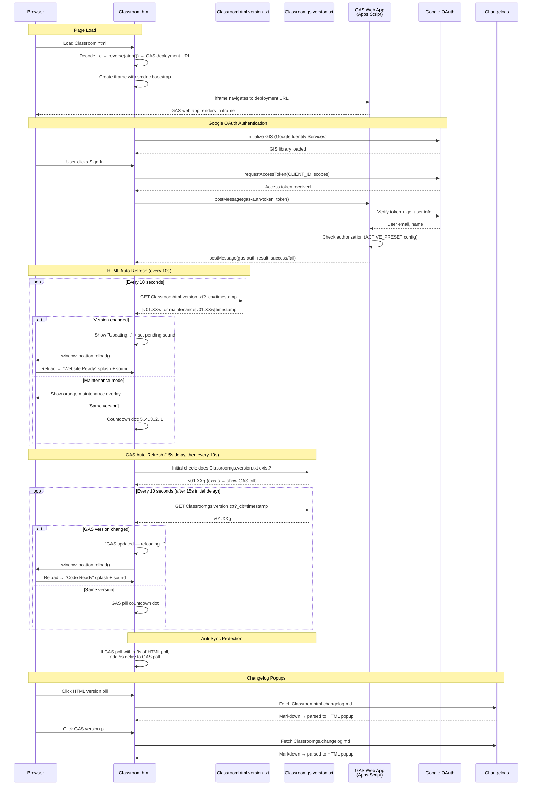

# Classroom.html — GAS Integration Sequence Diagram (Auth)

Sequence diagram showing the dual polling systems (HTML + GAS) and the iframe injection flow.

> [Open in mermaid.live](https://mermaid.live/edit#pako:eNq9Vt9v4jgQ_ldGeQId5Ep392HRbldc2ushtXsVtNw-IFUmGYLVYOdsA8v--N9vJk4KgdCrdNL1oYA94_lmvm_G_h7EOsGgH1j8e4UqxkspUiOWUwX0lwvjZCxzoRz8ZvTGojne-OP-9gaEhSgT1hqtl-HCLbMGu0nNio3CNRortQrdV3fscF13SO2_mA_GbM8ff-EMBnn-YWYuWvRpYRwbmbt2g5PWaYaFn__252DlFsd2kU9xIVSKmU7tVHmbz9ohaMJV1afD5ejDnUgRbrRIvFm52b248Nu801gw3n62ukQmBx4Rpqvz3vtzMMgVwJZwetZqt6tlTjnBPNPbJRLWh9FNw2GRQUFY5ZzYRdhItwBr4kTHMNPaWWdEXvOiQ_uVtRJrmZK3BacbI5Fxl3zKNPsFog2RIPKcQKuEUINU5XGna-c56Ne4AP5HwWQsHHFfx1jaD5V0UmTyG8L1cAyt0n-YsJ_bwhjNWsZoSwH47e5zadgnkzMjzBYyYgZPsPZAPyDOZPxEipKporiNcAz3knWDmELae_2EqhXdDK8-3z8OLztgY52fhOJ9qMzkROfEKNcVmn1ecm3dLRmSylqpsF1BNeoWTh3v297xssM1QSPn2_LwXyBFBytOSaq5PoRThCkSxqWQWYc0wMztHcoG0QLjJ-Do2shvBUHQGkT3w8nV493oanx1D7FWc5m2azrxuTYmYdCuMkdVWhWV-HVOwdsvdNuk7wcQqUR3Rzgn_wW0uE-20DurypxpncNVuQiW-kol1m_tNwoddk2QT86oT4_x7KOTSyJXLPM9_8kuqx_rs1745cvmB2gDVDrlUAkarM_rDf4ic0wOh4G4mDHJbvOok8cLvYFp8JAnVHCVhmE4DYhOS3Tm1Gu01LV6pZqPeG7RjVSJ3oSZ9n0VGmTpt9p1r8MWGBVW1eCZBjRprSRSRiiSLcGwOdVuwWjqCDCzCLe7asCSJtvLAIs0teFq7Nex4D8T24OzxzynSqpeqF1EsBzlrSDRrg_vwvBtGL4Jw_Mw7O2dWEEvvpycVhM_6OrS672zNCIJIHUizS04lGLVxpPnsUWUUxf1CRGevO4Av0rrPpVdtCc3r6qUJM8GtmLGcvEYXC6z7KUmgJaYO0qKYcsSTwG_fdQe14ftUYd4qjka0NaVzzDXr1b_NGD7FYsfCyGe9d6CF2_VDP-H8CO-mV-l-lcqsyKLBuaeRF-rST6jEOSAbrzueKtiuDO0Gx_dmT7acO4DagrIbwG6nN9Y0HM_THm5w68nkSRQ6Znv_srndFNE3GTVMwnudL7KbfNtGvFF6uNV7HP-NbB82u_o4sXBTI6rCOGyrEp0s1PZrTBPRQFLtughZ0krhL_MjkBVGTSj2pfka0BRJ_x3SEEnWKKhUZfQe_z7NKDxQVdu0J8GCc4F3YrT4CfZ0DWpmeCg78wKO4FvhfLd7hd__gOOXsXI)

## Key Design Notes

- **GAS iframe injection** — the deployment URL is stored as a reversed+base64-encoded string in `_e`. The iframe uses `srcdoc` with a bootstrap script that reads the URL from `parent._r`, deletes it, then navigates — preventing the URL from being visible in page source
- **Dual polling** — HTML and GAS versions are polled independently with anti-sync protection (if polls align within 3s, GAS poll gets a 5s delay to re-stagger them)
- **Two splash screens** — green "Website Ready" for HTML version changes, blue "Code Ready" for GAS version changes
- **Audio unlock via UAv2** — since the GAS iframe covers the entire page, click events don't reach the parent document. The UAv2 poll detects `navigator.userActivation.hasBeenActive` (propagated from cross-origin iframe clicks) and unlocks AudioContext without needing a direct click on the parent

Developed by: LightAISolutions
