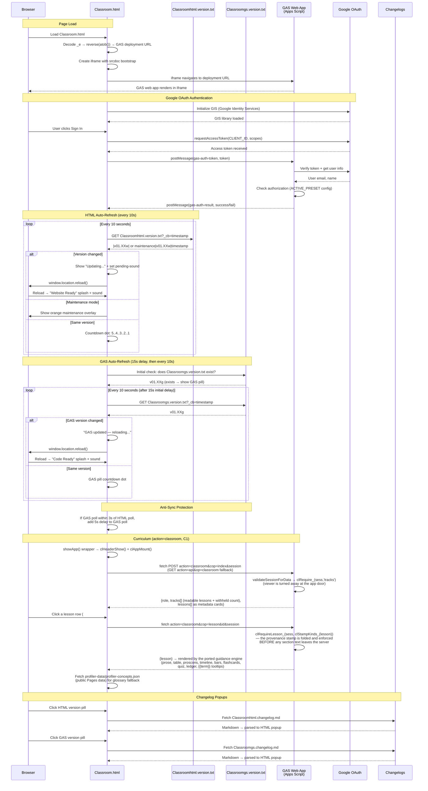

# Classroom.html — GAS Integration Sequence Diagram (Auth)

Sequence diagram showing the dual polling systems (HTML + GAS) and the iframe injection flow.

> [Open in mermaid.live](https://mermaid.live/edit#pako:eNq1V-1u4zYWfZULLZBKGFnTbLd_3J0UrieTBk06QZxJC9RFQJNXMjcUySEpezxpgP3VByj2Cfsku5eSEju2swEW-8cf4r3k4bnnHlJ3CTcCk2Hi8WODmuNbySrH6qkGALDMBcmlZTrAd84sPbrtge-vzs-AeRgr5r0zpi7moVY74q43oiioWKDz0ugifArbCSebCZX_L-GjCcXT1084g5G1f5-5o3RkrYcJd9KGbEeSMZXCmNf-ej9qwnw7btxucc50hcpUfqrbmB9NQDALdD0_OdExhAtWIZwZJtqwbnBwdNQO08hOwmj4IeotUnHgBuHP3_8Ah7R9TFkwszTL4jParECrzKpGHeDD5dmOacYOWUCQpWM1wlKGOXjHheEwMyb44JjdyDoZTYZ9tGYLWbGAHoLZudLJaDIYHB11GxxGREucAbMWHGqBzoPU3XT7WWvZH25UAegDdZCcBWn0JsYu_lTLIJmSnxFOTieQdvmngvLCCiboFpKj70rfDg8eqKEcJWeOuRUowwTuqdcHjw64kvzWw0RWGk53w3HURT6MOEfvr8wt6nR8dnr849XN6dscPDd2L5Q2BwIlgUOOctGjWa-LNT6co_eswrRifsCaMB_EpLzNzR7r8ojrGp0sV93kr6DCAA1tSerSPIUTl4kbxppJlYOOlVublALGc-S3QKsbJz_HAkE6Gl-dXh_fXFweT46vgBtdyirb0Em7152bcOgbFXLwTWTidcmkyp7ps-thaz2jJpjBJZYO_RxSapIVHH7Z06yMsXDcPQSP3Gjh26H1Rrkewsnx1X53-vaGz94EWaMPrLZr-dePu_pt8eVh8fPPy9_AOKiZ1AE10xwfnu_IZypQcWgZ4NFdxOPgVidP5mYJ0-SDFSxIXRVFMU3gFXgMYFELqauBN43ePcVDiy6lFmZZKNP2VeGQpJ9mm1lPW-AyRkXXmSY_4czLgHCJTKymCXirmJ8TlM3lUXmE80cqoDYCn0cX92gcUbFOYiy-Yqsnc0_IpLo6PUPc2DQ6CLPUIEwYwtdF8bei-Koo_loUh2sz9tDjj71Wdd263KbuDr_2IFCxVQ5kWvBUh30PXz94FnBqoSEIg3tPOcBP0odvuxZa01orqQrSGOBjWTwxR8isVOo5-UPKyoAOCLPswETs2VZjnDxtjE18-9piB9RNzRPMxYt1P00oviHZo4A___kvaDXb98D_Xe9jOodfJPYXCrIvE_B1Zb5UijRH1OFIBzmYrDSHC2cC8q1zsl3ttGwXNErF819q-MqDKVsDpcc53ZWYENDLmM77PueZXohHQeOc5I1qakhZhPCG93LJYXyY7UBEWh1Zm2awdMxadJForr5HJtCRB6QZvAKuRtaeE0Vptn0Wlhj4HC7eT67g6boH3Ng3Ugv8dODRUzHiZZCk3IUyKw-MfcyAkik1Y_w22zrrFkxJkt6knemdcW9ZYB3iS_zYSIc3Ka2TfxEc47f-iywut5C4pFPWQ2icRgFsyVbAAllEvCEJY9yuA_LOGYU5tJP98iukDplgM4Wg0HujPbyKhZyjEq2EsljBbvSXX-m2WmNggoBy5oS_332zGdOlBlg3LzizhPQv7Z_XByp8I8VBFb7ZS_5O3tv0Ayl67rcYfaDtLIZ25AFXE_KRH6QW_iZtp8kildTzRJp1ZtEdCNFyiNvSKEHcagGoS-M4Ckr57vjd-8tjYHpFvhcvKAE_BVDIFnSfnSN4dIv-lWaT_3bt--7iTdfY_xjPbNViMI5sqGqkiEBQV1JjLLh1xlPdqFQ5gfXcaJ8DWaSSGnOYMedzKMlBYlli2T428nMOCkWFLoe7u4Cuvr-HYIwK0vpdDfQu0m-dKaVCN6A6v374x43maIMv_uE74dtmpiSPryUeKDiD0jiolPGeLr-9-Pe3-pjE0r__wIWxjfXPSSpaS2_xZHUbmxg_bGHzysX7FYq6M8Dx2WNZzpm7jV5JZbHMeRTkU52L2cb28HdDWj90XoKo8v8rniRPanQ1kyIZJnfTJMyxxmkynCYCS9aoME3ukzxhTTDk4skwuAbzpD3pulfx9uH9vwF8KSVt)

## Key Design Notes

- **GAS iframe injection** — the deployment URL is stored as a reversed+base64-encoded string in `_e`. The iframe uses `srcdoc` with a bootstrap script that reads the URL from `parent._r`, deletes it, then navigates — preventing the URL from being visible in page source
- **Dual polling** — HTML and GAS versions are polled independently with anti-sync protection (if polls align within 3s, GAS poll gets a 5s delay to re-stagger them)
- **Two splash screens** — green "Website Ready" for HTML version changes, blue "Code Ready" for GAS version changes
- **Curriculum ops (role-gated, v01.00w/v01.01g; first tracks + renderer v01.01w/v01.02g)** — the page's own UI reads lessons and tracks over the cookie-less fetch transport at `?action=classroom&cop=index|track|lesson` (POST with a GET api-route fallback), the same shape Profiler's guidance ops use. `handleClassroomOp_` validates the session, applies the app door (`clRequire_(sess,'tracks')` — viewer is not admitted at all), pre-filters index and track answers to the tier, and for a lesson folds its own `provenance.inputs[]` stamp through `clStampKinds_` → `clGateForProvenance_` and enforces it with `clRequireLesson_` before any section text is returned. The gate is never stored in the data. Content lives in `Classroom.gs` as strict-JSON literals (repo + GAS project only, never on public Pages, because a track names gated titles); the renderer in `Classroom.html` is a port of the guidance engine onto a light palette, so one section vocabulary serves study guides, guidance modules, reports and lessons. Since C3 session 1 a `guidance:` provenance input links to this app's own hub instead of out to Profiler
- **Industry Guidance (C3 complete, v01.12w/v01.23g)** — the guidance hub came home from Profiler and, since session 3, it is the only copy. The nine `guidanceDoc*_()` module literals and `guidanceDocs_`/`guidanceIndex_`/`guidanceDoc_` live in `Classroom.gs` **below the `// CONTENT END` fence**, so an unattended C2 pipeline run cannot write them (`CLASSROOM-COMMITTER-CONTRACT.md` §3) — outside the pipeline's write set by construction rather than by convention. `handleGuidanceOp_` answers `?action=guidance&gop=index|doc` on the same cookie-less transport (POST with the GET api-route fallback) behind `clRequire_(sess,'guidance')` — admin and contributor, the tiers `GUIDANCE_ROLES` admitted in Profiler, so the gate followed the content across apps. The page routes `#guidance`, `#guidance/<id>[/<section>]` and `#guidance-glossary`, rendering modules through the same `cl*` primitives lessons use, plus a lane-grouped library, a cross-module search and the unified glossary. Module ids are permanent — Scraper's `guidance:<module-id>` seeds and every lesson's provenance stamp key on them. Profiler's copy and `scripts/check-guidance-parity.py`, the guard that held the two byte-identical, were both deleted at session 3; Profiler deep-links in from its dossier mention chips. **The masthead cross-links are gone on both sides (v01.13w / Profiler v01.90w, developer directive):** Classroom dropped `← Profiler` and Profiler dropped `🎓 Classroom` and `✦ Industry Guidance`. What survives is the link that points at *content* rather than at an app. `#cl-links` is a flex row, so the guidance link reflowed left with no slot arithmetic; a tier without the `guidance` capability now has no link in that row at all, only its role badge.
- **Session 3 closed the read-only window (v01.12w/v01.23g).** `clProgressValid_` admits every registered module alongside the lessons a session may read, behind the same `guidance` capability — one map, because the invariant is one: **progress is never a weaker gate than reading**. Modules therefore render with mark-as-understood buttons and filling nav ticks like any lesson, and the library cards carry a completion readout. The per-account history came across in **one shot, not a merge**: Profiler's `exportGuidanceProgress()` filters `gd_progress:<email>` down to the nine module ids (that property also holds `study-<slug>` and `dossier-<slug>` ticks, which stay there), and this app's `previewGuidanceProgressImport` / `applyGuidanceProgressImport` / `verifyGuidanceProgressImport` read it from the `GUIDANCE_PROGRESS_IMPORT` Script Property into `cl_progress:<email>`. **An existing Classroom tick always stands** — which makes the import idempotent by construction and is correct in both directions, since a Classroom date earlier than Profiler's is the true first completion. `clDrillGuidanceItems_` adds module `flashcards` and `quiz` sections to the C4 pool as `gc:`/`gq:` ids behind the same capability, which is **decision 6 of `PHASE6-CLASSROOM-DESIGN.md` at its target state**: no guidance item entered the drill until guidance both lived and was studied here.
- **The federation pieces (session 2).** The **Admin lens** (`clLoadAdminLens`/`clApplyAdminLens`) re-hosts here behind `clCan('reports')` — admin only, the same tier Profiler's `OV_ROLE_CAPS` grants it — and reads `reports/reports-index.json` and `reports/<id>.report.json` straight off public Pages under `CL_DATA_BASE`, so no server route was added for it; a non-admin issues no report request at all. Panels **append** into `#cl-<sectionId>` (two current reports can anchor the same section, and today two do); since session 3 wired the ticks there is a `.cl-done-btn` to insert before again, and the append-on-a-miss fallback stays so a missed selector can never drop admin content. An anchor a revision has since deleted lands before `#cl-glossary` with a note. The **guidance peer route** `?action=guidancepeer&t=…&gpop=mentions` answers `guidanceMentions_()`, which moved here with the content it scans; it is token-gated on the `GUIDANCE_PEER_TOKEN` Script Property exactly as Scraper's `?action=corpus` is on `CORPUS_TOKEN` — a different pair of peers and a deliberately different secret — refused flat while unset, with **no** browser-facing door, because Profiler's `guidanceAllowed_` remains the single boundary deciding who may ask
- **Audio unlock via UAv2** — since the GAS iframe covers the entire page, click events don't reach the parent document. The UAv2 poll detects `navigator.userActivation.hasBeenActive` (propagated from cross-origin iframe clicks) and unlocks AudioContext without needing a direct click on the parent

Developed by: LightAISolutions
