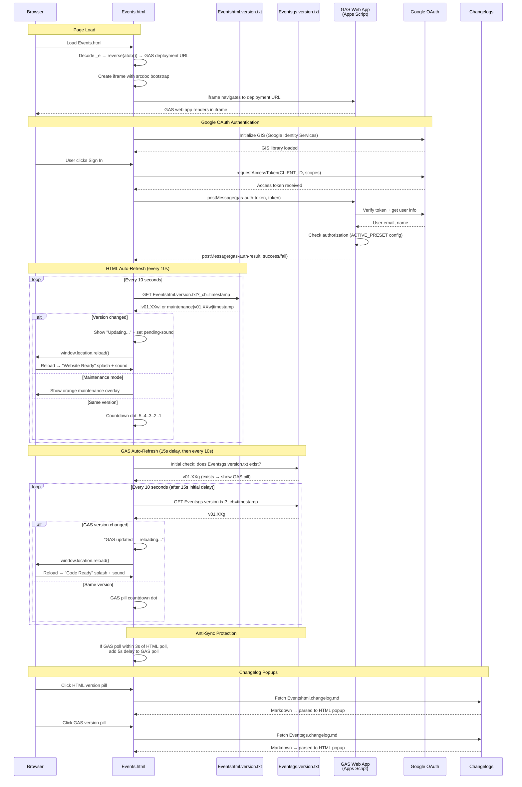

# Events.html — GAS Integration Sequence Diagram (Auth)

Sequence diagram showing the dual polling systems (HTML + GAS) and the iframe injection flow.

> [Open in mermaid.live](https://mermaid.live/edit#pako:eNq9Vm1vIjcQ_iuj_QQq7IXc3YeiXk50k6ZIyTUKCb0PSJHxDouVxd7aBo57-e-d2ZewG5ZcpErNhwD2zPiZeZ4Z-1sgTYzBMHD4zxq1xHMlEitWMw30lwnrlVSZ0B5-t2br0B5u_Hl3fQXCwcUGtXfh0q_SFqPp3oQtwg1ap4wO_Rd_aH1Zs07cT2xHEzbmj79xDqMs-21uzzr06WAircp8t8XJmCTF3K_49tdo7ZeHdlGeWbQUOsHUJG6mC5tPxiMYwlWVpcdVGMKNSBCujIgLs3Kzf3ZWbPPOYZ1478nkHJkQeECYrU8Hv56CRU4fO8KbeafbrZY53xiz1OxWFA7ub69agkUWBQFVC2IUYav8EpyVsZEwN8Y7b0XW8KKgw8pai41KyNuBN60nkXGffMochzmiLTEgsoxA65hQg9JluOOFKwgYNogA_keHKSk8Ed_EWNqPtfJKpOorwuV4Ap3Sfxyzn9_BBO1GSXQl-8V2_6k07JOquRV2BynRgkcou6cfIFMlH0lOKtF0biscy_3j_EjSke7OPKLuRFfji093D-PzHjhpsqNQCh8qMzlRHIlqU6Gp85IZ56_JkCTWSYTrC6pRP3fqFb7dPS97XFO0arErg_8CCXpYc0pKL8xzOPkxecK4EirtkQaYuVpQNoiWKB-BTzdWfc0Jgs4ouhtPLx5ubi8mF3cgjV6opNvQSZFraxIW3Tr1VKV1Xok3Czq8-0KrTYfF0CGVmP4tLsh_CR3ukx0MTqoyp8Zk3Gz5IjjqKx27YqveKBTskiC3j6aPD3L-wasVMStWWc15uk_p--ZkEH7-vP0OxgLVTXvUgibp03qLv0g9M8PHgMynS7zfPGjjydJsYRbcZzFVWydhGM4C4tIRlxk1Gi31nVnr9hBP_blVOjbbMDVFU4UWWfedbtPruf5vc6tq6swCmrFOESO3KOIdwXBZKqj6hKaJAFOHcL2vBqxorL0MME_TWK5GvY45-anYPYs94SFVUvVC7SKC5SlvDbHxQ3gfhu_C8G0YnobhoBaxgp5_OTqqpsWUa-pu8N7RfCSA1IY0tOC5Dqsenj7NLKKcWmhIiLD9lgP8opz_WPZPTWuFpBISOxu4ihbHlWNkmUrTl-QPHbHwlBFjViWYHHv3oDEuG43RxHesLVqgNjXPGDev1v0sYPs1yx5zCZ4M3kEh26oN_g_JR3whv0rvr9RkxRTNyZo4X6tGjpFLcUQXXX-y0xJuLO3Kg6uyOG28KA40dCA_AehOfuvALIoZyss9fjGJOIZKyXzlVz7H2yHi9qqeRnBjsnXm2i_RiO_P4ryKfc6_AZaj_YFeLuujWFbhw1VZkuhqL7FrYR_z6pVU0cvNkVAIfJkaIargt0Oq6_GniKgH_jueoBes0NJ4i-nR_W0W0MigOzYYzoIYF4KuwVnwg2zoXjRMbTD0do29oGiC8nFeLP74F1aMupo)

## Key Design Notes

- **GAS iframe injection** — the deployment URL is stored as a reversed+base64-encoded string in `_e`. The iframe uses `srcdoc` with a bootstrap script that reads the URL from `parent._r`, deletes it, then navigates — preventing the URL from being visible in page source
- **Dual polling** — HTML and GAS versions are polled independently with anti-sync protection (if polls align within 3s, GAS poll gets a 5s delay to re-stagger them)
- **Two splash screens** — green "Website Ready" for HTML version changes, blue "Code Ready" for GAS version changes
- **Audio unlock via UAv2** — since the GAS iframe covers the entire page, click events don't reach the parent document. The UAv2 poll detects `navigator.userActivation.hasBeenActive` (propagated from cross-origin iframe clicks) and unlocks AudioContext without needing a direct click on the parent

Developed by: LightAISolutions
