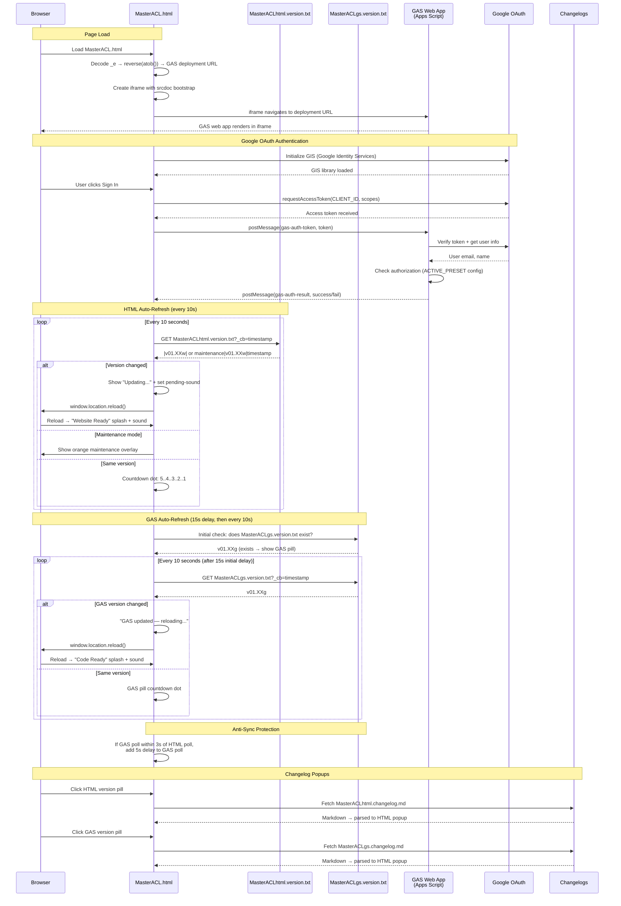

# MasterACL.html — GAS Integration Sequence Diagram (Auth)

Sequence diagram showing the dual polling systems (HTML + GAS) and the iframe injection flow.

> [Open in mermaid.live](https://mermaid.live/edit#pako:eNq1VttuGzcQ_ZXBPkmItI2b5mXROlDXqipATg1LVvIgwKDI0YrwLsmSs1KUC9CnfkCQL8yXFNyLpZVWroGiL7ZAzuXMzDnD_RRwLTCIAod_5qg4XkmWWJYtFACAYZYkl4Ypgl-t3jq0pxe_z64nwBxcM0doB_EkXFOWttjNG1beKNygdVKrkD7QqcOo6ZC4fzEfTL29__cOlzAw5uelvewMjHEw5VYa6rY4aZ2kWPiVv_4Y5LQ-tYuLEuM1UwmmOnELVdq81YSgN2jr_vR8OyK4YQnCRDNRmlWX_cvL8trftDbMXz9aXaEfDtwjfP_7K1j05WOHkV52ut3izBcr0KR6l6EiuLudtISJLTJCkCvLMoStpDU4y4XmsNSaHFlmGl6jwTSqrRXbyIQROiDdmmk0mPb7l5dVgVGBaItLYMaARSXQOpCqCne-a2X3o8YUwP9BRZIzklo1MVb2YyVJslR-RBiNp9Cp_MfC-9EOpmg3kqOrRl9e9x9b431SubTM7iDVTOCZed05tMBTyR8cTGWiYNwOx3oVORpwjs7N9AOqTjwZD9_O7sdXPXBcm7NQSh8g7wQWOcpNjeZwLkY7ukbnWIKdhLk-y2ndL5x6pW93P5c9rjlaudpVwV9AggS5L0mqlT6GU6QpCsaMybQHqpjcQVBvEK-RP4DPrq38WAwIOoN4Np4P729uh9PhDLhWK5l0Gzwpa20twqLLU-qBy4tO_LBiMu0-obN5VK6eQU66f4sri24NHS-SHVy8rNucam1gWB2CQ66VcOXVoVDmEYyGs_Pb6c09X_5CMkNHLDMH_vN9VZ83Ly_C9--3n0FbyJhUhIopjo_nLf4sJT8cnwZ4sV3E_vJEydO13sIiuDOCkVRJGIaLAF6AQwKDSkiV9J3OVXuIR4lupRJ6G6a61FVo0VO_0216HUvgtrAqts4ieIdLJwnhFpnYLQJwJmVu7aE002PqEK73rYBMC3waXVGjtr4Vh00shp-y3VHsqV9S1ZyeaFysc0VCbxUITRG8DsOfwvBVGP4YhhcHEWvoxY-zq2pebrkm7y5eOxCYsl0P_NKCYx7WGp4_7izgXkIRCI1nXznAD9LRm0pCB1wrKZVApzBwxVic75xHZmSaPkV_6LAVoQWPWVZgCuzdE2GMjoXRxHdOFi1Qm5z3MDfP5v0i8Pa5pz0K-P7XNyg5W2vgf-d77N_hZ5H9mYSsxwT8kJnPpaKPUfBwoEj2pzvF4cZqQn7yTpbZxqsyoU7T4v2XCl450Ktygfrjnv9WYkJATWP_3tc-57UQe23VH0Vwo01uXPsLGvvHs8xXz93X3wDro_2GxNdHe5jXGcKs6ko82fPrmtmHooF-VIZZh8KDr0ozuanht0M6ZOJzECXuv-IJekGGNmNSBFHwaRHQGjNcBNEiELhieUqL4EvQC1hO2o82iMjm2AtK-lff5-Xhl38AATbEdA)

## Key Design Notes

- **GAS iframe injection** — the deployment URL is stored as a reversed+base64-encoded string in `_e`. The iframe uses `srcdoc` with a bootstrap script that reads the URL from `parent._r`, deletes it, then navigates — preventing the URL from being visible in page source
- **Dual polling** — HTML and GAS versions are polled independently with anti-sync protection (if polls align within 3s, GAS poll gets a 5s delay to re-stagger them)
- **Two splash screens** — green "Website Ready" for HTML version changes, blue "Code Ready" for GAS version changes
- **Audio unlock via UAv2** — since the GAS iframe covers the entire page, click events don't reach the parent document. The UAv2 poll detects `navigator.userActivation.hasBeenActive` (propagated from cross-origin iframe clicks) and unlocks AudioContext without needing a direct click on the parent

Developed by: ShadowAISolutions
