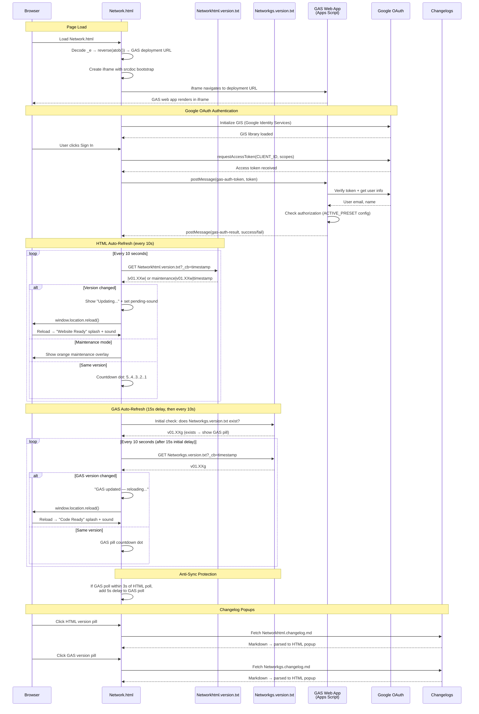

# Network.html — GAS Integration Sequence Diagram (Auth)

Sequence diagram showing the dual polling systems (HTML + GAS) and the iframe injection flow.

> [Open in mermaid.live](https://mermaid.live/edit#pako:eNq9Vt9vIjcQ_ldG-wQqbEPu7qGozYlu0hSJpFFI6D0gRcY7LBaLvbW9cNyP_73j9W7YDUsuUqXmIYA9M_5mvm_G_hpwFWMwDAz-k6PkeClYotlmLoH-Mqat4CJj0sLvWu0M6uONPx9uJsAM3KLdKb0OV3aTtljNajbOJNyiNkLJ0H62x-bXdfPE_MB4NHXW7uNvXMAoy35d6IsOfRqYci0y221xUipJsfDz3_4a5XZ1bBcVyUUrJhNMVWLm0tvcKougCFdVmZ4rxBDuWIIwUSz2ZuVm_-LCb7udllK5zWebS3SkwBPCPD8f_HIOGl3-2GFWLTrdbrXsEo4xS9V-g4T08X7SEizSyAipWBKrCDthV2A0jxWHhVLWWM2yhhcFHVbWkm1FQt4GrGo9iYz75FMmOSwQ7YgClmUEWsaEGoQsw52unGdg2GAC3D86THBmifkmxtJ-LIUVLBVfEK7HU-iU_uPY-dk9TFFvBUdT0u-3-8-lcT6pWGim95ASL3iCs0f6ATwVfE16Eomkc1vhaNdDxo44HWke1BplJ5qMr24fnsaXPTBcZSeheB8qMzlRHI5iW6Gp85IpY2_IkDTWSZjpM6pRv3Dqed_ugZcDrhlqsdyXwX-CBC3kLiUhl-olnOKYImHcMJH2SAOOuVpQZxCtkK_Bna60-FIQBJ1R9DCeXT3d3V9Nrx6AK7kUSbehE59raxIaTZ5aqlJeVOLnJR3efaXXZkM_eEglqn-PS_JfQcf1yR4GZ1WZU6UyuCoXwVBfydj4rXqjULBrgnxiOn184ovfrNgQtWyT1bxnh5y-bc8G4adPu2-gNFDhpEXJaJw-r7f4s9Q6atwxwIv5Eh82j_p4ulI7mAePWUzllkkYhvOAyDREZkadRkt9o3LZHuK5QXdCxmoXpsp3VajRCb_TbXq9bID7wqoaO_OApqwRRMk9snhPMEyWMio_oWkiwNQg3ByqARuaa68DLNJU2lWjXseC_ZTtX8SeuilVUvVK7SKCZSlvCbGyQ_gQhu_D8F0YnofhoBaxgl58OTmrZn7MNYU3-GBoQBJA6kOaWvBSiFUTz56HFlFOPTQkRHjiogP8LIz9WHZQTWxeUwnJ3RmYihfjSuegZSJNX2sA6LClpZQcaFGiKcB3j1rjutkaTYCnGqMFa1P1DuT2zcqfB84-d8LHQoRng_fghVs1wv8h-sjdyW9S_BtVWVFFo7Imz7fq0cUoxDiiu64_3UsOd5p2-dFt6U8bL_2Big50rwC6lt8ZUEs_Rt1yz72aWBxDpWV361c-pxsicg1WPY_gTmV5Ztrv0chdof68in2XfwOsi_YHWr5qTGNexQ83ZU2iyUFjN0yvi_KVXNHzzZBSCH2ZG0Gq8Ldjqgvyx5CoC_47oKAXbFDTiIvp9f11HtDYoIs2GM6DGJeM7sJ58J1s6HJUjtxgaHWOvcC3QflK94vf_wWNM763)

## Key Design Notes

- **GAS iframe injection** — the deployment URL is stored as a reversed+base64-encoded string in `_e`. The iframe uses `srcdoc` with a bootstrap script that reads the URL from `parent._r`, deletes it, then navigates — preventing the URL from being visible in page source
- **Dual polling** — HTML and GAS versions are polled independently with anti-sync protection (if polls align within 3s, GAS poll gets a 5s delay to re-stagger them)
- **Two splash screens** — green "Website Ready" for HTML version changes, blue "Code Ready" for GAS version changes
- **Audio unlock via UAv2** — since the GAS iframe covers the entire page, click events don't reach the parent document. The UAv2 poll detects `navigator.userActivation.hasBeenActive` (propagated from cross-origin iframe clicks) and unlocks AudioContext without needing a direct click on the parent

Developed by: LightAISolutions
