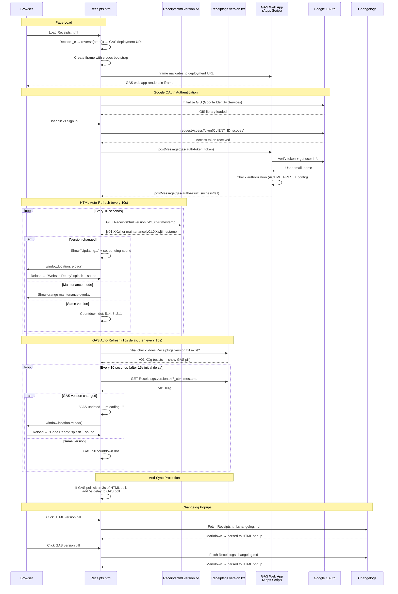

# Receipts.html — GAS Integration Sequence Diagram (Auth)

Sequence diagram showing the dual polling systems (HTML + GAS) and the iframe injection flow.

> [Open in mermaid.live](https://mermaid.live/edit#pako:eNq9Vm1v4jgQ_iujfAId5Ep398Oi3a64lOshtXsVUG4_IFXGGYLVYOdsA8u-_PcbxwkQCD2kk64fCsTz8sw8z4zzPeAqxqAbGPx7hZLjrWCJZsupBPrLmLaCi4xJC79ptTGoTw_-GD_cAzMwRI4isyZc2GVaYzY5NHI24Rq1EUqG9qs9tb-r2CfmX6x7I2fuPv7CGfSy7MNM3zTo08CIawrRrHFSKkkx9_Pf_uyt7OLULsrrixZMJpiqxEylt_msLIIiXGVzWq4XXXhkCcK9YrE3Kw7bNzf-2J3Udcud7oxu0REDzwjT1XXn_TVodA3ABrNq1mg2y8eu4hizVG2XSFCfhvc1wSKNjKCKOTGLsBF2AUbzWHGYKWWN1SyreFHQbmkt2Vok5G3AqtpMZNwmn6LKbo5oQxywLCPQMibUIGQR7nzrPAXdChXg_lEywZkl6qsYC_uBFFawVHxDuBuMoFH4D2LnZ7cwQr0WHE3Bvz9u71rjfFIx00xvISVi8AxpT_QDeCr4CwlKJJLy1sLRbo6M7XFKacbqBWUjuh_0P4-fB7ctMFxlZ6F4H2ozOVEc0se6RHPIS6aMfSBDElkjYabNqEft3KnlfZt7Xva4JqjFfFsE_wUStLByJQk5V8dw8jR5wbhkIm2RBhxzB0GdQbRA_gIuu9LiW04QNHrReDDpPz8O-6P-GLiSc5E0KzrxtdYWodGsUktdWuWd-HVOyZuvDNuk65cPqUS1hzgn_wU03JxsoXNVtjlVKoN-8RAMzZWMjT86HBQKdkeQzy2oT8989tGKJXHLltmB-2Rf1I_1VSf88mXzA5QG6py0KBnt1N3zGn-WWseNSwM83zDx_vBkkEcLtYFp8JTF1G-ZhGE4DYhNQ2xmNGr0qG3UStaH2E3oRshYbcJU-bEKNTrlN5pVr-MJGOZW5d6ZBrRnjSBOhsjiLcEwWcqo_4SmigBTg_Cw7wYsabG9DjAvU2nXjcM-5vSnbHsUe-TWVEHVK72LCJaluiXEynbhXRi-DcM3YXgdhp2DiCX0_MvZZTXxe66qvM47QxuSANIg0tqCYyWWUzzZbS2inIaoS4jw3F0H-FUY-6mYoQO1eVElJHhnYEpijOudw5aJNH1tBKDB5pZqcqhFASdH3zwZjruj4agiPDcaNWCrunco1xdrfxo4-5WTPuYyvOq8BS_dchT-D9lH7lq-SPMX6rLkirblgUAvVaSLkcuxR9dde7SVHB41nfKTC9NnG8x9QkUJ3YsA3cxvDKi536Tuccu9ObE4hlLN7uIvfc6PRORGrHxFgkeVrTJTf5VG7hb1-Ur2Xf0VsC7a72j5orqQeZkgXBZNie73Intg-iXvX0EWvcMZkgrBL4ojTGUB9aAOFXkBJpqD_44oaAVL1LTmYnoN_z4NaHXQbRt0p0GMc0YX4jT4STZ0QypHb9C1eoWtwA9C8bruH_78B1DjwbQ)



## Key Design Notes

- **GAS iframe injection** — the deployment URL is stored as a reversed+base64-encoded string in `_e`. The iframe uses `srcdoc` with a bootstrap script that reads the URL from `parent._r`, deletes it, then navigates — preventing the URL from being visible in page source
- **Dual polling** — HTML and GAS versions are polled independently with anti-sync protection (if polls align within 3s, GAS poll gets a 5s delay to re-stagger them)
- **Two splash screens** — green "Website Ready" for HTML version changes, blue "Code Ready" for GAS version changes
- **Audio unlock via UAv2** — since the GAS iframe covers the entire page, click events don't reach the parent document. The UAv2 poll detects `navigator.userActivation.hasBeenActive` (propagated from cross-origin iframe clicks) and unlocks AudioContext without needing a direct click on the parent

## Receipt Pipeline — Upload → Extract → Review → Save

Sequence for the receipts app feature (v01.01g/w upload, v01.02g/w extraction + review + save, v01.03g retry/fallback, v01.04g/v01.05w extraction cache + history browser, v01.09g/v01.11w batch upload + reports + edit-in-place, v01.10g multi-user data isolation, v01.11g/v01.16w sharing). All routes require a validated session; since v01.10g every read/write op is additionally scoped to the signed-in user's own receipts (owner = the row's Uploaded By email). The upload and save calls travel as body-POSTs with client-side retry because their payloads exceed GET URL limits. Extraction results are cached server-side by file ID (10 min) so transport retries never re-run Gemini.

> [Open in mermaid.live — Receipt Pipeline](https://mermaid.live/edit#pako:eNqlWM1uG8kRfpXCXExCpCj5D1g5diCZsqyFLRmiHMNYLhbF6eJMr3q6x909pCaGgz0F2NMiyQK5LJBL8gzJOY_iF0geIanuGYo0adpOTiSH09Vd9VV99VW_TVIjKDlIHL2pSKc0lJhZLMYaAKBE62UqS9QeXjqy60-fXj5_BujgglKSpXe7uS_Uryb2UcelqKFETQp2wNJM0hxStKK7buTkcMQ2-OMVTeCwLIMFYV4Y5ze8P7RyRmGFMZmi-Dsssc0xYGqUILtpLyqklmFx_Hb44jQszUiTRS9npFBnFWa0YfUoHHRUWkLhciIflrbOww48k5pOPRUOPE5cd6yjjTPjCcyMbAhjbzQ6gAt6U0lLDpzMNIm-1ODIOWk0dLDyOUyVmQNOzKw9CC_tP3rEIT-ASyxhnIw4yI3T4wTe__6PkGJBFmEAU6kISpletbjxwsX6oZlrl6Ii8Abe__jX_ft7e-U1fP3i-AQ6KeoZum6wN0FH9--uWDg5HB3Ai_PRJWDqpdEPq1IZFE0YoDM1toCJEfUDtnwH0HsqSu96oA2cHF_CFJWaYHrVOHZyOGqtzlBJgZ5GMRRPjB2ix443V6RX3g6YH0BqCT09kYo6F_3Xr1-_fv58OOw_fVoUzvXPzs7Odr8vs5WFHHvSrrLUnPcSJ-67Thd2AMuStABr5tBxHn3lGs9ILJlYhPBtE_hT0QvBbj9fWvVue7zo2ltM_SJgHBMsJZhyc2gaZzPy7OlRfSo6ccPubkb-SJlJZzWUIbV5Qchpemy0J-3h_Q8_gywwo1CSrjTa0SjNqUB22MrUw9ej87PWVrDSbx0oyKY5at8DFMKScz1gpHqQVtaSTuseuGrijUfVA4_XPYjfuURS9JQZW_dAtQXyzbfQIUxzmEufA4IgLrSCj9m-vTHorkrTdnNs4ozKw3GMKddPeIUEifjvEhJcQlx6CzYCU5J2UFrqT6VSJKCDSsFUkhIOSEiPE9UWIClHy_tMUaov2IRroA4YFKgrVEDa27oxrcWGIj8U31fOt6cZhOCBDPTCpTnCGS2qf2vCOZzRenkewCKDFxxNIqQA7MDU2JRgqjBbL9NhVSrJMEGaU3oVnHJY0CJJdjg1dkICMGMi8AlEux-nBDvwlqw19gBEa-4dVFqRc3Hzh_vQGSfBS9T1HOtxsn6UQ8cECszIDBWcDmHkjaXvzrCgBSVAJzVKSRfTYzqV19C_Pejf2VRmF6TZFZ8TlLnxhhmyQJ_m4ZGmOZwOP2SUJ1Kp1rtAIFKnaretlAWdhCj0wOIc6CaPrqj0axx1QaXClJY6ijVzB51QLiXZPudBWyqS3AYDk0oqEQ793GifqxpGVVGgrbk5caI7A0aDIEWethfbIlEOOACnYpXgYsZHqAS8_-VP4wQ6Q-lC8kvtPKEARTgjF47DAVon2I-2yqfSeWNrmHAEyEJntre_u3c3gwGEb_fmD2J-9Y1WNQiaYqV889_irfvzj_fRZoemhU6l8mQddNpshkGgOrCoM4IBuNzM-5WOOT0AZ6zvT-o-v9PdXohKOr-QC5_k_bD8XFPfy4JA4W9rKGTGKsVo1wu12c8qtIJ563TYsMJ69gcObp1x4KVX1E_RkXgAE4X6Csxcs8d8goYHOe9zAkUZpjVUbqGmljMMxUL5cU714PzVGVycvxrB-dmz19AJZuEhvGxQhqM6nIUB2d_Lur0m1qsF0pJAmxsP97thVfwNxgqyYGyblCHuzdMOY_FwCYiNHdt98-27ECuGAyxpQZbER7IDl-t6O7oZteAOyaNUn0Z4EcZl7tgB6d0Hhb_Fm5WmGv2i6xI1x1vEc-w0TKakvtqqSVNjRSSEIEQ_u4T-_Zc__yHsLHVoUuNkGFjl1-ME8L_thv_yHMwMpQ4tX2q467aHMxLTZ6uksP7i6PDxUlO6FW3cYsYsZJTX85w0WKPIQWr0VGbVAvwbUOLxvwCWRftw5C8tupxEx9uKukyxN72ERxQOeuhVv7uzBwJrt417I6C8v6XCcHVMrSlibUrnt6C5e63cNaeCsf4LoBwnx3FJWM9MXjkOVVB5HvKGjBuS7H5K6bKpz2c8PvdRbFtUlOBuJq0A58ZJK_y9CYnGj2AJXROPzvlh5fNujyOowTNSIZjhLVbVm7Dg58yovWYciqCw8AZh5jrQkowwN01qCy5HQUs0ZBbloGMJahhuqbMGq69arPb3t2AVmbVpXBkqRbaGolJe9h0pSj1PcyXs3-MKgAlv3RhTxpRwzAo8ZGYP4gSgaoh3AV6iWtO2cevHpiiDrvlwQPxfhsTup5euzkth5k5RKQeuxJQVx49_u797z4VgNmP91BK3TbJw8eI55ITCGlMs7bUKMA8T3FKCII3ovqmo4moLjYal8QdK_WNq34HzVILPramymFvBFGvZf_4dNJgpnI2TbhDBP_wcVbyx0OolFDPUKSsl0wjOa3-j8j-aVcdC-lWVzRkZNeTnJVQrs5qewTEYJ-9_-elf__gpWm_tLg8i42R7NJZHq0Bcaz2SQ7_hNE_kdezxTHphw_9j6AkpIwUVpQmD8KReGn0YBEtzKz25hugX5LL9BofpxX1RuTZrmnotyUojuAt5a7hLN6S63S9LX86pQWNwNrGQu-VY760mC1Oqz0naJWINzHF7b2_vE1pqVYBsuGx6rCRp33dSEEyq9Ir42AKlqgdzoitVD4o4oAwmso-ah-NB_AhVshNmCNbha8q8BzdXCzc3CPFmwvUgNazvWLVvA3KUo13w7v7-AshtPbJZ0xKvxZhVVATZF9J_APyxw5cI3ZjKM3NF27FFIdgyDxkx89tf3OvD988E_GXpyPpBlD8QV_Z57ItT5HkQ5nz0Ez468Y2QS01JD-D2Xj-6k2K5yf9x8htJ8-h7bDHGMtU09DFoy4KNI6e4C5rLgONDiHjfU2yIw8psNFgnCg7JSuYPYFVecK4E62HseBjTOSCyJhNPoodBJwZN6nwojybEHKggHxnBW4BKcdRCa5c6C8PILcb1Fk_4kpFDper2vSXieQCrItZ5rF08XxhWNxTWZU4xVFyni-rsNKycouVpH1LUgZO5PfHBX552k15SkC1QiuQgeTtOfE4FjZODcdJMxOPkXdJLsPJmVOs0OWB52kuqkoulufePD9_9B3lEFBo)

```mermaid
sequenceDiagram
    participant User
    participant HTML as Receipts.html<br>(scan panel + review card)
    participant GAS as GAS Web App<br>(doPost)
    participant Drive as Google Drive<br>(receipts folder)
    participant Gemini as Gemini API<br>(generativelanguage)
    participant SS as Spreadsheet<br>(Receipts + LineItems tabs)

    Note over User,SS: Requires signed-in session (auth flow above)
    User->>HTML: Tap "Scan receipt" → camera / file picker
    HTML->>HTML: Downscale to ≤1600px JPEG (canvas) → base64
    HTML->>GAS: POST action=uploadReceipt (form body; ≤3 attempts, no GET fallback)
    GAS->>GAS: validateSessionForData(token)
    GAS->>Drive: createFile(R-YYYYMMDD-HHmmss-NNNN.jpg)
    GAS->>SS: ensureReceiptTabs_() + append row (status=uploaded)
    GAS-->>HTML: {receiptId, fileId, fileUrl}
    HTML->>GAS: POST action=extractReceipt (GET api op fallback)
    GAS->>Drive: getFileById(fileId).getBlob()
    GAS->>Gemini: generateContent — image + responseSchema (strict JSON)
    Gemini-->>GAS: merchant, address, date, currency, subtotal, tax, total,<br>category, lineItems[] (each with a department category)
    GAS-->>HTML: {success, data}
    alt Extraction succeeded
        HTML->>User: Review card opens pre-filled (all fields editable)
    else Extraction failed
        HTML->>User: Review card opens empty — manual entry
    end
    User->>HTML: Adjust fields / line items → Save receipt
    HTML->>GAS: POST action=saveReceipt (form body: receiptId + reviewed JSON + force flag)
    GAS->>GAS: Duplicate check — same merchant+date+total as a saved receipt<br>→ {error: duplicate} unless force=1 ("Save anyway")
    GAS->>GAS: Assign readable ID Store_Name-YYYYMMDD (collision suffix -2/-3)
    GAS->>Drive: Rename the photo to match the new ID
    GAS->>SS: Fill receipt row incl. address (status=saved, raw extraction kept)
    GAS->>SS: Replace LineItems rows (with per-item categories)
    GAS->>SS: Rebuild the Monthly Summary tab (also on delete)
    GAS-->>HTML: {success, receiptId: newId}
    HTML->>User: "Saved ✓" (Discard instead leaves the row status=uploaded)

    Note over User,SS: History browser (v01.04g / v01.05w; saved-only default v01.05g / v01.06w)
    User->>HTML: Tap "History" → filters (merchant / date range / show-unsaved / sort-by-date)
    HTML->>GAS: POST action=listReceipts (GET api op fallback)
    GAS->>GAS: One-time lazy migrations, flag-guarded (IDs → Store_Name-YYYYMMDD,<br>merchants title-cased; blank owners backfilled to the legacy user)
    GAS->>SS: Read Receipts tab, OWN ROWS ONLY (owner = Uploaded By,<br>v01.10g), filter (status=saved unless uploaded=1),<br>upload order or receipt-date order (sort=date)
    GAS-->>HTML: {receipts[]} → list rendered
    User->>HTML: Tap a receipt row
    HTML->>GAS: POST action=getReceiptDetail (GET api op fallback)
    GAS->>SS: Read receipt row + its LineItems rows
    GAS-->>HTML: {receipt, lineItems[]} → expanded detail + photo link

    Note over User,SS: Record deletion (v01.05g / v01.06w)
    User->>HTML: Tap 🗑 → inline "Delete?" arm → tap again within 4s
    HTML->>GAS: POST action=deleteReceipt (GET api op fallback)
    GAS->>GAS: RBAC check — 'delete' permission when roles configured
    GAS->>SS: Delete receipt row + its LineItems rows
    GAS->>Drive: setTrashed(true) on the photo (recoverable ~30 days)
    GAS-->>HTML: {success} → row removed from the list

    Note over User,SS: .xlsx export (v01.05g / v01.06w)
    User->>HTML: Tap "Export .xlsx" (uses current history filters)
    HTML->>GAS: POST action=exportReceipts (GET api op fallback)
    GAS->>SS: Build temp spreadsheet — Receipts + LineItems sheets
    GAS->>Drive: Export temp as .xlsx (OAuth), then trash the temp file
    GAS-->>HTML: {fileName, base64} → Blob download in the browser

    Note over User,SS: Batch upload — mass processing (v01.09g / v01.11w)
    User->>HTML: Tap "Upload" → gallery multi-select (cap 15 per batch)
    loop Each photo, strictly sequential
        HTML->>HTML: Compress → base64
        HTML->>GAS: POST action=uploadReceipt (form body)
        HTML->>GAS: POST action=extractReceipt<br>(calls spaced ≥6.5s — Gemini free-tier RPM headroom)
        GAS-->>HTML: {data or error} → queued for review
    end
    HTML->>User: Review cards step through the queue ("· n of N")<br>— Save or Discard advances to the next receipt

    Note over User,SS: Edit saved receipt in place (v01.09g / v01.11w)
    User->>HTML: History detail → "✏️ Edit receipt / line items"
    HTML->>User: Review card pre-filled from getReceiptDetail data
    User->>HTML: Fix or remove lines → Save receipt
    HTML->>GAS: POST action=saveReceipt<br>(idempotent by receiptId — rewrites row + LineItems)

    Note over User,SS: Reports (v01.09g / v01.11w)
    User->>HTML: Tap "Reports" → period control + filters
    HTML->>GAS: POST action=reportReceipts (GET api op fallback)
    GAS->>SS: Read the user's own saved receipts + their LineItems (cap 2000)
    GAS-->>HTML: {receipts[], lineItems[]}
    HTML->>HTML: Client-side buckets (daily/weekly/monthly/bi-annual/annual)<br>+ instant filters (merchant, category, department, dates, cost range)

    Note over User,SS: Sharing (v01.11g / v01.16w)
    User->>HTML: Tap "Sharing" → grant by email (view / view+edit) or revoke
    HTML->>GAS: POST action=addShare / removeShare / listShares (GET api op fallback)
    GAS->>SS: Upsert/delete Shares-tab rows (Owner → Grantee + scope; 20-grant cap)
    User->>HTML: "Viewing" selector in History/Reports → a person who shared with me
    HTML->>GAS: listReceipts / getReceiptDetail / reportReceipts / exportReceipts<br>with owner=their email
    GAS->>GAS: Grant check against the Shares tab — 'view' allows browsing,<br>'edit' additionally allows saveReceipt; deleteReceipt stays owner-only
    GAS-->>HTML: The sharer's receipts (detail carries canEdit for the UI)
```

Developed by: ShadowAISolutions
