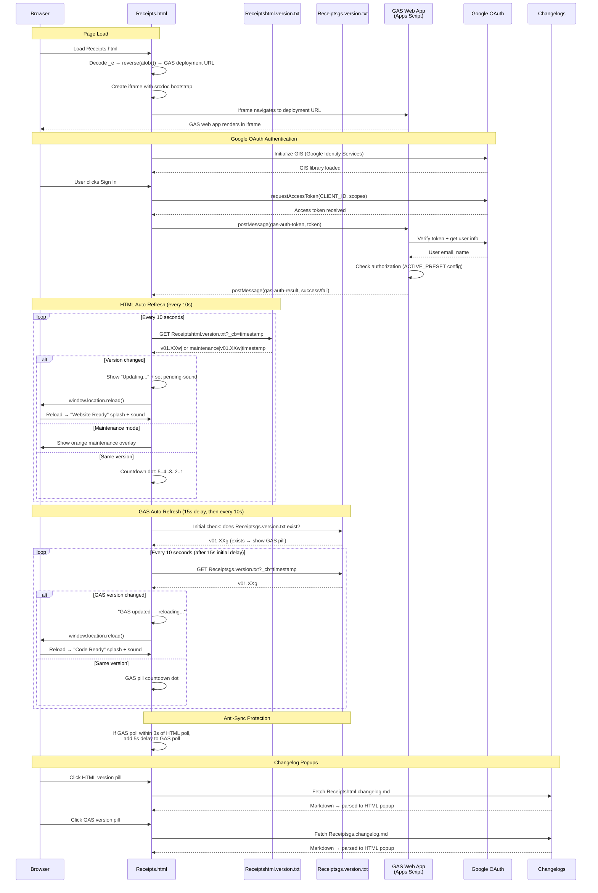

# Receipts.html — GAS Integration Sequence Diagram (Auth)

Sequence diagram showing the dual polling systems (HTML + GAS) and the iframe injection flow.

> [Open in mermaid.live](https://mermaid.live/edit#pako:eNq9Vm1v4jgQ_iujfAId5Ep398Oi3a64lOshtXsVUG4_IFXGGYLVYOdsA8u-_PcbxwkQCD2kk64fCsTz8sw8z4zzPeAqxqAbGPx7hZLjrWCJZsupBPrLmLaCi4xJC79ptTGoTw_-GD_cAzMwRI4isyZc2GVaYzY5NHI24Rq1EUqG9qs9tb-r2CfmX6x7I2fuPv7CGfSy7MNM3zTo08CIawrRrHFSKkkx9_Pf_uyt7OLULsrrixZMJpiqxEylt_msLIIiXGVzWq4XXXhkCcK9YrE3Kw7bNzf-2J3Udcud7oxu0REDzwjT1XXn_TVodA3ABrNq1mg2y8eu4hizVG2XSFCfhvc1wSKNjKCKOTGLsBF2AUbzWHGYKWWN1SyreFHQbmkt2Vok5G3AqtpMZNwmn6LKbo5oQxywLCPQMibUIGQR7nzrPAXdChXg_lEywZkl6qsYC_uBFFawVHxDuBuMoFH4D2LnZ7cwQr0WHE3Bvz9u71rjfFIx00xvISVi8AxpT_QDeCr4CwlKJJLy1sLRbo6M7XFKacbqBWUjuh_0P4-fB7ctMFxlZ6F4H2ozOVEc0se6RHPIS6aMfSBDElkjYabNqEft3KnlfZt7Xva4JqjFfFsE_wUStLByJQk5V8dw8jR5wbhkIm2RBhxzB0GdQbRA_gIuu9LiW04QNHrReDDpPz8O-6P-GLiSc5E0KzrxtdYWodGsUktdWuWd-HVOyZuvDNuk65cPqUS1hzgn_wU03JxsoXNVtjlVKoN-8RAMzZWMjT86HBQKdkeQzy2oT8989tGKJXHLltmB-2Rf1I_1VSf88mXzA5QG6py0KBnt1N3zGn-WWseNSwM83zDx_vBkkEcLtYFp8JTF1G-ZhGE4DYhNQ2xmNGr0qG3UStaH2E3oRshYbcJU-bEKNTrlN5pVr-MJGOZW5d6ZBrRnjSBOhsjiLcEwWcqo_4SmigBTg_Cw7wYsabG9DjAvU2nXjcM-5vSnbHsUe-TWVEHVK72LCJaluiXEynbhXRi-DcM3YXgdhp2DiCX0_MvZZTXxe66qvM47QxuSANIg0tqCYyWWUzzZbS2inIaoS4jw3F0H-FUY-6mYoQO1eVElJHhnYEpijOudw5aJNH1tBKDB5pZqcqhFASdH3zwZjruj4agiPDcaNWCrunco1xdrfxo4-5WTPuYyvOq8BS_dchT-D9lH7lq-SPMX6rLkirblgUAvVaSLkcuxR9dde7SVHB41nfKTC9NnG8x9QkUJ3YsA3cxvDKi536Tuccu9ObE4hlLN7uIvfc6PRORGrHxFgkeVrTJTf5VG7hb1-Ur2Xf0VsC7a72j5orqQeZkgXBZNie73Intg-iXvX0EWvcMZkgrBL4ojTGUB9aAOFXkBJpqD_44oaAVL1LTmYnoN_z4NaHXQbRt0p0GMc0YX4jT4STZ0QypHb9C1eoWtwA9C8bruH_78B1DjwbQ)



## Key Design Notes

- **GAS iframe injection** — the deployment URL is stored as a reversed+base64-encoded string in `_e`. The iframe uses `srcdoc` with a bootstrap script that reads the URL from `parent._r`, deletes it, then navigates — preventing the URL from being visible in page source
- **Dual polling** — HTML and GAS versions are polled independently with anti-sync protection (if polls align within 3s, GAS poll gets a 5s delay to re-stagger them)
- **Two splash screens** — green "Website Ready" for HTML version changes, blue "Code Ready" for GAS version changes
- **Audio unlock via UAv2** — since the GAS iframe covers the entire page, click events don't reach the parent document. The UAv2 poll detects `navigator.userActivation.hasBeenActive` (propagated from cross-origin iframe clicks) and unlocks AudioContext without needing a direct click on the parent

## Receipt Pipeline — Upload → Extract → Review → Save

Sequence for the receipts app feature (v01.01g/w upload, v01.02g/w extraction + review + save, v01.03g retry/fallback, v01.04g/v01.05w extraction cache + history browser, v01.09g/v01.11w batch upload + reports + edit-in-place, v01.10g multi-user data isolation). All routes require a validated session; since v01.10g every read/write op is additionally scoped to the signed-in user's own receipts (owner = the row's Uploaded By email). The upload and save calls travel as body-POSTs with client-side retry because their payloads exceed GET URL limits. Extraction results are cached server-side by file ID (10 min) so transport retries never re-run Gemini.

> [Open in mermaid.live — Receipt Pipeline](https://mermaid.live/edit#pako:eNqlWM1uG8kRfpXCXDyEhqK0_gFCxw4kU7a1sCVDlGEYy8WiOF2c6VVP97i7h9TEcLCnAHtaJFkglwVySZ4hOedR_ALJIyTVM0ORJk3byUkUOVXd9VXVV1_N2yg1gqJh5OhNRTqlkcTMYjHRAAAlWi9TWaL28NKR3fz26eXzZ4AOLiglWXq3n_tC_XpqH8YuRQ0lalKwB5bmkhaQohW9TSdPjsbsg_-8oikclWXwIMwL4_yW50dWzilYGJMpav4PJra9BsyMEmS3nUWF1DIYN5-OXpwG04w0WfRyTgp1VmFGW6zH4aLj0hIKlxP5YNoFD3vwTGo69VQ48Dh1vYlufJwZT2DmZAOMyXg8hAt6U0lLDpzMNIm-1ODIOWk0xFj5HGbKLACnZt5dhE37Dx8y5EO4xBIm0ZhBboOeRPD-93-EFAuyCAOYSUVQyvSqyxsbLu1HZqFdiorAG3j_418P7x0clNfw9YuTJxCnqOfoesHfFB3du7Pm4cnReAgvzseXgKmXRj-oSmVQtDBAPDO2gKkR9X32fBvQeypK7xLQBp6cXMIMlZpietUG9uRo3Hmdo5ICPY0bKB4bO0KPsTdXpNeeDjkfQmoJPT2WiuKL_uvXr18_fz4a9Z8-LQrn-mdnZ2f735fZmiFjT9pVltr7XuLUfRf3YA-wLEkLsGYBsfPoK9dGRmLFxRLCty3wpyIJYHd_X1r1bjdedO0tpn4JGGOCpQRTboemDTYjz5Ee16cibg7s7Wfkj5WZxutQhtJmg1DT9MhoT9rD-x9-BllgRqElXWm0o3GaU4EcsJWph6_H52edr-Cl3wVQkE1z1D4BFMKScwlwphJIK2tJp3UCrpp641El4PE6geYzt0iKnjJj6wRU1yDffAsxYZrDQvocEARxoxV8ze7praC7Kk27w7HFGZWHkwZT7p_wCAkSza8rmeAW4tZbshGYkrSD0lJ_JpUiATEqBTNJSjggIT1OVdeApBytnjNDqb7gEO6BOuSgQF2hAtLe1q1rLbY0-ZH4vnK-u80ggAcy0Au35hjntOz-nQXncE6b7TmEZQUvOZpEKAHYg5mxKcFMYbbZpqOqVJLTBGlO6VUIymFByyLZ49LYCwXAjInANxDdeVwSHMBbstbYIYjO3TuotCLnmsMfHEI8iUKUqOsF1pNo8ypHjgkUmJE5VXA6grE3lr47w4KWlABxapSSrimP2UxeQ_-rQf_2tja7IM2h-JygzI03zJAF-jQPX2lawOnoQ0Z5LJXqogsEInWq9rtOWdJJQCEBiwugmzq6otJvcNQFlQpTWpko1iwcxKFdSrJ9roOuVSS5LQ6mlVQiXPq50T5XNYyrokBb83DiQncGjAZBijztbrZloQwZgFOxTnBNxTepEvD-lz9NIohH0oXil9p5QgGKcE4uXIcB2iTYj47Kp9J5Y2uYMgJkIZ4fHO4f3MlgAOHT3cX9pr76RqsaBM2wUr79bfnUvcXH52h7QjtCZ1J5sg7irpphEKgOLOqMYAAuN4t-pZuaHoAz1vendZ-f6e1uRCWdX8qFT_J-MD_X1PeyIFD42xoKmbFKMdoloTf7WYVWMG-djlpW2Kz-wMFdMA689Ir6KToS92GqUF-BWWiOmG_Q8iDXfU6gKMO0hsot1dRqhaFYKj-uqQTOX53BxfmrMZyfPXsNcXALD-Blm2U4rsNdOCGHB1kvabFeb5COBLraeHDYC1bN_2CsIAvGdkUZcG-_jTkXD1YSsXViu2--fRew4nSAJS3IkvhIdeBqX-_ObkZdckfkUapPZ3gJ4yp37IH07oPG3xHN2lBt4qLrEjXjLZp77LVMpqS-2qlJU2NFQwhBiH52C_37L3_-QzhZ6jCkJtEosMpvJhHgf8cN_-QZzAylDiNfarjjdsPZENNnq6Rgf3F89GhlKN1qfNxixixkI68XOWmwRpGD1OiZzKpl8m-S0lz_C9KyHB-O_KVFl5OIva2oxxR7M0t4RWHQw6z63e0DEFi7XdzbJJTPt1QY7o6ZNUXTm9L5Hdncv1bumkvBWP8FqZxEJ41JsGcmrxxDFVSeh7wl45Yke59Suuzq8xmP733cjC0qSnA3m1ZI59ZNK_y8LRNtHMETuhaP-Pyo8nkvYQQ1eM5UADM8xap6Wy74e2bUpF2HmqSw8AZhFjrQkmzS3A6pHXk5DlqiJbNGDjqWoIbTLXXW5upXXa4OD3fkqmHWdnBlqBTZGopKedl3pCj1vM2VcHiXOwCmfHTrTBlTwgkr8FCZCTQbgKqheRfgJaoNbdsc_cgUZdA1Hy6I_8uS2Pu06fq-FHbuFJVy4EpMWXH8-Ld7-3ddALNd62eWeGyShYsXzyEnFNaYYuWs9QTzMsEjJQjSJrtvKqq428KgYWn8gVL_mNp34DyV4HNrqqypreCKtew__w4azAzOJlEviOAffm5UvLHQ6SUUc9QpKyXTCs5rf6PyP1pVJ0L6dZXNFdloyM8rqE5mtTODMZhE73_56V__-Knx3vldXUQm0W40VlerQFwbM5Kh33Kbx_K6mfFMeuHA_2PpCSUjBRWlCYvwtF5ZfTgJlhZWenIt0S_JZfcbHKYX90Xt2tq0_VqSlUbwFPLW8JRuSXV3XJa-nFODxuBqYiF3y7HeWy8WplSfk7QrxBqY46uDg4NPaKl1AbLlZdMjJUn7vpOCYFqlV8TXFihVPVgQXal6UDQLymAq-6h5OR40f0KX7IUdgnX4hjJP4ObVws0bhObNhEsgNazvWLX3oiQqyBYoRTSM3k4in1NBk2g4idp9YRK9i5IIK2_GtU6jIQ_vJKpKdtW-FW2-fPcfNQ4Zng)

```mermaid
sequenceDiagram
    participant User
    participant HTML as Receipts.html<br>(scan panel + review card)
    participant GAS as GAS Web App<br>(doPost)
    participant Drive as Google Drive<br>(receipts folder)
    participant Gemini as Gemini API<br>(generativelanguage)
    participant SS as Spreadsheet<br>(Receipts + LineItems tabs)

    Note over User,SS: Requires signed-in session (auth flow above)
    User->>HTML: Tap "Scan receipt" → camera / file picker
    HTML->>HTML: Downscale to ≤1600px JPEG (canvas) → base64
    HTML->>GAS: POST action=uploadReceipt (form body; ≤3 attempts, no GET fallback)
    GAS->>GAS: validateSessionForData(token)
    GAS->>Drive: createFile(R-YYYYMMDD-HHmmss-NNNN.jpg)
    GAS->>SS: ensureReceiptTabs_() + append row (status=uploaded)
    GAS-->>HTML: {receiptId, fileId, fileUrl}
    HTML->>GAS: POST action=extractReceipt (GET api op fallback)
    GAS->>Drive: getFileById(fileId).getBlob()
    GAS->>Gemini: generateContent — image + responseSchema (strict JSON)
    Gemini-->>GAS: merchant, address, date, currency, subtotal, tax, total,<br>category, lineItems[] (each with a department category)
    GAS-->>HTML: {success, data}
    alt Extraction succeeded
        HTML->>User: Review card opens pre-filled (all fields editable)
    else Extraction failed
        HTML->>User: Review card opens empty — manual entry
    end
    User->>HTML: Adjust fields / line items → Save receipt
    HTML->>GAS: POST action=saveReceipt (form body: receiptId + reviewed JSON + force flag)
    GAS->>GAS: Duplicate check — same merchant+date+total as a saved receipt<br>→ {error: duplicate} unless force=1 ("Save anyway")
    GAS->>GAS: Assign readable ID Store_Name-YYYYMMDD (collision suffix -2/-3)
    GAS->>Drive: Rename the photo to match the new ID
    GAS->>SS: Fill receipt row incl. address (status=saved, raw extraction kept)
    GAS->>SS: Replace LineItems rows (with per-item categories)
    GAS->>SS: Rebuild the Monthly Summary tab (also on delete)
    GAS-->>HTML: {success, receiptId: newId}
    HTML->>User: "Saved ✓" (Discard instead leaves the row status=uploaded)

    Note over User,SS: History browser (v01.04g / v01.05w; saved-only default v01.05g / v01.06w)
    User->>HTML: Tap "History" → filters (merchant / date range / show-unsaved / sort-by-date)
    HTML->>GAS: POST action=listReceipts (GET api op fallback)
    GAS->>GAS: One-time lazy migrations, flag-guarded (IDs → Store_Name-YYYYMMDD,<br>merchants title-cased; blank owners backfilled to the legacy user)
    GAS->>SS: Read Receipts tab, OWN ROWS ONLY (owner = Uploaded By,<br>v01.10g), filter (status=saved unless uploaded=1),<br>upload order or receipt-date order (sort=date)
    GAS-->>HTML: {receipts[]} → list rendered
    User->>HTML: Tap a receipt row
    HTML->>GAS: POST action=getReceiptDetail (GET api op fallback)
    GAS->>SS: Read receipt row + its LineItems rows
    GAS-->>HTML: {receipt, lineItems[]} → expanded detail + photo link

    Note over User,SS: Record deletion (v01.05g / v01.06w)
    User->>HTML: Tap 🗑 → inline "Delete?" arm → tap again within 4s
    HTML->>GAS: POST action=deleteReceipt (GET api op fallback)
    GAS->>GAS: RBAC check — 'delete' permission when roles configured
    GAS->>SS: Delete receipt row + its LineItems rows
    GAS->>Drive: setTrashed(true) on the photo (recoverable ~30 days)
    GAS-->>HTML: {success} → row removed from the list

    Note over User,SS: .xlsx export (v01.05g / v01.06w)
    User->>HTML: Tap "Export .xlsx" (uses current history filters)
    HTML->>GAS: POST action=exportReceipts (GET api op fallback)
    GAS->>SS: Build temp spreadsheet — Receipts + LineItems sheets
    GAS->>Drive: Export temp as .xlsx (OAuth), then trash the temp file
    GAS-->>HTML: {fileName, base64} → Blob download in the browser

    Note over User,SS: Batch upload — mass processing (v01.09g / v01.11w)
    User->>HTML: Tap "Upload" → gallery multi-select (cap 15 per batch)
    loop Each photo, strictly sequential
        HTML->>HTML: Compress → base64
        HTML->>GAS: POST action=uploadReceipt (form body)
        HTML->>GAS: POST action=extractReceipt<br>(calls spaced ≥6.5s — Gemini free-tier RPM headroom)
        GAS-->>HTML: {data or error} → queued for review
    end
    HTML->>User: Review cards step through the queue ("· n of N")<br>— Save or Discard advances to the next receipt

    Note over User,SS: Edit saved receipt in place (v01.09g / v01.11w)
    User->>HTML: History detail → "✏️ Edit receipt / line items"
    HTML->>User: Review card pre-filled from getReceiptDetail data
    User->>HTML: Fix or remove lines → Save receipt
    HTML->>GAS: POST action=saveReceipt<br>(idempotent by receiptId — rewrites row + LineItems)

    Note over User,SS: Reports (v01.09g / v01.11w)
    User->>HTML: Tap "Reports" → period control + filters
    HTML->>GAS: POST action=reportReceipts (GET api op fallback)
    GAS->>SS: Read the user's own saved receipts + their LineItems (cap 2000)
    GAS-->>HTML: {receipts[], lineItems[]}
    HTML->>HTML: Client-side buckets (daily/weekly/monthly/bi-annual/annual)<br>+ instant filters (merchant, category, department, dates, cost range)
```

Developed by: ShadowAISolutions
