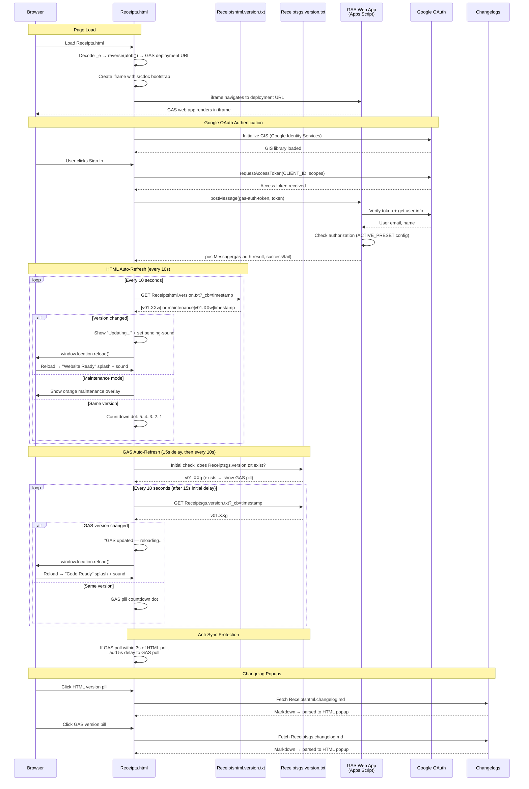

# Receipts.html — GAS Integration Sequence Diagram (Auth)

Sequence diagram showing the dual polling systems (HTML + GAS) and the iframe injection flow.

> [Open in mermaid.live](https://mermaid.live/edit#pako:eNq9Vm1v4jgQ_iujfAId5Ep398Oi3a64lOshtXsVUG4_IFXGGYLVYOdsA8u-_PcbxwkQCD2kk64fCsTz8sw8z4zzPeAqxqAbGPx7hZLjrWCJZsupBPrLmLaCi4xJC79ptTGoTw_-GD_cAzMwRI4isyZc2GVaYzY5NHI24Rq1EUqG9qs9tb-r2CfmX6x7I2fuPv7CGfSy7MNM3zTo08CIawrRrHFSKkkx9_Pf_uyt7OLULsrrixZMJpiqxEylt_msLIIiXGVzWq4XXXhkCcK9YrE3Kw7bNzf-2J3Udcud7oxu0REDzwjT1XXn_TVodA3ABrNq1mg2y8eu4hizVG2XSFCfhvc1wSKNjKCKOTGLsBF2AUbzWHGYKWWN1SyreFHQbmkt2Vok5G3AqtpMZNwmn6LKbo5oQxywLCPQMibUIGQR7nzrPAXdChXg_lEywZkl6qsYC_uBFFawVHxDuBuMoFH4D2LnZ7cwQr0WHE3Bvz9u71rjfFIx00xvISVi8AxpT_QDeCr4CwlKJJLy1sLRbo6M7XFKacbqBWUjuh_0P4-fB7ctMFxlZ6F4H2ozOVEc0se6RHPIS6aMfSBDElkjYabNqEft3KnlfZt7Xva4JqjFfFsE_wUStLByJQk5V8dw8jR5wbhkIm2RBhxzB0GdQbRA_gIuu9LiW04QNHrReDDpPz8O-6P-GLiSc5E0KzrxtdYWodGsUktdWuWd-HVOyZuvDNuk65cPqUS1hzgn_wU03JxsoXNVtjlVKoN-8RAMzZWMjT86HBQKdkeQzy2oT8989tGKJXHLltmB-2Rf1I_1VSf88mXzA5QG6py0KBnt1N3zGn-WWseNSwM83zDx_vBkkEcLtYFp8JTF1G-ZhGE4DYhNQ2xmNGr0qG3UStaH2E3oRshYbcJU-bEKNTrlN5pVr-MJGOZW5d6ZBrRnjSBOhsjiLcEwWcqo_4SmigBTg_Cw7wYsabG9DjAvU2nXjcM-5vSnbHsUe-TWVEHVK72LCJaluiXEynbhXRi-DcM3YXgdhp2DiCX0_MvZZTXxe66qvM47QxuSANIg0tqCYyWWUzzZbS2inIaoS4jw3F0H-FUY-6mYoQO1eVElJHhnYEpijOudw5aJNH1tBKDB5pZqcqhFASdH3zwZjruj4agiPDcaNWCrunco1xdrfxo4-5WTPuYyvOq8BS_dchT-D9lH7lq-SPMX6rLkirblgUAvVaSLkcuxR9dde7SVHB41nfKTC9NnG8x9QkUJ3YsA3cxvDKi536Tuccu9ObE4hlLN7uIvfc6PRORGrHxFgkeVrTJTf5VG7hb1-Ur2Xf0VsC7a72j5orqQeZkgXBZNie73Intg-iXvX0EWvcMZkgrBL4ojTGUB9aAOFXkBJpqD_44oaAVL1LTmYnoN_z4NaHXQbRt0p0GMc0YX4jT4STZ0QypHb9C1eoWtwA9C8bruH_78B1DjwbQ)

## Key Design Notes

- **GAS iframe injection** — the deployment URL is stored as a reversed+base64-encoded string in `_e`. The iframe uses `srcdoc` with a bootstrap script that reads the URL from `parent._r`, deletes it, then navigates — preventing the URL from being visible in page source
- **Dual polling** — HTML and GAS versions are polled independently with anti-sync protection (if polls align within 3s, GAS poll gets a 5s delay to re-stagger them)
- **Two splash screens** — green "Website Ready" for HTML version changes, blue "Code Ready" for GAS version changes
- **Audio unlock via UAv2** — since the GAS iframe covers the entire page, click events don't reach the parent document. The UAv2 poll detects `navigator.userActivation.hasBeenActive` (propagated from cross-origin iframe clicks) and unlocks AudioContext without needing a direct click on the parent

Developed by: ShadowAISolutions
