# Receipts.html — GAS Integration Sequence Diagram (Auth)

Sequence diagram showing the dual polling systems (HTML + GAS) and the iframe injection flow.

> [Open in mermaid.live](https://mermaid.live/edit#pako:eNq9Vm1v4jgQ_iujfAId5Ep398Oi3a64lOshtXsVUG4_IFXGGYLVYOdsA8u-_PcbxwkQCD2kk64fCsTz8sw8z4zzPeAqxqAbGPx7hZLjrWCJZsupBPrLmLaCi4xJC79ptTGoTw_-GD_cAzMwRI4isyZc2GVaYzY5NHI24Rq1EUqG9qs9tb-r2CfmX6x7I2fuPv7CGfSy7MNM3zTo08CIawrRrHFSKkkx9_Pf_uyt7OLULsrrixZMJpiqxEylt_msLIIiXGVzWq4XXXhkCcK9YrE3Kw7bNzf-2J3Udcud7oxu0REDzwjT1XXn_TVodA3ABrNq1mg2y8eu4hizVG2XSFCfhvc1wSKNjKCKOTGLsBF2AUbzWHGYKWWN1SyreFHQbmkt2Vok5G3AqtpMZNwmn6LKbo5oQxywLCPQMibUIGQR7nzrPAXdChXg_lEywZkl6qsYC_uBFFawVHxDuBuMoFH4D2LnZ7cwQr0WHE3Bvz9u71rjfFIx00xvISVi8AxpT_QDeCr4CwlKJJLy1sLRbo6M7XFKacbqBWUjuh_0P4-fB7ctMFxlZ6F4H2ozOVEc0se6RHPIS6aMfSBDElkjYabNqEft3KnlfZt7Xva4JqjFfFsE_wUStLByJQk5V8dw8jR5wbhkIm2RBhxzB0GdQbRA_gIuu9LiW04QNHrReDDpPz8O-6P-GLiSc5E0KzrxtdYWodGsUktdWuWd-HVOyZuvDNuk65cPqUS1hzgn_wU03JxsoXNVtjlVKoN-8RAMzZWMjT86HBQKdkeQzy2oT8989tGKJXHLltmB-2Rf1I_1VSf88mXzA5QG6py0KBnt1N3zGn-WWseNSwM83zDx_vBkkEcLtYFp8JTF1G-ZhGE4DYhNQ2xmNGr0qG3UStaH2E3oRshYbcJU-bEKNTrlN5pVr-MJGOZW5d6ZBrRnjSBOhsjiLcEwWcqo_4SmigBTg_Cw7wYsabG9DjAvU2nXjcM-5vSnbHsUe-TWVEHVK72LCJaluiXEynbhXRi-DcM3YXgdhp2DiCX0_MvZZTXxe66qvM47QxuSANIg0tqCYyWWUzzZbS2inIaoS4jw3F0H-FUY-6mYoQO1eVElJHhnYEpijOudw5aJNH1tBKDB5pZqcqhFASdH3zwZjruj4agiPDcaNWCrunco1xdrfxo4-5WTPuYyvOq8BS_dchT-D9lH7lq-SPMX6rLkirblgUAvVaSLkcuxR9dde7SVHB41nfKTC9NnG8x9QkUJ3YsA3cxvDKi536Tuccu9ObE4hlLN7uIvfc6PRORGrHxFgkeVrTJTf5VG7hb1-Ur2Xf0VsC7a72j5orqQeZkgXBZNie73Intg-iXvX0EWvcMZkgrBL4ojTGUB9aAOFXkBJpqD_44oaAVL1LTmYnoN_z4NaHXQbRt0p0GMc0YX4jT4STZ0QypHb9C1eoWtwA9C8bruH_78B1DjwbQ)

```mermaid
sequenceDiagram
    participant Browser
    participant HTML as Receipts.html
    participant HV as Receiptshtml.version.txt
    participant GV as Receiptsgs.version.txt
    participant GAS as GAS Web App<br>(Apps Script)
    participant Google as Google OAuth
    participant CL as Changelogs

    Note over Browser,HTML: Page Load
    Browser->>HTML: Load Receipts.html
    HTML->>HTML: Decode _e → reverse(atob()) → GAS deployment URL
    HTML->>HTML: Create iframe with srcdoc bootstrap
    HTML->>GAS: iframe navigates to deployment URL
    GAS-->>Browser: GAS web app renders in iframe

    Note over Browser,Google: Google OAuth Authentication
    HTML->>Google: Initialize GIS (Google Identity Services)
    Google-->>HTML: GIS library loaded
    Browser->>HTML: User clicks Sign In
    HTML->>Google: requestAccessToken(CLIENT_ID, scopes)
    Google-->>HTML: Access token received
    HTML->>GAS: postMessage(gas-auth-token, token)
    GAS->>Google: Verify token + get user info
    Google-->>GAS: User email, name
    GAS->>GAS: Check authorization (ACTIVE_PRESET config)
    GAS-->>HTML: postMessage(gas-auth-result, success/fail)

    Note over Browser,HV: HTML Auto-Refresh (every 10s)
    loop Every 10 seconds
        HTML->>HV: GET Receiptshtml.version.txt?_cb=timestamp
        HV-->>HTML: |v01.XXw| or maintenance|v01.XXw|timestamp
        alt Version changed
            HTML->>HTML: Show "Updating..." + set pending-sound
            HTML->>Browser: window.location.reload()
            Browser->>HTML: Reload → "Website Ready" splash + sound
        else Maintenance mode
            HTML->>Browser: Show orange maintenance overlay
        else Same version
            HTML->>HTML: Countdown dot: 5..4..3..2..1
        end
    end

    Note over Browser,GV: GAS Auto-Refresh (15s delay, then every 10s)
    HTML->>GV: Initial check: does Receiptsgs.version.txt exist?
    GV-->>HTML: v01.XXg (exists → show GAS pill)
    loop Every 10 seconds (after 15s initial delay)
        HTML->>GV: GET Receiptsgs.version.txt?_cb=timestamp
        GV-->>HTML: v01.XXg
        alt GAS version changed
            HTML->>HTML: "GAS updated — reloading..."
            HTML->>Browser: window.location.reload()
            Browser->>HTML: Reload → "Code Ready" splash + sound
        else Same version
            HTML->>HTML: GAS pill countdown dot
        end
    end

    Note over HTML,GV: Anti-Sync Protection
    HTML->>HTML: If GAS poll within 3s of HTML poll,<br>add 5s delay to GAS poll

    Note over Browser,CL: Changelog Popups
    Browser->>HTML: Click HTML version pill
    HTML->>CL: Fetch Receiptshtml.changelog.md
    CL-->>HTML: Markdown → parsed to HTML popup

    Browser->>HTML: Click GAS version pill
    HTML->>CL: Fetch Receiptsgs.changelog.md
    CL-->>HTML: Markdown → parsed to HTML popup
```



## Key Design Notes

- **GAS iframe injection** — the deployment URL is stored as a reversed+base64-encoded string in `_e`. The iframe uses `srcdoc` with a bootstrap script that reads the URL from `parent._r`, deletes it, then navigates — preventing the URL from being visible in page source
- **Dual polling** — HTML and GAS versions are polled independently with anti-sync protection (if polls align within 3s, GAS poll gets a 5s delay to re-stagger them)
- **Two splash screens** — green "Website Ready" for HTML version changes, blue "Code Ready" for GAS version changes
- **Audio unlock via UAv2** — since the GAS iframe covers the entire page, click events don't reach the parent document. The UAv2 poll detects `navigator.userActivation.hasBeenActive` (propagated from cross-origin iframe clicks) and unlocks AudioContext without needing a direct click on the parent

## Receipt Pipeline — Upload → Extract → Review → Save

Sequence for the receipts app feature (v01.01g/w upload, v01.02g/w extraction + review + save, v01.03g retry/fallback, v01.04g/v01.05w extraction cache + history browser). All routes require a validated session; the upload and save calls travel as body-POSTs with client-side retry because their payloads exceed GET URL limits. Extraction results are cached server-side by file ID (10 min) so transport retries never re-run Gemini.

> [Open in mermaid.live — Receipt Pipeline](https://mermaid.live/edit#pako:eNqVV9uO20YS_ZUCX0xhyLmsHT_Iay9kyx5PYI-N0QQLIwqCUneJ7Eyzm-5uSqMYE-QpwD7uBdiXBfYlX-YvyCck1bx4JiPL9pMoklXddeqcU813ibCSknHi6W1DRtBUYeGwmhsAgBpdUELVaAJ848ndvvv8_OULQA9nJEjVwe-XodJ_XbhHqRdooEZDGvbA0UrRGgQ6Obqd5Hgy4xz883dawKSuYwZpX1sftrw_dWpFMcLaQlP7P4a4bhuwtFqS27YWVcqoGNxeTV6fxNCCDDkMakUaTdFgQVuiZ3Gjs9oRSl8ShRjaFw978EIZOglUeQi48KO5aXOc2kBgV-QijNlsNoYzetsoRx68KgzJXBnw5L2yBlJsQglLbdeAC7vqN8Kh-aNHDPkYzrGGeTJjkLui5wm8_-VfILAih3AAS6UJaiUu-r5x4BA_tWvjBWqCYOH9P349un94WF_C16-fHkMq0KzQj2K-BXq6f-9GhuPJbAyvX83OAUVQ1jxsam1RdjBAurSugoWVmwec-S5gCFTVwWdgLBw_PYclar1AcdEVdjyZ9VlXqJXEQLMWimfWTTFgGuwFmRtvx56PQTjCQM-UpvQsf_PmzZuXL6fT_PnzqvI-Pz09Pd3_oS5uBDL2ZHzjqNvvOS789-kI9gDrmowEZ9eQ-oCh8V1lJK-lGCB81wF_IrMIdv_7jdNXu_Giy-BQhAEwxgRrBbbeDk1XbEGBK328OZFpu-Bov6DwWNtFehPKSG0OiJymJ9YEMgHe__wfUBUWFCXpa2s8zURJFXLBTokAX89enfa5Ypa8L6AiJ0o0IQOU0pH3GXCnMhCNc2TEJgPfLIINqDMIeJlBe80SERiosG6Tge4F8u13kBKKEtYqlIAgiYVW8Tb7t7eC7hsh-sWxwxl1gKctpqyf-ApJku3Ta51gCbH0BjcCW5PxUDvKl0prkpCi1rBUpKUHkirgQvcCJO3p-jpLVPoLFmENbGIPKjQNaiAT3KZLbeQWkU_kD40P_W4OInigor2wNGe4okH9OwnncUW35TmGgcGDR5OMFIA9WFonCJYai9synTa1VtwmECWJi1iUx4oGkuwxNfYiAdgxEXgHsl-PKcEFvCPnrBuD7NNdQWM0ed8u_vAI0nkSq0SzWeNmntzeysSzgQI7MrcKTqYwC9bR96dY0WAJkAqrtfItPZZLdQn5Xw7yu9tkdkaGSwklQV3aYNkhKwyijLcMreFk-mdHeaa07quLBqKM0Pu9UgY7iShk4HAN9IFHF1SHWx51RrVGQdcmirNrD2mUS00uZx70UlHktyRYNErLuOmX1oRSb2DWVBW6DQ8nJrq3YA1I0hRot9gGoowZgBN50-BaxretkvD-f_-eJ5BOlY_kV8YHQgmacEU-bocBum2wHx2Vz5UP1m1gwQiQg3R1eLR_eK-AA4hXX60ftPzKrdEbkLTERofu2fDW_fXH52i3QjdCl0oHch7Sns1wEK0OHJqC4AB8add5Y1pOH4C3LuSLTc7vjHYLUSsfhuPCJ30_hr8ylAdVEWj8cRNdDypV8FGFjwon084LbnM-Om9fgoeggqZcoCf5IMo6Lxp0N2fboIHZxoiW_Xl7lIJoDs6zGCKj0AdyMHny4o7ndYaihNVNZSAtHAMXbcVeUAZHh3mlDITS2RA0baEryuEYyQTNuj7cFE9vED1vHh6NYp3tf7CO92pdT9jYk-5uyn16eK1JW6e5__a7q4gotwocGUmO5EeYg9c1v7vzBfWNn1JApT_d_QGV676yByr4P5nCjmpuDNy2Lrqs0UiSINt97HUup5W52HleFdbJ1iwi8z5bXr_9_7__jCsrEwfYPJlGx_nbPAH8YxTxo8BgFqhMPA4oA_f8bjhb0_rsE1SMP3s8eXJtYN1pc9xhN61Ue_Rel2TAWU1MZLNURTM0_0NT2u1_QVsGWXkK5w59STINrqER2--HOcOfLwx6nGM_3T0EiRu_y5fbhvL6jirL6lg6W8WMzN4d3dy_1P6SqWBd-IJWzpOnbUiMZ5dvPEMVT4ABys6oOwMdfeoUzKk-3w1534_bkUZVDf7DV1hs59avsPh4Wye6OmIm9B0e6atJE8pRxggaCNypCGZ8i0_c23rB99l3s-5TqW0KH8pB2rWJtqTaNncDLMmSilyFSibj5N08CSVVNE_G86QbXfPkKskSbIJlH07GzJUsaWr2ru4Dvb159Ts_JUZ3)

```mermaid
sequenceDiagram
    participant User
    participant HTML as Receipts.html<br>(scan panel + review card)
    participant GAS as GAS Web App<br>(doPost)
    participant Drive as Google Drive<br>(receipts folder)
    participant Gemini as Gemini API<br>(generativelanguage)
    participant SS as Spreadsheet<br>(Receipts + LineItems tabs)

    Note over User,SS: Requires signed-in session (auth flow above)
    User->>HTML: Tap "Scan receipt" → camera / file picker
    HTML->>HTML: Downscale to ≤1600px JPEG (canvas) → base64
    HTML->>GAS: POST action=uploadReceipt (form body; ≤3 attempts, no GET fallback)
    GAS->>GAS: validateSessionForData(token)
    GAS->>Drive: createFile(R-YYYYMMDD-HHmmss-NNNN.jpg)
    GAS->>SS: ensureReceiptTabs_() + append row (status=uploaded)
    GAS-->>HTML: {receiptId, fileId, fileUrl}
    HTML->>GAS: POST action=extractReceipt (GET api op fallback)
    GAS->>Drive: getFileById(fileId).getBlob()
    GAS->>Gemini: generateContent — image + responseSchema (strict JSON)
    Gemini-->>GAS: merchant, address, date, currency, subtotal, tax, total,<br>category, lineItems[] (each with a department category)
    GAS-->>HTML: {success, data}
    alt Extraction succeeded
        HTML->>User: Review card opens pre-filled (all fields editable)
    else Extraction failed
        HTML->>User: Review card opens empty — manual entry
    end
    User->>HTML: Adjust fields / line items → Save receipt
    HTML->>GAS: POST action=saveReceipt (form body: receiptId + reviewed JSON + force flag)
    GAS->>GAS: Duplicate check — same merchant+date+total as a saved receipt<br>→ {error: duplicate} unless force=1 ("Save anyway")
    GAS->>GAS: Assign readable ID Store_Name-YYYYMMDD (collision suffix -2/-3)
    GAS->>Drive: Rename the photo to match the new ID
    GAS->>SS: Fill receipt row incl. address (status=saved, raw extraction kept)
    GAS->>SS: Replace LineItems rows (with per-item categories)
    GAS->>SS: Rebuild the Monthly Summary tab (also on delete)
    GAS-->>HTML: {success, receiptId: newId}
    HTML->>User: "Saved ✓" (Discard instead leaves the row status=uploaded)

    Note over User,SS: History browser (v01.04g / v01.05w; saved-only default v01.05g / v01.06w)
    User->>HTML: Tap "History" → filters (merchant / date range / show-unsaved / sort-by-date)
    HTML->>GAS: POST action=listReceipts (GET api op fallback)
    GAS->>GAS: One-time lazy data migration (IDs → Store_Name-YYYYMMDD,<br>merchants title-cased; flag-guarded)
    GAS->>Drive: Sync photo-folder viewers to the Master ACL's<br>Receipts column (grant + revoke, 10-min throttle)
    GAS->>SS: Read Receipts tab, filter (status=saved unless uploaded=1),<br>upload order or receipt-date order (sort=date)
    GAS-->>HTML: {receipts[]} → list rendered
    User->>HTML: Tap a receipt row
    HTML->>GAS: POST action=getReceiptDetail (GET api op fallback)
    GAS->>SS: Read receipt row + its LineItems rows
    GAS-->>HTML: {receipt, lineItems[]} → expanded detail + photo link

    Note over User,SS: Record deletion (v01.05g / v01.06w)
    User->>HTML: Tap 🗑 → inline "Delete?" arm → tap again within 4s
    HTML->>GAS: POST action=deleteReceipt (GET api op fallback)
    GAS->>GAS: RBAC check — 'delete' permission when roles configured
    GAS->>SS: Delete receipt row + its LineItems rows
    GAS->>Drive: setTrashed(true) on the photo (recoverable ~30 days)
    GAS-->>HTML: {success} → row removed from the list

    Note over User,SS: .xlsx export (v01.05g / v01.06w)
    User->>HTML: Tap "Export .xlsx" (uses current history filters)
    HTML->>GAS: POST action=exportReceipts (GET api op fallback)
    GAS->>SS: Build temp spreadsheet — Receipts + LineItems sheets
    GAS->>Drive: Export temp as .xlsx (OAuth), then trash the temp file
    GAS-->>HTML: {fileName, base64} → Blob download in the browser
```

Developed by: ShadowAISolutions
