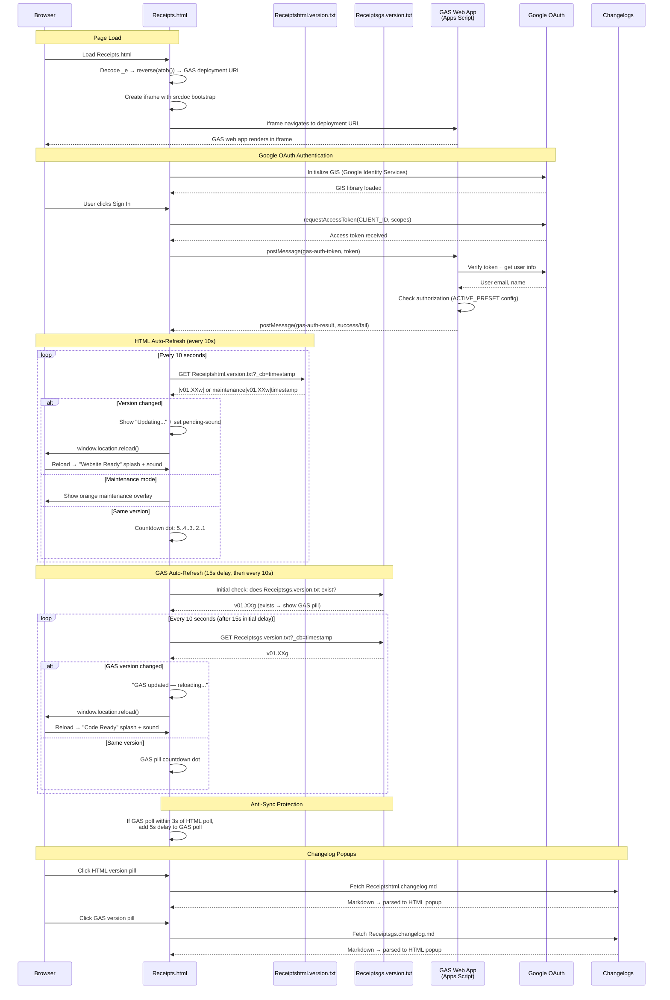

# Receipts.html — GAS Integration Sequence Diagram (Auth)

Sequence diagram showing the dual polling systems (HTML + GAS) and the iframe injection flow.

> [Open in mermaid.live](https://mermaid.live/edit#pako:eNq9Vm1v4jgQ_iujfAId5Ep398Oi3a64lOshtXsVUG4_IFXGGYLVYOdsA8u-_PcbxwkQCD2kk64fCsTz8sw8z4zzPeAqxqAbGPx7hZLjrWCJZsupBPrLmLaCi4xJC79ptTGoTw_-GD_cAzMwRI4isyZc2GVaYzY5NHI24Rq1EUqG9qs9tb-r2CfmX6x7I2fuPv7CGfSy7MNM3zTo08CIawrRrHFSKkkx9_Pf_uyt7OLULsrrixZMJpiqxEylt_msLIIiXGVzWq4XXXhkCcK9YrE3Kw7bNzf-2J3Udcud7oxu0REDzwjT1XXn_TVodA3ABrNq1mg2y8eu4hizVG2XSFCfhvc1wSKNjKCKOTGLsBF2AUbzWHGYKWWN1SyreFHQbmkt2Vok5G3AqtpMZNwmn6LKbo5oQxywLCPQMibUIGQR7nzrPAXdChXg_lEywZkl6qsYC_uBFFawVHxDuBuMoFH4D2LnZ7cwQr0WHE3Bvz9u71rjfFIx00xvISVi8AxpT_QDeCr4CwlKJJLy1sLRbo6M7XFKacbqBWUjuh_0P4-fB7ctMFxlZ6F4H2ozOVEc0se6RHPIS6aMfSBDElkjYabNqEft3KnlfZt7Xva4JqjFfFsE_wUStLByJQk5V8dw8jR5wbhkIm2RBhxzB0GdQbRA_gIuu9LiW04QNHrReDDpPz8O-6P-GLiSc5E0KzrxtdYWodGsUktdWuWd-HVOyZuvDNuk65cPqUS1hzgn_wU03JxsoXNVtjlVKoN-8RAMzZWMjT86HBQKdkeQzy2oT8989tGKJXHLltmB-2Rf1I_1VSf88mXzA5QG6py0KBnt1N3zGn-WWseNSwM83zDx_vBkkEcLtYFp8JTF1G-ZhGE4DYhNQ2xmNGr0qG3UStaH2E3oRshYbcJU-bEKNTrlN5pVr-MJGOZW5d6ZBrRnjSBOhsjiLcEwWcqo_4SmigBTg_Cw7wYsabG9DjAvU2nXjcM-5vSnbHsUe-TWVEHVK72LCJaluiXEynbhXRi-DcM3YXgdhp2DiCX0_MvZZTXxe66qvM47QxuSANIg0tqCYyWWUzzZbS2inIaoS4jw3F0H-FUY-6mYoQO1eVElJHhnYEpijOudw5aJNH1tBKDB5pZqcqhFASdH3zwZjruj4agiPDcaNWCrunco1xdrfxo4-5WTPuYyvOq8BS_dchT-D9lH7lq-SPMX6rLkirblgUAvVaSLkcuxR9dde7SVHB41nfKTC9NnG8x9QkUJ3YsA3cxvDKi536Tuccu9ObE4hlLN7uIvfc6PRORGrHxFgkeVrTJTf5VG7hb1-Ur2Xf0VsC7a72j5orqQeZkgXBZNie73Intg-iXvX0EWvcMZkgrBL4ojTGUB9aAOFXkBJpqD_44oaAVL1LTmYnoN_z4NaHXQbRt0p0GMc0YX4jT4STZ0QypHb9C1eoWtwA9C8bruH_78B1DjwbQ)



## Key Design Notes

- **GAS iframe injection** — the deployment URL is stored as a reversed+base64-encoded string in `_e`. The iframe uses `srcdoc` with a bootstrap script that reads the URL from `parent._r`, deletes it, then navigates — preventing the URL from being visible in page source
- **Dual polling** — HTML and GAS versions are polled independently with anti-sync protection (if polls align within 3s, GAS poll gets a 5s delay to re-stagger them)
- **Two splash screens** — green "Website Ready" for HTML version changes, blue "Code Ready" for GAS version changes
- **Audio unlock via UAv2** — since the GAS iframe covers the entire page, click events don't reach the parent document. The UAv2 poll detects `navigator.userActivation.hasBeenActive` (propagated from cross-origin iframe clicks) and unlocks AudioContext without needing a direct click on the parent

## Receipt Pipeline — Upload → Extract → Review → Save

Sequence for the receipts app feature (v01.01g/w upload, v01.02g/w extraction + review + save, v01.03g retry/fallback, v01.04g/v01.05w extraction cache + history browser). All routes require a validated session; the upload and save calls travel as body-POSTs with client-side retry because their payloads exceed GET URL limits. Extraction results are cached server-side by file ID (10 min) so transport retries never re-run Gemini.

> [Open in mermaid.live — Receipt Pipeline](https://mermaid.live/edit#pako:eNqVV01vG0cS_SuFuWQIzUhy7PjAxA7o0JZlxLIhKlgYYWAUu4szHfV0j7t7SHENLXJaYI-7CZBLgFwW-8P0C_Yn7FbPhyWLpu0ThzNT1V2v3nvV8zYRVlIyTjy9acgImiosHFZzAwBQowtKqBpNgB88udt3n549_x7QwykJUnXw-2Wo9DcL9zD1Ag3UaEjDHjhaKVqDQCdHt5McTWacg3_-QguY1HXMIO1L68OW96dOrShGWFtoav_HENdtA5ZWS3Lb1qJKGRWD26vJy-MYWpAhh0GtSKMpGixoS_QsbnRWO0LpS6IQQ_viYQ--V4aOA1UeAi78aG7aHCc2ENgVuQhjNpuN4ZTeNMqRB68KQzJXBjx5r6yBFJtQwlLbNeDCrvqNcGj-8CFDPoYzrGGezBjkruh5Ald__xcIrMghHMBSaYJaifO-bxw4xE_t2niBmiBYuPrHv-_cPzysL-DZy8dHkAo0K_SjmG-Bnu7fu5HhaDIbw8sXszNAEZQ1D5paW5QdDJAuratgYeXma858FzAEqurgMzAWjh6fwRK1XqA47wo7msz6rCvUSmKgWQvFE-umGDAN9pzMjbdjz8cgHGGgJ0pTepq_evXq1fPn02n-9GlVeZ-fnJyc7P9cFzcCGXsyvnHU7fcMF_51OoI9wLomI8HZNaQ-YGh8VxnJaykGCN92wB_LLILd__7g9OVuvOgiOBRhAIwxwVqBrbdD0xVbUOBKH22OZdouONovKDzSdpHehDJSmwMip-k7awKZAFe__AaqwoKiJH1tjaeZKKlCLtgpEeDZ7MVJnytmyfsCKnKiRBMyQCkdeZ8BdyoD0ThHRmwy8M0i2IA6g4AXGbTXLBGBgQrrNhnoXiA__gQpoShhrUIJCJJYaBVvs397K-i-EaJfHDucUQd43GLK-omvkCTZPr3WCZYQS29wI7A1GQ-1o3yptCYJKWoNS0VaeiCpAi50L0DSnq6vs0SlP2MR1sAm9qBC06AGMsFtutRGbhH5RP7c-NDv5iCCByraC0tzhisa1L-TcB5XdFueYxgYPHg0yUgB2IOldYJgqbG4LdNpU2vFbQJRkjiPRXmsaCDJHlNjLxKAHROBdyD79ZgSXMBbcs66Mcg-3SU0RpP37eIP7kA6T2KVaDZr3MyT21uZeDZQYEfmVsHxFGbBOnp9ghUNlgCpsFor39JjuVQXkH95kN_dJrNTMlxKKAnq0gbLDllhEGW8ZWgNx9P3HeWJ0rqvLhqIMkLv90oZ7CSikIHDNdA7Hp1THW551CnVGgVdmyjOrj2kUS41uZx50EtFkd-SYNEoLeOmn1sTSr2BWVNV6DY8nJjo3oI1IElToN1iG4gyZgCO5U2DaxnftkrC1R-_zhNIp8pH8ivjA6EETbgiH7fDAN022A-OyqfKB-s2sGAEyEG6Oryzf3ivgAOIV1-tv275lVujNyBpiY0O3bPhrfvrD8_RboVuhC6VDuQ8pD2b4SBaHTg0BcEB-NKu88a0nD4Ab13IF5uc3xntFqJWPgzHhY_6fgx_YSgPqiLQ-NcN07tSBR9U-KBwml_98p_WC25zPovizYsG3c0J1vMD5XBuY0ZkXeE32dorsm_UgzujaOntf7BOkgPreoZEELq7KQPz4BoqW8en__Gny1gCYwOOjCRH8gOtwusi2w11QT3SUwqo9MfhHlC5LuQ9UMG_p8Id1dyYcG1ddFGjkSRBtvvY62xFK3O-84AorJOtOmOzP5nP__3z93_GlZWJE2OeTKPEv50ngP_3fn4UGMwClYnzVxm453fD2brEJx9ZYvzpo8l31ybEF22OL9i-KtWeddclGXBWkwdhzVIVzdD8d01pt_8ZbRm83FM4c-hLkmlwDY3Y794ZO38vMOhxcPzt7iFI3PhdRtg2lNd3VFlWx9LZKmZk9u7o5v6F9hdMBevCZ7RynjxuQ2I822rjGap45ApQds7YOdboY8dOTvXp9sP7ftTOEKpq8O8-e2I7t372xMfbOtHVETOh7_BIX0yaUI4yRtBA4E5FMONbfMTd1gu-z0aXdd8mbVP4FAzSrk20JdW2uZsYSZZU5CpUMhknb-dJKKmieTKeJ92smCeXSZZgE-xsY0QyZq5kSVOzd3VfxO3Ny_8BEIQVcA)

```mermaid
sequenceDiagram
    participant User
    participant HTML as Receipts.html<br>(scan panel + review card)
    participant GAS as GAS Web App<br>(doPost)
    participant Drive as Google Drive<br>(receipts folder)
    participant Gemini as Gemini API<br>(generativelanguage)
    participant SS as Spreadsheet<br>(Receipts + LineItems tabs)

    Note over User,SS: Requires signed-in session (auth flow above)
    User->>HTML: Tap "Scan receipt" → camera / file picker
    HTML->>HTML: Downscale to ≤1600px JPEG (canvas) → base64
    HTML->>GAS: POST action=uploadReceipt (form body; ≤3 attempts, no GET fallback)
    GAS->>GAS: validateSessionForData(token)
    GAS->>Drive: createFile(R-YYYYMMDD-HHmmss-NNNN.jpg)
    GAS->>SS: ensureReceiptTabs_() + append row (status=uploaded)
    GAS-->>HTML: {receiptId, fileId, fileUrl}
    HTML->>GAS: POST action=extractReceipt (GET api op fallback)
    GAS->>Drive: getFileById(fileId).getBlob()
    GAS->>Gemini: generateContent — image + responseSchema (strict JSON)
    Gemini-->>GAS: merchant, address, date, currency, subtotal, tax, total,<br>category, lineItems[] (each with a department category)
    GAS-->>HTML: {success, data}
    alt Extraction succeeded
        HTML->>User: Review card opens pre-filled (all fields editable)
    else Extraction failed
        HTML->>User: Review card opens empty — manual entry
    end
    User->>HTML: Adjust fields / line items → Save receipt
    HTML->>GAS: POST action=saveReceipt (form body: receiptId + reviewed JSON + force flag)
    GAS->>GAS: Duplicate check — same merchant+date+total as a saved receipt<br>→ {error: duplicate} unless force=1 ("Save anyway")
    GAS->>GAS: Assign readable ID Store_Name-YYYYMMDD (collision suffix -2/-3)
    GAS->>Drive: Rename the photo to match the new ID
    GAS->>SS: Fill receipt row incl. address (status=saved, raw extraction kept)
    GAS->>SS: Replace LineItems rows (with per-item categories)
    GAS->>SS: Rebuild the Monthly Summary tab (also on delete)
    GAS-->>HTML: {success, receiptId: newId}
    HTML->>User: "Saved ✓" (Discard instead leaves the row status=uploaded)

    Note over User,SS: History browser (v01.04g / v01.05w; saved-only default v01.05g / v01.06w)
    User->>HTML: Tap "History" → filters (merchant / date range / show-unsaved / sort-by-date)
    HTML->>GAS: POST action=listReceipts (GET api op fallback)
    GAS->>GAS: One-time lazy ID migration (R-… → Store_Name-YYYYMMDD, flag-guarded)
    GAS->>SS: Read Receipts tab, filter (status=saved unless uploaded=1),<br>upload order or receipt-date order (sort=date)
    GAS-->>HTML: {receipts[]} → list rendered
    User->>HTML: Tap a receipt row
    HTML->>GAS: POST action=getReceiptDetail (GET api op fallback)
    GAS->>SS: Read receipt row + its LineItems rows
    GAS-->>HTML: {receipt, lineItems[]} → expanded detail + photo link

    Note over User,SS: Record deletion (v01.05g / v01.06w)
    User->>HTML: Tap 🗑 → inline "Delete?" arm → tap again within 4s
    HTML->>GAS: POST action=deleteReceipt (GET api op fallback)
    GAS->>GAS: RBAC check — 'delete' permission when roles configured
    GAS->>SS: Delete receipt row + its LineItems rows
    GAS->>Drive: setTrashed(true) on the photo (recoverable ~30 days)
    GAS-->>HTML: {success} → row removed from the list

    Note over User,SS: .xlsx export (v01.05g / v01.06w)
    User->>HTML: Tap "Export .xlsx" (uses current history filters)
    HTML->>GAS: POST action=exportReceipts (GET api op fallback)
    GAS->>SS: Build temp spreadsheet — Receipts + LineItems sheets
    GAS->>Drive: Export temp as .xlsx (OAuth), then trash the temp file
    GAS-->>HTML: {fileName, base64} → Blob download in the browser
```

Developed by: ShadowAISolutions
