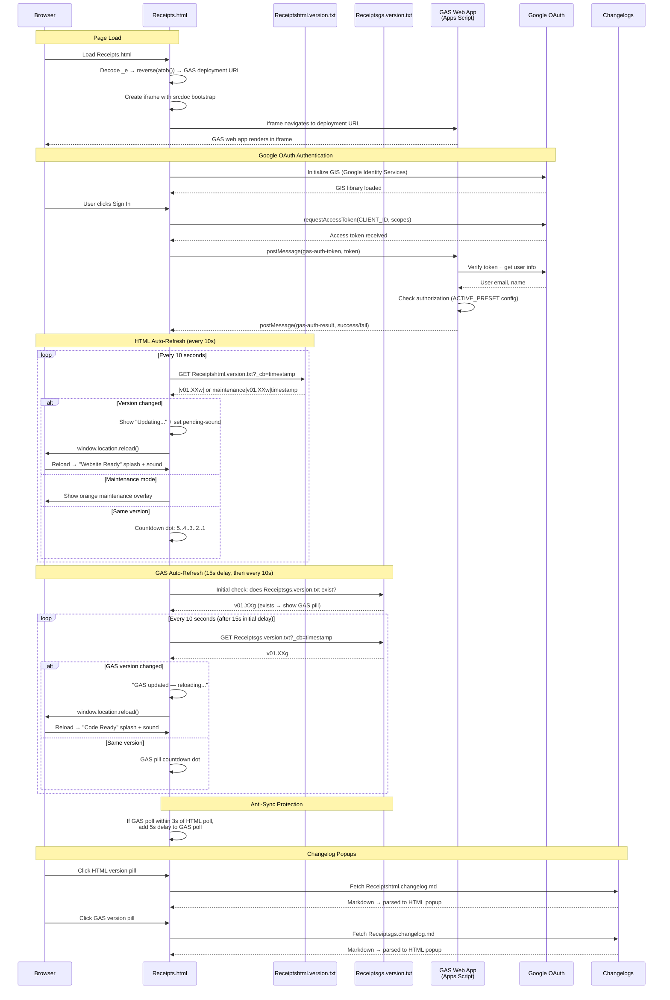

# Receipts.html — GAS Integration Sequence Diagram (Auth)

Sequence diagram showing the dual polling systems (HTML + GAS) and the iframe injection flow.

> [Open in mermaid.live](https://mermaid.live/edit#pako:eNq9Vm1v4jgQ_iujfAId5Ep398Oi3a64lOshtXsVUG4_IFXGGYLVYOdsA8u-_PcbxwkQCD2kk64fCsTz8sw8z4zzPeAqxqAbGPx7hZLjrWCJZsupBPrLmLaCi4xJC79ptTGoTw_-GD_cAzMwRI4isyZc2GVaYzY5NHI24Rq1EUqG9qs9tb-r2CfmX6x7I2fuPv7CGfSy7MNM3zTo08CIawrRrHFSKkkx9_Pf_uyt7OLULsrrixZMJpiqxEylt_msLIIiXGVzWq4XXXhkCcK9YrE3Kw7bNzf-2J3Udcud7oxu0REDzwjT1XXn_TVodA3ABrNq1mg2y8eu4hizVG2XSFCfhvc1wSKNjKCKOTGLsBF2AUbzWHGYKWWN1SyreFHQbmkt2Vok5G3AqtpMZNwmn6LKbo5oQxywLCPQMibUIGQR7nzrPAXdChXg_lEywZkl6qsYC_uBFFawVHxDuBuMoFH4D2LnZ7cwQr0WHE3Bvz9u71rjfFIx00xvISVi8AxpT_QDeCr4CwlKJJLy1sLRbo6M7XFKacbqBWUjuh_0P4-fB7ctMFxlZ6F4H2ozOVEc0se6RHPIS6aMfSBDElkjYabNqEft3KnlfZt7Xva4JqjFfFsE_wUStLByJQk5V8dw8jR5wbhkIm2RBhxzB0GdQbRA_gIuu9LiW04QNHrReDDpPz8O-6P-GLiSc5E0KzrxtdYWodGsUktdWuWd-HVOyZuvDNuk65cPqUS1hzgn_wU03JxsoXNVtjlVKoN-8RAMzZWMjT86HBQKdkeQzy2oT8989tGKJXHLltmB-2Rf1I_1VSf88mXzA5QG6py0KBnt1N3zGn-WWseNSwM83zDx_vBkkEcLtYFp8JTF1G-ZhGE4DYhNQ2xmNGr0qG3UStaH2E3oRshYbcJU-bEKNTrlN5pVr-MJGOZW5d6ZBrRnjSBOhsjiLcEwWcqo_4SmigBTg_Cw7wYsabG9DjAvU2nXjcM-5vSnbHsUe-TWVEHVK72LCJaluiXEynbhXRi-DcM3YXgdhp2DiCX0_MvZZTXxe66qvM47QxuSANIg0tqCYyWWUzzZbS2inIaoS4jw3F0H-FUY-6mYoQO1eVElJHhnYEpijOudw5aJNH1tBKDB5pZqcqhFASdH3zwZjruj4agiPDcaNWCrunco1xdrfxo4-5WTPuYyvOq8BS_dchT-D9lH7lq-SPMX6rLkirblgUAvVaSLkcuxR9dde7SVHB41nfKTC9NnG8x9QkUJ3YsA3cxvDKi536Tuccu9ObE4hlLN7uIvfc6PRORGrHxFgkeVrTJTf5VG7hb1-Ur2Xf0VsC7a72j5orqQeZkgXBZNie73Intg-iXvX0EWvcMZkgrBL4ojTGUB9aAOFXkBJpqD_44oaAVL1LTmYnoN_z4NaHXQbRt0p0GMc0YX4jT4STZ0QypHb9C1eoWtwA9C8bruH_78B1DjwbQ)



## Key Design Notes

- **GAS iframe injection** — the deployment URL is stored as a reversed+base64-encoded string in `_e`. The iframe uses `srcdoc` with a bootstrap script that reads the URL from `parent._r`, deletes it, then navigates — preventing the URL from being visible in page source
- **Dual polling** — HTML and GAS versions are polled independently with anti-sync protection (if polls align within 3s, GAS poll gets a 5s delay to re-stagger them)
- **Two splash screens** — green "Website Ready" for HTML version changes, blue "Code Ready" for GAS version changes
- **Audio unlock via UAv2** — since the GAS iframe covers the entire page, click events don't reach the parent document. The UAv2 poll detects `navigator.userActivation.hasBeenActive` (propagated from cross-origin iframe clicks) and unlocks AudioContext without needing a direct click on the parent

## Receipt Pipeline — Upload → Extract → Review → Save

Sequence for the receipts app feature (v01.01g/w upload, v01.02g/w extraction + review + save, v01.03g retry/fallback, v01.04g/v01.05w extraction cache + history browser, v01.09g/v01.11w batch upload + reports + edit-in-place, v01.10g multi-user data isolation, v01.11g/v01.16w sharing, v01.12g/v01.17w own-Drive photo storage). All routes require a validated session; since v01.10g every read/write op is additionally scoped to the signed-in user's own receipts (owner = the row's Uploaded By email). The upload and save calls travel as body-POSTs with client-side retry because their payloads exceed GET URL limits. Extraction results are cached server-side by file ID (10 min) so transport retries never re-run Gemini.

> [Open in mermaid.live — Receipt Pipeline](https://mermaid.live/edit#pako:eNqlWV9vG8cR_yqDexEJkabkJE4r1SkkS1EU2JYgyg2MMAiWe8PjVnu7l909UazhIk8F8hS0DdCXAH1pP0P73I_iL9B-hHZm946kSdE2-kTqeDs7f3_zm9GrTNocs4PM43c1GoknShROlCMDAFAJF5RUlTABXnh060-_uH72FISHK5SoquAfTEOpfzV2n3W8FAYqYVDDLji8VTgDKVzeXRdydjQkGfTxFY7hqKpYQm4vrQ8b3j9x6hb5hLWFxvg3H6k9uh0Pdmbiw0PQWAg5B-sKmFido9t0P5bKKBYYvx1dnrO4Ag06EdQtamGKWhS44fSQlR9WDkXup4iBjzYOgV14qgyeByw9BDH23ZGJMp7bgGBv0bFre8PhAVzhd7Vy6MGrwmDeVwY8eq-sgY6owxQm2s5AjO1towgd7X_2GYXhAK5FBaNsSI538fpRBm_-8CeQokQnYAATpREqJW-aWNLB9vyJnRkvhUYIFt788Lf9R3t71R18eXl6Bh0pzK3wXZY3Fh4ffbwigd19AMfOzjw6qCttRe6hmtpgSVyYIrwYnl7tDOHiq-cphDMVpvSLcuSznJ49YBWDvUEDnVHWuvGoqkZZCmEPRB1sXzoUAXOwBibK-QC1x0MSFN-C8xNwWCgf0GEOyrAOl87SDRyLLrz5_ie43dt_sP-wGPDnp7MVq86OhgdweTG8BiGDsuZxtCtpxcdVKQp84TRoZW7ShZQz1nAepPyLHmPnWVf0o_lRGCjPmpFNpQhKwkRoPRbyhgTMpmjA2OSw6JcBSGs8mgCDRsZEKO1TTpwdDRvVb4VWuQg4jFn0uXUnIogOi1l5m7IPja8dJtuuxdh_2-nCLoiqQpODszPo-CBC7ZMXMF8S0SbRq5R65_nr7a7Eu-CEDOk-0gs67EwYzwP6HuSqQB_6Usgp5hzYRTEnD1K2Udg3y4TxPGb8-cmqa7jKDyCVNz6xJpA323AyYvmKnDyUUywFWe6UDPDl8OJ5I4ul9BvTSnRyKkzogchzh54MEAF7IGvn0Mh5D3w9DjYI3YMg7noQv5NdUgQsrJv3KIkiVnz9DXRQyGmsEQEVun7zGglqv7_5_icuHiRMKtEEDxPr4MxZiU6RH_GuQuOxL6oKxrW8weDBhim6mfK4MYS-lrKxQKQwCh3gNLqX8IhfwRzz-OtSoAmSCMpaxAdL90PlsD9RWmMOHaE1TBTq3APmKoixbhRB7XH5HkrsD7gEyyqwT6AUphYa0AQ3T6JNvgE0j_Lf1j402gw4AqAYrqlah4LSLKHp1nz24rYpHuhMrCthbPP5AbT10PZBzDmPYJciJREmWhTrtXtSV1pRmEFOUd6wUV6U2GbaLuXXLmcRdSABpEHe3EdJQQa8QuesO4C8EfcaaqPR-3j5432CWbZSmPlMzEfZuipHnhoSUIejUBGyDoN1-O1zUWL_5cuXL589OzmBjrRaKx_TYzJRd9B_OOh_tCIv9YkrNGQK4V7bIkoRJLcDMDijOzqrhc4QYGcmPeJzHoSj-JC0nOqdjo9TE7pVAhZNZQ3vPldaN95ieFNG6gdN-bZgx17tgRMzwEVe3mAV1iReYaWFxKWOzwDV4RqmCqa8glS6Cv0GAeNa6ZyteGZNmOo5DOuyFG5ODYsKx1tqeDlqDO8o3jbxDsihb-NxrKAY-hze_PznUQadE-W5mJTxAUUOGsUtxvZEDlqH_3upzBfKB4KnJhYdaq97Hxcw4Ia798nsMOZr3xo9hxwnotYh_da-9Wh2P89JNySKM1E6oPPQaaoDBoy_4IQpEAbgp3bWr02skQF460J_PO_TO93tha2VDy0P6ZydXoOoFNiq7dPrBXNhsB9UiaDF7-ZQqiIyAt_jWu8XtXA54eD5SUKZ9WrixtAY4yGooLEvhcf8EMZamBtiuWQxaZBwNfGs1CaJDG_IMJG3bJ1yqsd87OriqyFcPH_6EjosFh7DixRlOJ6zLsyP9opuL_l6tUAaUGly4_F-l08lfmIdMTLrmqRkv6enHYrF46VAbOQT_utvXrOvKBxU8TnRunuyQyzX9fboFthSEAxC6XdHuHXjMnbsggr-rcLfYs1Kp4924V0lDPk7j3rsJmQkXrl1ZpDW5REQeFB47xL6z1__8ke-WRlueqPshFHl16MMxP_aF_0UyJmFUIZ5iDLwsd_uzghMbR98r2q5Oj56stTkdqKMHULMUsXxh2mws0TcpTUTVdRt8BdBiep_QFjaduQxXDvhp5h3gquxSxC7aD6p03QcSvI9t8Dff7QHuZj77v1dKUSJ27vSFgSPaUFWOCwt1djE2TJWuPJhS048uNP-jhLKuvABCTHKTuMRPk_9oPbkcCawAaYJ0hPUdt9F70nU--Mm6X0cmx-WFfjFPM1JsXGe5p83xTPZwZKET_7oXBzVYdrtkQdNjA47k9-6Lxb0nHC5l0a4GJRjbceQ25mJA5xZDvCWuBwzw0mQGEmqJ2JsKdzKFClWv2xitb-_JVYRn1P7K4TW6OZQ1jqovkeNMtDMXsH-J1RHMKarkzBtbQWnNFxwtvYgDjd6DnELFJTQa4w7Xv3ElhWzo7fXAO8_NC-4cffdR1cHOp6opdDag6-EJN7yw98fPfjEszPT8mbikJovOri6fAZTFLmztly6azXANOJQY2KaHKP7XY01VRu3KyLsb80P980gHnzACsLU2bqIucWiiGH_6x9gwE7g-SjrMjX__qc4W1gHDesS-a0wkviWTTT4Lixmj3uz6jRXYZX7U0ZGJvp-CdWQtdR5yAej7M3PP_77nz9G6Y3c5fFolG33xvLAx8C11mnJ9Ru0-VzdRaZAoMcX_h-jGKeMyrGsLM_44_nSQEZBcDhzKqBP7aIFl-17OoIX_0Hlms6keq3QKZtTLwvOUq9PoLrdLocfjqnMVCiblnajK8lCkMo7uCVgZeR4uLe39w5GtkpjNqwUn2iFJvS9yrHdPXRyofR8MEO80fNBGcecwVj1haGRfRA_uEp2eRIhNr_G73uw2Joslh9x6eJ7IC2xROL-9wUytYoFVY-sOZKulrLHGO9_1Mb4F7MNjY_68VM-fxn7P3OnKYJkXCa3u6I_tZ72lZEicGKmVeQUwUtHBUa7W9pkHMJGSuFvVFW1e7dlDQpcVuA4rhsJ-KM9HY-OLKcN7_KMwAp0t21yHfabZS62LQOUSRi1yCoy6J6FLXTe3u1usEDasiL-xgY8a_2_4EB9YsKLKYeWBC-unvKUQet9aat5w7kOV-cs8oOQ0taUIA4Dzd6Qlku1wy2VPpwK1zbm_f02C7aRqHSm6cxORNjBkqcLxscB0Mcu7b66Eetu7Q1uL36R5ySZZtkIjc1flHz8_T0R4UXl0YVBZNkQT_ZpuxCXFRc8_5HqZ6Q60jbUS1vhITzc60dzpKg22T_KfqNwFm2PHMQ66kWpvwwa3CThvNL0TO0teFIij7vOEjfXV5tZg_VOQi5ZgcYBrPJPXqWTdJ5uH0e844isTSNn0UIeR3j08YHzLbmYHMVTCkVwB4TW5DXmfsoUnI07FNcdWiQpipzQet68t9SZDmF1VvJBzH3Uj3ciG5D3moCC1KCSa-G7k9q2FI4TWwrDTZv4C__b5byb9bISXSlUnh1kr0ZZmGKJo-xglKXFyyh7nfUy-hfEcG5kdkBTUC-rK0LT9C_B-PD1fwGi14y7)

```mermaid
sequenceDiagram
    participant User
    participant HTML as Receipts.html<br>(scan panel + review card)
    participant GAS as GAS Web App<br>(doPost)
    participant Drive as Google Drive<br>(user's own Drive; legacy org folder)
    participant Gemini as Gemini API<br>(generativelanguage)
    participant SS as Spreadsheet<br>(Receipts + LineItems tabs)

    Note over User,SS: Requires signed-in session (auth flow above)
    User->>HTML: Tap "Scan receipt" → camera / file picker
    HTML->>HTML: Downscale to ≤1600px JPEG (canvas) → base64
    HTML->>Drive: Browser uploads photo to the USER'S OWN Drive with their<br>drive.file token ("Receipts App" folder, auto-created on first use;<br>folder ID registered in the Profiles tab) — v01.12g/v01.17w
    HTML->>GAS: POST action=uploadReceipt — imageUrl link registration<br>(legacy base64 → org-Drive upload is the automatic fallback<br>when no Drive token / consent / upload fails)
    GAS->>GAS: validateSessionForData(token)
    GAS->>SS: ensureReceiptTabs_() + append row (status=uploaded)
    GAS-->>HTML: {receiptId}
    HTML->>GAS: POST action=extractReceiptData (image bytes, digest-cached;<br>legacy org-Drive rows use action=extractReceipt by file ID)
    GAS->>Gemini: generateContent — image + responseSchema (strict JSON)
    Gemini-->>GAS: merchant, address, date, currency, subtotal, tax, total,<br>category, lineItems[] (each with a per-category subcategory —<br>departments for Groceries, expense-app buckets otherwise)
    GAS-->>HTML: {success, data}
    alt Extraction succeeded
        HTML->>User: Review card opens pre-filled (all fields editable)
    else Extraction failed
        HTML->>User: Review card opens empty — manual entry
    end
    User->>HTML: Adjust fields / line items → Save receipt
    HTML->>GAS: POST action=saveReceipt (form body: receiptId + reviewed JSON + force flag)
    GAS->>GAS: Duplicate check — same merchant+date+total as a saved receipt<br>→ {error: duplicate} unless force=1 ("Save anyway")
    GAS->>GAS: Assign readable ID Store_Name-YYYYMMDD (collision suffix -2/-3)
    GAS->>Drive: Rename the photo to match the new ID (org-Drive rows;<br>own-Drive photos are renamed by the browser via drive.file)
    GAS->>SS: Fill receipt row incl. address (status=saved, raw extraction kept)
    GAS->>SS: Replace LineItems rows (with per-item categories)
    GAS->>SS: Rebuild the Monthly Summary tab (also on delete)
    GAS-->>HTML: {success, receiptId: newId}
    HTML->>User: "Saved ✓" (Discard instead leaves the row status=uploaded)

    Note over User,SS: History browser (v01.04g / v01.05w; saved-only default v01.05g / v01.06w)
    User->>HTML: Tap "History" → filters (merchant / date range / show-unsaved / sort-by-date)
    HTML->>GAS: POST action=listReceipts (GET api op fallback)
    GAS->>GAS: One-time lazy migrations, flag-guarded (IDs → Store_Name-YYYYMMDD,<br>merchants title-cased; blank owners backfilled to the legacy user)
    GAS->>SS: Read Receipts tab, OWN ROWS ONLY (owner = Uploaded By,<br>v01.10g), filter (status=saved unless uploaded=1),<br>upload order or receipt-date order (sort=date)
    GAS-->>HTML: {receipts[]} → list rendered
    User->>HTML: Tap a receipt row
    HTML->>GAS: POST action=getReceiptDetail (GET api op fallback)
    GAS->>SS: Read receipt row + its LineItems rows
    GAS-->>HTML: {receipt, lineItems[]} → expanded detail + photo link

    Note over User,SS: Record deletion (v01.05g / v01.06w)
    User->>HTML: Tap 🗑 → inline "Delete?" arm → tap again within 4s
    HTML->>GAS: POST action=deleteReceipt (GET api op fallback)
    GAS->>GAS: RBAC check — 'delete' permission when roles configured
    GAS->>SS: Delete receipt row + its LineItems rows
    GAS->>Drive: setTrashed(true) on org-Drive photos (recoverable ~30 days);<br>own-Drive photos are trashed by the browser via drive.file
    GAS-->>HTML: {success} → row removed from the list

    Note over User,SS: .xlsx export (v01.05g / v01.06w)
    User->>HTML: Tap "Export .xlsx" (uses current history filters)
    HTML->>GAS: POST action=exportReceipts (GET api op fallback)
    GAS->>SS: Build temp spreadsheet — Receipts + LineItems sheets
    GAS->>Drive: Export temp as .xlsx (OAuth), then trash the temp file
    GAS-->>HTML: {fileName, base64} → Blob download in the browser

    Note over User,SS: Batch upload — mass processing (v01.09g / v01.11w)
    User->>HTML: Tap "Upload" → gallery multi-select (cap 15 per batch)
    loop Each photo, strictly sequential
        HTML->>HTML: Compress → base64
        HTML->>GAS: POST action=uploadReceipt (form body)
        HTML->>GAS: POST action=extractReceipt<br>(calls spaced ≥6.5s — Gemini free-tier RPM headroom)
        GAS-->>HTML: {data or error} → queued for review
    end
    HTML->>User: Review cards step through the queue ("· n of N")<br>— Save or Discard advances to the next receipt

    Note over User,SS: Edit saved receipt in place (v01.09g / v01.11w)
    User->>HTML: History detail → "✏️ Edit receipt / line items"
    HTML->>User: Review card pre-filled from getReceiptDetail data
    User->>HTML: Fix or remove lines → Save receipt
    HTML->>GAS: POST action=saveReceipt<br>(idempotent by receiptId — rewrites row + LineItems)

    Note over User,SS: Reports (v01.09g / v01.11w)
    User->>HTML: Tap "Reports" → period control + filters
    HTML->>GAS: POST action=reportReceipts (GET api op fallback)
    GAS->>SS: Read the user's own saved receipts + their LineItems (cap 2000)
    GAS-->>HTML: {receipts[], lineItems[]}
    HTML->>HTML: Client-side buckets (daily/weekly/monthly/bi-annual/annual)<br>+ instant filters (merchant, category, department, dates, cost range)

    Note over User,Drive: One-time legacy photo migration (v01.13g / v01.18w)
    HTML->>GAS: listLegacyPhotos → the caller's org-hosted photos<br>(files the script can open; own-Drive photos are skipped)
    HTML->>GAS: getLegacyPhotoBase64 per photo (server owns the legacy files)
    HTML->>Drive: Browser re-uploads each photo into the user's own<br>"Receipts App" folder (drive.file token)
    HTML->>GAS: completePhotoMigration → row re-linked to the new URL,<br>org copy trashed; flag-guarded per account, retries on failure

    Note over User,SS: Sharing (v01.11g / v01.16w)
    User->>HTML: Tap "Sharing" → grant by email (view / view+edit) or revoke
    HTML->>GAS: POST action=addShare / removeShare / listShares (GET api op fallback)
    GAS->>SS: Upsert/delete Shares-tab rows (Owner → Grantee + scope; 20-grant cap)
    User->>HTML: "Viewing" selector in History/Reports → a person who shared with me
    HTML->>GAS: listReceipts / getReceiptDetail / reportReceipts / exportReceipts<br>with owner=their email
    GAS->>GAS: Grant check against the Shares tab — 'view' allows browsing,<br>'edit' additionally allows saveReceipt; deleteReceipt stays owner-only
    GAS-->>HTML: The sharer's receipts (detail carries canEdit for the UI)
```

Developed by: LightAISolutions
