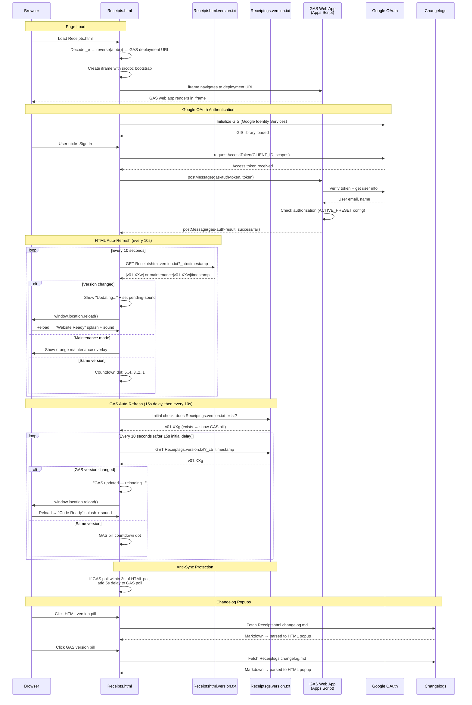

# Receipts.html — GAS Integration Sequence Diagram (Auth)

Sequence diagram showing the dual polling systems (HTML + GAS) and the iframe injection flow.

> [Open in mermaid.live](https://mermaid.live/edit#pako:eNq9Vm1v4jgQ_iujfAId5Ep398Oi3a64lOshtXsVUG4_IFXGGYLVYOdsA8u-_PcbxwkQCD2kk64fCsTz8sw8z4zzPeAqxqAbGPx7hZLjrWCJZsupBPrLmLaCi4xJC79ptTGoTw_-GD_cAzMwRI4isyZc2GVaYzY5NHI24Rq1EUqG9qs9tb-r2CfmX6x7I2fuPv7CGfSy7MNM3zTo08CIawrRrHFSKkkx9_Pf_uyt7OLULsrrixZMJpiqxEylt_msLIIiXGVzWq4XXXhkCcK9YrE3Kw7bNzf-2J3Udcud7oxu0REDzwjT1XXn_TVodA3ABrNq1mg2y8eu4hizVG2XSFCfhvc1wSKNjKCKOTGLsBF2AUbzWHGYKWWN1SyreFHQbmkt2Vok5G3AqtpMZNwmn6LKbo5oQxywLCPQMibUIGQR7nzrPAXdChXg_lEywZkl6qsYC_uBFFawVHxDuBuMoFH4D2LnZ7cwQr0WHE3Bvz9u71rjfFIx00xvISVi8AxpT_QDeCr4CwlKJJLy1sLRbo6M7XFKacbqBWUjuh_0P4-fB7ctMFxlZ6F4H2ozOVEc0se6RHPIS6aMfSBDElkjYabNqEft3KnlfZt7Xva4JqjFfFsE_wUStLByJQk5V8dw8jR5wbhkIm2RBhxzB0GdQbRA_gIuu9LiW04QNHrReDDpPz8O-6P-GLiSc5E0KzrxtdYWodGsUktdWuWd-HVOyZuvDNuk65cPqUS1hzgn_wU03JxsoXNVtjlVKoN-8RAMzZWMjT86HBQKdkeQzy2oT8989tGKJXHLltmB-2Rf1I_1VSf88mXzA5QG6py0KBnt1N3zGn-WWseNSwM83zDx_vBkkEcLtYFp8JTF1G-ZhGE4DYhNQ2xmNGr0qG3UStaH2E3oRshYbcJU-bEKNTrlN5pVr-MJGOZW5d6ZBrRnjSBOhsjiLcEwWcqo_4SmigBTg_Cw7wYsabG9DjAvU2nXjcM-5vSnbHsUe-TWVEHVK72LCJaluiXEynbhXRi-DcM3YXgdhp2DiCX0_MvZZTXxe66qvM47QxuSANIg0tqCYyWWUzzZbS2inIaoS4jw3F0H-FUY-6mYoQO1eVElJHhnYEpijOudw5aJNH1tBKDB5pZqcqhFASdH3zwZjruj4agiPDcaNWCrunco1xdrfxo4-5WTPuYyvOq8BS_dchT-D9lH7lq-SPMX6rLkirblgUAvVaSLkcuxR9dde7SVHB41nfKTC9NnG8x9QkUJ3YsA3cxvDKi536Tuccu9ObE4hlLN7uIvfc6PRORGrHxFgkeVrTJTf5VG7hb1-Ur2Xf0VsC7a72j5orqQeZkgXBZNie73Intg-iXvX0EWvcMZkgrBL4ojTGUB9aAOFXkBJpqD_44oaAVL1LTmYnoN_z4NaHXQbRt0p0GMc0YX4jT4STZ0QypHb9C1eoWtwA9C8bruH_78B1DjwbQ)



## Key Design Notes

- **GAS iframe injection** — the deployment URL is stored as a reversed+base64-encoded string in `_e`. The iframe uses `srcdoc` with a bootstrap script that reads the URL from `parent._r`, deletes it, then navigates — preventing the URL from being visible in page source
- **Dual polling** — HTML and GAS versions are polled independently with anti-sync protection (if polls align within 3s, GAS poll gets a 5s delay to re-stagger them)
- **Two splash screens** — green "Website Ready" for HTML version changes, blue "Code Ready" for GAS version changes
- **Audio unlock via UAv2** — since the GAS iframe covers the entire page, click events don't reach the parent document. The UAv2 poll detects `navigator.userActivation.hasBeenActive` (propagated from cross-origin iframe clicks) and unlocks AudioContext without needing a direct click on the parent

## Receipt Pipeline — Upload → Extract → Review → Save

Sequence for the receipts app feature (v01.01g/w upload, v01.02g/w extraction + review + save, v01.03g retry/fallback, v01.04g/v01.05w extraction cache + history browser). All routes require a validated session; the upload and save calls travel as body-POSTs with client-side retry because their payloads exceed GET URL limits. Extraction results are cached server-side by file ID (10 min) so transport retries never re-run Gemini.

> [Open in mermaid.live — Receipt Pipeline](https://mermaid.live/edit#pako:eNqVV01v20YQ_SsDXkLBlO0gaQ5Kk0KOHNtBohimg8KIgmLEHZEbL3eZ3aFkIXDQU4Ee-wH0UqCX_jL_gv6EdpeUbNWKEp9EkztvZ968ebv-GGVGUNSLHH2oSWc0kJhbLEcaAKBCyzKTFWqGN47s7beHp69eAjo4oYxkxW674FJ9O7ZPY5ehhgo1KdgCS1NJM8jQis5tkIN-6jH8z_c0hn5VBQRhjo3jNesHVk4pRBiTK2r-DiG2TQMmRgmy6_aiUmoZgpun_vFRCM1Jk0WWU1Ko8xpzWhOdhkTTyhIKVxBxCF0UD1vwUmo6YiodMI5dZ6QbjKFhAjMlG2hM0rQHJ_ShlpYcOJlrEl2pwZFz0miIseYCJsrMAMdmukjEh3afPvWU9-AUKxhFqSe5LXoUwdVPv0KGJVmEHZhIRVDJ7HzRNx-4jB-YmXYZKgI2cPXz3_cf7e5WF_DieP8A4gz1FF0n4I3R0aOHKwgH_bQHx6_TU8CMpdFP6koZFC0NEE-MLWFsxPyxR34AyExlxS4BbeBg_xQmqNQYs_O2sIN-ukCdopICmdKGiufGDpAxZnNOemV16HkPMkvI9Fwqik-6Z2dnZ69eDQbdw8OydK47HA6H2--rfCXQc0_a1ZbafE9x7H6IO7AFWFWkBVgzg9gxcu3aykjcgFhS-LEl_kgkgezF7xurLjfzRRdsMeMlYZ4TrCSYaj01bbE5sa90b34k4mbDznZOvKfMOF6lMkjbBwRN0zOjmTTD1Y-_gywxpzCSrjLaUZoVVKIv2MqM4UX6erjACijdRQEl2axAzQn4BiWQ1daSzuYJuHrMhlElwHiRQPucIVNu7DwBtRiKt-_W0ejqLCPnAi62zKFi2G9Y8hMRlpAg0Xy9wa0fCj9MS38BU5F2UFnqTqRSJCBGpWAiSQkHJCTjWC1GipSjm_tMUKo7bOJVPQ-slqhrVECa7byF1mLN2PbF-9rxIpudQA3IYBh-2FKc0nKeN0rI4ZRuD1wPlppcui6JlaYuh-C5VGqxfEXzHlokYHEGdE3NOVUME2MBayH5FtoJVQozumGA1sxcCOBCuuu8NipgqZQeDFdnqGnBKPIMCbj687dRBPFAutANqR0TClCEU3LABYWCbs_wZ934UDo2dg5jnzVZiKe797d3H-awA-Hpm9ljCLx0jVZzEDTBWnH7bbnq0ezzVt3u0Lr0RCom6yBeTBXshLECizon2AFXmFm31mFPyArKzsfmorNZE0o6Xp5FXzSVpmsolme3P7KSNrNVMUCtFTkHCyaf3O8koGlGQcrW8QZ3dG_fXYaSfXZgSQuyJD5DE94U5OZic1rUOiBGqe5Q8E3Rb4Fk9z_VbqhmxcyauuiiQi1IgGjy2IKqMGz8wvON539mrA9SFOYr_mot_fPXH7-EnaUO9jGKBh6EvhtFgP8Zgf_EnswcpYaZ5EJqeOg20xnyoK8-kUL8yV7_WaPN4IH3Gox7UJEtZXOVmRWkwRpFDjKjJzKvl82_bkqT_h3asjwRHfGpRVeQiNnW1AGjw_Q3HfDXQU-6N3z49GAXBM5dZ4MBNQ31-1sqjRf-xJoyIHr1bujm9oVyF14KxvIdWjmK9puQEO8trXaeqnC0MhStK7Vu0fnSrcJD3c0A9mqpBPjrGbjrW21o59pbbfi8rhNtHQEJXctH_Lpfc9FJPIMa2HcqkBlW-RvMul7490MsKWmvnk1T_CUHhJlp70Agmza3bh0lUUm2RCmiXvRxFHFBJY2i3ihqfXoUXUZJhDWbdK6zqOe1kkR15R23_YeneXn5L55hXEw)

```mermaid
sequenceDiagram
    participant User
    participant HTML as Receipts.html<br>(scan panel + review card)
    participant GAS as GAS Web App<br>(doPost)
    participant Drive as Google Drive<br>(receipts folder)
    participant Gemini as Gemini API<br>(generativelanguage)
    participant SS as Spreadsheet<br>(Receipts + LineItems tabs)

    Note over User,SS: Requires signed-in session (auth flow above)
    User->>HTML: Tap "Scan receipt" → camera / file picker
    HTML->>HTML: Downscale to ≤1600px JPEG (canvas) → base64
    HTML->>GAS: POST action=uploadReceipt (form body; ≤3 attempts, no GET fallback)
    GAS->>GAS: validateSessionForData(token)
    GAS->>Drive: createFile(R-YYYYMMDD-HHmmss-NNNN.jpg)
    GAS->>SS: ensureReceiptTabs_() + append row (status=uploaded)
    GAS-->>HTML: {receiptId, fileId, fileUrl}
    HTML->>GAS: POST action=extractReceipt (GET api op fallback)
    GAS->>Drive: getFileById(fileId).getBlob()
    GAS->>Gemini: generateContent — image + responseSchema (strict JSON)
    Gemini-->>GAS: merchant, date, currency, subtotal, tax, total, category, lineItems[]
    GAS-->>HTML: {success, data}
    alt Extraction succeeded
        HTML->>User: Review card opens pre-filled (all fields editable)
    else Extraction failed
        HTML->>User: Review card opens empty — manual entry
    end
    User->>HTML: Adjust fields / line items → Save receipt
    HTML->>GAS: POST action=saveReceipt (form body: receiptId + reviewed JSON)
    GAS->>SS: Fill receipt row (status=saved, raw extraction kept for audit)
    GAS->>SS: Replace LineItems rows for this receiptId
    GAS-->>HTML: {success, lineItems: N}
    HTML->>User: "Saved ✓" (Discard instead leaves the row status=uploaded)

    Note over User,SS: History browser (v01.04g / v01.05w; saved-only default v01.05g / v01.06w)
    User->>HTML: Tap "History" → filters (merchant / date range / show-unsaved checkbox)
    HTML->>GAS: POST action=listReceipts (GET api op fallback)
    GAS->>SS: Read Receipts tab, filter (status=saved unless uploaded=1), newest first
    GAS-->>HTML: {receipts[]} → list rendered
    User->>HTML: Tap a receipt row
    HTML->>GAS: POST action=getReceiptDetail (GET api op fallback)
    GAS->>SS: Read receipt row + its LineItems rows
    GAS-->>HTML: {receipt, lineItems[]} → expanded detail + photo link

    Note over User,SS: Record deletion (v01.05g / v01.06w)
    User->>HTML: Tap 🗑 → inline "Delete?" arm → tap again within 4s
    HTML->>GAS: POST action=deleteReceipt (GET api op fallback)
    GAS->>GAS: RBAC check — 'delete' permission when roles configured
    GAS->>SS: Delete receipt row + its LineItems rows
    GAS->>Drive: setTrashed(true) on the photo (recoverable ~30 days)
    GAS-->>HTML: {success} → row removed from the list

    Note over User,SS: .xlsx export (v01.05g / v01.06w)
    User->>HTML: Tap "Export .xlsx" (uses current history filters)
    HTML->>GAS: POST action=exportReceipts (GET api op fallback)
    GAS->>SS: Build temp spreadsheet — Receipts + LineItems sheets
    GAS->>Drive: Export temp as .xlsx (OAuth), then trash the temp file
    GAS-->>HTML: {fileName, base64} → Blob download in the browser
```

Developed by: ShadowAISolutions
