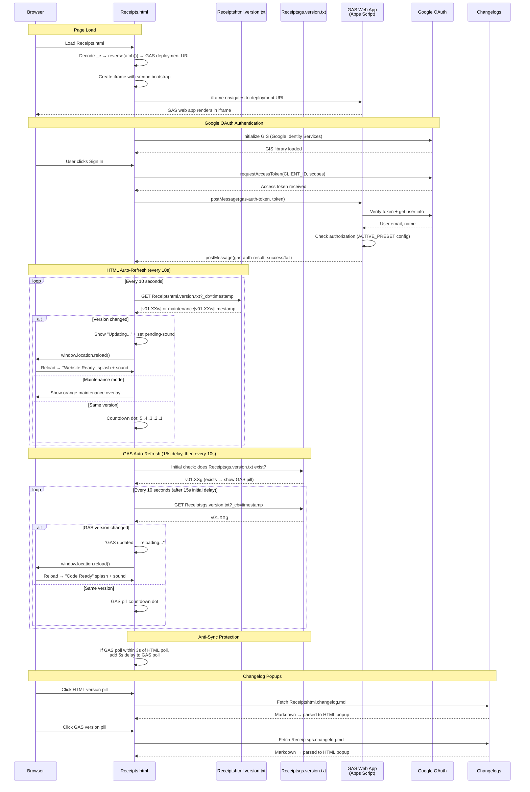

# Receipts.html — GAS Integration Sequence Diagram (Auth)

Sequence diagram showing the dual polling systems (HTML + GAS) and the iframe injection flow.

> [Open in mermaid.live](https://mermaid.live/edit#pako:eNq9Vm1v4jgQ_iujfAId5Ep398Oi3a64lOshtXsVUG4_IFXGGYLVYOdsA8u-_PcbxwkQCD2kk64fCsTz8sw8z4zzPeAqxqAbGPx7hZLjrWCJZsupBPrLmLaCi4xJC79ptTGoTw_-GD_cAzMwRI4isyZc2GVaYzY5NHI24Rq1EUqG9qs9tb-r2CfmX6x7I2fuPv7CGfSy7MNM3zTo08CIawrRrHFSKkkx9_Pf_uyt7OLULsrrixZMJpiqxEylt_msLIIiXGVzWq4XXXhkCcK9YrE3Kw7bNzf-2J3Udcud7oxu0REDzwjT1XXn_TVodA3ABrNq1mg2y8eu4hizVG2XSFCfhvc1wSKNjKCKOTGLsBF2AUbzWHGYKWWN1SyreFHQbmkt2Vok5G3AqtpMZNwmn6LKbo5oQxywLCPQMibUIGQR7nzrPAXdChXg_lEywZkl6qsYC_uBFFawVHxDuBuMoFH4D2LnZ7cwQr0WHE3Bvz9u71rjfFIx00xvISVi8AxpT_QDeCr4CwlKJJLy1sLRbo6M7XFKacbqBWUjuh_0P4-fB7ctMFxlZ6F4H2ozOVEc0se6RHPIS6aMfSBDElkjYabNqEft3KnlfZt7Xva4JqjFfFsE_wUStLByJQk5V8dw8jR5wbhkIm2RBhxzB0GdQbRA_gIuu9LiW04QNHrReDDpPz8O-6P-GLiSc5E0KzrxtdYWodGsUktdWuWd-HVOyZuvDNuk65cPqUS1hzgn_wU03JxsoXNVtjlVKoN-8RAMzZWMjT86HBQKdkeQzy2oT8989tGKJXHLltmB-2Rf1I_1VSf88mXzA5QG6py0KBnt1N3zGn-WWseNSwM83zDx_vBkkEcLtYFp8JTF1G-ZhGE4DYhNQ2xmNGr0qG3UStaH2E3oRshYbcJU-bEKNTrlN5pVr-MJGOZW5d6ZBrRnjSBOhsjiLcEwWcqo_4SmigBTg_Cw7wYsabG9DjAvU2nXjcM-5vSnbHsUe-TWVEHVK72LCJaluiXEynbhXRi-DcM3YXgdhp2DiCX0_MvZZTXxe66qvM47QxuSANIg0tqCYyWWUzzZbS2inIaoS4jw3F0H-FUY-6mYoQO1eVElJHhnYEpijOudw5aJNH1tBKDB5pZqcqhFASdH3zwZjruj4agiPDcaNWCrunco1xdrfxo4-5WTPuYyvOq8BS_dchT-D9lH7lq-SPMX6rLkirblgUAvVaSLkcuxR9dde7SVHB41nfKTC9NnG8x9QkUJ3YsA3cxvDKi536Tuccu9ObE4hlLN7uIvfc6PRORGrHxFgkeVrTJTf5VG7hb1-Ur2Xf0VsC7a72j5orqQeZkgXBZNie73Intg-iXvX0EWvcMZkgrBL4ojTGUB9aAOFXkBJpqD_44oaAVL1LTmYnoN_z4NaHXQbRt0p0GMc0YX4jT4STZ0QypHb9C1eoWtwA9C8bruH_78B1DjwbQ)



## Key Design Notes

- **GAS iframe injection** — the deployment URL is stored as a reversed+base64-encoded string in `_e`. The iframe uses `srcdoc` with a bootstrap script that reads the URL from `parent._r`, deletes it, then navigates — preventing the URL from being visible in page source
- **Dual polling** — HTML and GAS versions are polled independently with anti-sync protection (if polls align within 3s, GAS poll gets a 5s delay to re-stagger them)
- **Two splash screens** — green "Website Ready" for HTML version changes, blue "Code Ready" for GAS version changes
- **Audio unlock via UAv2** — since the GAS iframe covers the entire page, click events don't reach the parent document. The UAv2 poll detects `navigator.userActivation.hasBeenActive` (propagated from cross-origin iframe clicks) and unlocks AudioContext without needing a direct click on the parent

## Receipt Pipeline — Upload → Extract → Review → Save

Sequence for the receipts app feature (v01.01g/w upload, v01.02g/w extraction + review + save, v01.03g retry/fallback, v01.04g/v01.05w extraction cache + history browser, v01.09g/v01.11w batch upload + reports + edit-in-place, v01.10g multi-user data isolation, v01.11g/v01.16w sharing, v01.12g/v01.17w own-Drive photo storage). All routes require a validated session; since v01.10g every read/write op is additionally scoped to the signed-in user's own receipts (owner = the row's Uploaded By email). The upload and save calls travel as body-POSTs with client-side retry because their payloads exceed GET URL limits. Extraction results are cached server-side by file ID (10 min) so transport retries never re-run Gemini.

> [Open in mermaid.live — Receipt Pipeline](https://mermaid.live/edit#pako:eNqlWVFvG8cR_iuDexEJkabkJC4q1ylkS1EUxJYhyg2MMAiGt8PjVnu7l909UlfDRZ4K5CloG6AvAfrS_ob2uT_Ff6D9Ce3s7p1Ik6Jt9InU8XZ2Z-abb75ZvcpyIyg7yhx9V5PO6URiYbGcaACACq2XuaxQe3jhyG4-_fzq6ZeADi4pJ1l5d2_uS_Wrqf2053LUUKEmBftgaSFpCTla0d80cnY8Zhv88RVN4biqggVhnhvnt7x_YuWCwgpjCkXx77CkdmT3HJiljg8fgqIC8waMLWBmlCC7bX8qpZbBYPx2_Pw8mCtIk0UvF6RQFzUWtGX1OBx-XFlC4eZEPixtAwL78KXUdO6pdOBx6voTHW08M57ALMiG0A7G4yO4pO9qacmBk4UmMZQaHDknjYYe1n4OM2WWgFOzaA_CS4effsppOIIrrGCSjTnwNm4_yeDNH_4EOZZkEUYwk4qgkvl1m0te2K0_MUvtclQE3sCbH_52-ODgoLqBL56fnkEvR71A1w_2pujowcdrFkK4j-CxNUtHFupKGRQOqrnxhs35OcGL8enl3hguvnqWUriUfs6_SMsxE_zsXjiiN9ekoTfJujAeV9UkSykcANbeDHNL6EmA0TCT1nmoHT1kQ_EtOD8BS4V0niwJkDqc4bk1vEPIRR_efP8TLA4O7x3eL0bh8xfLNa_OjsdH8PxifAWYe2n0o-hXOlVYLkss6IVVoKS-ThsyZowOOEj4ixELwTO2GEb3ozGQLpyMfSrRyxxmqNQU82s2sJyTBm1SwGJcRpAb7Uh7GLU2ZiiVS5g4Ox63R1-gkgI9jSOKPjP2BD32gpm1txl9pF1tKfl2hVP3ba8P-4BVRVqANUvoOY--dikKJFZMdCB6laB3Ll7vDiXdeIu5T_vxuaAXggnTxpMbgJAFOT_MMZ-TCIm9LeYUQUYbp327TZg2EfHnJ-uhCVV-BKm86YnRnqPZpTMwlqs4yON8TiWy51bmHr4YXzxrbQUrw9a1kmw-R-0HgEJYcuwAehpAXltLOm8G4OqpNx7VADzeDCB-Z79y9FQY2wwYRJErvv4GeoT5PNYIgiDmnJKP2b69NfquzvN2c0wZQOXhNEaGqSS8QoJE_HUlR8wmzEIdWYOpSDuoLA1nUikS0EOlYCZJCQckpMeparmIlKPVfRiTH7AJlZVvQg5K1DUqIO1tk0xrsYXvjsVva-fb04xC8EAGpuVCGyMjJBHhTig6XLS4h97M2BKmRjRH0EG5a2EkAgRgH2bG5gQzhcVm2Z3UlZKcJsjnlF8HpxyW1IFkn6GxHwDAzQOBTyDa_RgS7MArstbYIxCtuddQa0XOxc0fHTJDBi9RN0tsJtnmUY4d9xLg5sSpYlIce2Pp22dY0vDly5cvnz49OYFebpSSLsJjNpM3MLw_Gn60Zi9R_CVpdoUpq2P3En0emBw0LXmP3nqNhuo1S50ehXUO0HJ-2JrgUuXl09Q_FhLhth9sUNVnUqk2WoGZpM7VvbbyOp4KUR2AxSXQLS6vqfIbFi-pUpjTSrMO3NIL5VeRHTKu2tKT5LYYmNZSieDFU6P9XDUwrssSbcO9hgvHGe5VghR52l28HfCOOKBvU2msoJh6AW9-_vMkg96JdKGYpHaeUIAiXFDsLBygTea-U4V8Lp03tuly0ePOePBxAaPQKw8-WT6MeB0arRoQNMNa-fRb99aD5d0SJe2Q1MlMKk_WQa-tDhgF6gSLuiAYgZub5bDWsUZG4Iz1w2kz5Hf6uwtbSec7CdE7O70CrCSYqmuxmwVzoWnoZUmg8HcNlLKIzdwNQq0PixqtYB48P0kss1lNgdNbZxx46RUNc3QkHsJUob5mgcoe8wkSryaJlDoc69gtCEPRCW3G1CBIqcuLr8Zw8ezLl9ALZuERvEhZhsdNOEuQNgdFf5BivV4gLam02Hh02A-rkrQwlsWUsS0oQ9zT0x7n4tFKIrZKAff1N69DrDgdXPGCFdkd6MDVut6d3YI69UAepXp3hrswrnLHPkjv3ir8Hd6sNenoF91UqDneIp5jPzEjS8Kdcj83VkRCCBr_vUvoP3_9yx_DzlKHpjfJTgKr_HqSAf6vffFPnoNZoNRBQkgNH7vd4YzE1PXB96qWy8fHT1aa3F60sceMWco4uQQFaw1r7tzomSzqLvm3SYnH_4C0dO3Ikb-y6OYket7W1GeKvW0-qdP0LOUc-9ACf__RAQhsXP_uruSjxd1daQeDR1iwF5ZKwzU2s6aMFS6d34GJezfK3TCgjPUfAIhJdhqXhPXcD2rHAQ_a08M8UXqi2v67lDmben_e5HM_js2Pygrc7SgcQLF1FA4_b8tn8iNYQpfi0bs4rv28P-AI6pidEMzw1l254OfMy4M0fcWkPFZmCsIsdZy99GqCd-TlcVA4iRKjSHUsjA2nW-oi5eqXba4OD3fkKvJzan8FKkW2gbJWXg4dKco9j9sVHH7CdQRT3joZU8ZUcMpzQUDrAOJcohqIFzheotpQ3HHrJ6asgjp6e4J__3n3Vhv33710fRYLw3COSjlwFeasW374-4N7n7gQzHTvMrPEzZcsXD5_CnNCYY0pV_ZaTzCPONyYgkyO2f2uppqrLbQrFuxvzQ93zSAOnKcK_NyauojYCqZYYf_rH6DBzODZJOsHaf79T3G2MBZa1YVigTpnvWWSDL7xt7PHnag6FdKva39GZFSi7weoVqylzsMxmGRvfv7x3__8MVpv7a6OR5NsdzRWB75AXBudlkO_5TSfyZuoFJj0wob_xygWICMFlZUJ4_m0WRnIOAmWllZ6cqlddOSy-4qN6cV9ULmmNaleK7LSCO5l3hru9YlUd_tl6cM5NSgVRtPKteYaWJhSw_XZCrEG5rh_cHDwDkW2LmO23AY-UZK0HzopCKZ1fk18bIFSNaMl0bVqRmUcc0ZTOUTNI_sofoQq2Q-TCKv5DX0_gNsLj9t7jXhf4gaQG1aJrP13JXI8R9vx7uFhl8hdPTKtaYnXYkQVlUE8BviPgD_2-WqjH6G8MNe0O7coBFvmUSUiv_2Le334_p4Jf1E5sn4URRTElUMeHuMsehHkPR_9jI9OfE_lclPRQ7h_MIzu5Fht83-S_UbSMvoeW4yxTDWJPkZtWbBxZIi7oNwMOD6EiLdQ5ZY4rE1Yo02i4JCsIX8E6_IiXHKy9TC8PIpwDhnZEJtn0cOgNoOydT6URwoxByqIUM7gHqBSHLXQ2qUuwkizx3nd43sCyZlDpZr2vRXieQjrUth5bFw8Xxh5txTW1ZxiqLhOu-rsJVbO0fKdAeSoAydzewoX4uf9bJCVZEuUIjvKXk0yP6eSJtnRJEtz9SR7nQ0yvhweNzrPjljkDrK64mJJ_6yJD1__F0C2tTQ)

```mermaid
sequenceDiagram
    participant User
    participant HTML as Receipts.html<br>(scan panel + review card)
    participant GAS as GAS Web App<br>(doPost)
    participant Drive as Google Drive<br>(user's own Drive; legacy org folder)
    participant Gemini as Gemini API<br>(generativelanguage)
    participant SS as Spreadsheet<br>(Receipts + LineItems tabs)

    Note over User,SS: Requires signed-in session (auth flow above)
    User->>HTML: Tap "Scan receipt" → camera / file picker
    HTML->>HTML: Downscale to ≤1600px JPEG (canvas) → base64
    HTML->>Drive: Browser uploads photo to the USER'S OWN Drive with their<br>drive.file token ("Receipts App" folder, auto-created on first use;<br>folder ID registered in the Profiles tab) — v01.12g/v01.17w
    HTML->>GAS: POST action=uploadReceipt — imageUrl link registration<br>(legacy base64 → org-Drive upload is the automatic fallback<br>when no Drive token / consent / upload fails)
    GAS->>GAS: validateSessionForData(token)
    GAS->>SS: ensureReceiptTabs_() + append row (status=uploaded)
    GAS-->>HTML: {receiptId}
    HTML->>GAS: POST action=extractReceiptData (image bytes, digest-cached;<br>legacy org-Drive rows use action=extractReceipt by file ID)
    GAS->>Gemini: generateContent — image + responseSchema (strict JSON)
    Gemini-->>GAS: merchant, address, date, currency, subtotal, tax, total,<br>category, lineItems[] (each with a department category)
    GAS-->>HTML: {success, data}
    alt Extraction succeeded
        HTML->>User: Review card opens pre-filled (all fields editable)
    else Extraction failed
        HTML->>User: Review card opens empty — manual entry
    end
    User->>HTML: Adjust fields / line items → Save receipt
    HTML->>GAS: POST action=saveReceipt (form body: receiptId + reviewed JSON + force flag)
    GAS->>GAS: Duplicate check — same merchant+date+total as a saved receipt<br>→ {error: duplicate} unless force=1 ("Save anyway")
    GAS->>GAS: Assign readable ID Store_Name-YYYYMMDD (collision suffix -2/-3)
    GAS->>Drive: Rename the photo to match the new ID (org-Drive rows;<br>own-Drive photos are renamed by the browser via drive.file)
    GAS->>SS: Fill receipt row incl. address (status=saved, raw extraction kept)
    GAS->>SS: Replace LineItems rows (with per-item categories)
    GAS->>SS: Rebuild the Monthly Summary tab (also on delete)
    GAS-->>HTML: {success, receiptId: newId}
    HTML->>User: "Saved ✓" (Discard instead leaves the row status=uploaded)

    Note over User,SS: History browser (v01.04g / v01.05w; saved-only default v01.05g / v01.06w)
    User->>HTML: Tap "History" → filters (merchant / date range / show-unsaved / sort-by-date)
    HTML->>GAS: POST action=listReceipts (GET api op fallback)
    GAS->>GAS: One-time lazy migrations, flag-guarded (IDs → Store_Name-YYYYMMDD,<br>merchants title-cased; blank owners backfilled to the legacy user)
    GAS->>SS: Read Receipts tab, OWN ROWS ONLY (owner = Uploaded By,<br>v01.10g), filter (status=saved unless uploaded=1),<br>upload order or receipt-date order (sort=date)
    GAS-->>HTML: {receipts[]} → list rendered
    User->>HTML: Tap a receipt row
    HTML->>GAS: POST action=getReceiptDetail (GET api op fallback)
    GAS->>SS: Read receipt row + its LineItems rows
    GAS-->>HTML: {receipt, lineItems[]} → expanded detail + photo link

    Note over User,SS: Record deletion (v01.05g / v01.06w)
    User->>HTML: Tap 🗑 → inline "Delete?" arm → tap again within 4s
    HTML->>GAS: POST action=deleteReceipt (GET api op fallback)
    GAS->>GAS: RBAC check — 'delete' permission when roles configured
    GAS->>SS: Delete receipt row + its LineItems rows
    GAS->>Drive: setTrashed(true) on org-Drive photos (recoverable ~30 days);<br>own-Drive photos are trashed by the browser via drive.file
    GAS-->>HTML: {success} → row removed from the list

    Note over User,SS: .xlsx export (v01.05g / v01.06w)
    User->>HTML: Tap "Export .xlsx" (uses current history filters)
    HTML->>GAS: POST action=exportReceipts (GET api op fallback)
    GAS->>SS: Build temp spreadsheet — Receipts + LineItems sheets
    GAS->>Drive: Export temp as .xlsx (OAuth), then trash the temp file
    GAS-->>HTML: {fileName, base64} → Blob download in the browser

    Note over User,SS: Batch upload — mass processing (v01.09g / v01.11w)
    User->>HTML: Tap "Upload" → gallery multi-select (cap 15 per batch)
    loop Each photo, strictly sequential
        HTML->>HTML: Compress → base64
        HTML->>GAS: POST action=uploadReceipt (form body)
        HTML->>GAS: POST action=extractReceipt<br>(calls spaced ≥6.5s — Gemini free-tier RPM headroom)
        GAS-->>HTML: {data or error} → queued for review
    end
    HTML->>User: Review cards step through the queue ("· n of N")<br>— Save or Discard advances to the next receipt

    Note over User,SS: Edit saved receipt in place (v01.09g / v01.11w)
    User->>HTML: History detail → "✏️ Edit receipt / line items"
    HTML->>User: Review card pre-filled from getReceiptDetail data
    User->>HTML: Fix or remove lines → Save receipt
    HTML->>GAS: POST action=saveReceipt<br>(idempotent by receiptId — rewrites row + LineItems)

    Note over User,SS: Reports (v01.09g / v01.11w)
    User->>HTML: Tap "Reports" → period control + filters
    HTML->>GAS: POST action=reportReceipts (GET api op fallback)
    GAS->>SS: Read the user's own saved receipts + their LineItems (cap 2000)
    GAS-->>HTML: {receipts[], lineItems[]}
    HTML->>HTML: Client-side buckets (daily/weekly/monthly/bi-annual/annual)<br>+ instant filters (merchant, category, department, dates, cost range)

    Note over User,SS: Sharing (v01.11g / v01.16w)
    User->>HTML: Tap "Sharing" → grant by email (view / view+edit) or revoke
    HTML->>GAS: POST action=addShare / removeShare / listShares (GET api op fallback)
    GAS->>SS: Upsert/delete Shares-tab rows (Owner → Grantee + scope; 20-grant cap)
    User->>HTML: "Viewing" selector in History/Reports → a person who shared with me
    HTML->>GAS: listReceipts / getReceiptDetail / reportReceipts / exportReceipts<br>with owner=their email
    GAS->>GAS: Grant check against the Shares tab — 'view' allows browsing,<br>'edit' additionally allows saveReceipt; deleteReceipt stays owner-only
    GAS-->>HTML: The sharer's receipts (detail carries canEdit for the UI)
```

Developed by: ShadowAISolutions
