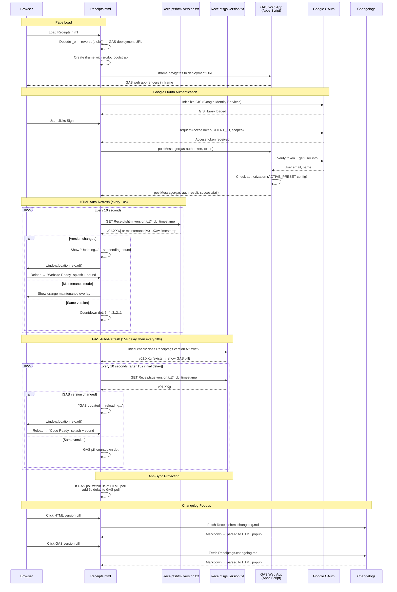

# Receipts.html — GAS Integration Sequence Diagram (Auth)

Sequence diagram showing the dual polling systems (HTML + GAS) and the iframe injection flow.

> [Open in mermaid.live](https://mermaid.live/edit#pako:eNq9Vm1v4jgQ_iujfAId5Ep398Oi3a64lOshtXsVUG4_IFXGGYLVYOdsA8u-_PcbxwkQCD2kk64fCsTz8sw8z4zzPeAqxqAbGPx7hZLjrWCJZsupBPrLmLaCi4xJC79ptTGoTw_-GD_cAzMwRI4isyZc2GVaYzY5NHI24Rq1EUqG9qs9tb-r2CfmX6x7I2fuPv7CGfSy7MNM3zTo08CIawrRrHFSKkkx9_Pf_uyt7OLULsrrixZMJpiqxEylt_msLIIiXGVzWq4XXXhkCcK9YrE3Kw7bNzf-2J3Udcud7oxu0REDzwjT1XXn_TVodA3ABrNq1mg2y8eu4hizVG2XSFCfhvc1wSKNjKCKOTGLsBF2AUbzWHGYKWWN1SyreFHQbmkt2Vok5G3AqtpMZNwmn6LKbo5oQxywLCPQMibUIGQR7nzrPAXdChXg_lEywZkl6qsYC_uBFFawVHxDuBuMoFH4D2LnZ7cwQr0WHE3Bvz9u71rjfFIx00xvISVi8AxpT_QDeCr4CwlKJJLy1sLRbo6M7XFKacbqBWUjuh_0P4-fB7ctMFxlZ6F4H2ozOVEc0se6RHPIS6aMfSBDElkjYabNqEft3KnlfZt7Xva4JqjFfFsE_wUStLByJQk5V8dw8jR5wbhkIm2RBhxzB0GdQbRA_gIuu9LiW04QNHrReDDpPz8O-6P-GLiSc5E0KzrxtdYWodGsUktdWuWd-HVOyZuvDNuk65cPqUS1hzgn_wU03JxsoXNVtjlVKoN-8RAMzZWMjT86HBQKdkeQzy2oT8989tGKJXHLltmB-2Rf1I_1VSf88mXzA5QG6py0KBnt1N3zGn-WWseNSwM83zDx_vBkkEcLtYFp8JTF1G-ZhGE4DYhNQ2xmNGr0qG3UStaH2E3oRshYbcJU-bEKNTrlN5pVr-MJGOZW5d6ZBrRnjSBOhsjiLcEwWcqo_4SmigBTg_Cw7wYsabG9DjAvU2nXjcM-5vSnbHsUe-TWVEHVK72LCJaluiXEynbhXRi-DcM3YXgdhp2DiCX0_MvZZTXxe66qvM47QxuSANIg0tqCYyWWUzzZbS2inIaoS4jw3F0H-FUY-6mYoQO1eVElJHhnYEpijOudw5aJNH1tBKDB5pZqcqhFASdH3zwZjruj4agiPDcaNWCrunco1xdrfxo4-5WTPuYyvOq8BS_dchT-D9lH7lq-SPMX6rLkirblgUAvVaSLkcuxR9dde7SVHB41nfKTC9NnG8x9QkUJ3YsA3cxvDKi536Tuccu9ObE4hlLN7uIvfc6PRORGrHxFgkeVrTJTf5VG7hb1-Ur2Xf0VsC7a72j5orqQeZkgXBZNie73Intg-iXvX0EWvcMZkgrBL4ojTGUB9aAOFXkBJpqD_44oaAVL1LTmYnoN_z4NaHXQbRt0p0GMc0YX4jT4STZ0QypHb9C1eoWtwA9C8bruH_78B1DjwbQ)



## Key Design Notes

- **GAS iframe injection** — the deployment URL is stored as a reversed+base64-encoded string in `_e`. The iframe uses `srcdoc` with a bootstrap script that reads the URL from `parent._r`, deletes it, then navigates — preventing the URL from being visible in page source
- **Dual polling** — HTML and GAS versions are polled independently with anti-sync protection (if polls align within 3s, GAS poll gets a 5s delay to re-stagger them)
- **Two splash screens** — green "Website Ready" for HTML version changes, blue "Code Ready" for GAS version changes
- **Audio unlock via UAv2** — since the GAS iframe covers the entire page, click events don't reach the parent document. The UAv2 poll detects `navigator.userActivation.hasBeenActive` (propagated from cross-origin iframe clicks) and unlocks AudioContext without needing a direct click on the parent

## Receipt Pipeline — Upload → Extract → Review → Save

Sequence for the receipts app feature (v01.01g/w upload, v01.02g/w extraction + review + save, v01.03g retry/fallback, v01.04g/v01.05w extraction cache + history browser). All routes require a validated session; the upload and save calls travel as body-POSTs with client-side retry because their payloads exceed GET URL limits. Extraction results are cached server-side by file ID (10 min) so transport retries never re-run Gemini.

> [Open in mermaid.live — Receipt Pipeline](https://mermaid.live/edit#pako:eNqVVsFuGzcQ_ZXBntbwypbRNAelNaBUju0gVgyvg8KIgmK0HK0Yc0mGnJUsGAZ6KtBr22OP_TJ_SUFqV5FqWUVOS604j_PezBvufVIYQUkv8fSlJl3QQGLpsBppAACLjmUhLWqGD57c07dn1xfvAD1cUUHSsj-YcqV-GLvj1BeowaImBfvgaCZpDgU6sfcU5LSfB4zw-JnG0Lc2IghzaTxv2T9wckYxwphS0fJ3DHFNGjAxSpDbdhZVUssYvFz1L89jaEmaHLKckUJd1ljSlug8JppbRyj8lIhjaEse9uGd1HTOVHlgHPu9kV5iDA0TmBm5KGOW5z24oi-1dOTBy1KT6EgNnryXRkOKNU9hoswccGxmbSIhtHN8HCTvwTVaGCV5ELkhPUrg8bc_oMCKHMIhTKQisLK4besWAlfxAzPXvkBFwAYef__n6GW3a-_g7eXJKaQF6hn6vYg3Rk8vX2wgnPbzHly-z68BC5ZG_1hbZVA0MkA6Ma6CsRGLVwH5O0Bmqiz7DLSB05NrmKBSYyxuG2Kn_bxFnaGSApnypRRvjBsgY8rmlvTG7ljzHhSOkOmNVJRedW5ubm4uLgaDztlZVXnfGQ6Hw4PPttwIDNqT9rWjJt9rHPtf0j3YB7SWtABn5pB6Rq59w4zEGsRKwvtG-HORRbHb5wenHnbrRXfssOCVYEETtBKM3S5NQ7YkDkxfL85Fujxw76Akfq3MON2UMrZ2CIg9TT8ZzaQZHn_9C2SFJUVLemu0p7yYUoWBsJMFw9v8_bDFiiidlkBFrpii5gxCgTIoaudIF4sMfD1mw6gyYLzLoFkXyFQat8hAtab4-GmbjL4uCvI-4mKjHCqGk6VKwRFxCwkSy3_XtA2mCGZazRcwlrQH66gzkUqRgBSVgokkJTyQkIxj1VqKlKf1cyYo1TccErp6EVWtUNeogDS7RQOtxRbb9sXn2nObzWGUBmQcGMFsOc5o5eedLeRxRk8N14NVT66mLomNoq5M8EYq1W7f6PkALTJwOAf6Ks0tWYaJcYC1kPwE7YqswoLWBqAzcx8DeCr917x2dsCqU3ow3PTQsgSjJCgk4PHvP0cJpAPpYzWk9kwoQBHOyANPKRJ66uFnp_GZ9GzcAsYha3KQzrpHB90XJRxCXH0_f34IN7HN_J1IxeQ8pK1f4DAaBhzq1Z3yXFWV9Ly6Tf53LCx1R7G6fcOlkzUZZKBpTrHXnGdIK7yDo2531yDzHz89RA4hDXCkBTkSz_DG9d7ZzaqkltSAGKX6Bmbr_bkPkv1_GmwHm425s-RFdxa1IAFimcc-2KlhEzbeJllSkatQiqSX3I8SnlJFo6Q3SgRNsFY8Sh6SLMGaTb7QRdJjV1OW1DYUt_lqWr58-BfpuR0X)

```mermaid
sequenceDiagram
    participant User
    participant HTML as Receipts.html<br>(scan panel + review card)
    participant GAS as GAS Web App<br>(doPost)
    participant Drive as Google Drive<br>(receipts folder)
    participant Gemini as Gemini API<br>(generativelanguage)
    participant SS as Spreadsheet<br>(Receipts + LineItems tabs)

    Note over User,SS: Requires signed-in session (auth flow above)
    User->>HTML: Tap "Scan receipt" → camera / file picker
    HTML->>HTML: Downscale to ≤1600px JPEG (canvas) → base64
    HTML->>GAS: POST action=uploadReceipt (form body; ≤3 attempts, no GET fallback)
    GAS->>GAS: validateSessionForData(token)
    GAS->>Drive: createFile(R-YYYYMMDD-HHmmss-NNNN.jpg)
    GAS->>SS: ensureReceiptTabs_() + append row (status=uploaded)
    GAS-->>HTML: {receiptId, fileId, fileUrl}
    HTML->>GAS: POST action=extractReceipt (GET api op fallback)
    GAS->>Drive: getFileById(fileId).getBlob()
    GAS->>Gemini: generateContent — image + responseSchema (strict JSON)
    Gemini-->>GAS: merchant, date, currency, subtotal, tax, total, category, lineItems[]
    GAS-->>HTML: {success, data}
    alt Extraction succeeded
        HTML->>User: Review card opens pre-filled (all fields editable)
    else Extraction failed
        HTML->>User: Review card opens empty — manual entry
    end
    User->>HTML: Adjust fields / line items → Save receipt
    HTML->>GAS: POST action=saveReceipt (form body: receiptId + reviewed JSON)
    GAS->>SS: Fill receipt row (status=saved, raw extraction kept for audit)
    GAS->>SS: Replace LineItems rows for this receiptId
    GAS-->>HTML: {success, lineItems: N}
    HTML->>User: "Saved ✓" (Discard instead leaves the row status=uploaded)

    Note over User,SS: History browser (v01.04g / v01.05w)
    User->>HTML: Tap "History" → filters (merchant / date range)
    HTML->>GAS: POST action=listReceipts (GET api op fallback)
    GAS->>SS: Read Receipts tab, filter, newest first (max 100)
    GAS-->>HTML: {receipts[]} → list rendered
    User->>HTML: Tap a receipt row
    HTML->>GAS: POST action=getReceiptDetail (GET api op fallback)
    GAS->>SS: Read receipt row + its LineItems rows
    GAS-->>HTML: {receipt, lineItems[]} → expanded detail + photo link
```

Developed by: ShadowAISolutions
