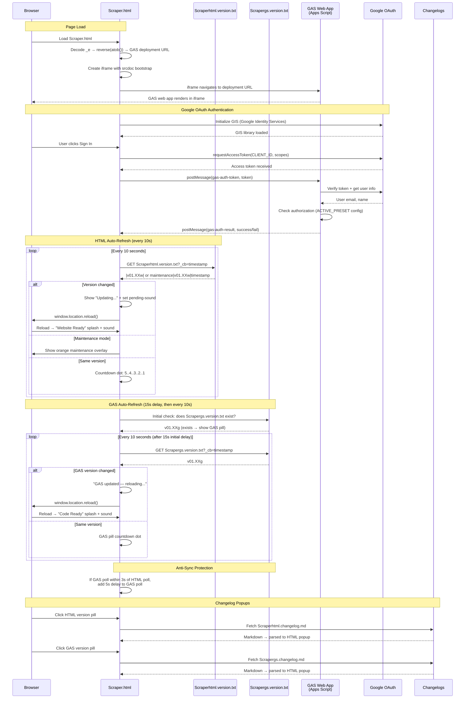

# Scraper.html — GAS Integration Sequence Diagram (Auth)

Sequence diagram showing the dual polling systems (HTML + GAS) and the iframe injection flow.

> [Open in mermaid.live](https://mermaid.live/edit#pako:eNq9Vt9v4jgQ_ldGeQIdZEt39-HQbVdcyvWQ2r0KKLcPSJVxhmA12DnbwLI__vcbxwkkJXQrnXR9KGDPjL-Z75uxvwVcxRj0A4P_bFByvBYs0Ww9l0B_GdNWcJExaeF3rXYG9enGn9O7W2AGJlyzDHW4suu0wWpWsXEm4Ra1EUqG9os9Nb-pmifmJ8aDibN2H3_jAgZZ9ttCX7XoMw8hMttucFIqSTH389_-Gmzs6tQuypOLVkwmmKrEzKW3-aQsgiJcZWU6rhB9uGcJwq1isTcrNrtXV37b7TSUym0ebK7RkQKPCPPNZe_XS9Do8scWs2rRarfLZZdwjFmq9mskpA_j24ZgkUZGSMWSWEXYCbsCo3msOCyUssYSkpoXBe2X1pJtRULeBqxqPImMu-RTJNnPEe2IApZlBFrGhBqELMKdr5xnoF9jAtw_OkxwZon5OsbCfiSFFSwVXxFuRhNoFf6j2PnZPUxQbwVHU9Dvt7uH0jifVCw003tIiRc8w9kD_QCeCv5EehKJpHMb4WjXQ8YOOB1ppuoJZSu6HQ0_TR9H1x0wXGVnoXgfKjM5URyOYluiqfKSKWPvyJA01kqY6TKqUTd36njf9pGXI64ZarHcF8F_gQQtbFxKQi7Vczj5MXnCuGYi7ZAGHHOVoM4gWiF_Ane60uJrThC0BtF0NBs-3o-Hk-EUuJJLkbRrOvG5Niah0WxSS1Xa5JV4s6TD2y_02qzvBw-pRHXHuCT_FbRcn-yhd1GWOVUqg2GxCIb6SsbGb1UbhYLdEOQz0-njI198sGJN1LJ1VvGeHXP6vr3ohZ8_776D0kCFkxYlo3F6WG_wZ6l11LhjgOfzJT5unvTxZKV2MA8espjKLZMwDOcBkWmIzIw6jZa6Rm1kc4hDg-6EjNUuTJXvqlCjE36rXfd63gDj3KocO_OApqwRRMkYWbwnGCZLGZWf0NQRYGoQ7o7VgDXNtZcB5mkq7apRrWPOfsr2z2JP3JQqqHqhdhHBspS3hFjZPrwPw3dh-DYML8OwV4lYQs-_nJ1VMz_m6sLrvTc0IAkg9SFNLXguxLKJZ4ehRZRTD_UJEZ656AC_CGM_Fh1UEZvXVEJydwam5MW40jlomUjTlxoAWmxpKSUHWhRocvDtk9a4qbdGHeC5xmjAWle9A7l9tfLngbPfOOFjLsKL3jvwwi0b4f8QfeTu5Fcp_pWqLKmiUVmR52v16GLkYhzQXded7CWHe027_OS29KeNlv5ARQe6VwBdy28NqKUfo265415NLI6h1LK79Uuf8w0RuQYrn0dwr7JNZprv0chdof68kn2Xfw2si_YHWr6qTWNexg_XRU2i26PG7ph-ystXcEXPN0NKIfRFbgSpxN-MqSrIn0OiLvjvgIJOsEZNIy6m1_e3eUBjgy7aoD8PYlwyugvnwQ-yoctROXKDvtUb7AS-DYpXul_88S9oaL3N)

## Key Design Notes

- **GAS iframe injection** — the deployment URL is stored as a reversed+base64-encoded string in `_e`. The iframe uses `srcdoc` with a bootstrap script that reads the URL from `parent._r`, deletes it, then navigates — preventing the URL from being visible in page source
- **Dual polling** — HTML and GAS versions are polled independently with anti-sync protection (if polls align within 3s, GAS poll gets a 5s delay to re-stagger them)
- **Two splash screens** — green "Website Ready" for HTML version changes, blue "Code Ready" for GAS version changes
- **Audio unlock via UAv2** — since the GAS iframe covers the entire page, click events don't reach the parent document. The UAv2 poll detects `navigator.userActivation.hasBeenActive` (propagated from cross-origin iframe clicks) and unlocks AudioContext without needing a direct click on the parent

Developed by: ShadowAISolutions
