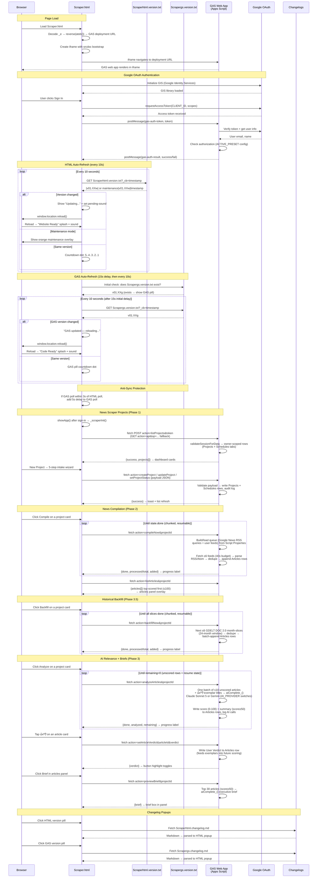

# Scraper.html — GAS Integration Sequence Diagram (Auth)

Sequence diagram showing the dual polling systems (HTML + GAS) and the iframe injection flow.

> [Open in mermaid.live](https://mermaid.live/edit#pako:eNq9WM1uG8kRfpUCD8YQIkeSbeVAxFrQlFbLQJYEUaYXCAOhOV0cdtTTPe7uIU17DeQUwIcE2CD3vWxeTE-wjxBU9wz_SQlYJBf_TFdVV3311U_zSy3RHGutmsWPBaoEzwRLDcsGCgAgZ8aJRORMOXhr9NSi2Tz44e7dJTALvcSwHE08dpncItVfkiGReILGCq1i98ltil8si6f2CeF2j6Tprw84hHae_3FoTqN2nnsTInf1LUpapxK9XvjXdbtw4025jg-uM2YqRalTO1BB5ko7BD1BUyHTICBacMNShEvNeBArD5unp-GYTrZARYdzmTOkpMA9wuPf_wUGKXiMmNPDqF733yhUjrnUswyVg_e3l1vMdAwyhyBGhmUIU-HGYE3CdQJDrZ11huUrWhftXquSVmwiUubQgtNbb7po95rN09MyvJb3aIpDYHkOBhVHY0Go0txuzAL2rZUcAP2ByomEOaHVqo-lfFcJJ5gUnxEuuj2ISv0uJz03gx6aiUjQlokPx805NKQjxdAwMwOpGccd2Xpv0UAiRfJgoSdSBd3t7hiqHuvaSYLW3ukHVFHnsnt-dXffPWuATXS-05WgA46UwGCCYlJ5s5yXXFv3Dq1lKUYps01WuHHTKzWCbn2Rl4VffTRiNCuNH0CKDgoKSaiRXnfHX-MDxowJ2QDlM7dklAQ6Y0wegG7XRnz2CYKo3bnr9s_vb27Pe-d3kGg1Eml9hSch1q1BGLSFdA2whUficMSErO-psn4rtJx24XTzFkcG7RgiKpIZHB9VMEutczgvP4LFRCtuw9FyofRbcHF-t6svfXefDN84kaF1LMuXtPuLmH6aHB3HP_44_Qm0gYwJ5VAxleD8-xZ9Jh2lhq6BxHcWvjjcqOPeWE9hUHufc-aESuM4HtTgACw6yFFxodKm1YXabmJeoFOhuJ7GUoeqig0S8aP6qtZ6Adx6Kd9zBrUPOLTCIdwi47NBDWwumR2TK6vXo7QI7xZQQKY57vfOx6gNQbEMok-9ZLM12z1qUWWe9gDX0YVyXE8VcO1acBLHr-P4VRy_jOPjJYuV6_4fOxtVP_S4VdYdn1jgKNmsAdSyYJ2FVQX35x0LEiqgFnCNO-Yb4Cdh3Xdl-SwxLRAqhcgLWJ8US7iRX7mQch_1IWIjhwbIY1G64j2vbxTFxWpRrHq3qyS2OLrKd3Jy8mzOD2okXxDlkcPj3_4Nga8V___nXO_QBH4W0Z9JxipJkCyz8rk0JBueg23lRLM3UwncGO0w2ZiQ4bbuKFyopfSTXyh4ZUGPQuukzw3akRjnUFGYJn2ls6cOaAhc4XROXvLjr5g4C9HNmFmE4_oWf4in7TyP6hBoaEWqmkJ5sO9tsEQVEtU3R98IXTKGm-veHTAf7xsprKuufeGHm1_4iLSlBMvFC52_ieMYRkzKIUse6huzbMKkIIL10FLyvtfmjDnmfdJThabpBzcHCt1fMA_1AHrJGHkhaUFiQ7tt2H0pB1oD8lLtz3_56o1zZsdDzQyHhJlqKq2z8QqnFbRe6aRpHeYglGMPtM19ZobvwqoEIfELYGXksCyn-f8pJIsVkD3HXGEhytnMl8GfetdXm5D1S8igEiPXpoamwgIcMrzAh-JqACu4cCB1ugepgI7TzDo4AEoymNBpn8PHjs5yIcuNJFDxZX07th3a6EoFBK2AVTnyGVlqo--VExKsYw5jrhVClIwL9YC8AbS3ZGwocUsH3UxFuOtKT1-UN3WX-sgSwG8LIfmhh_ZjgQXOV1sf422vR-B-LNAIJBr6bW6EyG0dRkZn5XuHkpGjcQLt1lu-9749fvv1D0EZotdHFoYFT9GFF0bOjEW667bXO2w7nQXmIi_y8CxhOS0f0KaXUpXm1bsW-SXkfBlQlpEfOu2YbADjHHlIem50amgPlmyIcqkR7kWVKFI5sI7rqgeslKISdDqnyjbIYSSMdRA9fvv1-OioTuH60KqYcqZQLnaQvRz8QVinjUiYhLcseRhRqy9p-Co-2UvEufzTTGRSgpX0soHfQ8dheePTfLzCTy4Q5eLs_PIOzq478DI-gkwrN24GV3xvfPm66b-Vw7e-xheSGTKXjJv_J-LsTVa7S9MeJ37HPIC3RuBoPsBe7U1WWzE5-_ycrmHoHaWESt8cQVSoknJkFN6EdGHoLM_JGAvX7mL7WtauFYJHm0a-ZzfMHajYTRk5gN9--fkfh7_98vM_AT9hlktmwAlHefGVIKhJSnR4H_ny6EhWcISeVgodnNCb5wIzoQRE7e79ze11v3t2fgt2Klwynr9517z74OeFdweioyaVHu1WRZbRezzyB4_f_nMSKtLpVa40aIpQBhMm5RPMKVHz5VEm4xn9Zj3xdyxfwokSryoUlzK_M3UWqybVR8NF4l6Uyl3-YhK-bMzZAJF_jZdKsIaDL7rQvKvM0WbvNIwKV5iAr1Bb3-FfymsDFsPCOa1gLNKxFOmYbkpTiXZvy6KKoR94VnvlE0jkBicCp155W78ude50Dq-OFqaXGVH1khVmEgJJ4cQEYUi2t4XsD8qAvfND_YkCKP3e1S46FHL14x_c6LzI9wLj9-vqnUP7_gokZC3M3uVfHJLKfpyVYHQuF56_Y-bBPxfmY5kTF8pFPi_yyvntDi2_u572J7W_15tao5ahyZjgtVbty6DmxpjhoNYa1DiOWCHdoPa11qixwml6xtRazhTYqIXdtPz1OXz8-l_oBXXz)

```mermaid
sequenceDiagram
    participant Browser
    participant HTML as Scraper.html
    participant HV as Scraperhtml.version.txt
    participant GV as Scrapergs.version.txt
    participant GAS as GAS Web App<br>(Apps Script)
    participant Google as Google OAuth
    participant CL as Changelogs

    Note over Browser,HTML: Page Load
    Browser->>HTML: Load Scraper.html
    HTML->>HTML: Decode _e → reverse(atob()) → GAS deployment URL
    HTML->>HTML: Create iframe with srcdoc bootstrap
    HTML->>GAS: iframe navigates to deployment URL
    GAS-->>Browser: GAS web app renders in iframe

    Note over Browser,Google: Google OAuth Authentication
    HTML->>Google: Initialize GIS (Google Identity Services)
    Google-->>HTML: GIS library loaded
    Browser->>HTML: User clicks Sign In
    HTML->>Google: requestAccessToken(CLIENT_ID, scopes)
    Google-->>HTML: Access token received
    HTML->>GAS: postMessage(gas-auth-token, token)
    GAS->>Google: Verify token + get user info
    Google-->>GAS: User email, name
    GAS->>GAS: Check authorization (ACTIVE_PRESET config)
    GAS-->>HTML: postMessage(gas-auth-result, success/fail)

    Note over Browser,HV: HTML Auto-Refresh (every 10s)
    loop Every 10 seconds
        HTML->>HV: GET Scraperhtml.version.txt?_cb=timestamp
        HV-->>HTML: |v01.XXw| or maintenance|v01.XXw|timestamp
        alt Version changed
            HTML->>HTML: Show "Updating..." + set pending-sound
            HTML->>Browser: window.location.reload()
            Browser->>HTML: Reload → "Website Ready" splash + sound
        else Maintenance mode
            HTML->>Browser: Show orange maintenance overlay
        else Same version
            HTML->>HTML: Countdown dot: 5..4..3..2..1
        end
    end

    Note over Browser,GV: GAS Auto-Refresh (15s delay, then every 10s)
    HTML->>GV: Initial check: does Scrapergs.version.txt exist?
    GV-->>HTML: v01.XXg (exists → show GAS pill)
    loop Every 10 seconds (after 15s initial delay)
        HTML->>GV: GET Scrapergs.version.txt?_cb=timestamp
        GV-->>HTML: v01.XXg
        alt GAS version changed
            HTML->>HTML: "GAS updated — reloading..."
            HTML->>Browser: window.location.reload()
            Browser->>HTML: Reload → "Code Ready" splash + sound
        else Same version
            HTML->>HTML: GAS pill countdown dot
        end
    end

    Note over HTML,GV: Anti-Sync Protection
    HTML->>HTML: If GAS poll within 3s of HTML poll,<br>add 5s delay to GAS poll

    Note over Browser,GAS: News Scraper Projects (Phase 1)
    HTML->>HTML: showApp() after sign-in → _scraperInit()
    HTML->>GAS: fetch POST action=listProjects&token<br>(GET action=api&op=... fallback)
    GAS->>GAS: validateSessionForData → owner-scoped rows<br>(Projects + Schedules tabs)
    GAS-->>HTML: {success, projects[]} → dashboard cards
    Browser->>HTML: New Project → 5-step intake wizard
    HTML->>GAS: fetch action=createProject / updateProject /<br>setProjectStatus (payload JSON)
    GAS->>GAS: Validate payload → write Projects +<br>Schedules rows, audit log
    GAS-->>HTML: {success} → toast + list refresh

    Note over Browser,GAS: News Compilation (Phase 2)
    Browser->>HTML: Click Compile on a project card
    loop Until state.done (chunked, resumable)
        HTML->>GAS: fetch action=compileNow&projectId
        GAS->>GAS: Build/load queue (Google News RSS<br>queries + user feeds) from Script Properties
        GAS->>GAS: Fetch ≤6 feeds (40s budget) → parse<br>RSS/Atom → dedupe → append Articles rows
        GAS-->>HTML: {done, processed/total, added} → progress label
    end
    HTML->>GAS: fetch action=listArticles&projectId
    GAS-->>HTML: {articles[]} top-scored first (≤100)<br>→ articles panel overlay

    Note over Browser,GAS: Historical Backfill (Phase 3.5)
    Browser->>HTML: Click Backfill on a project card
    loop Until all slices done (chunked, resumable)
        HTML->>GAS: fetch action=backfillNow&projectId
        GAS->>GAS: Next ≤6 GDELT DOC 2.0 month-slices<br>(24-month window) → dedupe →<br>batch-append Articles rows
        GAS-->>HTML: {done, processed/total, added} → progress label
    end

    Note over Browser,GAS: AI Relevance + Briefs (Phase 3)
    Browser->>HTML: Click Analyze on a project card
    loop Until remaining=0 (unscored rows = resume state)
        HTML->>GAS: fetch action=analyzeArticles&projectId
        GAS->>GAS: One batch of ≤10 unscored articles<br>+ 👍/👎 exemplar titles → aiComplete_()<br>Claude Sonnet 5 or Gemini (AI_PROVIDER switches)
        GAS->>GAS: Write score (0-100) + summary (score≥50)<br>to Articles rows, log AI calls
        GAS-->>HTML: {done, analyzed, remaining} → progress label
    end
    Browser->>HTML: Tap 👍/👎 on an article card
    HTML->>GAS: fetch action=setArticleVerdict&articleId&verdict
    GAS->>GAS: Write User Verdict to Articles row<br>(feeds exemplars into future scoring)
    GAS-->>HTML: {verdict} → button highlight toggles
    Browser->>HTML: Click Brief in articles panel
    HTML->>GAS: fetch action=previewBrief&projectId
    GAS->>GAS: Top 30 articles (score≥50) →<br>aiComplete_() executive brief
    GAS-->>HTML: {brief} → brief box in panel

    Note over Browser,CL: Changelog Popups
    Browser->>HTML: Click HTML version pill
    HTML->>CL: Fetch Scraperhtml.changelog.md
    CL-->>HTML: Markdown → parsed to HTML popup

    Browser->>HTML: Click GAS version pill
    HTML->>CL: Fetch Scrapergs.changelog.md
    CL-->>HTML: Markdown → parsed to HTML popup
```

## Key Design Notes

- **GAS iframe injection** — the deployment URL is stored as a reversed+base64-encoded string in `_e`. The iframe uses `srcdoc` with a bootstrap script that reads the URL from `parent._r`, deletes it, then navigates — preventing the URL from being visible in page source
- **Dual polling** — HTML and GAS versions are polled independently with anti-sync protection (if polls align within 3s, GAS poll gets a 5s delay to re-stagger them)
- **Two splash screens** — green "Website Ready" for HTML version changes, blue "Code Ready" for GAS version changes
- **Audio unlock via UAv2** — since the GAS iframe covers the entire page, click events don't reach the parent document. The UAv2 poll detects `navigator.userActivation.hasBeenActive` (propagated from cross-origin iframe clicks) and unlocks AudioContext without needing a direct click on the parent

Developed by: LightAISolutions
