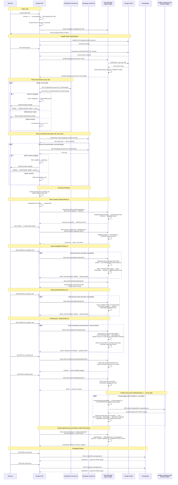

# Scraper.html — GAS Integration Sequence Diagram (Auth)

Sequence diagram showing the dual polling systems (HTML + GAS) and the iframe injection flow.

> [Open in mermaid.live](https://mermaid.live/edit#pako:eNq9Wc1uG0cSfpUCD8YQJkc_tvZArB3QFE1zYUsCKcsBwkDomSkOO2p2d7p7SNOOF3taIIddIIu955J9htzzKH6CPMKiumf4L1pAsHuxpZmq7qqvvvobfaylKsNaq2bx-wJliuec5YZNRxIAQDPjeMo1kw5eGDW3aHZfvLp-8xqYhWFqmEYTT9xU7JG6WZMhkXiGxnIlY_fe7Yr31sVz-wXh9pCk6b93mEBb6z8n5nnU1tofwbWr71FSKhfo9cJPl-3CTXblOt65zoTJHIXK7a7EoNsjEW3UmAs0zVRNNZMcbfydVdKb0uPuVZHAFcvR1kcynHGhHIKaoamwbRCULS8FrxXLglj5svn8eXhNb_aATS-XMudIYYVbhM9__xcYJPgwYk4lUb3unxFYGWqhFlOUDt4OXu85pmOQOQQ-NmyKMOduAtakmUohUcpZZ5je0Oq1h61KWrIZz5lDC07tvanXHjabz5-X7rW8RXNMgGkNBmWGxgKX5XH3Yxai19qIItA_KB1PmeNKbtpYyvcld5wJ_gGh1x9CVOr3M9JzCxiimfHUh8tb6183l9CQjuCJYWYBQrEM74nWW4sGUsHTOwtDnkvo7zfHUP5Z105TtPZa3aGMOq_73Yvr2_55A2yq9L2mBB1wpAQGU-Szypr1uGhl3Ru0luUY5cw2WeEmTa_UCLr1VVxWdt2g4eNFefhjyNFBQS5xOVbb5vhrvMM4ZVw0QPrIrR1KAp0JpndAtyvDP_gAQdTuXPdvurdXg-6wew2pkmOe1zd4Enzd64RBWwjXAFt4JI7GjItDWXbTCkWrXTjVHODYoJ1AREmygJPjCmahlIZu-RAspkpmZfavJ8pNC3rd6_sq21e3afLM8Slax6Z6Tftm5dMPs-OT-Ouv5z-AMjBlXDqUTKa4fL5HnwlHoaFrIPW1KVu93Mnj4UTNYVR7qzPmuMzjOB7V4DFYdKBRZlzmTasKuf-IZYLOuczUPBYqZFVskIgf1Te1thNg4KV8zRnV3mFiuUMYIMsWoxpYLZidkCmb16OwCG9WUMBUZXjYOu-jMgTFOog-9IItts4eUokq43QAuI4qpMvUXEKmXAvO4vhpHD-J49M4Plk7sTLd_3BvoboJNW6TdSdnFjIUbNEAKlmwzcIqg2-WFQtSSqAWZArv6ZCA77l1X5Xps8a0QKgcIi9gfVAs4UZ2aS7EIepDxMYODZDFvDTFW17fSYreZlJsWndfSuwxdJPvZOTswZwf1Ui-IMpjBp__9m8IfK34_z_neoc68IOI_kAyVkGCdJ2VD6UhneE52JaON4cLmcKVUQ7TnQ4ZbuuPw4VKCN_5uYQnFtQ4lE563KDRhmUZVBSmTl_pHMgDagIXOF-Sl-z4DlNnIbqaMItwUt9jD_G0rXVUh0BDy3PZ5NKDfWvDSZQhUX239Y3RpRO4uhxeA_P-PhPcuuraR765hTmtu5Rgmj9S-lkcxzBmQiQsvavv9LIZE5wINkRLwXupzDlzzNuk5hJN0zfuDMh1f8HS1ccwTCeYFYIGJJbYfc3uY9nQGjRberVvvv3kD8-YnSSKmQxSZqqutM3GC5xX0Hqls6Z1qIFLx-5omvvATHYfViUIqR8Aq0OOynRa_k4uWayAHDrmCguRZgufBn8ZXl7sQnZTQgaVGJk2N9QVVuDQwSt8yK8GsCLjDoTKDyAV0HGKWQePgYIMJlTah_Cxo6aai3IiCVQ8re_HtkMTXamAoCSwKkY-Imtl9K10XIB1zGGcKYkQpZNC3mHWAJpbpiwRuKeC7oYi3HWh5o_Km_prdWQN4BcFF9mRh_b7Agtcjrbex8FwSOB-X6DhSDT009wYMbN1GBs1LTcmCoZG4zjavbe89LZ9_vGXPwVliJ4eW0iKLEcXNgzNjEW6azAcHrWdmgbmYlbosJYwTcMHtGmTqsK8edcqvoScTwOKMmZHTjkmGsCyDLMQdG1UbmgOFixBsVYID6JKFKkM2MZ10wJWSlEKOqUpsw1mMObGOog-__jLyfFxndz1rlU-aSZRrGaQgxx8xa1ThqdMwAuW3o2p1Jc0fBKfHSTiUv7LTGRCgBW02cAfoWNS3vhlPl7gexeI0jvvvr6G88sOnMbHMFXSTZrBFF8bT582_bOy-da3-EIyCXPppPl_Is7BYLX71O1x5mfMx_DCcBwvG9iTg8FqSyYWHx5SNQztUZLL_NkxRIUsKUeHwrMQLgyV5SERY-Ha-9i-FbVLieDRppbv2Q1LAyp2U0Qew-8___SPo99__umfgO9xqgUz4LijuPhM4FQkBTq8jXx6dAQrMoShkhIdnNHO08Mplxyidv_2anB50z_vDsDOuUsny513y7p3vl94cyA6blLq0WxVTKe0j0f-xecf_3MWMtKpTa40qItQBFMmxBeYU6Lm06MMxgPqzXbgr5lew4kCLysU1yJ_b-gsVkXqBk3GU_eoVO5nj2bhyU6fDRD5bbxUgi0cfNKF4l1FjiZ7p2BcuMIEfLncu4d_LK8NWCSFc0rChOcTwfMJ3ZTnAu3BkkUZQx94NmvlF5DQBmcc5155X70uda6VhifHq6PXGVHVkg1mEgJp4fgMIaGz97nsX5QOe-MT9Z4cKO3eLhe99rAx6PZa1En9h0HoS4cGrQM_fUcDTKhVQzn0-h3Fopn54TbD9V3slSqMWIAzPM_RQGTpADcxyjmBGQX2r0qmeJRtbGNrgNi0GqfMNaE_QWZcgixMhjYliyrzbJmpkSmkhRfdl5eDLi2noLlGwSWNboVFyDcLT7jNe0xj9PJzaMYcO7rn4-hKe9DtLT8hfVwKUbPVRSJ4ukLRYM6tM4u9fr7VFo1bIu1n6xZInEM4c-H9vbwII-aoduHfzNCwHEc1-O1XEDh2yzsCOo4JhEjSak6LDjrM6qH25QXPqAMcTZm5Q-K95inYMBBxSbY0lRRVUJb1YXstI9PLHaKZ-4WVV1xRetlWTstxYs4NbQ0TtFh_wHyzAuOIPvlUv3Yl9fqsnOLX43-h5nAEpkgMT69Cwu1k2MbbkkQD_2xIqXYb1VtLyJ8ew2-_hkJM8JyeEc7LeOJUT5jlFk78c1sk1vmuenoM0fmT8qa9RagCyX7zbQMEs45o_AmO4KPP94ZfEpmwn-5v5h0qSNXHfbhSutAHy5bffquvELSNbwSATguT8fr3wLQ6P56W8e-8Xnnxhpk7v8wvh2af0OWarQtdGb_foPWvIl-2J7d_1JpaozZFM2U8q7VqH0c1N8EpjmqtUS3DMSuEG9U-1Ro1VjhF0ai1nCmwUQubY_nXpfDw038BvsPLVw)

```mermaid
sequenceDiagram
    participant Browser
    participant HTML as Scraper.html
    participant HV as Scraperhtml.version.txt
    participant GV as Scrapergs.version.txt
    participant GAS as GAS Web App<br>(Apps Script)
    participant Google as Google OAuth
    participant CL as Changelogs
    participant REG as profiler-companies.json<br>(GitHub Pages)

    Note over Browser,HTML: Page Load
    Browser->>HTML: Load Scraper.html
    HTML->>HTML: Decode _e → reverse(atob()) → GAS deployment URL
    HTML->>HTML: Create iframe with srcdoc bootstrap
    HTML->>GAS: iframe navigates to deployment URL
    GAS-->>Browser: GAS web app renders in iframe

    Note over Browser,Google: Google OAuth Authentication
    HTML->>Google: Initialize GIS (Google Identity Services)
    Google-->>HTML: GIS library loaded
    Browser->>HTML: User clicks Sign In
    HTML->>Google: requestAccessToken(CLIENT_ID, scopes)
    Google-->>HTML: Access token received
    HTML->>GAS: postMessage(gas-auth-token, token)
    GAS->>Google: Verify token + get user info
    Google-->>GAS: User email, name
    GAS->>GAS: Check authorization (ACTIVE_PRESET config)
    GAS-->>HTML: postMessage(gas-auth-result, success/fail)

    Note over Browser,HV: HTML Auto-Refresh (every 10s)
    loop Every 10 seconds
        HTML->>HV: GET Scraperhtml.version.txt?_cb=timestamp
        HV-->>HTML: |v01.XXw| or maintenance|v01.XXw|timestamp
        alt Version changed
            HTML->>HTML: Show "Updating..." + set pending-sound
            HTML->>Browser: window.location.reload()
            Browser->>HTML: Reload → "Website Ready" splash + sound
        else Maintenance mode
            HTML->>Browser: Show orange maintenance overlay
        else Same version
            HTML->>HTML: Countdown dot: 5..4..3..2..1
        end
    end

    Note over Browser,GV: GAS Auto-Refresh (15s delay, then every 10s)
    HTML->>GV: Initial check: does Scrapergs.version.txt exist?
    GV-->>HTML: v01.XXg (exists → show GAS pill)
    loop Every 10 seconds (after 15s initial delay)
        HTML->>GV: GET Scrapergs.version.txt?_cb=timestamp
        GV-->>HTML: v01.XXg
        alt GAS version changed
            HTML->>HTML: "GAS updated — reloading..."
            HTML->>Browser: window.location.reload()
            Browser->>HTML: Reload → "Code Ready" splash + sound
        else Same version
            HTML->>HTML: GAS pill countdown dot
        end
    end

    Note over HTML,GV: Anti-Sync Protection
    HTML->>HTML: If GAS poll within 3s of HTML poll,<br>add 5s delay to GAS poll

    Note over Browser,GAS: News Scraper Projects (Phase 1)
    HTML->>HTML: showApp() after sign-in → _scraperInit()
    HTML->>GAS: fetch POST action=listProjects&token<br>(GET action=api&op=... fallback)
    GAS->>GAS: validateSessionForData → owner-scoped rows<br>(Projects + Schedules tabs)
    GAS-->>HTML: {success, projects[]} → dashboard cards
    Browser->>HTML: New Project → 5-step intake wizard
    HTML->>GAS: fetch action=createProject / updateProject /<br>setProjectStatus (payload JSON)
    GAS->>GAS: Validate payload → write Projects +<br>Schedules rows, audit log
    GAS-->>HTML: {success} → toast + list refresh

    Note over Browser,GAS: News Compilation (Phase 2)
    Browser->>HTML: Click Compile on a project card
    loop Until state.done (chunked, resumable)
        HTML->>GAS: fetch action=compileNow&projectId
        GAS->>GAS: Build/load queue (Google News RSS<br>queries + user feeds) from Script Properties
        GAS->>GAS: Fetch ≤6 feeds (40s budget) → parse<br>RSS/Atom → dedupe → append Articles rows
        GAS-->>HTML: {done, processed/total, added} → progress label
    end
    HTML->>GAS: fetch action=listArticles&projectId
    GAS-->>HTML: {articles[]} top-scored first (≤100)<br>→ articles panel overlay

    Note over Browser,GAS: Historical Backfill (Phase 3.5)
    Browser->>HTML: Click Backfill on a project card
    loop Until all slices done (chunked, resumable)
        HTML->>GAS: fetch action=backfillNow&projectId
        GAS->>GAS: Next ≤6 GDELT DOC 2.0 month-slices<br>(24-month window) → dedupe →<br>batch-append Articles rows
        GAS-->>HTML: {done, processed/total, added} → progress label
    end

    Note over Browser,GAS: AI Relevance + Briefs (Phase 3)
    Browser->>HTML: Click Analyze on a project card
    loop Until remaining=0 (unscored rows = resume state)
        HTML->>GAS: fetch action=analyzeArticles&projectId
        GAS->>GAS: One batch of ≤10 unscored articles<br>+ 👍/👎 exemplar titles → aiComplete_()<br>Claude Sonnet 5 or Gemini (AI_PROVIDER switches)
        GAS->>GAS: Write score (0-100) + summary (score≥50)<br>to Articles rows, log AI calls
        GAS-->>HTML: {done, analyzed, remaining} → progress label
    end
    Browser->>HTML: Tap 👍/👎 on an article card
    HTML->>GAS: fetch action=setArticleVerdict&articleId&verdict
    GAS->>GAS: Write User Verdict to Articles row<br>(feeds exemplars into future scoring)
    GAS-->>HTML: {verdict} → button highlight toggles
    Browser->>HTML: Click Brief in articles panel
    HTML->>GAS: fetch action=previewBrief&projectId
    GAS->>GAS: Top 30 articles (score≥50) →<br>aiComplete_() executive brief
    GAS-->>HTML: {brief} → brief box in panel

    Note over GAS,REG: Profiler Interest Sync (Rebuild Phase 1 — server side)
    loop Hourly trigger (sync throttled to ~once/day)
        GAS->>GAS: scSchedulerTick heartbeat → scSyncInterests_()<br>(runs BEFORE the pipeline pause gate)
        GAS->>REG: GET profiler-data/profiler-companies.json
        REG-->>GAS: {companies[]} public Profiler registry
        GAS->>GAS: Upsert Interests tab: new company → ON +<br>"New coverage" · left registry → stale (never deleted)<br>+ guidance/market topic seeds (insert-only)
    end
    Note over HTML,GAS: Session-gated interest ops (Phase 2 panel wires these)
    HTML->>GAS: fetch action=listInterests / setInterestEnabled /<br>syncInterestsNow / rubricPreview
    GAS->>GAS: rubricPreview → scRubricScore_(): company 40 ·<br>topic 25 · Profiler emphasis 15 · substance 20 (D3 rubric)
    GAS-->>HTML: {interests[], lastSync} / {score, signals}

    Note over Browser,CL: Changelog Popups
    Browser->>HTML: Click HTML version pill
    HTML->>CL: Fetch Scraperhtml.changelog.md
    CL-->>HTML: Markdown → parsed to HTML popup

    Browser->>HTML: Click GAS version pill
    HTML->>CL: Fetch Scrapergs.changelog.md
    CL-->>HTML: Markdown → parsed to HTML popup
```

## Key Design Notes

- **GAS iframe injection** — the deployment URL is stored as a reversed+base64-encoded string in `_e`. The iframe uses `srcdoc` with a bootstrap script that reads the URL from `parent._r`, deletes it, then navigates — preventing the URL from being visible in page source
- **Dual polling** — HTML and GAS versions are polled independently with anti-sync protection (if polls align within 3s, GAS poll gets a 5s delay to re-stagger them)
- **Two splash screens** — green "Website Ready" for HTML version changes, blue "Code Ready" for GAS version changes
- **Audio unlock via UAv2** — since the GAS iframe covers the entire page, click events don't reach the parent document. The UAv2 poll detects `navigator.userActivation.hasBeenActive` (propagated from cross-origin iframe clicks) and unlocks AudioContext without needing a direct click on the parent

Developed by: LightAISolutions
