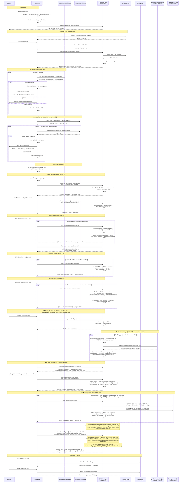

# Scraper.html — GAS Integration Sequence Diagram (Auth)

Sequence diagram showing the dual polling systems (HTML + GAS) and the iframe injection flow.

> [Open in mermaid.live](https://mermaid.live/edit#pako:eNq9WtuOGzcS_ZWCHpIWRpe52AlWWDuQJWWsxdwgyeMsMsGAapa6maHINsmWLDte7NMCftgFstj3vCTfkPd8ir8gn7Aoslu30VyAYPcl1nSzyKpTp27svK_EmmOlVbH4JkcVY1ewxLDplQIAyJhxIhYZUw5eGD23aG6_eDk6PQFmYRgblqFppG4qd6y6XFtDSxozNFZo1XBv3e3lx-vLE_vA4vaQVtM_r3EM7Sz789g8j9pZ5rcQmavuENI6kejlwq_zdu7S2-s63rhOylSCUif29opB75iWZEZPhERTj_U0Y0qgbXxvtfKqHAv3Mh_DBUvQ7tDlde8F7TAyjGM9M2gtDIZD2CPZQrsznNsrFUTPtEPQMzSlU2rkg5bfHk4042FZ8bL-_Hl4TW92eIleLtd0kfgA1wif_vFvMEi4Y8ScHkfVqn9GKHPMpF5MUTl4NTjZsU3HIHMIYmLYFGEuXArWxFzHMNbaWWdYtiF13B62ytWKzUTCHFpweudJx-1hvf78eWFey2s0xzGwLAODiqOxIFSx3d2YBWBbG-4H-g8qJ2LmhFabOhbr-0o4waR4h3DcH0JUyPc5ybkFDNHMRLz0c3hdX0JDMlKMDTMLkJpxvMNbrywaiKWIbywMRaKgv1sdQ4FrXTuO0dqRvkEVdU76vbPRdb9bAxvr7E5Vggw4EgKDMYpZqc26XzJt3SlayxKMEmbrLHdp3QvVgmx15ZeVXpdoxGRRbL4HCTrIySShJnpbHX-MNxinTMgaKO-5tU1pQSfF-AbodG3EO-8giNqdUf-yd30x6A17I4i1moikusGTYOtOIwzaXLoa2Nwj0ZwwIav3RNllK2S7du50fYATgzaFiIJkAQf7JcxS6wx6xUOwGGvFi7SxHiiXLTjuje5KiV9dx-NnTkzROjbN1qQvVzb9MNs_aHzzzfwH0AamTCiHiqkYl893yDPpyDV0DMQ-qfHVy1txPEz1HK4qrzLOnFBJo9G4qsAeWHSQoeJCJXWrc7V7i2WAzoXiet6QOkRVwyARP6puSm0HwMCv8jnnqvIax1Y4hAEyvriqgM0ksympsnk8SotwuoICpprj_dp5G7UhKNZB9K6XbLG195BSVOGne4Dr6Fw5rucKuHYteNpoPGk0jhqNw0bjYG3HUnX_485EdRly3CbrDp5a4CjZogaUsmCbhWUEXy4zFsQUQC3gGu8orYBvhXVfFeGzxrRAqAQiv8B6p1jCjfTKhJT3UR8iNnFogDQWhSpe8-qtoDjeDIpN7e4KiR2KbvKdlJw9mvNXFVqfE-WRw6e__wcCX0v-_8-53qEK_CiiP5KMpZMgXmflY2lIe3gOtpUT9eFCxXBhtMP4VoUMp_Un4UAtpa_8QsGRBT0JqZMe16ivYZxDSWGq9KXMPXFARYD6oJIepMf3GDsL0UXKLMJBdYc-xNN2lkVVCDS0IlF1oTzY1zbsRBESVW-Xvgm6OIWL8-EImLf3mRTWlcd-5otbaPB6yxUsE5_p7Fmj0YAJk3LM4pvqrVo2Y1IQwYZoyXlfa9Nljnmd9FyhqfvCzYFM9wcsTd2DYZwizyU1SGxsdxW790VBq1FT6sW-_e6D35wzm441MxxiZsqqtM3GM5yX0Hqhp3XrMAOhHLuhbu4dM_wurAoQYt8Alps0i3Ba_k0mWSyBHDrmcgtRxhY-DP4yPD-7DdllARmUy0i1uaGqsAKHNl7hQ3bVgOVcOJA6uQepgI7TzDrYA3IymJBpH8PHjp5mQhYdSaDiYXU3th3q6AoBBK2AlT7yHllLo6-UExKsYw4bXCuEKE5zdYO8BtS3TNlY4o4MetsV4awzPf-sOKm_lkfWAH6RC8mbHto3Oea4bG29jYPhkMB9k6MRSDT03dwEkdsqTIyeFqMWOSND4wTanad87XX79PHnL4IwRE_2LYxznqALE0bGjEU6azAcNttOTwNzkedZGEtYRs0HtGmAKt28edbKv4ScDwPyMvKm047JGjDOkQenZ0YnfuSSbIxyLRHeiypRpFRgG9dNDVixikLQ6Ywi2yCHiTDWQfTp488H-_tVMtebVtqUMYVy1YPcy8GXwjptRMwkvGDxzYRSfUHDo8bTe4m4XP8wE5mUYCVNNvBH6DguTnyYj2f41gWiHHd7JyPonnfgsLEPU61cWg-q-Nx4-KTunxXFt7rFF1ozZi5O6_8n4tzrrHafqj3OfI-5By-MwMmygB3d66y2YnLx7jFZw9AcpYRKnu1DlKuCcrQpPAvuwpBZHuMxFo69i-1bXjtXCB5tKvme3bBUoGQ3eWQPfv_px382f__px38BvsVpJpkBJxz5xUeCoCQp0eF15MOjI1nOEYZaKXTwlGaeY5wKJSBq968vBueX_W5vAHYuXJwuZ94t7V77euHVgWi_TqFHvVU-ndI8HvkXnz7-8jREpNObXKlRFSEPxkzKB5hToObDo3DGI_LNHaRZQWX8IAav-mDQCQJ1vACOsfDdbfdoVX-odSUjZmi4iB0YnTufuNNVuphpekQ3TmhmyMH_Y-pWlEPTHVmDSEt3LJvp6oGUmRmcCZx74V0ps5AZ6QyO9ldbrzulDOcNchB94tyJGcKY9t6VhP2LgL__CWP9lgwo9N4G_7g9rA16xy0qZv5SD_rKoUHrwDfA0QDHVC2h6Dv9mBDAAwJvfRx6qXMjF-CMSBI0EFnawKVGOyeRU-v7N61ibPKNgWgNEBuXHY0ZEfopMuPGyEJzZmPSqFTPFsESmVxZeNH7-nzQo_kQMpGhFIq6p9wiJJuxH07zFlMnu7zK5Myx5h0XmyvpQe94eYvzfrmI6l2Wj6WIVygaTIR1ZrHTzleZReOWSPv2tgUK5xD2XHh7z89Cl3dVOfNvZmhYglcV-O1XkDhxyzMCOo5JhEjRdEyzBjrk1ZB-nM5E3LSY0O1i0-rcxAg2tCRCkSp1rWTpk4ci9LUwCF20N2v6D5iQ21Q5rD6isVhuESYMiLQqx5ad7b4o13_7XQ0ks44oEdg-9HbZZqd0i--9h8Fq2xwRCHQFmCQSbQ0mkiW2BjFzmGizgDgVma2B5-yq0mxnhZEXB6ag1ASaIVCUntNPn28ZMZcTCR-AwOISgZ6ivoIXE8M60c_8ziYfGxFfhMxyK5VsvC2iZeCfeY2uo2prya0n-_DbryHpZyKGw6dEqCVxcZqlzAoLB_65zcfW-Qp-uA9R96g4qWBWwSkfZBDpyaRePikPU9RRv0Ojke90KAazP0AT3odLSv_TZ8KapwKTxcxiiGRhvLrnA8Hr3osWjFKEU22oFEGPizCubNLzaD1zdUKDBzT9WZ_iriqDXJWDoNLzqwoIRW2VF6hRTaZkkxYpT8Q3hIhWMEe84WwB03C8hU8ff_kSeiOIJOVtKwhLEg1qPIFE1-nNY_oTk6uuSNC6Mz3fTize7jByFJhC9wCMtq4cXiA62gedO4nO-osJ6jibZHLoIw-flH0lRF8epnCq1XqDufPA7iFQm2udzpbfF_wQVfi_Tvfb69NUdHDYNLmiGq143eixUDWgi5r6HEWSuiVNtggeyBz6GVv6hZRr9-EGF_VMC-WK9kaUfZdExiHi6NBQ-2Qd7aBElqFb3ViUldaGe57Qk52RLtBXN-Euhx4F5H2uvqsfosjBGtxg5precdQUUZO03Q8tM8OOZOvN7SJxwiyohdVyRjcgqdF5koKNC0IPMBaZoNx2DSxhQllHvPJJLx_b2IgxfR9ybOwJjSxOfTSHF5BqyS1QiMZ6OhYqzPR6Ahi2p30Et57pnzMpP2_ACSYsXkC3f9wbjq4HvU7_gj6_gM3NTJCOVEXo816hhlZYp1tMmIrEhP1D8XlEYSjRfl-oU_OTdw3e1EBPJhZdDaSYCsoWdFSChQQ0i-K3_DPRJ2KGxc1LExx9QhJByn-DOaF8spK26NriwuiZ4GjobzbDFZ4QmSXs1Z2eW1feIOMWzs9O_gqxlvlUWTiofwF78Kf6waH3SijXpdsKBjY950oJ33BpYMARM2AmTimPxNpzMUWwdDXKLDBP4pRJSbf8ChvwtZAOjVBJDTKWUC5kioceCU29ADZclVpgBkMUbPXFW-ZtwrMHSzg8b6yvBNSp-73iDlOnTLGk8MY1RMPOoH3RG1wXJGp3T_tn1x4hPwrxqVDrzcjWvBFwpY9xfkQNqjfGiyIkPsDejsglVcJlqiP7EyM4NGmwQcUZudhRuoQ9mDLrqHCHSkM3uiRqtJT1PCtxihhd26Byn1uYeIBBqFjmnNKSszBjRrDAjrtKVIfGi_IzO1zoLM_sfUOIN6S81qfr7Y34od1C3l__wBaX-zemRYbpnKyQPGXmxt-OL2-hfHte3FtneVYqv1uh9c8MD-uT2D-qTaVWmaKZMsErrcr7q4pLcYpXldZVheOE5dJdVT5UahWWO029WKXlTI61SugViv_PIzz88F8S7mrj)

```mermaid
sequenceDiagram
    participant Browser
    participant HTML as Scraper.html
    participant HV as Scraperhtml.version.txt
    participant GV as Scrapergs.version.txt
    participant GAS as GAS Web App<br>(Apps Script)
    participant Google as Google OAuth
    participant CL as Changelogs
    participant REG as profiler-companies.json<br>(GitHub Pages)
    participant WEB as Trade-press RSS +<br>Google News

    Note over Browser,HTML: Page Load
    Browser->>HTML: Load Scraper.html
    HTML->>HTML: Decode _e → reverse(atob()) → GAS deployment URL
    HTML->>HTML: Create iframe with srcdoc bootstrap
    HTML->>GAS: iframe navigates to deployment URL
    GAS-->>Browser: GAS web app renders in iframe

    Note over Browser,Google: Google OAuth Authentication
    HTML->>Google: Initialize GIS (Google Identity Services)
    Google-->>HTML: GIS library loaded
    Browser->>HTML: User clicks Sign In
    HTML->>Google: requestAccessToken(CLIENT_ID, scopes)
    Google-->>HTML: Access token received
    HTML->>GAS: postMessage(gas-auth-token, token)
    GAS->>Google: Verify token + get user info
    Google-->>GAS: User email, name
    GAS->>GAS: Check authorization (ACTIVE_PRESET config)
    GAS-->>HTML: postMessage(gas-auth-result, success/fail)

    Note over Browser,HV: HTML Auto-Refresh (every 10s)
    loop Every 10 seconds
        HTML->>HV: GET Scraperhtml.version.txt?_cb=timestamp
        HV-->>HTML: |v01.XXw| or maintenance|v01.XXw|timestamp
        alt Version changed
            HTML->>HTML: Show "Updating..." + set pending-sound
            HTML->>Browser: window.location.reload()
            Browser->>HTML: Reload → "Website Ready" splash + sound
        else Maintenance mode
            HTML->>Browser: Show orange maintenance overlay
        else Same version
            HTML->>HTML: Countdown dot: 5..4..3..2..1
        end
    end

    Note over Browser,GV: GAS Auto-Refresh (15s delay, then every 10s)
    HTML->>GV: Initial check: does Scrapergs.version.txt exist?
    GV-->>HTML: v01.XXg (exists → show GAS pill)
    loop Every 10 seconds (after 15s initial delay)
        HTML->>GV: GET Scrapergs.version.txt?_cb=timestamp
        GV-->>HTML: v01.XXg
        alt GAS version changed
            HTML->>HTML: "GAS updated — reloading..."
            HTML->>Browser: window.location.reload()
            Browser->>HTML: Reload → "Code Ready" splash + sound
        else Same version
            HTML->>HTML: GAS pill countdown dot
        end
    end

    Note over HTML,GV: Anti-Sync Protection
    HTML->>HTML: If GAS poll within 3s of HTML poll,<br>add 5s delay to GAS poll

    Note over Browser,GAS: News Scraper Projects (Phase 1)
    HTML->>HTML: showApp() after sign-in → _scraperInit()
    HTML->>GAS: fetch POST action=listProjects&token<br>(GET action=api&op=... fallback)
    GAS->>GAS: validateSessionForData → owner-scoped rows<br>(Projects + Schedules tabs)
    GAS-->>HTML: {success, projects[]} → dashboard cards
    Browser->>HTML: New Project → 5-step intake wizard
    HTML->>GAS: fetch action=createProject / updateProject /<br>setProjectStatus (payload JSON)
    GAS->>GAS: Validate payload → write Projects +<br>Schedules rows, audit log
    GAS-->>HTML: {success} → toast + list refresh

    Note over Browser,GAS: News Compilation (Phase 2)
    Browser->>HTML: Click Compile on a project card
    loop Until state.done (chunked, resumable)
        HTML->>GAS: fetch action=compileNow&projectId
        GAS->>GAS: Build/load queue (Google News RSS<br>queries + user feeds) from Script Properties
        GAS->>GAS: Fetch ≤6 feeds (40s budget) → parse<br>RSS/Atom → dedupe → append Articles rows
        GAS-->>HTML: {done, processed/total, added} → progress label
    end
    HTML->>GAS: fetch action=listArticles&projectId
    GAS-->>HTML: {articles[]} top-scored first (≤100)<br>→ articles panel overlay

    Note over Browser,GAS: Historical Backfill (Phase 3.5)
    Browser->>HTML: Click Backfill on a project card
    loop Until all slices done (chunked, resumable)
        HTML->>GAS: fetch action=backfillNow&projectId
        GAS->>GAS: Next ≤6 GDELT DOC 2.0 month-slices<br>(24-month window) → dedupe →<br>batch-append Articles rows
        GAS-->>HTML: {done, processed/total, added} → progress label
    end

    Note over Browser,GAS: AI Relevance + Briefs (Phase 3)
    Browser->>HTML: Click Analyze on a project card
    loop Until remaining=0 (unscored rows = resume state)
        HTML->>GAS: fetch action=analyzeArticles&projectId
        GAS->>GAS: One batch of ≤10 unscored articles<br>+ 👍/👎 exemplar titles → aiComplete_()<br>Claude Sonnet 5 or Gemini (AI_PROVIDER switches)
        GAS->>GAS: Write score (0-100) + summary (score≥50)<br>to Articles rows, log AI calls
        GAS-->>HTML: {done, analyzed, remaining} → progress label
    end
    Note over Browser,GAS: 👍/👎 rating UI retired by decision D3 (Phase 2) —<br>verdict routes + historical votes preserved server-side
    Browser->>HTML: Click Brief in articles panel
    HTML->>GAS: fetch action=previewBrief&projectId
    GAS->>GAS: Top 30 articles (score≥50) →<br>aiComplete_() executive brief
    GAS-->>HTML: {brief} → brief box in panel

    Note over GAS,REG: Profiler Interest Sync (Rebuild Phase 1 — server side)
    loop Hourly trigger (sync throttled to ~once/day)
        GAS->>GAS: scSchedulerTick heartbeat → scSyncInterests_()<br>(runs BEFORE the pipeline pause gate)
        GAS->>REG: GET profiler-data/profiler-companies.json
        REG-->>GAS: {companies[]} public Profiler registry
        GAS->>GAS: Upsert Interests tab: new company → ON +<br>"New coverage" · left registry → stale (never deleted)<br>+ topic/segment/source seeds (insert-only)
    end
    Note over Browser,GAS: Wire Desk Interests Rail (Rebuild Phase 2)
    HTML->>GAS: fetch action=listInterests&token (on sign-in)
    GAS-->>HTML: {interests[], lastSync} → Sources/Companies/<br>Segments/Topics toggles, flags, category chips, sync card
    Browser->>HTML: Toggle an interest / Sync now / Score a headline
    HTML->>GAS: fetch action=setInterestEnabled /<br>syncInterestsNow / rubricPreview
    GAS->>GAS: rubricPreview → scRubricScore_(): company 40 ·<br>topic 25 · Profiler emphasis 15 · substance 20 (D3 rubric)<br>+ segment gate (off-segment company news zeroed)
    GAS-->>HTML: {enabled} / {result} / {score, signals} → rail updates

    Note over Browser,WEB: The Morning Edition (Rebuild Phase 3)
    loop Chunked steps — "Run intake now" in-app loop, or the hourly tick<br>on weekday mornings ≥7 ET (live since the Phase 4 go-live)
        HTML->>GAS: fetch action=runDigestNow
        GAS->>WEB: Fetch enabled D1 roster feeds (30 outlets,<br>≤6/step) → 24h window (72h Mon) → dedupe
        GAS->>WEB: D2 backstop: Google News company-name<br>queries (12/run round-robin, down-weighted)
        GAS->>GAS: Rubric scores intake → AI key-point summaries<br>+ lead (deterministic snippet fallback) →<br>sections → Night Ink HTML → Digests tab
        GAS-->>HTML: {phase, kept/fetched, done} → progress line
    end
    Note over GAS: Delivery resolves through scEditionRecipients_ against the<br>Subscribers tab — each subscriber holds any combination of edition<br>ids, or 'all'. Legacy DIGEST_RECIPIENT survives only as the<br>one-time migration source
    HTML->>GAS: fetch action=listDigests {edition, from, q, offset, limit} /<br>getDigest / deleteDigest / goLiveStatus / testAi /<br>emailLatestDigest / setAiProvider / saveSubscriber (recipients)
    Note over GAS: listDigests reads ONLY columns 1-6 + 9-12 — never the<br>Sections/HTML columns — so a deep archive costs the same as a<br>shallow one. Filtering, paging and the per-edition counts are<br>server-side
    Note over GAS: setAiProvider + recipient edits gated by<br>scCanManageDigest_ (SCRAPER_DIGEST_ADMIN_ONLY → admin-only)
    GAS-->>HTML: {digests, total, counts.byEdition} + Night Ink HTML →<br>News Stand grid / calendar / table + masthead rail with<br>roll-up counts (a parent's filter includes its variants)

    Note over Browser,CL: Changelog Popups
    Browser->>HTML: Click HTML version pill
    HTML->>CL: Fetch Scraperhtml.changelog.md
    CL-->>HTML: Markdown → parsed to HTML popup

    Browser->>HTML: Click GAS version pill
    HTML->>CL: Fetch Scrapergs.changelog.md
    CL-->>HTML: Markdown → parsed to HTML popup
```

## Key Design Notes

- **GAS iframe injection** — the deployment URL is stored as a reversed+base64-encoded string in `_e`. The iframe uses `srcdoc` with a bootstrap script that reads the URL from `parent._r`, deletes it, then navigates — preventing the URL from being visible in page source
- **Dual polling** — HTML and GAS versions are polled independently with anti-sync protection (if polls align within 3s, GAS poll gets a 5s delay to re-stagger them)
- **Two splash screens** — green "Website Ready" for HTML version changes, blue "Code Ready" for GAS version changes
- **Audio unlock via UAv2** — since the GAS iframe covers the entire page, click events don't reach the parent document. The UAv2 poll detects `navigator.userActivation.hasBeenActive` (propagated from cross-origin iframe clicks) and unlocks AudioContext without needing a direct click on the parent

Developed by: LightAISolutions
