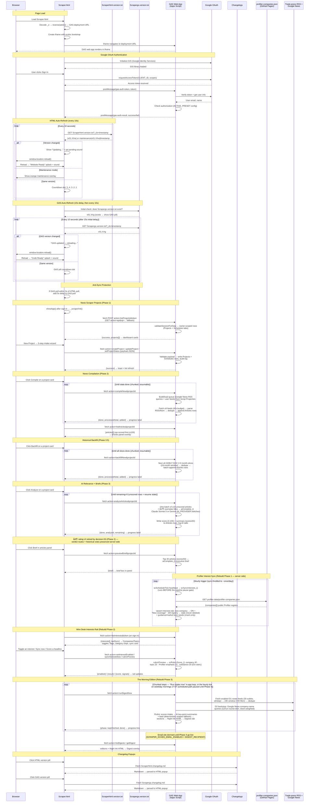

# Scraper.html — GAS Integration Sequence Diagram (Auth)

Sequence diagram showing the dual polling systems (HTML + GAS) and the iframe injection flow.

> [Open in mermaid.live](https://mermaid.live/edit#pako:eNq9WduOGzcS_ZWCHoIWRpe5eDaAsHagkZSxFnODJI8DRMGAapZaXFFkh2RLlh0v9mkBP-wCWex7XpJvyHs-xV-QT1gU2a3baC5AsPtia7pZZF1OVZ1ifyjFmmOpUbL4fYYqxrZgiWGzoQIASJlxIhYpUw7OjF5YNPdfvB5cXgCz0I8NS9HUJm4m96y63VhDS2pzNFZoVXPv3P3l55vLE_vE4mafVtN_b3EEzTT988i8ippp6rcQqSvvEdI6kejlwq_rZuYm99e1vHGtCVMJSp3Y-yt6nXNakho9FhJNNdazlCmBtvZXq5VX5Vy419kIbliCdo8ubztntMPAMI7V1KC10Ov34YBkc-2ucGGHKoheaYeg52iKoFQoBg2_PVxoxsOy_GX11avwmt7siRK9XK1pI-EB7hA-_-PfYJD8jhFzehSVy_4ZeZljKvVyhsrBm97Fnm1aBplDEGPDZggL4SZgTcx1DCOtnXWGpVtS581-o1it2FwkzKEFp_eedN7sV6uvXuXmNbxGCxwBS1MwqDgaC0Ll2z3ss-DYxlb4gf5B5UTMnNBqW8d8fVcJJ5gU7xHOu32IcvkuJzm3hD6auYhXcQ6vqyvXkIwUI8PMEqRmHB-I1huLBmIp4qmFvkgUdPerYyhxrWvGMVo70FNUUeui27ka3HXbFbCxTh9UJciAIyEwGKOYF9psxiXV1l2itSzBKGG2yjI3qXqhSpAtr-Oy1usWjRgv880PIEEHGZkk1FjvquOP8QbjjAlZAeUjt7EpLWhNMJ4Cna6NeO8DBFGzNejedu5uep1-ZwCxVmORlLdwEmzda4RBm0lXAZt5T9THTMjyI1l22wjVrpk5Xe3h2KCdQERJsoSjw8LNUusUOvlDsBhrxfOysZkotw047wweKolf3cWjl07M0Do2Szekb9c2_TA_PKp9883iB9AGZkwoh4qpGFfP98gz6Sg0dAzEvqjx9ct7edyf6AUMS29SzpxQSa1WG5bgACw6SFFxoZKq1Znav8UqQRdCcb2oSR2yqmaQgB-Vt6V2E6DnV_maMyy9xZEVDqGHjC-HJbCpZHZCqmwfj9IiXK5dATPN8XHtvI3akCs2nehDL9lyZ-8-lag8To84rqUz5bheKODaNeC0VntRq53Uase12tHGjoXq_seDheo21Lht1B2dWuAo2bICVLJgF4VFBt-uKhbElEAN4BofaK2A74R1X-Xps4G0AKgEIr_A-qBY8hvplQopH4M-RGzs0ABpLHJVvOble0lxvp0U29o9lBJ7FN3GOyk5fzbmhyVanxHkkcPnv_8HAl4L_P_Psd6iDvwsoD8TjEWQIN5E5XNhSHt4DDaVE9X-UsVwY7TD-F6HDKd1x-FALaXv_ELBiQU9DqWTHleI1zDOoYAwdfpC5pE8oCZAPKiAB-nxV4ydhehmwizCUXmPPoTTZppGZQgwtCJRVaG8s-9s2IkyJCrfb31jdPEEbq77A2De3pdSWFcc-4VvboHgdVYrWCq-0OnLWq0GYybliMXT8r1eNmdSEMD6aCl4X2vTZo55nfRCoan6xs2BTPcHrEw9gH48QZ5JIkhsZPc1uw95Q6sQKfVi33730W_OmZ2MNDMcYmaKrrSLxitcFK71QqdV6zAFoRybEpt7zwx_yFe5E2JPAItN6nk6rf4mkywWjuw75jILUcqWPg3-0r--uu-y29xlUCwj1RaGusLaObTx2j9kVwVYxoUDqZNHPBW84zSzDg6AggwmVNrn4LGlZ6mQOSMJUDwu7_dtixhdLoCgFbAiRj4iG2X0jXJCgnXMYY1rhRDFk0xNkVeAeMuMjSTuqaD3QxHOutKLL_KTuht1ZMPBZ5mQvO5d-32GGa6orbex1--Tc7_P0AgkGHo2N0bktgxjo2f5qEXBSNE4gXbvKV973T5_-vlPQRiiF4cWRhlP0IUJI2XGIp3V6_frTadnAbnIszSMJSwl8gFNGqCKMG-ftY4vec6nAUUZed1px2QFGOfIQ9BToxM_ckk2QrlRCB_1KkGkUGDXr9sasHwVpaDTKWW2QQ5jYayD6POnn48OD8tkrjetsCllCuWagzyKwdfCOm1EzCScsXg6plKfw_CkdvooEFfrn0YikxKspMkG_ggcR_mJT-PxCt-5AJTzdudiAO3rFhzXDmGmlZtUgyq-Nh6_qPpnefMt7-CF1oyYiyfV_xNwHg1Ws0vdHueeYx7AmRE4XjWwk0eD1VRMLt8_p2oYmqOUUMnLQ4gylUOONoWXIVwYKstzIsbCsQ-hfSdq1wrBe5tavkc3rBQo0E0ROYDff_rxn_Xff_rxX4DvcJZKZsAJR3HxmSCoSEp0eBf59GhJlnGEvlYKHZzSzHOOM6EERM3u3U3v-rbb7vTALoSLJ6uZd0e7t75feHUgOqxS6hG3ymYzmscj_-Lzp19OQ0Y6vY2VCnURimDMpHwCObnXfHrkwXhGvXkANGtXGT-IwZsuGHSCnDpaAsdYeHbbPln3H6KuZMQcDRexA6Mz5wv3ZF0u5poe0Y0Tmjly8P-ZqhXF0PRA1SDQ0h3Ldrl6omSmBucCF154X8nMZQY6hZPD9dabQSnSeQscBJ84c2KOMKK99xVh_yL43_-EkX5HBuR67zr_vNmv9DrnDWpm_lIPusqhQevAE-CohyPqlpDzTj8mBOcBOW9zHHqtMyOX4IxIEjQQWdrATYx2TiIn6vs3rWKs862BaMMhNi4YjRmQ9yfIjBshC-TMxqRRoZ7NkyUymbJw1vn6uteh-RBSkaIUithTZhGS7dwPp3mLicmurjI5c6z-wMXmWrrXOV_d4nxYLaJ-l2YjKeK1Fw0mwjqz3Gvnm9SicStPe3rbAIULCHsuvb3XV4HlDUtX_s0cDUtwWILffgWJY7c6I3jHMYkQKZqOadZAh7wcyk-SCU5FuD5jZoqOerOIwQZOIhTpUtVKFkF5KkXfCoPQRjvdMKDHhNzFynH5GcxitUUYMSDSqphb9vJ9Uaz_9rsKSGYdYSLAvVXEoz4gA22oa0ki0VZgLFliKxAzh4k2S4gnIrUV8BBdN5bdIjDw4sAUFOdCPeSF0gv66csrI6BywtwTBltc2dtRRCN4PiBs4vrK72yykRHxTSgk9yrH1ts8OXr-mdfoLio3VlB6cQi__Rp8QWE_PiX8rHCKs3TCrLBw5J_bbGSdb9jHhxC1T_KT9oYCgwkfoQ4fwv2i_-mLWMUHkcl83DAEjzAZPXK3_7Zz1oDBBOFSG-oi0OEiTBrbwDrZLDqtwM2ABjfrq9Ow1MtUMcMpvRiWQChiRF6gQu2U6sQkr1YinpJ3tIIF4pSzJczC8RY-f_rlS-gMqDCHssQhZW4SKguHzDOQoNOL5_ALk6m2SNC6K73YLQze-DAy5I6F9hEYbV0xfEB0cgg6cxKd9RcLxBjrZHfggccvCl4I0ZfHE7jUapMg7j2wfQxEU63T6er7gB-CcvRU6X56cxqKjo7rJlPUYxWvGj0SqgJ00VJdoEgmVHT2lryAzsBHbBEcUq7ZhSkuq6kWyuX0RBS8SSLjEHF0aIj-WEc7KJGm6NY3DkWntOGeJnCqK9IFumoa7mLoUfC8r7UP8RlKBazAFFNX94EjUkMkZ5fPrFJ9T6305nbodh_8RS7XZkafvrbQAomuSjH3ro36rV7zptO767ded9p3nctm9-Kuc9U8u-i04QDa3fNOf3DX67S6N_S14zlVtbC1Tl8jwh97MhhDehFTetBfTw9mLSJLxUdDuNFpltrHKJU_oLikpMu6LXtot5AFm58L4mL_2iz3d-tibcclM1N_17eaqT3ZyG_h0iwtlN-v0Oal6dP6JPaPalOqlGZoZkzwUqP0YVhyE5zhsNQYljiOWSbdsPSxVCmxzGlqNaWGMxlWSqF85l-tw8OP_wWNhEMW)

```mermaid
sequenceDiagram
    participant Browser
    participant HTML as Scraper.html
    participant HV as Scraperhtml.version.txt
    participant GV as Scrapergs.version.txt
    participant GAS as GAS Web App<br>(Apps Script)
    participant Google as Google OAuth
    participant CL as Changelogs
    participant REG as profiler-companies.json<br>(GitHub Pages)
    participant WEB as Trade-press RSS +<br>Google News

    Note over Browser,HTML: Page Load
    Browser->>HTML: Load Scraper.html
    HTML->>HTML: Decode _e → reverse(atob()) → GAS deployment URL
    HTML->>HTML: Create iframe with srcdoc bootstrap
    HTML->>GAS: iframe navigates to deployment URL
    GAS-->>Browser: GAS web app renders in iframe

    Note over Browser,Google: Google OAuth Authentication
    HTML->>Google: Initialize GIS (Google Identity Services)
    Google-->>HTML: GIS library loaded
    Browser->>HTML: User clicks Sign In
    HTML->>Google: requestAccessToken(CLIENT_ID, scopes)
    Google-->>HTML: Access token received
    HTML->>GAS: postMessage(gas-auth-token, token)
    GAS->>Google: Verify token + get user info
    Google-->>GAS: User email, name
    GAS->>GAS: Check authorization (ACTIVE_PRESET config)
    GAS-->>HTML: postMessage(gas-auth-result, success/fail)

    Note over Browser,HV: HTML Auto-Refresh (every 10s)
    loop Every 10 seconds
        HTML->>HV: GET Scraperhtml.version.txt?_cb=timestamp
        HV-->>HTML: |v01.XXw| or maintenance|v01.XXw|timestamp
        alt Version changed
            HTML->>HTML: Show "Updating..." + set pending-sound
            HTML->>Browser: window.location.reload()
            Browser->>HTML: Reload → "Website Ready" splash + sound
        else Maintenance mode
            HTML->>Browser: Show orange maintenance overlay
        else Same version
            HTML->>HTML: Countdown dot: 5..4..3..2..1
        end
    end

    Note over Browser,GV: GAS Auto-Refresh (15s delay, then every 10s)
    HTML->>GV: Initial check: does Scrapergs.version.txt exist?
    GV-->>HTML: v01.XXg (exists → show GAS pill)
    loop Every 10 seconds (after 15s initial delay)
        HTML->>GV: GET Scrapergs.version.txt?_cb=timestamp
        GV-->>HTML: v01.XXg
        alt GAS version changed
            HTML->>HTML: "GAS updated — reloading..."
            HTML->>Browser: window.location.reload()
            Browser->>HTML: Reload → "Code Ready" splash + sound
        else Same version
            HTML->>HTML: GAS pill countdown dot
        end
    end

    Note over HTML,GV: Anti-Sync Protection
    HTML->>HTML: If GAS poll within 3s of HTML poll,<br>add 5s delay to GAS poll

    Note over Browser,GAS: News Scraper Projects (Phase 1)
    HTML->>HTML: showApp() after sign-in → _scraperInit()
    HTML->>GAS: fetch POST action=listProjects&token<br>(GET action=api&op=... fallback)
    GAS->>GAS: validateSessionForData → owner-scoped rows<br>(Projects + Schedules tabs)
    GAS-->>HTML: {success, projects[]} → dashboard cards
    Browser->>HTML: New Project → 5-step intake wizard
    HTML->>GAS: fetch action=createProject / updateProject /<br>setProjectStatus (payload JSON)
    GAS->>GAS: Validate payload → write Projects +<br>Schedules rows, audit log
    GAS-->>HTML: {success} → toast + list refresh

    Note over Browser,GAS: News Compilation (Phase 2)
    Browser->>HTML: Click Compile on a project card
    loop Until state.done (chunked, resumable)
        HTML->>GAS: fetch action=compileNow&projectId
        GAS->>GAS: Build/load queue (Google News RSS<br>queries + user feeds) from Script Properties
        GAS->>GAS: Fetch ≤6 feeds (40s budget) → parse<br>RSS/Atom → dedupe → append Articles rows
        GAS-->>HTML: {done, processed/total, added} → progress label
    end
    HTML->>GAS: fetch action=listArticles&projectId
    GAS-->>HTML: {articles[]} top-scored first (≤100)<br>→ articles panel overlay

    Note over Browser,GAS: Historical Backfill (Phase 3.5)
    Browser->>HTML: Click Backfill on a project card
    loop Until all slices done (chunked, resumable)
        HTML->>GAS: fetch action=backfillNow&projectId
        GAS->>GAS: Next ≤6 GDELT DOC 2.0 month-slices<br>(24-month window) → dedupe →<br>batch-append Articles rows
        GAS-->>HTML: {done, processed/total, added} → progress label
    end

    Note over Browser,GAS: AI Relevance + Briefs (Phase 3)
    Browser->>HTML: Click Analyze on a project card
    loop Until remaining=0 (unscored rows = resume state)
        HTML->>GAS: fetch action=analyzeArticles&projectId
        GAS->>GAS: One batch of ≤10 unscored articles<br>+ 👍/👎 exemplar titles → aiComplete_()<br>Claude Sonnet 5 or Gemini (AI_PROVIDER switches)
        GAS->>GAS: Write score (0-100) + summary (score≥50)<br>to Articles rows, log AI calls
        GAS-->>HTML: {done, analyzed, remaining} → progress label
    end
    Note over Browser,GAS: 👍/👎 rating UI retired by decision D3 (Phase 2) —<br>verdict routes + historical votes preserved server-side
    Browser->>HTML: Click Brief in articles panel
    HTML->>GAS: fetch action=previewBrief&projectId
    GAS->>GAS: Top 30 articles (score≥50) →<br>aiComplete_() executive brief
    GAS-->>HTML: {brief} → brief box in panel

    Note over GAS,REG: Profiler Interest Sync (Rebuild Phase 1 — server side)
    loop Hourly trigger (sync throttled to ~once/day)
        GAS->>GAS: scSchedulerTick heartbeat → scSyncInterests_()<br>(runs BEFORE the pipeline pause gate)
        GAS->>REG: GET profiler-data/profiler-companies.json
        REG-->>GAS: {companies[]} public Profiler registry
        GAS->>GAS: Upsert Interests tab: new company → ON +<br>"New coverage" · left registry → stale (never deleted)<br>+ guidance/market topic seeds (insert-only)
    end
    Note over Browser,GAS: Wire Desk Interests Rail (Rebuild Phase 2)
    HTML->>GAS: fetch action=listInterests&token (on sign-in)
    GAS-->>HTML: {interests[], lastSync} → Companies/Topics<br>toggles, flags, category chips, sync card
    Browser->>HTML: Toggle an interest / Sync now / Score a headline
    HTML->>GAS: fetch action=setInterestEnabled /<br>syncInterestsNow / rubricPreview
    GAS->>GAS: rubricPreview → scRubricScore_(): company 40 ·<br>topic 25 · Profiler emphasis 15 · substance 20 (D3 rubric)
    GAS-->>HTML: {enabled} / {result} / {score, signals} → rail updates

    Note over Browser,WEB: The Morning Edition (Rebuild Phase 3)
    loop Chunked steps — "Run intake now" in-app loop, or the hourly tick<br>on weekday mornings ≥7 ET (scheduled path paused until Phase 4)
        HTML->>GAS: fetch action=runDigestNow
        GAS->>WEB: Fetch enabled D1 roster feeds (30 outlets,<br>≤6/step) → 24h window (72h Mon) → dedupe
        GAS->>WEB: D2 backstop: Google News company-name<br>queries (12/run round-robin, down-weighted)
        GAS->>GAS: Rubric scores intake → AI key-point summaries<br>+ lead (deterministic snippet fallback) →<br>sections → Night Ink HTML → Digests tab
        GAS-->>HTML: {phase, kept/fetched, done} → progress line
    end
    Note over GAS: Email site dormant until Phase 4 go-live<br>(SCRAPER_SCHED_EMAIL_ENABLED + DIGEST_RECIPIENT)
    HTML->>GAS: fetch action=listDigests / getDigest
    GAS-->>HTML: editions + Night Ink HTML → Digest overlay

    Note over Browser,CL: Changelog Popups
    Browser->>HTML: Click HTML version pill
    HTML->>CL: Fetch Scraperhtml.changelog.md
    CL-->>HTML: Markdown → parsed to HTML popup

    Browser->>HTML: Click GAS version pill
    HTML->>CL: Fetch Scrapergs.changelog.md
    CL-->>HTML: Markdown → parsed to HTML popup
```

## Key Design Notes

- **GAS iframe injection** — the deployment URL is stored as a reversed+base64-encoded string in `_e`. The iframe uses `srcdoc` with a bootstrap script that reads the URL from `parent._r`, deletes it, then navigates — preventing the URL from being visible in page source
- **Dual polling** — HTML and GAS versions are polled independently with anti-sync protection (if polls align within 3s, GAS poll gets a 5s delay to re-stagger them)
- **Two splash screens** — green "Website Ready" for HTML version changes, blue "Code Ready" for GAS version changes
- **Audio unlock via UAv2** — since the GAS iframe covers the entire page, click events don't reach the parent document. The UAv2 poll detects `navigator.userActivation.hasBeenActive` (propagated from cross-origin iframe clicks) and unlocks AudioContext without needing a direct click on the parent

Developed by: LightAISolutions
