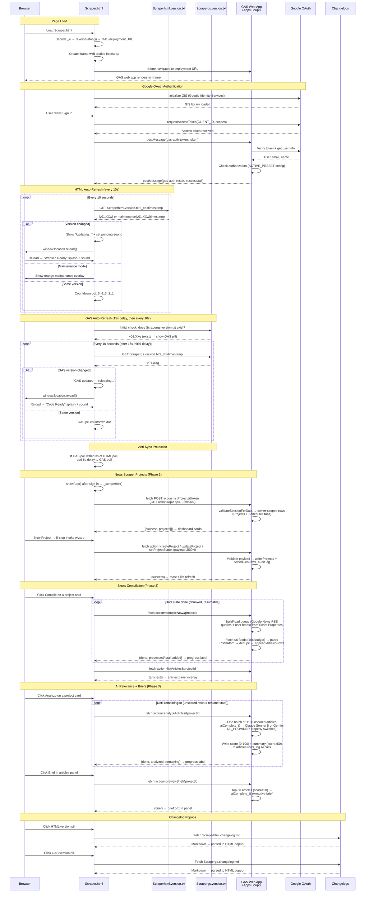

# Scraper.html — GAS Integration Sequence Diagram (Auth)

Sequence diagram showing the dual polling systems (HTML + GAS) and the iframe injection flow.

> [Open in mermaid.live](https://mermaid.live/edit#pako:eNq1WM1uG8kRfpXCHIwhTI6o9SoHYqUFTWkVBrIkaGR6gTAQmtPFYUc93e3uHtK010BOAfa6yCMkL-YnCapnhj8iRQsIcpHI6arqqq---hl-iTLNMepFDj-WqDI8Fyy3rBgrAADDrBeZMEx5eGv1wqHdPfjz_bsrYA7SzDKDNpn5Qu6RGm3IkEgyR-uEVon_5HfFLzfFc_cd4X5K0vTvA06gb8xPE3sW940JJoTxrT1KWucSg1716aZf-tmu3CAEN5gxlaPUuRurSuZaewQ9R9sg0yYgenDLcoQrzXglVh92zs6qYzrZAxUdrmTOkZICDwjf_vkHWKTgMWZeT-JWKzyjUDkaqZcFKg_v7672mBlYZB5BTC0rEBbCz8DZjOsMJlp75y0zW1qX_bTXSCs2Fznz6MDrvTdd9tNO5-ysDq8XPFrgBJgxYFFxtA6Eqs09j1mFfW8rB0B_UHmRMS-02vaxlh8q4QWT4jPC5TCFuNYfctLzS0jRzkWGrk58ddxZQUM6Ukwss0uQmnF8JlvvHVrIpMgeHaQiVzDc746l6nG-n2Xo3L1-RBUProYX1_cPw_M2uEybZ12pdMCTEljMUMwbbzbzYrTz79A5lmOcM9dhpZ91glK70m2t87L2a4RWTJe18deQo4eSQhJqqp-6E64JAWPBhGyDCpnbMEoCgxlmj0C3ays-hwRB3B_cD0cXD7d3F-nFPWRaTUXe2uJJFeveICy6Uvo2uDIgcTRlQrYOVNmoV7Wcful15w6nFt0MYiqSJRx3G5il1gYu6ofgMNOKu-pos1BGPbi8uH-uL_38kE1OvSjQeVaYDe3ROqbf5t3j5NdfF7-BtlAwoTwqpjJcPd-jz6Sn1NA1kIXOwteHO3WczvQCxtF7w5kXKk-SZBzBa3DowaDiQuUdp0u138SqQBdCcb1IpK6qKrFIxI9b21pPC-AuSIWeM44-4MQJj3CHjC_HETgjmZuRK9vXo3QI79ZQQKE5HvYuxKgtQbEJYki9ZMsntlNqUXWeDgA30KXyXC8UcO17cJIkPybJmyT5IUmONyw2rocPzzaqUdXjtll3fOKAo2TLNlDLgqcsbCp4tOpYkFEB9YBrfGa-AX4Szv9cl88G0ypC5RAHAReS4gg38ssIKQ9RH2I29WiBPBa1K8Hz1k5RXG4XxbZ3z5XEHke3-U5Ozl_M-XFE8iVRHjl8-8e_oOJrw___O9cHNIFfRPQXkrFJEmSbrHwpDclG4GBfedFJlyqDW6s9ZjsTsrptOK0u1FKGyS8UvHGgp1XrpMdt2pEY59BQmCZ9o3OgDmgIXONiRV7y4--YeQfx7Yw5hOPWHn-Ip31j4hZUNHQiVx2hAtgPrrJEFRK3dkffFH02g9ub9B5YiPdUCueba1-F4RYWPiJtLcGMeKXNaZIkMGVSTlj22NqZZXMmBREsRUfJ-0Xbc-ZZ8EkvFNpOGNwcKPRwwSrU15BmM-SlpAWJTdy-YfelHmhtMLXaX__2NRjnzM0mmlkOGbPNVHrKxmtcNNAGpZOO82hAKM8eaZv7zCx_DqsahCwsgI2Ro7qcVt8pJIcNkKlnvnQQG7YMZfCX9OZ6F7JRDRk0YuTawtJUWINDhtf4UFxtYCUXHqTODyBVoeM1cx5eAyUZbNVpX8LHgS6MkPVGUlHxh9Z-bAe00dUKCFoBa3IUMrLRRt8rLyQ4zzwmXCuEOJuV6hF5G2hvKdhE4p4OupuK6q5rvXhV3zTc6CMbAL8theRHAdqPJZa4Wm1DjHdpSuB-LNEKJBqGbW6KyF0LplYX9fsOJcOg9QLd3lt-Cb59-_3ff6qUIf6x62BS8hx99YZhmHVId92l6VHf66JiLvLSVK8lzNDyAX16U2rSvH3XOr-EXCgDyjLyI689k21gnCOvkm6szi3twZJNUG40woOoEkUaB57iuu0Bq6WaEmy-g2EK5XrNOEiz_pBmBM7DZvIa3lqB01Xbe3OQa33F5PLzS7hmaftWQuWnXYhL5TJt6xYEpxXnsOLjS2jHqmufw-gJK24UwoSRup4SOY67sHKgASxMDUGlI9HjQ1yxZSBZyRFSrRR6OKFV-BILoUT1Ij58uL27GQ3PL-4odiLmEtxC-Gy2ei164sqH0FLC3RB3O8fdbovGb1kU9MoWh4Nvv__npNuiG7ze5mGbGg2lK2NSfoeVNUShoGvkX0DJ_VkOjKDX3m16fYfFxuJc4CIo72NxrXOvDbzprk1vgkAO72YGP2FWejFHmJDtfXURDqp4w0eY6E8UQO33c-UwoJCbn0TgVpvSuEPAhK2j2f5oC9qChKxVHWnzPSxr7CdFDcbgau35O2YfwxK1alacFph6vTGlaZzf79DmNvp9f3L3v3sTtaMCbcEEj3rRl3HkZ1jgOOqNI45TVko_jr5G7YiVXtN6F_W8LbEdVTO7_lWuevj1v6y7deI)

```mermaid
sequenceDiagram
    participant Browser
    participant HTML as Scraper.html
    participant HV as Scraperhtml.version.txt
    participant GV as Scrapergs.version.txt
    participant GAS as GAS Web App<br>(Apps Script)
    participant Google as Google OAuth
    participant CL as Changelogs

    Note over Browser,HTML: Page Load
    Browser->>HTML: Load Scraper.html
    HTML->>HTML: Decode _e → reverse(atob()) → GAS deployment URL
    HTML->>HTML: Create iframe with srcdoc bootstrap
    HTML->>GAS: iframe navigates to deployment URL
    GAS-->>Browser: GAS web app renders in iframe

    Note over Browser,Google: Google OAuth Authentication
    HTML->>Google: Initialize GIS (Google Identity Services)
    Google-->>HTML: GIS library loaded
    Browser->>HTML: User clicks Sign In
    HTML->>Google: requestAccessToken(CLIENT_ID, scopes)
    Google-->>HTML: Access token received
    HTML->>GAS: postMessage(gas-auth-token, token)
    GAS->>Google: Verify token + get user info
    Google-->>GAS: User email, name
    GAS->>GAS: Check authorization (ACTIVE_PRESET config)
    GAS-->>HTML: postMessage(gas-auth-result, success/fail)

    Note over Browser,HV: HTML Auto-Refresh (every 10s)
    loop Every 10 seconds
        HTML->>HV: GET Scraperhtml.version.txt?_cb=timestamp
        HV-->>HTML: |v01.XXw| or maintenance|v01.XXw|timestamp
        alt Version changed
            HTML->>HTML: Show "Updating..." + set pending-sound
            HTML->>Browser: window.location.reload()
            Browser->>HTML: Reload → "Website Ready" splash + sound
        else Maintenance mode
            HTML->>Browser: Show orange maintenance overlay
        else Same version
            HTML->>HTML: Countdown dot: 5..4..3..2..1
        end
    end

    Note over Browser,GV: GAS Auto-Refresh (15s delay, then every 10s)
    HTML->>GV: Initial check: does Scrapergs.version.txt exist?
    GV-->>HTML: v01.XXg (exists → show GAS pill)
    loop Every 10 seconds (after 15s initial delay)
        HTML->>GV: GET Scrapergs.version.txt?_cb=timestamp
        GV-->>HTML: v01.XXg
        alt GAS version changed
            HTML->>HTML: "GAS updated — reloading..."
            HTML->>Browser: window.location.reload()
            Browser->>HTML: Reload → "Code Ready" splash + sound
        else Same version
            HTML->>HTML: GAS pill countdown dot
        end
    end

    Note over HTML,GV: Anti-Sync Protection
    HTML->>HTML: If GAS poll within 3s of HTML poll,<br>add 5s delay to GAS poll

    Note over Browser,GAS: News Scraper Projects (Phase 1)
    HTML->>HTML: showApp() after sign-in → _scraperInit()
    HTML->>GAS: fetch POST action=listProjects&token<br>(GET action=api&op=... fallback)
    GAS->>GAS: validateSessionForData → owner-scoped rows<br>(Projects + Schedules tabs)
    GAS-->>HTML: {success, projects[]} → dashboard cards
    Browser->>HTML: New Project → 5-step intake wizard
    HTML->>GAS: fetch action=createProject / updateProject /<br>setProjectStatus (payload JSON)
    GAS->>GAS: Validate payload → write Projects +<br>Schedules rows, audit log
    GAS-->>HTML: {success} → toast + list refresh

    Note over Browser,GAS: News Compilation (Phase 2)
    Browser->>HTML: Click Compile on a project card
    loop Until state.done (chunked, resumable)
        HTML->>GAS: fetch action=compileNow&projectId
        GAS->>GAS: Build/load queue (Google News RSS<br>queries + user feeds) from Script Properties
        GAS->>GAS: Fetch ≤6 feeds (40s budget) → parse<br>RSS/Atom → dedupe → append Articles rows
        GAS-->>HTML: {done, processed/total, added} → progress label
    end
    HTML->>GAS: fetch action=listArticles&projectId
    GAS-->>HTML: {articles[]} → articles panel overlay

    Note over Browser,GAS: AI Relevance + Briefs (Phase 3)
    Browser->>HTML: Click Analyze on a project card
    loop Until remaining=0 (unscored rows = resume state)
        HTML->>GAS: fetch action=analyzeArticles&projectId
        GAS->>GAS: One batch of ≤10 unscored articles<br>aiComplete_() → Claude Sonnet 5 or Gemini<br>(AI_PROVIDER property switches)
        GAS->>GAS: Write score (0-100) + summary (score≥50)<br>to Articles rows, log AI calls
        GAS-->>HTML: {done, analyzed, remaining} → progress label
    end
    Browser->>HTML: Click Brief in articles panel
    HTML->>GAS: fetch action=previewBrief&projectId
    GAS->>GAS: Top 30 articles (score≥50) →<br>aiComplete_() executive brief
    GAS-->>HTML: {brief} → brief box in panel

    Note over Browser,CL: Changelog Popups
    Browser->>HTML: Click HTML version pill
    HTML->>CL: Fetch Scraperhtml.changelog.md
    CL-->>HTML: Markdown → parsed to HTML popup

    Browser->>HTML: Click GAS version pill
    HTML->>CL: Fetch Scrapergs.changelog.md
    CL-->>HTML: Markdown → parsed to HTML popup
```

## Key Design Notes

- **GAS iframe injection** — the deployment URL is stored as a reversed+base64-encoded string in `_e`. The iframe uses `srcdoc` with a bootstrap script that reads the URL from `parent._r`, deletes it, then navigates — preventing the URL from being visible in page source
- **Dual polling** — HTML and GAS versions are polled independently with anti-sync protection (if polls align within 3s, GAS poll gets a 5s delay to re-stagger them)
- **Two splash screens** — green "Website Ready" for HTML version changes, blue "Code Ready" for GAS version changes
- **Audio unlock via UAv2** — since the GAS iframe covers the entire page, click events don't reach the parent document. The UAv2 poll detects `navigator.userActivation.hasBeenActive` (propagated from cross-origin iframe clicks) and unlocks AudioContext without needing a direct click on the parent

Developed by: ShadowAISolutions
