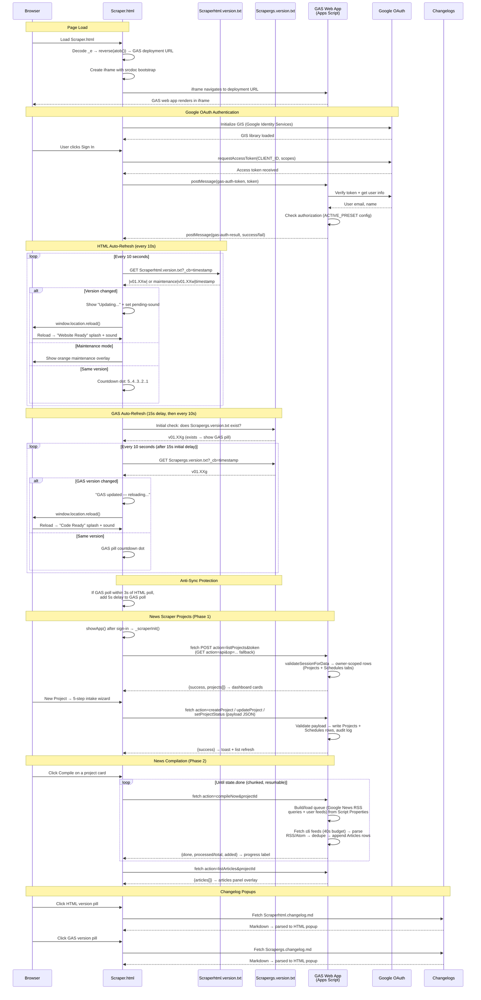

# Scraper.html — GAS Integration Sequence Diagram (Auth)

Sequence diagram showing the dual polling systems (HTML + GAS) and the iframe injection flow.

> [Open in mermaid.live](https://mermaid.live/edit#pako:eNq1WM1uG8kRfpXCHIwhTI6s3XUOxFoLLq1VGMiyoJG5C4SBUJwuDjtqdre7e8SlvQZyCrDXII-QJ_OTBNUzwx-R1AoIcpHI6arqqq---hl-TgojKOknnj5WpAt6K7F0uJhoAACLLshCWtQBfnRm6cntH_z59t0loIe8cGjJZfOwUAekxlsyLJI9kPPS6Cz8GvbFL7bFS_8HwoOcpfnfzzSFgbXfT91ZOrA2mpA2dA4oGVMqinr1p_eDKsz35YYxuOEcdUnKlH6ia5krEwjMA7kWmS4D0YdrLAkuDYparDnsnZ3Vx3xyACo-XMu8JU4K3BF8_ee_wBEHTykGM007nfiMQxVklVktSAf4cHN5wMzQEQYCOXO4IFjKMAfvCmEKmBoTfHBod7QuBnm_ldb4IEsM5CGYgzddDPJe7-ysCa8fPVrSFNBacKQFOQ9SN-aOY1Zj39_JAfAf0kEWGKTRuz428iMtg0QlPxFcjHJIG_2RYL2wgpzcgyzIN4mvj3traFhHyalDtwJlUNCRbH3w5KBQsrj3kMtSw-iwO46rx4dBUZD3t-aedDq8HJ1f3d6N3nbBF8YedaXWgcBK4Kgg-dB6s50Xa3x4R95jSWmJvodVmPeiUrfW7WzysvFrTE7OVo3xl1BSgIpDknpmHrsTr4kB0wKl6oKOmdsyygLDORX3wLcbJz_FBEE6GN6Oxud31zfn-fktFEbPZNnZ4Ukd68EgHPlKhS74KiJxMkOpOk9U2bhft5xBFUzvhmaO_BxSLpIVnL5qYVbGWDhvHoKnwmjh66PtQhn34eL89lhf-uGumL4JckE-4MJuaY83Mf328Oo0--WX5W9gHCxQ6kAadUHr5wf0UQVODV8DRewsYnO4V8f53CxhknywAoPUZZZlkwRegqcAlrSQuux5U-nDJtYFupRamGWmTF1VmSMmftrZ1XpcADdRKvacSfIzTb0MBDeEYjVJwFuFfs6u7F5PyhO820ABCyPoae9ijMYxFNsgxtQrXD2ynXOLavL0BHBDU-kgzFKDMKEPr7Psuyz7Nsu-ybLTLYut6_HD0UY1rnvcLutOX3sQpHDVBW5Z8JiFbQWP1x0LCi6gPghDR-Yb0K_Shx-a8tliWk2oEtIo4GNSPOPGflmp1FPUhxRngRywx7JxJXre2SuKi92i2PXuWEkccHSX7-zkw7M5P0lYvmLKk4Cv__g31Hxt-f9_5_qQJ_CziP5MMrZJgmKblc-lIduIHBzoIHv5Shdw7UygYm9C1reNZvWFRqk4-aWGbz2YWd06-XGXdyQUAloK86RvdZ6oAx4CV7Rck5f9-DsVwUN6PUdPcNo54A_zdGBt2oGahl6Wuid1BPvO15a4QtLO_uibUSjmcP0-vwWM8b5R0of22hdxuMWFj0nbSKCVL4x9k2UZzFCpKRb3nb1Z9oBKMsFy8py8n4x7iwGjT2apyfXi4BbAoccL1qG-hLyYk6gUL0g49YeG3edmoHXBNmp__duXaFygn08NOgEFunYqPWbjFS1baKPS654PZEHqgPe8zX1CJ45h1YBQxAWwNXLSlNP6O4fkqQUyDxgqD6nFVSyDv-Tvr_YhGzeQQSvGri0dT4UNOGx4gw_H1QWshAygTPkEUjU6waAP8BI4yeDqTvscPg7NwkrVbCQ1Fb_pHMZ2yBtdo0BgNGCbo5iRrTb6QQepwAcMlAmjCdJiXul7El3gvWWBU0UHOuh-Kuq7rszyRXPTaKuPbAH8YyWVOInQfqyoovVqG2O8yXMG92NFThLTMG5zMyLhOzBzZtG873AyLLkgyR-85afo29ff__OnWhnS7155mFaipFC_YVh0nviumzw_GQSzqJlLorL1awlaXj5gwG9KbZp379rkl5GLZcBZJnESTEDVBRSCRJ1060zpeA9WOCW11QifRJUp0jrwGNddD7CRakuw_Q4WNanNmnGMZkNmTfsOCNfGVtY_xa3YZttxx21_JxK2Vqdge_EsWvvZoolheLkJ4R26-zg11tkR3LGbfm4r2zp_2KHt8fvH_pT-f_Um6SYLcguUIuknnydJmNOCJkl_kgiaYaXCJPmSdBOsguFplvSDq6ib1C2q-RGifvjlvz0xcHc)

```mermaid
sequenceDiagram
    participant Browser
    participant HTML as Scraper.html
    participant HV as Scraperhtml.version.txt
    participant GV as Scrapergs.version.txt
    participant GAS as GAS Web App<br>(Apps Script)
    participant Google as Google OAuth
    participant CL as Changelogs

    Note over Browser,HTML: Page Load
    Browser->>HTML: Load Scraper.html
    HTML->>HTML: Decode _e → reverse(atob()) → GAS deployment URL
    HTML->>HTML: Create iframe with srcdoc bootstrap
    HTML->>GAS: iframe navigates to deployment URL
    GAS-->>Browser: GAS web app renders in iframe

    Note over Browser,Google: Google OAuth Authentication
    HTML->>Google: Initialize GIS (Google Identity Services)
    Google-->>HTML: GIS library loaded
    Browser->>HTML: User clicks Sign In
    HTML->>Google: requestAccessToken(CLIENT_ID, scopes)
    Google-->>HTML: Access token received
    HTML->>GAS: postMessage(gas-auth-token, token)
    GAS->>Google: Verify token + get user info
    Google-->>GAS: User email, name
    GAS->>GAS: Check authorization (ACTIVE_PRESET config)
    GAS-->>HTML: postMessage(gas-auth-result, success/fail)

    Note over Browser,HV: HTML Auto-Refresh (every 10s)
    loop Every 10 seconds
        HTML->>HV: GET Scraperhtml.version.txt?_cb=timestamp
        HV-->>HTML: |v01.XXw| or maintenance|v01.XXw|timestamp
        alt Version changed
            HTML->>HTML: Show "Updating..." + set pending-sound
            HTML->>Browser: window.location.reload()
            Browser->>HTML: Reload → "Website Ready" splash + sound
        else Maintenance mode
            HTML->>Browser: Show orange maintenance overlay
        else Same version
            HTML->>HTML: Countdown dot: 5..4..3..2..1
        end
    end

    Note over Browser,GV: GAS Auto-Refresh (15s delay, then every 10s)
    HTML->>GV: Initial check: does Scrapergs.version.txt exist?
    GV-->>HTML: v01.XXg (exists → show GAS pill)
    loop Every 10 seconds (after 15s initial delay)
        HTML->>GV: GET Scrapergs.version.txt?_cb=timestamp
        GV-->>HTML: v01.XXg
        alt GAS version changed
            HTML->>HTML: "GAS updated — reloading..."
            HTML->>Browser: window.location.reload()
            Browser->>HTML: Reload → "Code Ready" splash + sound
        else Same version
            HTML->>HTML: GAS pill countdown dot
        end
    end

    Note over HTML,GV: Anti-Sync Protection
    HTML->>HTML: If GAS poll within 3s of HTML poll,<br>add 5s delay to GAS poll

    Note over Browser,GAS: News Scraper Projects (Phase 1)
    HTML->>HTML: showApp() after sign-in → _scraperInit()
    HTML->>GAS: fetch POST action=listProjects&token<br>(GET action=api&op=... fallback)
    GAS->>GAS: validateSessionForData → owner-scoped rows<br>(Projects + Schedules tabs)
    GAS-->>HTML: {success, projects[]} → dashboard cards
    Browser->>HTML: New Project → 5-step intake wizard
    HTML->>GAS: fetch action=createProject / updateProject /<br>setProjectStatus (payload JSON)
    GAS->>GAS: Validate payload → write Projects +<br>Schedules rows, audit log
    GAS-->>HTML: {success} → toast + list refresh

    Note over Browser,GAS: News Compilation (Phase 2)
    Browser->>HTML: Click Compile on a project card
    loop Until state.done (chunked, resumable)
        HTML->>GAS: fetch action=compileNow&projectId
        GAS->>GAS: Build/load queue (Google News RSS<br>queries + user feeds) from Script Properties
        GAS->>GAS: Fetch ≤6 feeds (40s budget) → parse<br>RSS/Atom → dedupe → append Articles rows
        GAS-->>HTML: {done, processed/total, added} → progress label
    end
    HTML->>GAS: fetch action=listArticles&projectId
    GAS-->>HTML: {articles[]} → articles panel overlay

    Note over Browser,CL: Changelog Popups
    Browser->>HTML: Click HTML version pill
    HTML->>CL: Fetch Scraperhtml.changelog.md
    CL-->>HTML: Markdown → parsed to HTML popup

    Browser->>HTML: Click GAS version pill
    HTML->>CL: Fetch Scrapergs.changelog.md
    CL-->>HTML: Markdown → parsed to HTML popup
```

## Key Design Notes

- **GAS iframe injection** — the deployment URL is stored as a reversed+base64-encoded string in `_e`. The iframe uses `srcdoc` with a bootstrap script that reads the URL from `parent._r`, deletes it, then navigates — preventing the URL from being visible in page source
- **Dual polling** — HTML and GAS versions are polled independently with anti-sync protection (if polls align within 3s, GAS poll gets a 5s delay to re-stagger them)
- **Two splash screens** — green "Website Ready" for HTML version changes, blue "Code Ready" for GAS version changes
- **Audio unlock via UAv2** — since the GAS iframe covers the entire page, click events don't reach the parent document. The UAv2 poll detects `navigator.userActivation.hasBeenActive` (propagated from cross-origin iframe clicks) and unlocks AudioContext without needing a direct click on the parent

Developed by: ShadowAISolutions
