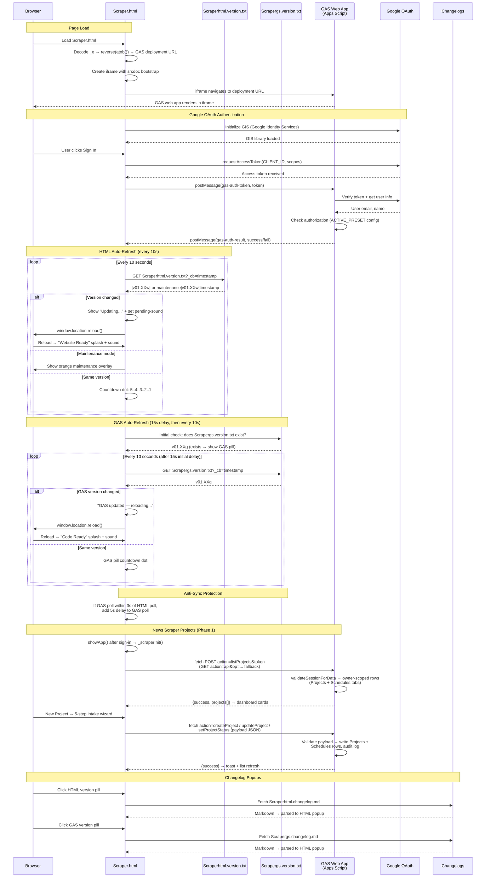

# Scraper.html — GAS Integration Sequence Diagram (Auth)

Sequence diagram showing the dual polling systems (HTML + GAS) and the iframe injection flow.

> [Open in mermaid.live](https://mermaid.live/edit#pako:eNq1V9tuGzcQ_ZXBPhQrRNrETfMiNA5U2XFV2I7hdZQAVWFQ5GjFmiJZkitFuQB96gcU_cJ8STHcXV0syTFQ9MV2ljPDM2fOzDCfEm4EJt3E4x8lao4nkhWOzUYaAMAyFySXlukAPzmz8Oh2D36-uTgH5iHnjll02TTM1B6r4YYNmWRzdF4anYUPYdf8bNO88N8w7uVkTb_e4Rh61v44dsdpz9oYQtrQ2uNkTKEw-lV_vemVYbpr14_J9adMF6hM4Ue6srk0AcHM0TXMtImILlyxAuHcMFGZ1Yed4-PqmE72UEWHK5sTpKLALcLXv_4Gh5Q8piyYcdpqxW-UqkCrzHKGOsDb6_M9YfoOWUCQE8dmCAsZpuAdF4bD2Jjgg2N2y-usl3cba83msmABPQSz96azXt7pHB_X6XUjogWOgVkLDrVA50HqOtxhziruu1s1APqBOkjOgjR6G2NtP9AySKbkR4SzQQ5p7T8Q5BeWkKObS46-Lnx13FlRQz5Kjh1zS1CGCTxQrbceHXAl-Z2HXBYaBvvhOOoeH3qco_c35g512j8fnF7e3A5O2uC5sQehVD4QyAkccpTzBs1mXazx4QK9ZwWmBfMdVoZpJzq1K9_Wui5rXEN0crKsgz-BAgOUlJLUE3MfTrwmJowzJlUbdKzcRlAy6E-R3wHdbpz8GAsEaa9_Mxie3l5dn-anN8CNnsiitaWTKte9STj0pQpt8GVk4umESdV6oMuG3Wrk9MpgOtc4ceinkFKTLOHoWUOzMsbCaf0RPHKjha-ONhtl2IWz05tDc-nVLR-_DHKGPrCZ3fAernP6PH92lL1_v_gMxsGMSR1QM81x9X2PP1OBSkPXAI-TRawPd_o4n5oFjJK3VrAgdZFl2SiBJ-AxgEUtpC463pR6f4hVgy6kFmaRKVN1VeaQhJ-2tr3uN8B1tIozZ5S8w7GXAeEamViOEvBWMT8lKNvXo_IIF2sqYGYEPowu5mgcUbFJYiy9Yst7sXMaUXWdHiCub0odhFloECZ04UWW_ZBlz7Ps-yw72ojYQI9_HBxUw2rGbavu6IUHgYot20AjC-6rsOng4WpiAacG6oIweGC_AX6QPryq22dDaZWgCkijgY9F8cQb4bJSqYekDymbBHRAiGUNJSJv7TTF2XZTbKM71BJ7gG7rnUDOH635UUL2JUkeBXz98x-o9Nro_3_Xep828KOE_kgxNkUCvqnKx8qQYkQN9nSQnXypOVw5E5DvbMjqtsGkutAoFTe_1PDcg5lUo5M-t-mNxISARsK06RufB_qAlsAlLlbiJRy_Iw8e0qsp8whHrT14SKc9a9MWVDL0stAdqSPZt76KRB2StnZX3wQDn8LVm_wGWMz3pZI-NNd-F5dbfPCRaGsLZuV3xr7MsgwmTKkx43etnV02Z0qSwHL0VLzXxp2wwCIms9DoOnFxC6DU4wWrVJ9AzqcoSkUPJDb2-5bdp3qhtcHWbr_-9iUGF8xPx4Y5AZy5ZivdV-MlLhpqo9OLjg9oQerA7ug195E5cYirmgQeH4BNkKd1O63-TSl5bIjMAwulh9SyZWyDX_I3l7uUDWvKoDEjaAtHW2FNDgVe80N5tYGVQgZQpniAqYqdYJgP8ASoyOCqSXtYj32a883jHK6MLe0BQvv0jKv038wh6sctDina60jh5ouAN_GzWU15_3yN_oK5u9jOBN4y51FQK9WNZkvbgN8PaHMufhtP4f8rmqSdzNDNmBRJN_k0SsIUZzhKuqNE4ISVKoySL0k7YWUwNGaSbnAltpNKO_X_DquPX_4FM1yhUw)

```mermaid
sequenceDiagram
    participant Browser
    participant HTML as Scraper.html
    participant HV as Scraperhtml.version.txt
    participant GV as Scrapergs.version.txt
    participant GAS as GAS Web App<br>(Apps Script)
    participant Google as Google OAuth
    participant CL as Changelogs

    Note over Browser,HTML: Page Load
    Browser->>HTML: Load Scraper.html
    HTML->>HTML: Decode _e → reverse(atob()) → GAS deployment URL
    HTML->>HTML: Create iframe with srcdoc bootstrap
    HTML->>GAS: iframe navigates to deployment URL
    GAS-->>Browser: GAS web app renders in iframe

    Note over Browser,Google: Google OAuth Authentication
    HTML->>Google: Initialize GIS (Google Identity Services)
    Google-->>HTML: GIS library loaded
    Browser->>HTML: User clicks Sign In
    HTML->>Google: requestAccessToken(CLIENT_ID, scopes)
    Google-->>HTML: Access token received
    HTML->>GAS: postMessage(gas-auth-token, token)
    GAS->>Google: Verify token + get user info
    Google-->>GAS: User email, name
    GAS->>GAS: Check authorization (ACTIVE_PRESET config)
    GAS-->>HTML: postMessage(gas-auth-result, success/fail)

    Note over Browser,HV: HTML Auto-Refresh (every 10s)
    loop Every 10 seconds
        HTML->>HV: GET Scraperhtml.version.txt?_cb=timestamp
        HV-->>HTML: |v01.XXw| or maintenance|v01.XXw|timestamp
        alt Version changed
            HTML->>HTML: Show "Updating..." + set pending-sound
            HTML->>Browser: window.location.reload()
            Browser->>HTML: Reload → "Website Ready" splash + sound
        else Maintenance mode
            HTML->>Browser: Show orange maintenance overlay
        else Same version
            HTML->>HTML: Countdown dot: 5..4..3..2..1
        end
    end

    Note over Browser,GV: GAS Auto-Refresh (15s delay, then every 10s)
    HTML->>GV: Initial check: does Scrapergs.version.txt exist?
    GV-->>HTML: v01.XXg (exists → show GAS pill)
    loop Every 10 seconds (after 15s initial delay)
        HTML->>GV: GET Scrapergs.version.txt?_cb=timestamp
        GV-->>HTML: v01.XXg
        alt GAS version changed
            HTML->>HTML: "GAS updated — reloading..."
            HTML->>Browser: window.location.reload()
            Browser->>HTML: Reload → "Code Ready" splash + sound
        else Same version
            HTML->>HTML: GAS pill countdown dot
        end
    end

    Note over HTML,GV: Anti-Sync Protection
    HTML->>HTML: If GAS poll within 3s of HTML poll,<br>add 5s delay to GAS poll

    Note over Browser,GAS: News Scraper Projects (Phase 1)
    HTML->>HTML: showApp() after sign-in → _scraperInit()
    HTML->>GAS: fetch POST action=listProjects&token<br>(GET action=api&op=... fallback)
    GAS->>GAS: validateSessionForData → owner-scoped rows<br>(Projects + Schedules tabs)
    GAS-->>HTML: {success, projects[]} → dashboard cards
    Browser->>HTML: New Project → 5-step intake wizard
    HTML->>GAS: fetch action=createProject / updateProject /<br>setProjectStatus (payload JSON)
    GAS->>GAS: Validate payload → write Projects +<br>Schedules rows, audit log
    GAS-->>HTML: {success} → toast + list refresh

    Note over Browser,CL: Changelog Popups
    Browser->>HTML: Click HTML version pill
    HTML->>CL: Fetch Scraperhtml.changelog.md
    CL-->>HTML: Markdown → parsed to HTML popup

    Browser->>HTML: Click GAS version pill
    HTML->>CL: Fetch Scrapergs.changelog.md
    CL-->>HTML: Markdown → parsed to HTML popup
```

## Key Design Notes

- **GAS iframe injection** — the deployment URL is stored as a reversed+base64-encoded string in `_e`. The iframe uses `srcdoc` with a bootstrap script that reads the URL from `parent._r`, deletes it, then navigates — preventing the URL from being visible in page source
- **Dual polling** — HTML and GAS versions are polled independently with anti-sync protection (if polls align within 3s, GAS poll gets a 5s delay to re-stagger them)
- **Two splash screens** — green "Website Ready" for HTML version changes, blue "Code Ready" for GAS version changes
- **Audio unlock via UAv2** — since the GAS iframe covers the entire page, click events don't reach the parent document. The UAv2 poll detects `navigator.userActivation.hasBeenActive` (propagated from cross-origin iframe clicks) and unlocks AudioContext without needing a direct click on the parent

Developed by: ShadowAISolutions
