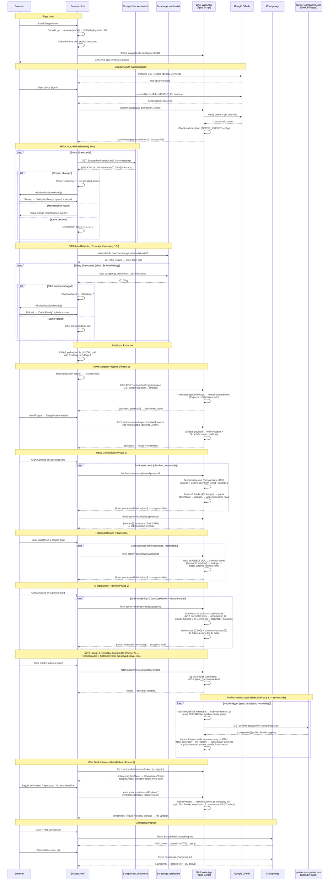

# Scraper.html — GAS Integration Sequence Diagram (Auth)

Sequence diagram showing the dual polling systems (HTML + GAS) and the iframe injection flow.

> [Open in mermaid.live](https://mermaid.live/edit#pako:eNq9Wc1uG8kRfpUCD8YQJkd_Vg5E7AVN0TQDWRJIWV5guRB6povDXjW7x909pGmvg5wC-JAAG-S-l80z7H0fxU-wjxBU9wx_JFISsEguNj1TXV311Vd_40-1VHOstWoW3xeoUjwRLDNsOlIAADkzTqQiZ8rBS6PnFs3dF68v35wCszBMDcvRxBM3lVukrtZkSCSeobFCq9h9cHfFe-vimX1AuD0kafrrHSbQzvM_J-ZF1M5zr0Lkrr7lkNaZRH8u_DpvF25yV67jnetMmMpQ6szelRh0eySSGz0WEk0z1dOcKYE2_sFq5U3pCfe6SOCCZWjrIxV0nGmHoGdoKmwbBGXLS8GpZjyIlS-bL16E1_RmC9j0cilzghRWuEb4-vd_gUGCDyPmdBLV6_4ZgcUxl3oxReXg7eB0i5qOQeYQxNiwKcJcuAlYk3KdQqK1s86wfONUrz1sVdKKzUTGHFpweutNvfaw2XzxonSv5S2aYwIsz8Gg4mgsCFWq241ZiF5rI4pAf6ByImVOaLVpYynfV8IJJsVHhF5_CFF5vs_pnFvAEM1MpD5c3lr_urmEhs5IkRhmFiA147gjWm8tGkilSG8sDEWmoL_dHEP5Z107TdHaS32DKuqc9rtnl9f9kwbYVOc7TQlnwNEhMJiimFXWrMcl19a9QWtZhlHGbJMVbtL0hxrhbH0Vl5VdV2jEeFEqfwoZOijIJaHG-rY5_hrvME6ZkA1QPnJrSkmgM8H0Buh2bcRHHyCI2p3L_lX3-mLQHXYvIdVqLLL6Bk-Cr1udMGgL6RpgC4_E3pgJeV-WXbVC0WoXTjcHODZoJxBRkizgYL-CWWqdQ7d8CBZTrXiZ_euJctWCXvdyV2X75jpNnjsxRevYNF87fbXy6cfZ_kH87bfzH0EbmDKhHCqmUlw-33KeSUehoWsg9bWJr17eyePhRM9hVHubc-aEyuI4HtXgKVh0kKPiQmVNqwu1XcUyQedCcT2PpQ5ZFRsk4kf1zVO3E2DgpXzNGdXeYWKFQxgg44tRDWwumZ2QKZvXo7QIb1ZQwFRzvN8676M2BMU6iD70ki1u6R5SiSrjdA9wHV0ox_VcAdeuBcdx_CyOj-L4MI4P1jRWpvsfOwvVVahxm6w7OLbAUbJFA6hkwW0WVhl8taxYkFICtYBr3NEhAT8I674p02eNaYFQGURewPqgWMKN7MqFlPdRHyI2dmiALBalKd7y-p2k6G0mxaZ1u1Jii6GbfCcjZ4_m_KhG8gVRHjl8_du_IfC14v__nOsd6sCPIvojyVgFCdJ1Vj6WhqTDc7CtnGgOFyqFC6Mdpnc6ZLitPw4Xail95xcKjizocSid9LhBow3jHCoKU6evztyTB9QEznC-JC_Z8QOmzkJ0MWEW4aC-xR7iaTvPozoEGlqRqaZQHuxrGzRRhkT1u61vjC6dwMX58BKY9_e5FNZV1z7xzS3Mad2lBMvFE50_j-MYxkzKhKU39Tu9bMakIIIN0VLwXmlzwhzzNum5QtP0jZsDue4vWLr6FIbpBHkhaUBiid3W7D6VDa1Bs6U_9t33n71yzuwk0cxwSJmputJtNp7hvILWHzpuWoc5COXYDU1zH5nhu7AqQUj9AFgp2SvTaflvcsliBeTQMVdYiHK28Gnwl-H52V3IrkrIoBIj0-aGusIKHFK8wof8agAruHAgdXYPUgEdp5l18BQoyGBCpX0MHzt6mgtZTiSBiof17dh2aKIrDyBoBayKkY_IWhl9q5yQYB1zGHOtEKJ0Uqgb5A2guWXKEolbKujdUIS7zvT8SXlTf62OrAH8shCS73lo3xdY4HK09T4OhkMC932BRiDR0E9zY0Ru6zA2elpuTBSMHI0TaLfe8srb9vXLL38KhyF6tm8hKXiGLmwYOTMW6a7BcLjXdnoamIu8yMNawnIaPqBNm1QV5s27VvEl5HwaUJSR7zntmGwA4xx5CHpudGZoDpYsQblWCO9FlShSGXAb100LWClFKeh0TpltkMNYGOsg-vrll4P9_Tq5612rfMqZQrmaQe7l4GthnTYiZRJesvRmTKW-pOFRfHwvEZfyDzORSQlW0mYDf4SOSXnjw3w8ww8uEKV30j29hJPzDhzG-zDVyk2awRRfGw-fNf2zsvnWb_GFZBLm0knz_0Sce4PV7lO3x5mfMZ_CSyNwvGxgR_cGq62YXHx8TNUwtEcpobLn-xAVqqQcKYXnIVwYKstjIsbCtbvYfitq5wrBo00t37MblgZU7KaIPIXff_7pH3u___zTPwE_4DSXzIATjuLiM0FQkZTo8Dry6dGRrOAIQ60UOjimnaeHU6EERO3-9cXg_Kp_0h2AnQuXTpY77y3r3vl-4c2BaL9JqUezVTGd0j4e-Rdfv_znOGSk05tcaVAXoQimTMoHmFOi5tOjDMYj6s0O0qygMn4Rg7d9MOgEgZosgGMq_HR7crTqPzS6khMzNFykDowunC_ck1W5mGl6lBu0aGbIwf9lmlZUS9OOqkGkpW8sm-XqgZKZG5wJnPvD20pmeeZS53C0v1K9HpQqnTfIQfRJCydmCAnp3laE_YuAv_8Jif5ADpR23wa_1x42Bt1ei5qZ_zYHfeXQoHXgB-BogAl1SyjnTr8mBPCAwFtfh17rwsgFOCOyDA1ElhS4idHOSeQ0-v5VqxT3-MZCtAaITauJxlwS-hNkxiXIwnBmU7KoMs-WyRKZQll42X11PujSfgi5yFEKRdNTYRGyzdwPt3mPaZJdfpHkzLG9Hd8nV6cH3d7yK86npRD1u7xIpEhXKBrMhHVmsdXPt7lF45ZI-_G2BQrnEHQuvL_nZ2HKG9XO_JsZGpbhqAa__QoSx255R0DHMYkQKdqOaddAh7weyk9WCE5FeG_KzA066s0iBRtmEqHIlqZWsgrKQyn6ThiEE7Q3aw4MmJC3uXJYf8RksVQRVgyItKr2lq3zvqjkv_u-AZJZR5wIdO9U8di7JAdtqGtZJtE2YCxZZhuQMoeZNgtIJyK3DfAUXTWW20Xg0h8HpqC6F_ZCXig9p5--vDIiKifOPeCwxaW_XUVjBC8XhHVen3nNpkiMSC9CIblTOTbelskx8M-8RddRvbWk0rN9-O3XgAWF_fCY-LPkKU7zCbPCwoF_bovEOt-wD_chOjkqb9oaCgwufIY9-BS-L_qfvog1fBCZLNcNQ_QIm5HdPTV0qOxW_4sAFzovcntfcfZrdvW5g9b-DfhJWxjB1z88ppX-eFrGvHO68ukNMzf-q8FyOvdlq9zn8yKvjN9u0Prnl4ftyewftabWqE3RTJngtVbt06jmJjjFUa01qnEcs0K6Ue1zrVFjhdNE2lrLmQIbtRCI8r-xwsPP_wUKtPCw)

```mermaid
sequenceDiagram
    participant Browser
    participant HTML as Scraper.html
    participant HV as Scraperhtml.version.txt
    participant GV as Scrapergs.version.txt
    participant GAS as GAS Web App<br>(Apps Script)
    participant Google as Google OAuth
    participant CL as Changelogs
    participant REG as profiler-companies.json<br>(GitHub Pages)

    Note over Browser,HTML: Page Load
    Browser->>HTML: Load Scraper.html
    HTML->>HTML: Decode _e → reverse(atob()) → GAS deployment URL
    HTML->>HTML: Create iframe with srcdoc bootstrap
    HTML->>GAS: iframe navigates to deployment URL
    GAS-->>Browser: GAS web app renders in iframe

    Note over Browser,Google: Google OAuth Authentication
    HTML->>Google: Initialize GIS (Google Identity Services)
    Google-->>HTML: GIS library loaded
    Browser->>HTML: User clicks Sign In
    HTML->>Google: requestAccessToken(CLIENT_ID, scopes)
    Google-->>HTML: Access token received
    HTML->>GAS: postMessage(gas-auth-token, token)
    GAS->>Google: Verify token + get user info
    Google-->>GAS: User email, name
    GAS->>GAS: Check authorization (ACTIVE_PRESET config)
    GAS-->>HTML: postMessage(gas-auth-result, success/fail)

    Note over Browser,HV: HTML Auto-Refresh (every 10s)
    loop Every 10 seconds
        HTML->>HV: GET Scraperhtml.version.txt?_cb=timestamp
        HV-->>HTML: |v01.XXw| or maintenance|v01.XXw|timestamp
        alt Version changed
            HTML->>HTML: Show "Updating..." + set pending-sound
            HTML->>Browser: window.location.reload()
            Browser->>HTML: Reload → "Website Ready" splash + sound
        else Maintenance mode
            HTML->>Browser: Show orange maintenance overlay
        else Same version
            HTML->>HTML: Countdown dot: 5..4..3..2..1
        end
    end

    Note over Browser,GV: GAS Auto-Refresh (15s delay, then every 10s)
    HTML->>GV: Initial check: does Scrapergs.version.txt exist?
    GV-->>HTML: v01.XXg (exists → show GAS pill)
    loop Every 10 seconds (after 15s initial delay)
        HTML->>GV: GET Scrapergs.version.txt?_cb=timestamp
        GV-->>HTML: v01.XXg
        alt GAS version changed
            HTML->>HTML: "GAS updated — reloading..."
            HTML->>Browser: window.location.reload()
            Browser->>HTML: Reload → "Code Ready" splash + sound
        else Same version
            HTML->>HTML: GAS pill countdown dot
        end
    end

    Note over HTML,GV: Anti-Sync Protection
    HTML->>HTML: If GAS poll within 3s of HTML poll,<br>add 5s delay to GAS poll

    Note over Browser,GAS: News Scraper Projects (Phase 1)
    HTML->>HTML: showApp() after sign-in → _scraperInit()
    HTML->>GAS: fetch POST action=listProjects&token<br>(GET action=api&op=... fallback)
    GAS->>GAS: validateSessionForData → owner-scoped rows<br>(Projects + Schedules tabs)
    GAS-->>HTML: {success, projects[]} → dashboard cards
    Browser->>HTML: New Project → 5-step intake wizard
    HTML->>GAS: fetch action=createProject / updateProject /<br>setProjectStatus (payload JSON)
    GAS->>GAS: Validate payload → write Projects +<br>Schedules rows, audit log
    GAS-->>HTML: {success} → toast + list refresh

    Note over Browser,GAS: News Compilation (Phase 2)
    Browser->>HTML: Click Compile on a project card
    loop Until state.done (chunked, resumable)
        HTML->>GAS: fetch action=compileNow&projectId
        GAS->>GAS: Build/load queue (Google News RSS<br>queries + user feeds) from Script Properties
        GAS->>GAS: Fetch ≤6 feeds (40s budget) → parse<br>RSS/Atom → dedupe → append Articles rows
        GAS-->>HTML: {done, processed/total, added} → progress label
    end
    HTML->>GAS: fetch action=listArticles&projectId
    GAS-->>HTML: {articles[]} top-scored first (≤100)<br>→ articles panel overlay

    Note over Browser,GAS: Historical Backfill (Phase 3.5)
    Browser->>HTML: Click Backfill on a project card
    loop Until all slices done (chunked, resumable)
        HTML->>GAS: fetch action=backfillNow&projectId
        GAS->>GAS: Next ≤6 GDELT DOC 2.0 month-slices<br>(24-month window) → dedupe →<br>batch-append Articles rows
        GAS-->>HTML: {done, processed/total, added} → progress label
    end

    Note over Browser,GAS: AI Relevance + Briefs (Phase 3)
    Browser->>HTML: Click Analyze on a project card
    loop Until remaining=0 (unscored rows = resume state)
        HTML->>GAS: fetch action=analyzeArticles&projectId
        GAS->>GAS: One batch of ≤10 unscored articles<br>+ 👍/👎 exemplar titles → aiComplete_()<br>Claude Sonnet 5 or Gemini (AI_PROVIDER switches)
        GAS->>GAS: Write score (0-100) + summary (score≥50)<br>to Articles rows, log AI calls
        GAS-->>HTML: {done, analyzed, remaining} → progress label
    end
    Note over Browser,GAS: 👍/👎 rating UI retired by decision D3 (Phase 2) —<br>verdict routes + historical votes preserved server-side
    Browser->>HTML: Click Brief in articles panel
    HTML->>GAS: fetch action=previewBrief&projectId
    GAS->>GAS: Top 30 articles (score≥50) →<br>aiComplete_() executive brief
    GAS-->>HTML: {brief} → brief box in panel

    Note over GAS,REG: Profiler Interest Sync (Rebuild Phase 1 — server side)
    loop Hourly trigger (sync throttled to ~once/day)
        GAS->>GAS: scSchedulerTick heartbeat → scSyncInterests_()<br>(runs BEFORE the pipeline pause gate)
        GAS->>REG: GET profiler-data/profiler-companies.json
        REG-->>GAS: {companies[]} public Profiler registry
        GAS->>GAS: Upsert Interests tab: new company → ON +<br>"New coverage" · left registry → stale (never deleted)<br>+ guidance/market topic seeds (insert-only)
    end
    Note over Browser,GAS: Wire Desk Interests Rail (Rebuild Phase 2)
    HTML->>GAS: fetch action=listInterests&token (on sign-in)
    GAS-->>HTML: {interests[], lastSync} → Companies/Topics<br>toggles, flags, category chips, sync card
    Browser->>HTML: Toggle an interest / Sync now / Score a headline
    HTML->>GAS: fetch action=setInterestEnabled /<br>syncInterestsNow / rubricPreview
    GAS->>GAS: rubricPreview → scRubricScore_(): company 40 ·<br>topic 25 · Profiler emphasis 15 · substance 20 (D3 rubric)
    GAS-->>HTML: {enabled} / {result} / {score, signals} → rail updates

    Note over Browser,CL: Changelog Popups
    Browser->>HTML: Click HTML version pill
    HTML->>CL: Fetch Scraperhtml.changelog.md
    CL-->>HTML: Markdown → parsed to HTML popup

    Browser->>HTML: Click GAS version pill
    HTML->>CL: Fetch Scrapergs.changelog.md
    CL-->>HTML: Markdown → parsed to HTML popup
```

## Key Design Notes

- **GAS iframe injection** — the deployment URL is stored as a reversed+base64-encoded string in `_e`. The iframe uses `srcdoc` with a bootstrap script that reads the URL from `parent._r`, deletes it, then navigates — preventing the URL from being visible in page source
- **Dual polling** — HTML and GAS versions are polled independently with anti-sync protection (if polls align within 3s, GAS poll gets a 5s delay to re-stagger them)
- **Two splash screens** — green "Website Ready" for HTML version changes, blue "Code Ready" for GAS version changes
- **Audio unlock via UAv2** — since the GAS iframe covers the entire page, click events don't reach the parent document. The UAv2 poll detects `navigator.userActivation.hasBeenActive` (propagated from cross-origin iframe clicks) and unlocks AudioContext without needing a direct click on the parent

Developed by: LightAISolutions
