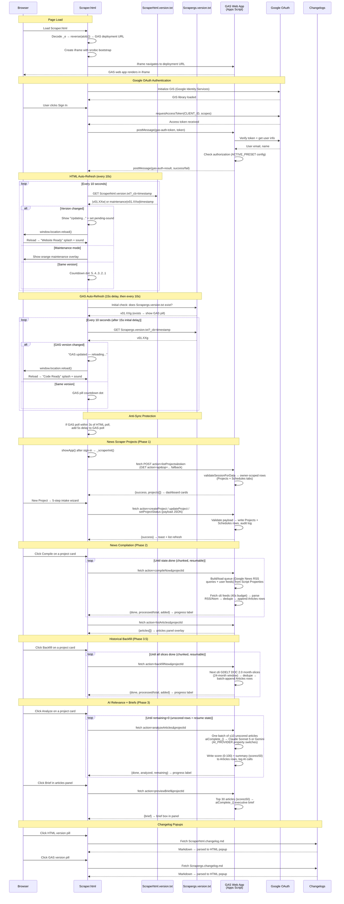

# Scraper.html — GAS Integration Sequence Diagram (Auth)

Sequence diagram showing the dual polling systems (HTML + GAS) and the iframe injection flow.

> [Open in mermaid.live](https://mermaid.live/edit#pako:eNq9WN1u28oRfpUBLwIKlmg5iXsh1D5QZB8fFY5tmI5ygKowVtwRtfVyl9ldSlZyAvSqQG6LPsLpi_lJilmS-rF-bOCgvbElcmZn5ptvflbfgkRzDDqBxS8FqgTPBEsNy4YKACBnxolE5Ew5-GD0zKLZfPHL3cdLYBbixLAcTTRxmdwiNViRIZFoisYKrSL36DbFL1bFU_uCcDcmafr3GUfQzfM_j8xp2M1zf4TIXWOLktapRK9XfrruFm6yKdfzwfUmTKUodWqHqpS50g5BT9HUyDQJiA7csBThUjNeilUvW6en5Wt6swUqermQOUNKCtwjPP3zX2CQgseQOT0KGw3_jELlmEs9z1A5-HR7ueWYnkHmEMTYsAxhJtwErEm4TmCktbPOsHxN66Ibd2ppxaYiZQ4tOL3V0kU3brVOT6vwOt6jGY6A5TkYVByNBaGq43ZjVmLfWcsB0B9UTiTMCa3Wfazk-0o4waT4inDRjyGs9Puc9NwcYjRTkaCtEl--bi2gIR0pRoaZOUjNOO7I1ieLBhIpkgcLsUgV9Le7Y6h6rOsmCVp7px9Qhb3L_vnV3X3_rAk20flOV0odcKQEBhMU09qb1bzk2rqPaC1LMUyZbbHCTVpeqVnqNpZ5Wfo1QCPG8-rwA0jRQUEhCTXWz93xZnzAmDEhm6B85lYOJYHeBJMHIOvaiK8-QRB2e3f9wfn9ze15fH4HiVZjkTbWeFLGujUIg7aQrgm28EgcjpmQjT1VNuiULadbON26xbFBO4GQimQOR-0aZql1DufVQ7CYaMVt-Wq1UAYduDi_29WXfrpPRidOZGgdy_IV7cEypt-m7aPo119nv4E2kDGhHCqmElw836LPpKPUkBlIfGfhy5cbdRxP9AyGwaecMydUGkXRMIADsOggR8WFSltWF2r7EYsCnQnF9SySuqyqyCARP2ysaz0vgFsv5XvOMPiMIyscwi0yPh8GYHPJ7IRcWTeP0iJ8XEIBmea43zsfozYExSqIPvWSzZ-dHVOLqvK0B7ieLpTjeqaAa9eB4yh6H0XvouhtFB2tnFi77j_sbFSDssets-7o2AJHyeZNoJYFz1lYV_Bg0bEgoQLqANe4Y74BPgrrfqrKZ4VpJaFSCL2A9UmxhBv5lQsp91EfQjZ2aIA8FpUr3vPGRlFcrBfFune7SmKLo-t8Jyenr-b8MCD5giiPHJ7-8W8o-Vrz_3_O9R5N4FcR_ZVkrJMEySorX0tDOsNzsKucaMVzlcCN0Q6TjQlZWuuPS4NaSj_5hYJ3FvS4bJ30uEk7EuMcagrTpK919tQBDYErnC3IS378HRNnIbyZMItw1NjiD_G0m-dhA0oaWpGqllAe7HtbnkQVEjY2R98YXTKBm-v4DpiP90QK62qzb_xw8wsfkbaSYLl4o_OTKIpgzKQcseShsTHLpkwKIliMlpL3szZnzDHvk54pNC0_uDlQ6N7AItQDiJMJ8kLSgsRGdtuw-1YNtCbkldpf__bdH86ZnYw0MxwSZuqp9JyNVzirofVKxy3rMAehHHugbe4rM3wXVhUIiV8A60MOq3JafKeQLNZAxo65wkKYs7kvg7_E11ebkA0qyKAWI9dmhqbCEhw6eIkPxdUEVnDhQOp0D1IlOk4z6-AAKMlgyk77Gj72dJYLWW0kJRXfNrZj26ONrlJA0ApYnSOfkZU2-kk5IcE65jDiWiGEyaRQD8ibQHtLxkYSt3TQzVSUtq707E1lqb_SR1YA_lAIyQ89tF8KLHCx2voYb-OYwP1SoBFINPTb3BiR2waMjc6q-w4lI0fjBNqtVn72vj39-P1PpTKE79sWRgVP0ZU3jJwZi2TrNo4Pu05nJXORF3l5LWE5LR_QpZtSneZ1W8v8EnK-DCjLyA-ddkw2gXGOvEx6bnRqaA-WbIRypRHuRZUoUjvwHNd1D1glVZdg_R1yplAu14y9NPtFWKeNSJiEDyx5GFM3r5j2Ljrey7WF_MtkY1KClXR5gT_CuFFl8WXKXeGjK7lwcXZ-eQdn1z14G7Uh08pNWqUrvv29fd_yz6r52nhGCZIZMZdMWv8nbuxNVrdPAx2nfo08gA9G4Hgxo97tTVZXMTn_-prGYOiqpIRKT9oQFsom2lTzAk7KdGHZPF6TMVaa3UXoZ1m7VggebZrqTz9-P2rDwoGa3X7EC-pzEh3eh2XGepIVHCHWSqGDY7q3XGAmlCh_Nenf39xeD_pn57cUO3WROdiZcMlkcYd95spn3_-9bQjbraN2u0G7UpFldL8O_YunH_85bjfIgtPrxGjSVKB0JUzKF2hSQeRroUL-Ff1jR0kSI-g3ivVe8ELLyQ1OBc688raWU-nc6RzetZdHr4JQ18p6ZvARk8KJKcKIzt7WxPyLMl7_EUb6kQKo_N5VDj0Kuf79Cm50XuR2HzB-RaxXdVpZ1yCh08rxsXppTurzo6wCo3e59PwjMw9-411MFk7bZrWL5kVeO7_dodWrw8v-pPaPexM0gwxNxgQPOsG3YeAmmOEw6AwDjmNWSDcMvgfNgBVO0y4edJwpsBmUC1b1E2r58Pt_ASmuBLw)

```mermaid
sequenceDiagram
    participant Browser
    participant HTML as Scraper.html
    participant HV as Scraperhtml.version.txt
    participant GV as Scrapergs.version.txt
    participant GAS as GAS Web App<br>(Apps Script)
    participant Google as Google OAuth
    participant CL as Changelogs

    Note over Browser,HTML: Page Load
    Browser->>HTML: Load Scraper.html
    HTML->>HTML: Decode _e → reverse(atob()) → GAS deployment URL
    HTML->>HTML: Create iframe with srcdoc bootstrap
    HTML->>GAS: iframe navigates to deployment URL
    GAS-->>Browser: GAS web app renders in iframe

    Note over Browser,Google: Google OAuth Authentication
    HTML->>Google: Initialize GIS (Google Identity Services)
    Google-->>HTML: GIS library loaded
    Browser->>HTML: User clicks Sign In
    HTML->>Google: requestAccessToken(CLIENT_ID, scopes)
    Google-->>HTML: Access token received
    HTML->>GAS: postMessage(gas-auth-token, token)
    GAS->>Google: Verify token + get user info
    Google-->>GAS: User email, name
    GAS->>GAS: Check authorization (ACTIVE_PRESET config)
    GAS-->>HTML: postMessage(gas-auth-result, success/fail)

    Note over Browser,HV: HTML Auto-Refresh (every 10s)
    loop Every 10 seconds
        HTML->>HV: GET Scraperhtml.version.txt?_cb=timestamp
        HV-->>HTML: |v01.XXw| or maintenance|v01.XXw|timestamp
        alt Version changed
            HTML->>HTML: Show "Updating..." + set pending-sound
            HTML->>Browser: window.location.reload()
            Browser->>HTML: Reload → "Website Ready" splash + sound
        else Maintenance mode
            HTML->>Browser: Show orange maintenance overlay
        else Same version
            HTML->>HTML: Countdown dot: 5..4..3..2..1
        end
    end

    Note over Browser,GV: GAS Auto-Refresh (15s delay, then every 10s)
    HTML->>GV: Initial check: does Scrapergs.version.txt exist?
    GV-->>HTML: v01.XXg (exists → show GAS pill)
    loop Every 10 seconds (after 15s initial delay)
        HTML->>GV: GET Scrapergs.version.txt?_cb=timestamp
        GV-->>HTML: v01.XXg
        alt GAS version changed
            HTML->>HTML: "GAS updated — reloading..."
            HTML->>Browser: window.location.reload()
            Browser->>HTML: Reload → "Code Ready" splash + sound
        else Same version
            HTML->>HTML: GAS pill countdown dot
        end
    end

    Note over HTML,GV: Anti-Sync Protection
    HTML->>HTML: If GAS poll within 3s of HTML poll,<br>add 5s delay to GAS poll

    Note over Browser,GAS: News Scraper Projects (Phase 1)
    HTML->>HTML: showApp() after sign-in → _scraperInit()
    HTML->>GAS: fetch POST action=listProjects&token<br>(GET action=api&op=... fallback)
    GAS->>GAS: validateSessionForData → owner-scoped rows<br>(Projects + Schedules tabs)
    GAS-->>HTML: {success, projects[]} → dashboard cards
    Browser->>HTML: New Project → 5-step intake wizard
    HTML->>GAS: fetch action=createProject / updateProject /<br>setProjectStatus (payload JSON)
    GAS->>GAS: Validate payload → write Projects +<br>Schedules rows, audit log
    GAS-->>HTML: {success} → toast + list refresh

    Note over Browser,GAS: News Compilation (Phase 2)
    Browser->>HTML: Click Compile on a project card
    loop Until state.done (chunked, resumable)
        HTML->>GAS: fetch action=compileNow&projectId
        GAS->>GAS: Build/load queue (Google News RSS<br>queries + user feeds) from Script Properties
        GAS->>GAS: Fetch ≤6 feeds (40s budget) → parse<br>RSS/Atom → dedupe → append Articles rows
        GAS-->>HTML: {done, processed/total, added} → progress label
    end
    HTML->>GAS: fetch action=listArticles&projectId
    GAS-->>HTML: {articles[]} → articles panel overlay

    Note over Browser,GAS: Historical Backfill (Phase 3.5)
    Browser->>HTML: Click Backfill on a project card
    loop Until all slices done (chunked, resumable)
        HTML->>GAS: fetch action=backfillNow&projectId
        GAS->>GAS: Next ≤6 GDELT DOC 2.0 month-slices<br>(24-month window) → dedupe →<br>batch-append Articles rows
        GAS-->>HTML: {done, processed/total, added} → progress label
    end

    Note over Browser,GAS: AI Relevance + Briefs (Phase 3)
    Browser->>HTML: Click Analyze on a project card
    loop Until remaining=0 (unscored rows = resume state)
        HTML->>GAS: fetch action=analyzeArticles&projectId
        GAS->>GAS: One batch of ≤10 unscored articles<br>aiComplete_() → Claude Sonnet 5 or Gemini<br>(AI_PROVIDER property switches)
        GAS->>GAS: Write score (0-100) + summary (score≥50)<br>to Articles rows, log AI calls
        GAS-->>HTML: {done, analyzed, remaining} → progress label
    end
    Browser->>HTML: Click Brief in articles panel
    HTML->>GAS: fetch action=previewBrief&projectId
    GAS->>GAS: Top 30 articles (score≥50) →<br>aiComplete_() executive brief
    GAS-->>HTML: {brief} → brief box in panel

    Note over Browser,CL: Changelog Popups
    Browser->>HTML: Click HTML version pill
    HTML->>CL: Fetch Scraperhtml.changelog.md
    CL-->>HTML: Markdown → parsed to HTML popup

    Browser->>HTML: Click GAS version pill
    HTML->>CL: Fetch Scrapergs.changelog.md
    CL-->>HTML: Markdown → parsed to HTML popup
```

## Key Design Notes

- **GAS iframe injection** — the deployment URL is stored as a reversed+base64-encoded string in `_e`. The iframe uses `srcdoc` with a bootstrap script that reads the URL from `parent._r`, deletes it, then navigates — preventing the URL from being visible in page source
- **Dual polling** — HTML and GAS versions are polled independently with anti-sync protection (if polls align within 3s, GAS poll gets a 5s delay to re-stagger them)
- **Two splash screens** — green "Website Ready" for HTML version changes, blue "Code Ready" for GAS version changes
- **Audio unlock via UAv2** — since the GAS iframe covers the entire page, click events don't reach the parent document. The UAv2 poll detects `navigator.userActivation.hasBeenActive` (propagated from cross-origin iframe clicks) and unlocks AudioContext without needing a direct click on the parent

Developed by: ShadowAISolutions
