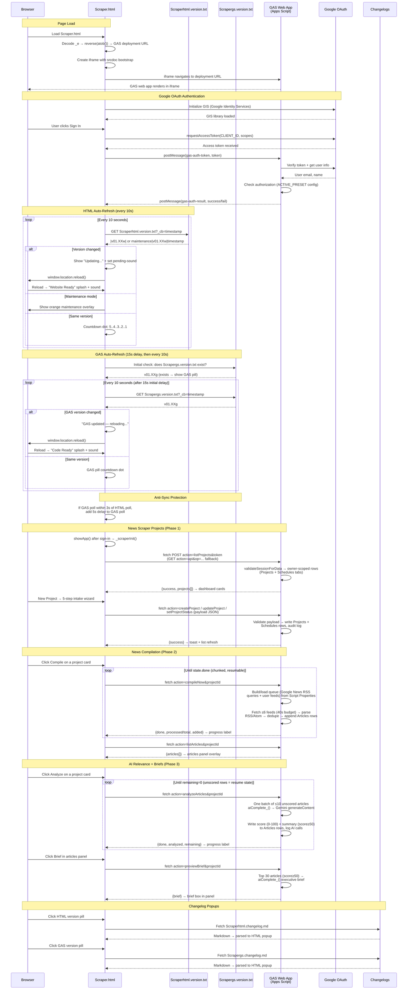

# Scraper.html — GAS Integration Sequence Diagram (Auth)

Sequence diagram showing the dual polling systems (HTML + GAS) and the iframe injection flow.

> [Open in mermaid.live](https://mermaid.live/edit#pako:eNq1WF9v28gR_yoDPgQULNHy5dIH4eyDovhcF45jmI5zQFUYK-6I2nq5u9ldSlFyAfpU4F4P_QjtF8snKWZJ6o9FKQaKvtgSd2Z25je_-UN9iTLNMRpEDj-WqDJ8I1huWTFWAACGWS8yYZjy8NrqhUO7e_Dnu7dXwBykmWUGbTLzhWyRut-QIZFkjtYJrRL_ye-KX2yK5-47wsOUpOnfB5zA0JifJvYsHhoTTAjjOy1KWucSg1716d2w9LNduVEIbjRjKkepczdWlcy19gh6jrZBpktADOCG5QhXmvFKrD7snZ1Vx3TSAhUdrmTeICUFHhC-_fMPsEjBY8y8nsSdTnhGoXI0Ui8LVB7e3161mBlZZB5BTC0rEBbCz8DZjOsMJlp75y0zW1oXw3TQSCs2Fznz6MDr1psuhmmvd3ZWhzcIHi1wAswYsKg4WgdC1eb2Y1ZhP9jKAdAfVF5kzAuttn2s5S-V8IJJ8Rnh4jKFuNa_5KTnl5CinYsMXZ346ri3goZ0pJhYZpcgNeO4J1vvHVrIpMgeHaQiV3DZ7o6l6nF-mGXo3J1-RBWPri7Pr-8eLt90wWXa7HWl0gFPSmAxQzFvvNnMi9HOv0XnWI5xzlyPlX7WC0rdSrezzsvar3u0YrqsjR9Bjh5KCkmoqX7qTrgmBIwFE7ILKmRuwygJjGaYPQLdrq34HBIE8XB0d3l__nBze56e30Gm1VTknS2eVLG2BmHRldJ3wZUBieMpE7JzoMruB1XLGZZe925xatHNIKYiWcJJv4FZam3gvH4IDjOtuKuONgvlfgAX53f7-tLPD9nk1IsCnWeF2dC-X8f027x_kvz66-I30BYKJpRHxVSGq-ct-kx6Sg1dA1noLHx9uFPH6UwvYBy9N5x5ofIkScYRHIFDDwYVFyrvOV2qdhOrAl0IxfUikbqqqsQiET_ubGs9LYDbIBV6zjj6gBMnPMItMr4cR-CMZG5Grmxfj9IhvF1DAYXmeNi7EKO2BMUmiCH1ki2f2E6pRdV5OgDcSJfKc71QwLUfwKsk-TFJXibJD0lysmGxcT182Nuo7qset826k1cOOEq27AK1LHjKwqaC71cdCzIqoAFwjXvmG-An4fzPdflsMK0iVA5xEHAhKY5wI7-MkPIQ9SFmU48WyGNRuxI87-wUxcV2UWx7t68kWhzd5js5OX8258cRyZdEeeTw7R__goqvDf__71wf0QR-FtGfScYmSZBtsvK5NCQbgYND5UUvXaoMbqz2mO1MyOq2y2l1oZYyTH6h4KUDPa1aJz3u0o7EOIeGwjTpG50DdUBD4BoXK_KSH3_HzDuIb2bMIZx0Wvwhng6NiTtQ0dCJXPWECmA_uMoSVUjc2R19U_TZDG7epXfAQrynUjjfXPsiDLew8BFpawlmxAttTpMkgSmTcsKyx87OLJszKYhgKTpK3i_avmGeBZ_0QqHthcHNgUIPF6xCPYI0myEvJS1IbOLaht2XeqB1wdRqf_3b12CcMzebaGY5ZMw2U-kpG69x0UAblF71nEcDQnn2SNvcZ2b5PqxqELKwADZGjutyWn2nkBw2QKae-dJBbNgylMFf0nfXu5Dd15BBI0auLSxNhTU4ZHiND8XVBVZy4UHq_ABSFTpeM-fhCCjJYKtO-xw-jnRhhKw3koqKP3TasR3RRlcrIGgFrMlRyMhGG32vvJDgPPOYcK0Q4mxWqkfkXaC9pWATiS0ddDcV1V3XevGivulyo49sAPy6FJIfB2g_lljiarUNMd6mKYH7sUQrkGgYtrkpIncdmFpd1O87lAyD1gt0rbf8Enz79vu__1QpQ_xj38Gk5Dn66g3DMOuQ7rpN0-Oh10XFXOSlqV5LmKHlA4b0ptSkefuudX4JuVAGlGXkx157JrvAOEdeJd1YnVvagyWboNxohAdRJYo0DjzFddsDVks1Jdh8B8MUyvWacZBmw0uaETgPm8kRvLYCp6u29_Ig14aKyeXn53DN0vathMpP-xCXymXa1i0ITivOYcXH59COVdfuw-gJK94phAkjdT0lcpz0YeVAA1iYGoJKR6LHh7h-H8VCKAE5KrTM40jTAudbL_kQmkWwCnG_d9Lvd2iwlkVBL2NxOPj2-39e9Tt0ldfbDOtSC6FEZEzK7_CtDj6Uao3pM8jWnr-Qa3qh3SbOd_hpLM4FLoJyGz9rnTtt4GV_bXoTBHJ4F3P8hFnpxRxhQrbbGB8OqnjDR5joTxRA7fc-oo8o5ObHDrjRpjTuEDBhn2j2OtpvtiAha1Wv2XzDyhr7SVGDMbpae_6W2cewHq3aEKfVpF5cTGka59sd2twzv-9P7v5Xb6JuVKAtmODRIPoyjvwMCxxHg3HEccpK6cfR16gbsdJrWtuigbcldqNqFte_tlUPv_4Xq5lo4Q)

```mermaid
sequenceDiagram
    participant Browser
    participant HTML as Scraper.html
    participant HV as Scraperhtml.version.txt
    participant GV as Scrapergs.version.txt
    participant GAS as GAS Web App<br>(Apps Script)
    participant Google as Google OAuth
    participant CL as Changelogs

    Note over Browser,HTML: Page Load
    Browser->>HTML: Load Scraper.html
    HTML->>HTML: Decode _e → reverse(atob()) → GAS deployment URL
    HTML->>HTML: Create iframe with srcdoc bootstrap
    HTML->>GAS: iframe navigates to deployment URL
    GAS-->>Browser: GAS web app renders in iframe

    Note over Browser,Google: Google OAuth Authentication
    HTML->>Google: Initialize GIS (Google Identity Services)
    Google-->>HTML: GIS library loaded
    Browser->>HTML: User clicks Sign In
    HTML->>Google: requestAccessToken(CLIENT_ID, scopes)
    Google-->>HTML: Access token received
    HTML->>GAS: postMessage(gas-auth-token, token)
    GAS->>Google: Verify token + get user info
    Google-->>GAS: User email, name
    GAS->>GAS: Check authorization (ACTIVE_PRESET config)
    GAS-->>HTML: postMessage(gas-auth-result, success/fail)

    Note over Browser,HV: HTML Auto-Refresh (every 10s)
    loop Every 10 seconds
        HTML->>HV: GET Scraperhtml.version.txt?_cb=timestamp
        HV-->>HTML: |v01.XXw| or maintenance|v01.XXw|timestamp
        alt Version changed
            HTML->>HTML: Show "Updating..." + set pending-sound
            HTML->>Browser: window.location.reload()
            Browser->>HTML: Reload → "Website Ready" splash + sound
        else Maintenance mode
            HTML->>Browser: Show orange maintenance overlay
        else Same version
            HTML->>HTML: Countdown dot: 5..4..3..2..1
        end
    end

    Note over Browser,GV: GAS Auto-Refresh (15s delay, then every 10s)
    HTML->>GV: Initial check: does Scrapergs.version.txt exist?
    GV-->>HTML: v01.XXg (exists → show GAS pill)
    loop Every 10 seconds (after 15s initial delay)
        HTML->>GV: GET Scrapergs.version.txt?_cb=timestamp
        GV-->>HTML: v01.XXg
        alt GAS version changed
            HTML->>HTML: "GAS updated — reloading..."
            HTML->>Browser: window.location.reload()
            Browser->>HTML: Reload → "Code Ready" splash + sound
        else Same version
            HTML->>HTML: GAS pill countdown dot
        end
    end

    Note over HTML,GV: Anti-Sync Protection
    HTML->>HTML: If GAS poll within 3s of HTML poll,<br>add 5s delay to GAS poll

    Note over Browser,GAS: News Scraper Projects (Phase 1)
    HTML->>HTML: showApp() after sign-in → _scraperInit()
    HTML->>GAS: fetch POST action=listProjects&token<br>(GET action=api&op=... fallback)
    GAS->>GAS: validateSessionForData → owner-scoped rows<br>(Projects + Schedules tabs)
    GAS-->>HTML: {success, projects[]} → dashboard cards
    Browser->>HTML: New Project → 5-step intake wizard
    HTML->>GAS: fetch action=createProject / updateProject /<br>setProjectStatus (payload JSON)
    GAS->>GAS: Validate payload → write Projects +<br>Schedules rows, audit log
    GAS-->>HTML: {success} → toast + list refresh

    Note over Browser,GAS: News Compilation (Phase 2)
    Browser->>HTML: Click Compile on a project card
    loop Until state.done (chunked, resumable)
        HTML->>GAS: fetch action=compileNow&projectId
        GAS->>GAS: Build/load queue (Google News RSS<br>queries + user feeds) from Script Properties
        GAS->>GAS: Fetch ≤6 feeds (40s budget) → parse<br>RSS/Atom → dedupe → append Articles rows
        GAS-->>HTML: {done, processed/total, added} → progress label
    end
    HTML->>GAS: fetch action=listArticles&projectId
    GAS-->>HTML: {articles[]} → articles panel overlay

    Note over Browser,GAS: AI Relevance + Briefs (Phase 3)
    Browser->>HTML: Click Analyze on a project card
    loop Until remaining=0 (unscored rows = resume state)
        HTML->>GAS: fetch action=analyzeArticles&projectId
        GAS->>GAS: One batch of ≤10 unscored articles<br>aiComplete_() → Gemini generateContent
        GAS->>GAS: Write score (0-100) + summary (score≥50)<br>to Articles rows, log AI calls
        GAS-->>HTML: {done, analyzed, remaining} → progress label
    end
    Browser->>HTML: Click Brief in articles panel
    HTML->>GAS: fetch action=previewBrief&projectId
    GAS->>GAS: Top 30 articles (score≥50) →<br>aiComplete_() executive brief
    GAS-->>HTML: {brief} → brief box in panel

    Note over Browser,CL: Changelog Popups
    Browser->>HTML: Click HTML version pill
    HTML->>CL: Fetch Scraperhtml.changelog.md
    CL-->>HTML: Markdown → parsed to HTML popup

    Browser->>HTML: Click GAS version pill
    HTML->>CL: Fetch Scrapergs.changelog.md
    CL-->>HTML: Markdown → parsed to HTML popup
```

## Key Design Notes

- **GAS iframe injection** — the deployment URL is stored as a reversed+base64-encoded string in `_e`. The iframe uses `srcdoc` with a bootstrap script that reads the URL from `parent._r`, deletes it, then navigates — preventing the URL from being visible in page source
- **Dual polling** — HTML and GAS versions are polled independently with anti-sync protection (if polls align within 3s, GAS poll gets a 5s delay to re-stagger them)
- **Two splash screens** — green "Website Ready" for HTML version changes, blue "Code Ready" for GAS version changes
- **Audio unlock via UAv2** — since the GAS iframe covers the entire page, click events don't reach the parent document. The UAv2 poll detects `navigator.userActivation.hasBeenActive` (propagated from cross-origin iframe clicks) and unlocks AudioContext without needing a direct click on the parent

Developed by: ShadowAISolutions
