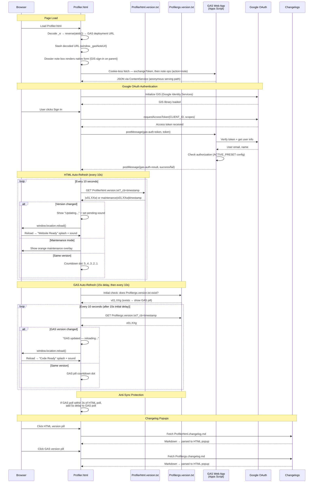

# Profiler.html — GAS Integration Sequence Diagram (Auth)

Sequence diagram showing the dual polling systems (HTML + GAS) and the note-box fetch transport (PROJECT OVERRIDE — no iframe: document-loads of /exec fail in cookie-carrying browsers).

> [Open in mermaid.live](https://mermaid.live/edit#pako:eNq1V9tu20YQ_ZUBnyhYYuOmeREaB6rsOipsxzBtJQ8CjNVyRC683GF3l5KVC9CnfkDRL8yXFMOLLcmUa6Doi0js3M7MnJmlvgSSEgyGgcPfSzQSj5VIrchnBgCgENYrqQphPPxiaeXQPhW8vz4_A-Hg0tJCabRR5nPdoTbdVGKdaInWKTKRv_dP9U-39FP3L9qjmNX58RHnMCqKn-f2KBwVhYNYWlX4XocRUaqxsqvfPoxKnz3VG1f5jTNhUtSUupmpdS7II9ASbVucPtdiCJciRTgjkdRqjXBwdFSLWdJVLZY-KB0jNwZuEb7_-RdY5OwxFJ7mYa9XnXGuCRaa1jkaDzdXZx1uYi9cBknlLGEdCFfKJLSKblPhOIEbq3td8ck5hRYM5zine7BoErQOjPBqibAgm0N4OonBqdQMlAEyXDQ0ftvd6SgewpjoTuFAo3OwQC8z-P7H34D3sqrpNd2h6YPP0NTxqHAQCukVmbd80Hg8HcWDB4C_xR8uYKkEjMl4ND5Gu1QSIRSGzDqn0oHjI5NCIXzW29-0uvnDLRIA_6DxSgpGsZ1Roz8xyiuh1WcErkPY2E8StvNraBC5Fn0lfkyAbbSaW2HXoEkkuIcuNw4tSK3knYNYpQYm3XAsT7DzIynRuaqk4fhscnJxfTs57oOTVOyFUtuAZyOwKFEtWzSbXSzI-XN0TqQYpsINROmzgW-ax4-NPj3imqJVi3Xj_ABS9FBySsosaBdOFaZKGHOhdB-MyHHLacWmDOUdcHSy6nPVIAhH4-vJ9OT28uokPrkGSWah0i7edCZh0ZXa98GVVSV-WAiln2HM--mwXnuj0tPgChcWXQYhD-kaDl-1ZdZEBZw0h-BQkklcLdqct-kQTk-u967Gd7dy_tarHJ0XebFhPn1M6uvy1WH06dPqK5CFXCieCGEkPpx32AvtuTccBuo5TB6FTxdJRiuYBTdFIrwyaRRFswAOwKGHAk2iTDpwVJpuF03dhtDsHk31WEUWmflhb9tqdwKuKq1q6c2Cjzh3yiNcoUjWswBcoXnFHcBOeNQO4fyxFJBTgs-jq3Iky6XYLGLVey3WO75jkSM0fXqmcGMqjU9oZSAhP4Q3UfRTFL2Ooh-j6HDDYwu9etm7qZgqo3iHdodvHCSoxbpZobs0bEd4-rCyQPIEDSEh3HfFAt4r5981A7RBtZpRKYSVgqu64rhwDKxQWj9HfgjFwqMFhqwaLBX03pOxON0Zi214-4aiA-k24xnl8sWsnwWsXzLpManurJqx7QT872wf80fAi6j-Qjq2XQK5ycuXEpF9VCwcGa8G8dpI7o9H-eSSrKNNFnVA0hpWymfKwGsHtKi3Jx_3-TtNJAm0JAZPDzb7J2HMk9V-kMElFWXhuq_PMd-cdby275z_Flj29mv1WbK1hGUbIMqboozPHul1LuxdVT_uVCGsw4SxN5kVZdGi70a0ScQXAErdf4UT9IMcbS5UEgyDL7PAZ5jjLBjOggQXotR-FnwL-oEoPXFjg6G3JfaDmvzN34L68Ns_u7PwFg)

## Key Design Notes

- **Native note box over fetch (PROJECT OVERRIDE)** — the deployment URL is stored reversed+base64 in `_e` and stashed in `window._gasNoteUrl`; the note box is native page UI (GIS sign-in popup on the parent, fleet CLIENT_ID), and all backend traffic — token exchange and the note ops — goes over cookie-less `fetch()` to `?action=note&nop=…` (POST with GET api-route fallback; file payloads POST-only). Document-loads of /exec (iframe or top-level) are avoided entirely: they fail in cookie-carrying browsers via Google's multi-account routing. When `_e` is empty the box falls back to the GitHub-issue-form flow
- **Industry Guidance ops (role-gated, v01.38w/v01.17g; progress sync v01.68w/v01.27g)** — the same cookie-less fetch transport carries `?action=guidance&gop=index|doc|mentions|progress|setprogress` (POST with GET api-route fallback). Server-side `handleGuidanceOp_` requires `guidanceAllowed_` (the `admin` permission, or a tier in `GUIDANCE_ROLES` — currently `contributor`) before returning document-analysis module JSON; the page's `✦ Industry Guidance` masthead button (created only for guidance-capable sessions by the auth wall's `pass()`) opens a full-screen overlay that renders the module — prose, tables, pros/cons, timeline, bars, flashcards, quiz, ledger, glossary tooltips — entirely from the fetched JSON. Reading progress (section ticks) syncs per account via `gop=progress`/`gop=setprogress` into one Script Property per account (`gd_progress:<email>`); the page keeps localStorage as its offline fallback and migrates local-only ticks up on first sync. Content lives in Profiler.gs (repo + GAS project only, never on public Pages)
- **Dual polling** — HTML and GAS versions are polled independently with anti-sync protection (if polls align within 3s, GAS poll gets a 5s delay to re-stagger them)
- **Two splash screens** — green "Website Ready" for HTML version changes, blue "Code Ready" for GAS version changes
- **Audio unlock** — the note-box iframe does not cover the page, so parent clicks reach the document normally; the standard template audio unlock applies

Developed by: LightAISolutions
