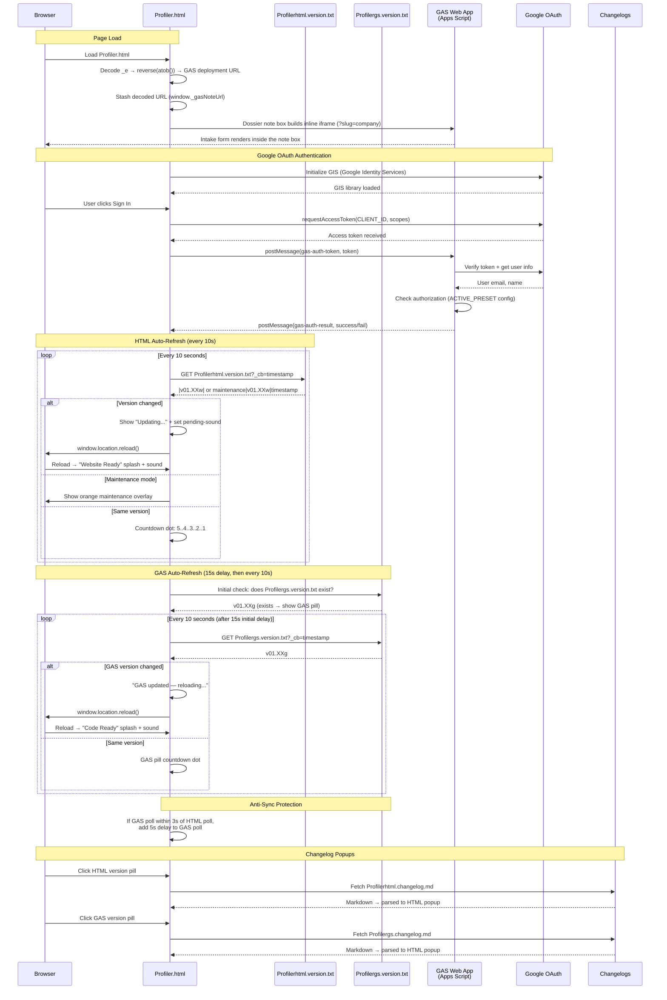

# Profiler.html — GAS Integration Sequence Diagram (Auth)

Sequence diagram showing the dual polling systems (HTML + GAS) and the inline note-box iframe flow (PROJECT OVERRIDE — not the template’s full-screen iframe).

> [Open in mermaid.live](https://mermaid.live/edit#pako:eNq1Vttu4zYQ_ZWBnmSsrW663Rehm8B1XNdAshtEjncfDAQ0OZKJUKRKUna8F6BP_YCiX7hfUowujq9pgKIviUHO5czMOUN9CbgRGMSBw99L1BwvJcssy2caAKBg1ksuC6Y9_GLNyqE9vPhtcn0FzMGNNalUaKOFz9URs-m2EdlES7ROGh35R39oP9qxz9y_WPcTMqd_H3EO_aL4eW7Pw35ROEi4lYXvHHEyJlNY-dW_PvRLvzi0G1T1DRZMZ6hM5ma6tnlvPIJZom2b06VexHDDMoQrw0Rt1lz2zs_ra7o51i263RhdIg0G7hG-__kXWKTqMWTezMNOpzqjWgUWyqxz1B7ubq-OhEk8cwsQVTBBNhCupBZmFd1nzFEBd1Z1dhxH_SSGS-OcRAuaSpybR5iXUgkHUiupEWRqWY4QXjhVZu-4yQum102YUT_p9c7Pm6pjGGvPHhBSY3OwqAVaCuOkQPAL3GQ43dR6OPHOkID-oPaSMy-N3i2gsR9r6SVT8jPCaJxA2PiPBfn5NSRol5Kja3FX171N68hHyblldg3KMIEnxnnn0AJXkj84SGSmYXwcjiWFOd_nHJ2bmAfU4eBqPHw_uR9fdsFxU5yEUvuAJyewyFEuWzTbQyuM89foHMswzJjrsdIvepVTt_bdmtATrilama6b4K8gQw8llSR1avbhVGmqgjFnUnVBsxx3gpLBYIH8ASi7sfJzNSAI-4PJeDq8v7kdJsMJcKNTme0ypq71aBEWXal8F1xZdeKHlEli7UkZTuN6LfVLb3q3mFp0CwhJRGs4e922WRlTwLA5BIfcaOHqq20hTWMYDScnV9fFPZ-_8zJH51lebLlPn4r6unx9Fn36tPoKxkLOpPaomea4OT_iz5Sn2VAa4NXuEU-Xh0JfmBXMgrtCMC91FkXRLIBX4NBDgVpInfWcKfXxEButNrtBmVpWkUViftjZ9dpXwG1lVS2lWfAR5056hFtkYj0LwBWKVtAr2EuPyiFcP7UCciPweXRVjcZSK7abWM1esfVe7IQ2VDOnZxo3MKX2wqw0CONjeBtFP0XRmyj6MYrOtiK20KsfJzcVUaWf7NHu7K0DgYqtu7TwNOzTsJXwdLOygJOCYhAGTz2BgI_S-YtGQFtUqxmVQVgZuGoqjhpHwAqp1HPkh5ClHi0QZNlgqaB3DmQx2pPFLrxTojiCdJfxhHL5YtbPArIvifQo4Psff0PN2FYB_zvbB_RIv4jqL6RjOyXg27x8KREpRsXCvvayl6w1p_l45AePZJ1tnNYJjVKwkn4hNbxxYNJ6e9Jxl76jmBDQkhi82ficVsKAlNV-MMGNKcrCHX8-B_Ry1vnauVP9O2Ap2q_o-WJ3CfM2QZQ3TRlcPdHrmtmHqn80qYJZh4KwN5UVZdGiP45om4gvAJS5_won6AY52pxJEcTBl1ngF5jjLIhngcCUlcrPgm9BN2ClNzTYIPa2xG5Qk7_5bK8Pv_0DMCrP8g)

## Key Design Notes

- **Inline note-box iframe (PROJECT OVERRIDE)** — the deployment URL is stored as a reversed+base64-encoded string in `_e`, but instead of the template’s full-screen iframe the decoded URL is stashed in `window._gasNoteUrl`; each dossier’s "Add a Field Note" section renders its own inline iframe with `?slug=<company>` so the form prefills the company. When `_e` is empty the box falls back to the GitHub-issue-form flow
- **Dual polling** — HTML and GAS versions are polled independently with anti-sync protection (if polls align within 3s, GAS poll gets a 5s delay to re-stagger them)
- **Two splash screens** — green "Website Ready" for HTML version changes, blue "Code Ready" for GAS version changes
- **Audio unlock** — the note-box iframe does not cover the page, so parent clicks reach the document normally; the standard template audio unlock applies

Developed by: ShadowAISolutions
