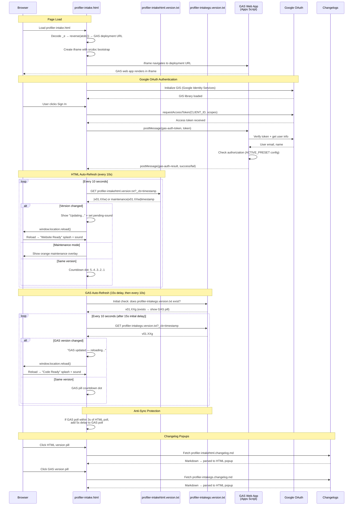

# profiler-intake.html — GAS Integration Sequence Diagram (Auth)

Sequence diagram showing the dual polling systems (HTML + GAS) and the iframe injection flow.

> [Open in mermaid.live](https://mermaid.live/edit#pako:eNq9Vt9vIjcQ_ldG-wQqbEPu7qGozYlu0hSJXKNA6D0gRcY7u1gs9tY2cNyP_73j9S6wYUkiVWoeAtgz42_mm2_sbwFXMQb9wOA_a5QcrwVLNVvNJNBfzrQVXORMWvhdq61Bfbrx5-RuBMxArlUiMtRdIS1bYriwq6zBetpg60zDDWojlAztF3vqdtvklppXnAZj5-U-_sY5DPL817m-atGngTHXIrftBiel0gwLP__tr8HaLk7toiLpaMFkiplKzUx6m0_KIijCVVWs4wrUh3uWIowUi71Zudm9uvLbbueFEjqjve01OtLgCWG2vuz9cgkaXR2wxayat9rtatklHmOeqd0KCfHjw6ghWKSREWKREOsIW2EXYDSPFYe5UtZYzfKaFwXtV9aSbURK3gasajyJjLvkUybbLxBtiQqW5wRaxoQahCzDna-gZ6JfYwTcPzpMcGapA-oYS_uhFFawTHxFuB2OoVX6D2PnZ3cwRr0RHE3ZBn67uy-N88nEXDO9g4z4wTPcPdIP4JngS-orkUo6txGOdhozdsDpSDNRS5StaDS8-TR5Gl53wHCVn4XifajM5ERxOIpNheaYl1wZe0eG1GutlJkuoxp1C6eO920feDngmqIWya4M_hOkaGHtUhIyUc_hFMcUCeOKiaxDPeCYOwrqDKIF8iW405UWXwuCoDWIJsPpzdP9w834ZgJcyUSk7Vqf-Fwbk9Bo1pmlKq2LSvyc0OHtFzQ37fvBRF2iug-YkP8CWk4nO-hdVGXOlMrhplwEQ7qSsfFbx0KhYLcE-ZWp9fGJz3-zYkUUs1V-FGV6yO375qIXfv68_Q5KAxVQWpSMxu5-vcGfZdZR5I4BXsyb-LB5oufxQm1hFjzmMZVdpmEYzgIi1RCpOSmOlrpGrWVziL1Qt0LGahtmyqsr1OgE0GrXvZ4L4aGwqsbPLKCpawRR84As3hEMk2eMaCA0dQSYGYS7QzVgRfPtZYBFmkq7ahzXseiCjO2exR67aVVS9ULtIoJlKW8JsbJ9-BCG78PwXRhehmHvKGIFvfhydmZN_birN2Dvg6FBSQBJjzS94HlDVmKe7ocXUU5a6hMifOUCBPwijP1YKuqo6XxvpdT-zsBU_BhXQgcxF1n2kiCgxRJLqTnwokRVJNE-kcpts1TqQM8JpQFzXQUO7ObNSpgFzn7thIBFU1703oNv5EoY_4cIIndXv0kBb-zSijIaoUft-tb-dDGK5hzQHdgd7ySHe027_OQW9acNE3-gogPd64Cu63cGVOLHq1vuuFcVi2Ooetu9Biqf8wKJnOCq5xPcq3ydm-b7NXJXqz-vYt_lXwProv2Bli8apzSvzglXZW2i0aHX7pheFmUsOaNnnqGOoSzKHAlalUcztuPGfDs0UsV_BxZ0ghVqGoExveK_zQIaK3QhB_1ZEGPC6M6cBT_Ihi5R5cgO-lavsRN4WZSvfb_4418pUtrp)

## Key Design Notes

- **GAS iframe injection** — the deployment URL is stored as a reversed+base64-encoded string in `_e`. The iframe uses `srcdoc` with a bootstrap script that reads the URL from `parent._r`, deletes it, then navigates — preventing the URL from being visible in page source
- **Dual polling** — HTML and GAS versions are polled independently with anti-sync protection (if polls align within 3s, GAS poll gets a 5s delay to re-stagger them)
- **Two splash screens** — green "Website Ready" for HTML version changes, blue "Code Ready" for GAS version changes
- **Audio unlock via UAv2** — since the GAS iframe covers the entire page, click events don't reach the parent document. The UAv2 poll detects `navigator.userActivation.hasBeenActive` (propagated from cross-origin iframe clicks) and unlocks AudioContext without needing a direct click on the parent

Developed by: ShadowAISolutions
