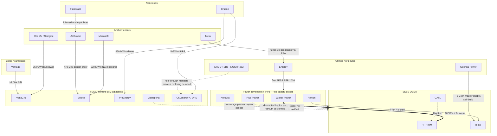
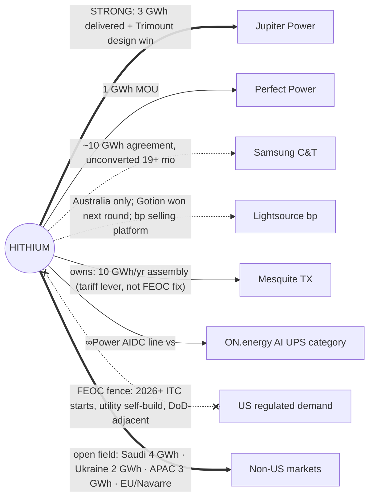

# The US AIDC Containerized-BESS Relationship Web — From Hithium's Seat

**Provenance:** synthesis from the 88-company Profiler dossier base (Batches A–D completed 2026-08-23/24) plus the three Industry Guidance analyses. Internal, never deployed. Every company named here has a full dossier in `live-site-pages/profiler-data/` — cite those (and their sources) for any claim; this document maps the *relationships between* them. Prepared 2026-08-24.

**What this answers:** the developer's core question — *how do containerized-BESS suppliers, developers, general contractors, and data-center operators actually connect in the US AIDC buildout, and where does Hithium plug in?*

---

## 1. The one-paragraph answer

Batteries reach AI data centers through **owners, not builders**: hyperscalers and neoclouds contract power from developers/IPPs and utilities; those owners select the BESS OEM; EPCs and GCs install what the owner furnishes. Hithium's US access therefore runs through a narrow set of battery-buying owners — its anchor is **Jupiter Power** (3 GWh delivered-through-2025 supply deal + the Trimount design win) — while four forces shape everything around that channel: (1) the **FEOC/tariff stack** prices Hithium out of ITC-driven procurement for 2026+ construction starts, concentrating its demand in safe-harbored-2025 and merchant projects; (2) **FEOC-immune gas packagers** (VoltaGrid, ERock, ProEnergy, Mainspring) are capturing the behind-the-meter AIDC energy budget that off-grid BESS would otherwise attach to; (3) **ON.energy's AI UPS** created a BESS-based data-center power category with a deliberately non-Chinese supply chain — directly contesting the socket Hithium's own ∞Power AIDC line targets; and (4) **utility large-load tariffs and ERCOT ride-through rules** are converting speculative AI demand into certified procurement where bankability, not price, decides the OEM.

---

## 2. The value chain, layer by layer

### Layer 1 — Anchor tenants (demand originators)
Microsoft, Google, Meta, Amazon, Anthropic, OpenAI (Stargate), xAI. They originate the load, sign the PPAs/ESAs that fund everything downstream, and set procurement norms (Meta funds Entergy's ten gas plants; Anthropic buys 470 MW of ERock gensets; Microsoft anchors ERock's San Jose microgrid). **They almost never buy grid-scale batteries directly** — but their carbon pledges, FEOC sensitivities, and speed requirements cascade down the chain as specification pressure.

### Layer 2 — Neoclouds (the fastest movers)
CoreWeave, Crusoe, Lambda, Nebius, Fluidstack, Applied Digital, IREN, TeraWulf, Core Scientific. They make power decisions in quarters, not rate cases, and are the most active buyers of *adjacent* power hardware: Crusoe alone dual-sources ProEnergy turbines (650 MW) and GE Vernova units, and anchors ON.energy's 5 GW AI UPS. **Crusoe is the single most connected node in the whole web** — it touches the gas cohort, the BESS-UPS category, and the hyperscaler layer (Stargate/Abilene, the inferred Anthropic/Fluidstack hosts).

### Layer 3 — Colocation/campus developers
Vantage, Aligned, QTS, Switch, STACK, Equinix. They own the campuses, sign the utility interconnections, and increasingly contract behind-the-meter power (Vantage↔VoltaGrid >1 GW). Battery relevance today is mostly UPS-adjacent and ride-through compliance; their scale decisions (Stargate campuses, the ~$100B Vantage exploration) set where the load — and its buffering requirement — lands.

### Layer 4 — Power developers / IPPs (the actual battery buyers)
Jupiter Power, Plus Power, NextEra Energy Resources, Arevon, Eolian, Key Capture, Terra-Gen, Lightsource bp (exiting via bp's platform sale). **This is where cell brands are chosen.** The verified pattern across every EPC dossier: batteries are owner-furnished. Buyer postures vary sharply: Arevon is Tesla-locked (7-for-7); NextEra runs a diversified book; Jupiter buys Hithium at GWh scale while messaging domestic content publicly — the quiet-buyer pattern that defines what a realistic Hithium account looks like.

### Layer 5 — EPCs and GCs (installers, not buyers)
Renewables EPCs: SOLV, Blattner (Quanta), MasTec, Primoris, Rosendin. Data-center GCs: Turner, HITT, Holder, DPR, Mortenson. Power/mission-critical EPCs: Bechtel, Kiewit, Burns & McDonnell, Black & Veatch. They install owner-furnished BESS (SOLV↔Tesla on every flagship; Blattner installing owner-selected Fluence/e-STORAGE — including China-linked systems at Slate; MasTec's owner-selected Sungrow pairings) and sign the OEM supply agreement only in utility self-build (Burns & McDonnell + Crowder executing Georgia Power's Tesla portfolio). **Sales value: specification influence and approved-vendor lists, not purchase orders.**

### Layer 6 — Containerized-BESS competitors
Global tier: Tesla, CATL, BYD, EVE, Sungrow, Samsung SDI, LG Energy Solution. Integrator tier: Fluence, FlexGen, Prevalon, Canadian Solar e-STORAGE, Trina Storage, HyperStrong, LS Energy Solutions, CRRC Zhuzhou, Sunwoda, Narada, Envision. The US market splits on the FEOC line: Tesla/Samsung SDI/LGES and US-assembled integrator stacks harvest the ITC-driven demand; Chinese-cell systems compete for safe-harbored and merchant volume on price and availability — Hithium's own lane, shared with CATL (whose litigation against Hithium is also a within-lane weapon).

### Layer 7 — FEOC-immune BtM adjacents (the demand-shapers)
VoltaGrid (2.3 GW Oracle/OpenAI; >1 GW Vantage), ERock (Microsoft/Meta-EPE/Anthropic ~936 MW book), ProEnergy (>1.65 GW turbine orders), Mainspring (linear generators, OBBBA's flat 30% ITC), Bloom (fuel cells). Every campus they win defers a containerized-storage purchase — and each carries **zero BESS in its product line**, leaving an open storage-attach socket that FEOC optics steer toward non-Chinese cells. **ON.energy stands apart**: it productized BESS *itself* into this chain (medium-voltage AI UPS, 5 GW Crusoe deployment, FEOC-clean stack, cell supplier unnamed) — the direct category rival to Hithium's ∞Power AIDC line.

### Layer 8 — Utilities and grid rules (the certifiers)
Oncor/ERCOT (SB 6, NOGRR 282 ride-through, the Abbott audit), AEP (the 85% minimum-take template), Entergy (gas-for-AI + first BESS RFP), Dominion (GS-5 + the 2.7 GW VCEA storage mandate), Georgia Power (3,022.5 MW owned-BESS certification; Tesla master supply). They convert AI demand into certified procurement — and their prudence standards make **bankability the deciding specification** in the regulated half of the market.

---

## 3. Hithium's verified position in the web

| Relationship | Grade | What it actually is |
|---|---|---|
| **Jupiter Power** | **Strong — the anchor** | 3 GWh supply deal (2024, ∞Block 5 MWh, delivery through end-2025) + the Trimount design win (5.015 MWh units). The template account: a sophisticated merchant/safe-harbored buyer that purchases on economics while messaging domestic content publicly. |
| Perfect Power | Real but early | 1 GWh MOU (Texas/California developer) — MOU-grade until deliveries attribute. |
| Samsung C&T | MOU-grade, unconverted | The ~10 GWh E&C cooperation agreement (Jan 2025) remains publicly unconverted 19+ months on; Samsung's US develop-and-sell arm hands battery choice to project buyers (Sunraycer chose e-STORAGE for the ex-Samsung Texas pipeline). Treat as optionality, not backlog. |
| Lightsource bp | Real, Australia-only | Woolooga 640 MWh (128× 5 MWh). Gotion won the next battery; bp is selling the platform (Wren House/Qualitas) — a fading channel. |
| Mesquite, TX | Owned infrastructure | 10 GWh/yr module + system assembly (no cells), shipping since Aug 2025 — a tariff-base and logistics lever, **not** a FEOC/MACR fix (Hithium US is an FIE; output counts as PFE-made). |
| ∞Power AIDC line | Product, pre-traction (US) | The Dec 2025 AI-data-center push (1300Ah-class cells, 6.9 MW/55.2 MWh systems) contests the same socket as ON.energy's AI UPS — with the FEOC fence standing between it and US hyperscale campuses. |

**The policy fence around all of it** (full mechanics: the China-policy guidance module): NDAA §154 naming → statutory SFE → 2026+ construction starts fail the 55% MACR floor with Hithium cells (entire ITC lost) → ~40.9% tariff on imported content → DoD-adjacent loads close Oct 2027. The addressable US demand is therefore: safe-harbored-2025 projects, merchant/tax-indifferent buyers (ERCOT), and non-ITC niches — plus everything outside the US.

## 4. Who decides the cell brand — the decision map

| Channel | Decider | Hithium's realistic motion |
|---|---|---|
| Merchant ERCOT (IPP-owned) | Developer/IPP procurement | The core lane. Jupiter-pattern accounts: economics + availability + augmentation; quiet-buyer discretion respected. |
| Utility RFP via PPA | The developer bidding the RFP | Bid-stage design-wins with developers (pricing locks the BOM) — but FEOC math caps 2026+ ITC bids; target safe-harbored bids and non-ITC structures. |
| Utility self-build | Utility + its EPC (approved-vendor list) | Effectively closed to Chinese cells on prudence/FEOC grounds (Georgia→Tesla, Dominion→EVLO). Monitor, don't force. |
| BtM data-center buffering (NOGRR 282 / SB 6) | DC developer or its power partner | Contested by ON.energy's FEOC-clean category creation; Hithium's play is non-US campuses and any operator without ITC/FEOC exposure. |
| Gas-cohort storage attach | The packager (VoltaGrid/ERock/ProEnergy/Mainspring) when sockets fill | FEOC optics make a direct win unlikely; the indirect play is through their customers' owners on non-US or merchant sites. |
| Non-US (LatAm, MEA, APAC, EU) | Developers/utilities without FEOC constraint | The open field: Saudi 4 GWh, Ukraine 2 GWh, Brawn 3 GWh APAC, Statkraft/Turbo Energy EU, Navarre plant — and ON.energy's dormant LatAm franchise as a plausible future channel. |

## 5. The web, drawn

## 6. Where the demand actually is (2026–2028)

1. **Safe-harbored 2025 US projects** — finite, shrinking, and the only ITC-compatible Hithium demand. The Jupiter book sits here.
2. **Merchant ERCOT** — ~16.3 GW fleet and decelerating, but tax-indifferent; Hithium sells here today (Mesquite halves the tariff base).
3. **Regulated-Southeast certified programs** — the growth story (GA/VA/LA/SPP), effectively fenced off from Chinese cells; watch, don't chase.
4. **BtM buffering at data centers** — new, code-driven (NOGRR 282/SB 6), contested by ON.energy's FEOC-clean category; Hithium's ∞Power AIDC line fights for the same socket outside the US policy perimeter.
5. **The gas-bridge attach (later)** — VoltaGrid/ERock/ProEnergy/Mainspring campuses all carry open storage sockets that fill post-bridge (~2029+); FEOC optics point those at non-Chinese cells unless the policy stack moves.
6. **Non-US** — where the product ladder (587→1300Ah, 8-hour LDES, sodium) competes unfenced; the current order book (Saudi, Ukraine, APAC, EU) already lives here.

Developed by: LightAISolutions
